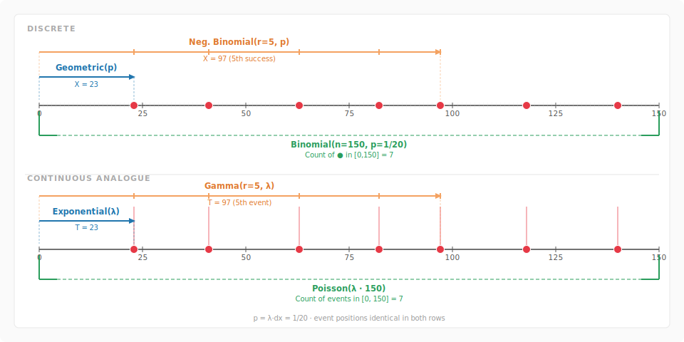

## The fundamental construction

Take a long axis and chop it into bins of width $dx$. In each bin, run an
independent Bernoulli trial with success probability
$$
p = \lambda \, dx.
$$
That is the whole story. Every classical distribution in this family is just a
different question asked about this same random experiment.

When $dx = 1$ the bins are unit intervals and $p = \lambda$: we are in the
**discrete** world. When $dx \to 0$ with $\lambda$ fixed, the grid dissolves
into a continuum and we enter the **continuous** world. The parameter $\lambda$
is the *rate* — the expected number of successes per unit length of axis —
and it is the one quantity that survives the passage to the limit.

## The four questions

### One bin: Bernoulli and the infinitesimal indicator

The simplest question is: did a single bin produce a success?

In the discrete case ($dx = 1$) this is a $\text{Bernoulli}(p)$ random
variable. In the continuous limit, a bin $[x,\, x + dx]$ produces a success
with probability $\lambda \, dx$: it is the indicator of an infinitesimal
event, the atom from which everything else is built.

### Waiting time to the first success: Geometric and Exponential

How many bins do we need to scan before seeing the first success?

In the discrete case this count follows a $\text{Geometric}(p)$ distribution.
Its PMF is
$$
P(X = k) = (1-p)^{k-1} p, \qquad k = 1, 2, \ldots
$$
and its mean is $1/p = 1/\lambda$ (since $p = \lambda \cdot 1$ for $dx=1$).

In the continuous limit the waiting *time* to the first event follows an
$\text{Exponential}(\lambda)$ distribution, with PDF
$$
f(t) = \lambda e^{-\lambda t}, \qquad t \geq 0.
$$
The mean is again $1/\lambda$.

The link is the **memoryless property**: both distributions satisfy
$$
P(X > s + t \mid X > s) = P(X > t),
$$
and in fact the Geometric and Exponential are the *only* distributions with
this property in their respective settings. As $dx \to 0$,
$$
P(X > t) = (1 - \lambda\,dx)^{t/dx} \longrightarrow e^{-\lambda t},
$$
which is exactly the Exponential survival function.

### Waiting time to the $r$-th success: Negative Binomial and Gamma

How many bins until we accumulate $r$ successes?

In the discrete case this is the $\text{Negative Binomial}(r, p)$
distribution. It can be seen as the sum of $r$ independent
$\text{Geometric}(p)$ variables, and its mean is $r/p = r/\lambda$.

In the continuous limit, the waiting time to the $r$-th event follows a
$\text{Gamma}(r, \lambda)$ distribution, with PDF
$$
f(t) = \frac{\lambda^r}{\Gamma(r)}\, t^{r-1} e^{-\lambda t}, \qquad t \geq 0.
$$
It is the sum of $r$ independent $\text{Exponential}(\lambda)$ variables, with
mean $r/\lambda$.

The analogy is exact: Negative Binomial is to Geometric as Gamma is to
Exponential. Both describe the *accumulated waiting time* for $r$ events;
only the granularity of the clock differs.

### Count of successes in a fixed window: Binomial and Poisson

How many successes fall in a fixed interval $[0, n]$?

In the discrete case, scanning $n$ bins each with success probability $p$
gives a $\text{Binomial}(n, p)$ count. Its mean is $np = n\lambda$ (for
$dx = 1$).

In the continuous limit, the count of events in $[0, t]$ follows a
$\text{Poisson}(\lambda t)$ distribution, with PMF
$$
P(N_t = k) = \frac{(\lambda t)^k e^{-\lambda t}}{k!}, \qquad k = 0, 1, 2, \ldots
$$
This is the classical **Poisson limit of the Binomial**: as $n \to \infty$
and $p \to 0$ with $np = \mu$ fixed,
$$
\binom{n}{k} p^k (1-p)^{n-k} \longrightarrow \frac{\mu^k e^{-\mu}}{k!}.
$$
The mean and variance both equal $\mu = \lambda t$, reflecting the
independent-increment structure of the Poisson process.

---

## Summary table

| Question | Discrete ($dx=1$, $p=\lambda$) | Continuous ($dx \to 0$, $p = \lambda\,dx$) |
|---|---|---|
| One bin | $\text{Bernoulli}(p)$ | infinitesimal indicator |
| Time to 1st event | $\text{Geometric}(p)$ | $\text{Exponential}(\lambda)$ |
| Time to $r$-th event | $\text{Neg. Binomial}(r, p)$ | $\text{Gamma}(r, \lambda)$ |
| Count in $[0, n]$ | $\text{Binomial}(n, p)$ | $\text{Poisson}(\lambda n)$ |

---

## The Poisson process

The continuous column is not just a list of distributions: it is a single
object, the **Poisson process** of rate $\lambda$. Its defining properties are:

1. **Independent increments.** Counts in disjoint intervals are independent.
2. **Stationary increments.** The distribution of $N_{s+t} - N_s$ depends
   only on $t$, not on $s$.
3. **Rare events.** The probability of two or more events in $[t, t+dx]$ is
   $o(dx)$.

From these axioms alone one can derive that inter-arrival times are i.i.d.
$\text{Exponential}(\lambda)$, that the time to the $r$-th arrival is
$\text{Gamma}(r, \lambda)$, and that counts over any interval of length $t$
are $\text{Poisson}(\lambda t)$ — recovering the entire right column of the
table from a single process.

The discrete column is the same process, simply run on a coarser clock.