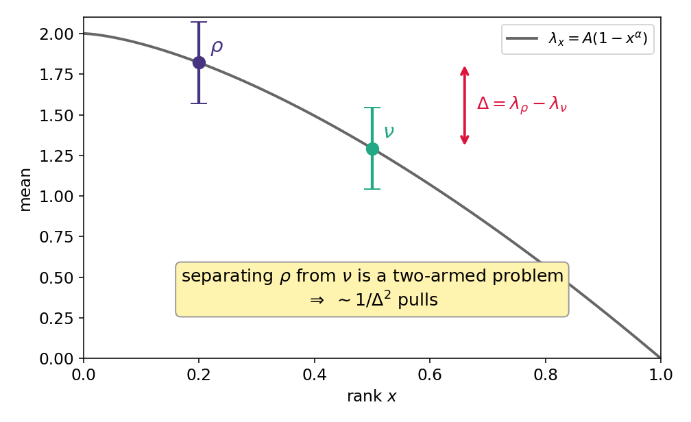
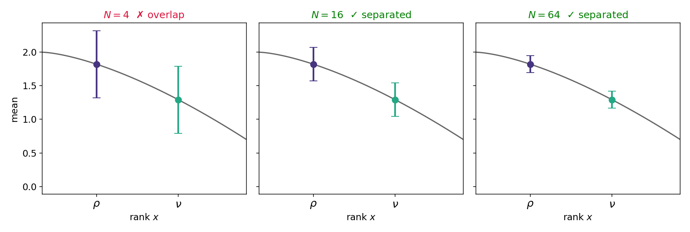
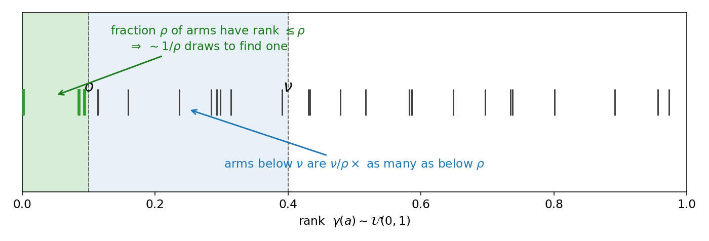
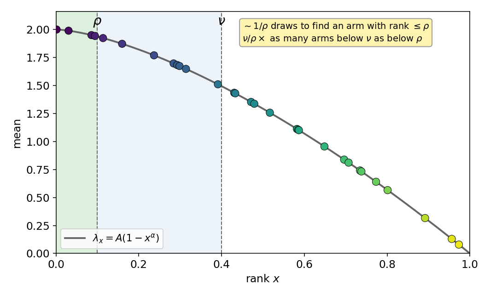
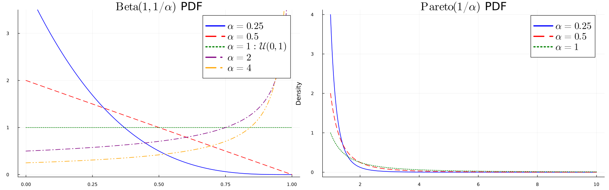
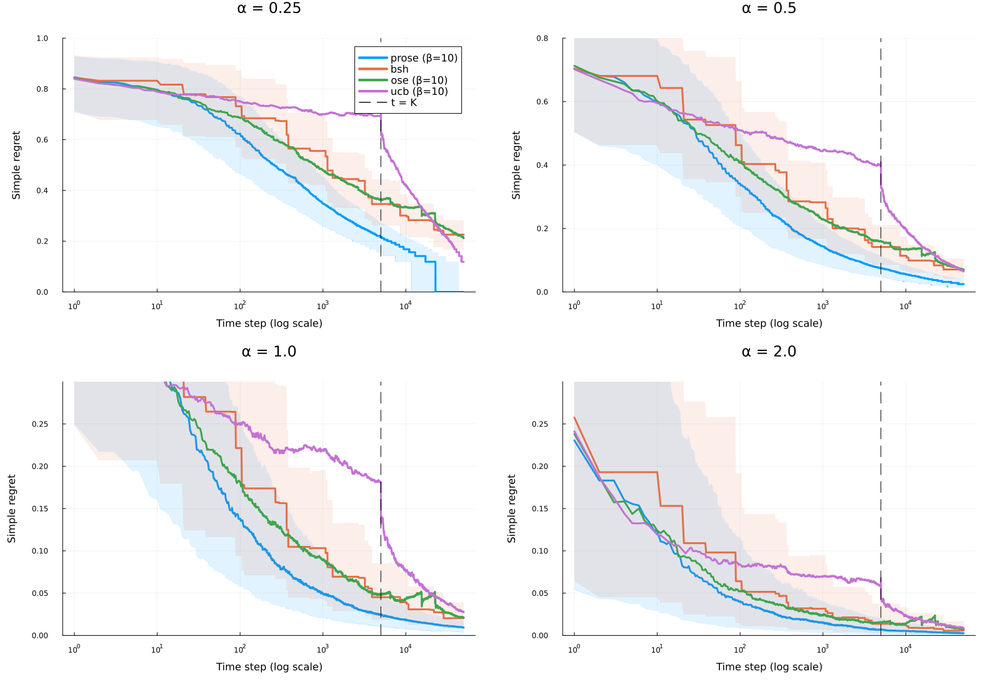
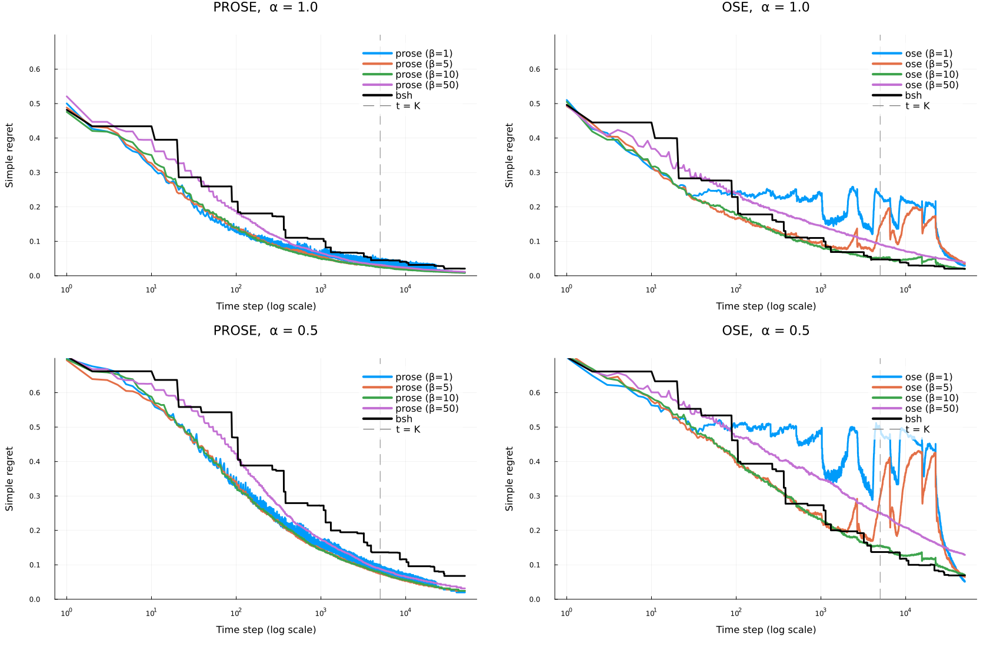
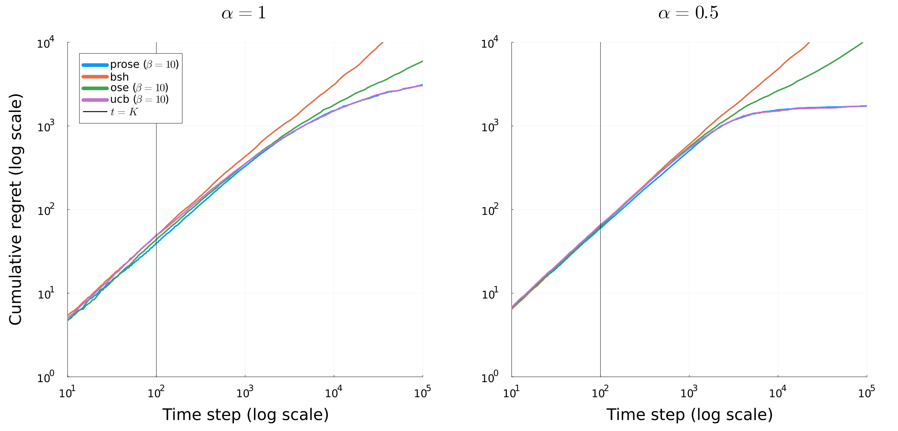

# Introduction

## This Talk

- Sequential decision problems
- Unbounded set of options
- Limited sampling budget

. . .

::: {.hl-legend}
Colour code: [key idea]{.hl-key} · [definition]{.hl-def} · [positive result]{.hl-pos} · [limitation]{.hl-neg}
:::

## Classical Bandit Problems

. . .

Consider a **two-armed bandit** problem, $\mathcal A=\{1, 2\}$

we observe:

$\newcommand{\and}{\quad \mathrm{and} \quad}$

::: {.square-def}
$X_{1,s} = \mu_{1} + \varepsilon_{1,s} \quad \and \quad X_{2,s} = \mu_{2} + \varepsilon_{2,s}$
:::

- $\mu_1$, $\mu_2$ belong to $\mathbb R$
- $\varepsilon_{i,s} \sim \mathcal N(0,1)$ (or 1-subgaussian)

## Active Learning Setting

At each timestep $t$

- Based on past observation
- The learner pulls arm $\hat a_t \in \{1, 2\}$ and get reward $X_{\hat a_t, s}$
- $s = N_{\hat a_t,t}$ is the number of times arm $\hat a_t$ has been pulled

## Cumulative Regret

. . .

Motivation:

- Overall cost of learning
- Every suboptimal pull incurs a loss
  
. . .

Defined as 

::: {.square-def}
$R = \sum_{t=1}^n (\mu_1 - \mu_{j_t})$
:::

## UCB Algo

. . .

Optimism in face of uncertainty: 

Choose arms that [maximizes upper-confidence]{.hl-key} bound

::: {.square-def}
$UCB_{a,t} \asymp \hat \mu_a + \frac{c}{\sqrt{N_{a,t}}}$
:::

## Illustration of UCB

:::{.replay-hint}
← / → step · ↓ skip to next slide
:::

::: {.replay data-algo="ucb"}
:::

::: {.notes}
Watch the confidence intervals shrink as arms are pulled; UCB keeps picking the highest upper bound.
:::

## Upper Bound on Cumulative Regret

. . .

Assume $\mu_1 > \mu_2$, let $\Delta = \mu_1 - \mu_2$ be the **gap**

. . .

**Main idea.** If the confidence interval are disjoint, we detect best arm:

. . .

**Simplified condition.**

::: {.square-def}
$\frac{1}{\sqrt{t}} \lesssim \Delta$
:::

. . .

We detect best arm after time $t \gtrsim 1/\Delta^2$

::: {.square-def}
$R \lesssim \max(\frac{\Delta}{\Delta^2}, \Delta t) \lesssim \sqrt{t}$

:::

. . .

(worst case when $\Delta \asymp 1/\sqrt{t}$)

# Bandits with Infinitely Many Arms

## Setting

. . .

Let $\mathcal A = \{1, 2, \dots, \}$.

. . .

Observations for arm $a$ (if ever observed):

::: {.square-def}
$X_{a,s} = \mu_a + \varepsilon_{a,s}$
:::

- $\mu_a$ are drawn independently from some distribution $\mathcal D$
- $\varepsilon_{a,s}$ are independent $\mathcal N(0,1)$

## Alternative formulation

. . .

::: {.square-def}
$X_{a,s} = \lambda_{\gamma(a)} + \varepsilon_{a,s}$
:::

- $\eta \mapsto \lambda_{\eta}$ is a decreasing function
- $\gamma(a)$ are iid $\mathcal U(0,1)$

. . .

$\rightarrow$ $\gamma(a)$ represents a [continuous rank]{.hl-key} of arm $a$

. . .

$\rightarrow$ "[best arm]{.hl-def}" corresponds to [$\gamma(a)=0$]{.hl-def}

. . .

$\rightarrow$ Unbounded distribution of arm means iff $\lambda_0 = +\infty$

## Seeing the Reservoir

:::{.replay-hint}
← / → step · ↓ skip · watch the **right panel**: arms appear on the curve $\lambda_\eta = A(1-\eta^\alpha)$ by their continuous rank
:::

::: {.replay data-algo="ose"}
:::

::: {.notes}
Each new arm lands on the reservoir curve at its rank x = γ(a). Low rank ≈ near-best arm.
:::

## When Cumulative Regret Fails

. . .

Consider the case where $\lambda_{\gamma(a)} \in \{0, \epsilon\}$ and 

$\mathbb P(\lambda_{\gamma(a)} = \epsilon) = \eta_0$:

. . .

::: {.square-def}
$\lambda_{\eta}= \begin{cases}
\epsilon &\text{if } \eta \leq \eta_0\\
0 &\text{otherwise } \\
\end{cases}$
:::

. . .

@de2021bandits established that it is [impossible to adapt to $\eta_0$]{.hl-neg} to get a "good" [cumulative regret]{.hl-neg}

. . .

It is [possible to adapt to $\eta_0$]{.hl-pos} if we consider [simple regret]{.hl-pos}

## Simple Recommendation Reward

. . .

At each timestep $t$, the learner:

- Pulls an arm $\hat a_t \in \mathcal A$
- Recommends an arm $\hat r_t$

. . .

The [simple expected reward]{.hl-key} is $\lambda_{\gamma(\hat r_t)}$

## ε-Good Arms and Simple Regrets

. . .

Two main criteria in the literature:

- $\epsilon$-good arm: [$\mathbb P(\lambda_{\gamma(\hat r_t)} \geq \lambda_0 - \epsilon) \geq 1-\delta$]{.hl-def}
- Simple regret: [$\lambda_0 - \lambda_{\hat r_t}$]{.hl-def}

. . .

$\to$ These are **anytime** criteria.

. . .

$\to$ In fixed budget settings $t \in \{1, \dots, T\}$, simple regret can be defined as
$\lambda_0 - \lambda_{\hat a_t}$

. . .

$\to$ we [need boundedness]{.hl-neg} ($\lambda_0 < +\infty$) to define them!

## Main Question

. . .

Given quantile function $\lambda$,

What simple reward can we achieve?

## Related Results

. . .

@carpentier2015simple established the minimax rate (up to polylogs) when $\lambda_{\eta} \asymp 1-\eta^\alpha$

. . . 

@zhao2023revisiting proposed a parameter free algorithm and general bounds on simple regrets

. . .

They recover in particular the results of @carpentier2015simple in their specific class of distributions

# Theoretical Results

## Main Result

. . .

Let $\mathcal D$ be any distribution (potentially unbounded).

. . .

Define for $0< \rho < \nu < 1$:

::: {.square-def}
$G(\rho, \nu) = \frac{\nu}{\rho} \frac{1}{(\lambda_{\rho}- \lambda_{\nu})^2} \lor \frac{1}{\rho}$
:::

- $\frac{1}{(\lambda_{\rho}- \lambda_{\nu})^2}$ correspond to the [inverse squared gap]{.hl-key} between ranks $\nu$ and $\rho$
- It would correspond to the [sample complexity]{.hl-key} if we had [only two arms]{.hl-key} with mean $\lambda_\nu$ and $\lambda_{\rho}$
- For one arm s.t. $\gamma(a) \leq \rho$, there are [$\nu/\rho$]{.hl-def} arms s.t. $\gamma(a) \leq \nu$

## Distinguishing two ranks

The two means differ by the gap $\Delta=\lambda_\rho-\lambda_\nu$ — separating them is a [two-armed problem]{.hl-key}.

{width=66%}

## … which needs ∼ 1/Δ² pulls

{width=92%}

## Good arms are rare

{width=94%}

## … seen on the reservoir

{width=64%}

. . .

::: {.square-def}
$G = \underbrace{\tfrac{\nu}{\rho}}_{\text{crowding}}\,\underbrace{\tfrac{1}{(\lambda_\rho-\lambda_\nu)^2}}_{\text{2-arm cost}}\ \lor\ \underbrace{\tfrac{1}{\rho}}_{\text{find a candidate}}$
:::

## Main Result

. . .

::: {.square-def}
$G(\rho, \nu) = \frac{\nu}{\rho} \frac{1}{(\lambda_{\rho}- \lambda_{\nu})^2} \lor \frac{1}{\rho}$
:::

We are able to [detect quantile $\eta$]{.hl-key} at time $t$

. . .

$\exists \rho < \eta$ s.t. $\forall \nu \geq \eta$,

. . .

::: {.square-def}
$G(\rho, \nu) \ll t$
:::

. . .

($\ll$ hides a polylog factor in $t$ and error probability $\delta$)

. . .

This result is also valid for [unbounded distributions]{.hl-key} !

## Distribution Families

. . .

Three classes instantiate the quantile function $\lambda_\eta$:

- **Bernoulli** (two-level), **Beta** ($\lambda_\eta = 1-\eta^\alpha$, bounded), **Pareto** ($\lambda_\eta = \eta^{-\alpha}$, unbounded)

. . .

{width=85%}

## Consequences — Bounded mathcal D

Notation: $\zeta$ = noise level,  $\mathbf{t}=t \cdot (polylog)$

:::{style="font-size: 72%;"}
| Type of $\mathcal{D}$ | Quantile $\lambda_{\eta}$ | Upper Bound on $\gamma(\hat r_t)$ | Lower Bound on $\lambda_{\gamma(\hat r_t)}$ |
|:---:|:---:|:---:|:---:|
| **Bernoulli** | $u\mathbf{1}\{\eta \leq \eta_0\}$ | $\eta_0 \mathbf{1}\{\mathbf{t} \geq \frac{\zeta^2}{\eta_0 u^2}\}$ | $u \mathbf{1}\{\mathbf{t} \geq \frac{\zeta^2}{\eta_0 u^2}\}$ |
| **Beta** ($\alpha < 1/2$) | $1-\eta^{\alpha}$ | $\frac{1 \lor \frac{\zeta^2}{\alpha^2}}{\mathbf{t}}$ | $1-\left(\frac{1 \lor \frac{\zeta^2}{\alpha^2}}{\mathbf{t}}\right)^\alpha$ |
| **Beta** ($\alpha \geq 1/2$) | $1-\eta^{\alpha}$ | $\frac{1}{\mathbf{t}} \lor \left(\frac{\zeta^2}{\mathbf{t}}\right)^{\frac{1}{2\alpha}}$ | $1-\frac{1}{\mathbf{t}^\alpha} \lor \sqrt{\frac{\zeta^2}{\mathbf{t}}}$ |
:::

## Consequences — Unbounded mathcal D (Pareto)

Notation: $\zeta$ = noise level,  $\mathbf{t}=t \cdot (polylog)$

:::{style="font-size: 72%;"}
| Type of $\mathcal{D}$ | Quantile $\lambda_{\eta}$ | Upper Bound on $\gamma(\hat r_t)$ | Lower Bound on $\lambda_{\gamma(\hat r_t)}$ |
|:---:|:---:|:---:|:---:|
| **Pareto** ($\alpha < 1/2$) | $\eta^{-\alpha}$ | $\frac{1}{\mathbf{t}} \lor \left( \frac{\zeta^2}{\alpha^2\mathbf{t}}\right)^{\frac{1}{1-2\alpha}}$ | $\mathbf{t}^\alpha \land \left(\frac{\alpha^2\mathbf{t}}{\zeta^2}\right)^{\frac{\alpha}{1-2\alpha}}$ |
| **Pareto** ($\alpha \geq 1/2$) | $\eta^{-\alpha}$ | $\frac{1}{\mathbf{t}}\lor \mathbf{1}\{\mathbf{t} \geq \zeta^{1/\alpha}\}$ | $\mathbf{t}^\alpha \mathbf{1}\{\mathbf{t} \geq \zeta^{1/\alpha}\}$ |
:::

# Algorithms

## Literature

- @carpentier2015simple: Assumes that $\lambda_{\eta} = 1- \eta^{\alpha}$ and estimate $\alpha$ to adapt
- @jamieson2013finding: [Bracketing trick]{.hl-pos} consisting in increasing disjoint sets of explored arms
- @zhao2023revisiting: Sequential halving, [doubling trick]{.hl-neg} and [bracketing trick]{.hl-pos}

## OSE and PROSE

- **OSE (Optimistic Scope Exploration)**
- **PROSE (Progressive Ranking for Optimistic Scope Exploration)**

## OSE

. . .

:::{style="font-size: 80%;"}
::: {.square-def}
$LCB_{a,t} = \hat \lambda_{\gamma(a)} - \frac{C}{\sqrt{N_{a,t}}} \quad \text{and} \quad UCB_{a,t} \asymp \hat \lambda_{\gamma(a)} + \frac{C}{\sqrt{N_{a,t}}}$
:::
:::

At each time $t$:

- **Draw** an exploration scope $Z \sim t^U$, where $U \sim \mathcal U(0,1)$
- **Pull** UCB over $\{1, \dots, Z\}$, [$\hat a_t = \mathrm{argmax}_{a \leq Z} UCB_{a,t}$]{.hl-def}
- **Recommend** LCB over all arms, [$\hat r_t = \mathrm{argmax}_{a \in \mathcal A} LCB_{a,t}$]{.hl-def}

. . .

There is [also a deterministic version]{.hl-pos} (better in practice and computationally more efficient)

## OSE in action

:::{.replay-hint}
← / → step · ↓ skip · **left panel**: the shaded scope $Z$ and the argmax-UCB pull inside it
:::

::: {.replay data-algo="ose"}
:::

## Why do we take Z ∼ t^U ?

- Assume that for any $q \in (0,1), \lambda_{q} \asymp \lambda_{q/2}$
- If $Z \asymp t^{k/\log_2(t)}=2^k$, 

. . .

::: {.square-def}
$\exists a \leq Z$ s.t. $\gamma(a) \lesssim 2^{-k}$
:::

- This happens with non-negligible probability:

. . .

::: {.square-def}
$\mathbb P(t^{k/\log_2(t)} \leq Z \leq t^{k/\log_2(t)}) = 1/\log_2(t)$
:::

## Result on OSE

. . .

Recall that for $\rho < \nu$, we define

::: {.square-def}
$G(\rho, \nu) = \frac{\nu}{\rho} \frac{1}{(\lambda_{\rho}- \lambda_{\nu})^2} \lor \frac{1}{\rho}$
:::

. . .

::: {.callout-note}
## Theorem

Let $\eta \in (0,1)$ and assume that $G(\rho, \nu) \leq \tfrac{t}{C\log^C(t/\delta)}$.

Then, with probability at least $1-\delta$, OSE recommends arms $(\hat r_t)_{t \geq 1}$ that satisfy $\gamma(\hat r_t) \leq \eta$

:::

## Practical Limitations

- $\mathbb P(Z=1) = 1/\log_2(t)$
- Even if we know [first arms]{.hl-neg} are bad, we [keep pulling them]{.hl-neg} a lot ($t/\log_2(t)$)
- [Idea: rank the arms]{.hl-pos} iteratively with a pessimistic metric

## PROSE

. . .

Start from some [arbitrary ranking $\pi$]{.hl-key}. For each $t$:

- **Draw** an exploration scope $Z \sim t^U$, where $U \sim \mathcal U(0,1)$
- **Pull** UCB over $\{1, \dots, Z\}$, [$\hat a_t = \mathrm{argmax}_{\pi(a) \leq Z} UCB_{a,t}$]{.hl-def}
- [**Sort** the arms]{.hl-key} by LCB: $LCB_{\pi^{-1}(1),t} \geq LCB_{\pi^{-1}(2),t}\dots$
- **Recommend** LCB over all arms, [$\hat r_t = LCB_{\pi^{-1}(1),t}$]{.hl-def}

. . .

Naive implementation: time complexity $\asymp \tilde O(t^2)$

Deterministic version + cascading trick for max: time complexity $\asymp \tilde O(t)$

## PROSE in action

:::{.replay-hint}
← / → step · ↓ skip · the arms get **re-sorted by LCB** so good arms drift left
:::

::: {.replay data-algo="prose"}
:::

# Numerical Study

## Experimental Setting

- $\lambda_{\eta} = 1-\eta^{\alpha}$ with $\alpha \in \{0.25, 0.5, 1, 2\}$
- $K = 5000$ arms 
- $T_{\mathrm{max}}=50000$
- Mean of [simple regret trajectories]{.hl-key} over $N=2000$ trials

## Main Result

. . .

{width=70%}

## Influence of Tuning Parameter

. . .

{width=70%}

## Cumulative Regret

. . .

## Implementation Details

- **PROSE** ([optimized deterministic]{.hl-key} version): [$\sim$ 76 ms/trial]{.hl-pos} <!-- (range: 30--184 ms)-->
- **BSH** ([home made]{.hl-key} implementation): [$\sim$ 89 ms/trial]{.hl-pos} <!--(range: 33--439 ms) --> 
- **BSH** ([original version]{.hl-key} from @zhao2023revisiting):
  - [$\sim  14s$/trial]{.hl-neg} (slow pace language Python or R).
  - ignores the authors' recommendation to carry over confidence bounds across doubling trick restarts
  