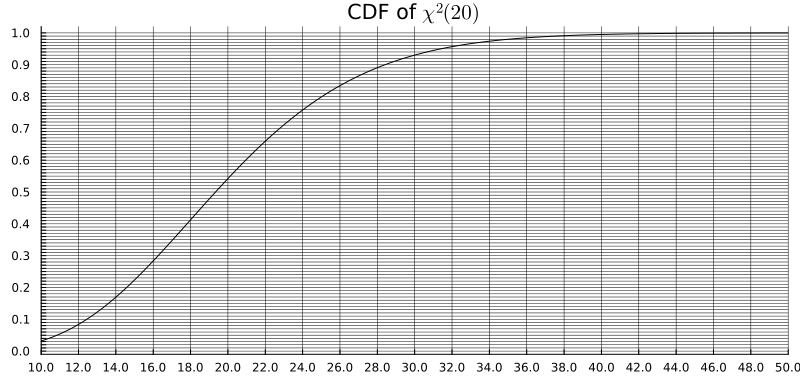

## Distributions to know (reflexes)

## Distributions to know (reflexes)

| Distribution | Support | Mean | Variance | Density / PMF |
|---|---|---|---|---|
| $\mathcal{N}(\mu, \sigma^2)$ | $\mathbb{R}$ | $\mu$ | $\sigma^2$ | $\dfrac{1}{\sigma\sqrt{2\pi}}e^{-\frac{(x-\mu)^2}{2\sigma^2}}$ |
| $\mathrm{Bin}(n, p)$ | $\{0,\ldots,n\}$ | $np$ | $np(1-p)$ | $\dbinom{n}{k}p^k(1-p)^{n-k}$ |
| $\mathcal{G}(p)$ | $\mathbb{N}^*$ | $1/p$ | $(1-p)/p^2$ | $(1-p)^{k-1}p$ |
| $\mathcal{E}(\lambda)$ | $\mathbb{R}_+$ | $1/\lambda$ | $1/\lambda^2$ | $\lambda e^{-\lambda x}$ |
| $\mathcal{P}(\lambda)$ | $\mathbb{N}$ | $\lambda$ | $\lambda$ | $e^{-\lambda}\dfrac{\lambda^k}{k!}$ |
| $\Gamma(k,\lambda)$ | $\mathbb{R}_+$ | $k/\lambda$ | $k/\lambda^2$ | $\dfrac{\lambda^k x^{k-1} e^{-\lambda x}}{\Gamma(k)}$ |

**What to remember:**

- $\mathrm{Bin}(n, p)$: sum of $n$ independent Bernoulli$(p)$ — counts the number of successes.
- $\mathcal{G}(p)$: number of trials until the first success (geometric waiting time).
- $\mathcal{E}(\lambda)$: duration of an exponential clock ticking at rate $\lambda$ — memoryless.
- $\mathcal{P}(\lambda)$: number of ticks of a rate-$\lambda$ Poisson clock on $[0, 1]$.
- $\Gamma(k, \lambda)$: sum of $k$ independent $\mathcal{E}(\lambda)$ variables (for integer $k$; the distribution extends to all $k > 0$). **You don't have to learn it's density**.

## Exercise 0: $2\sigma$-Game

For each distribution $P$, compute the $2\sigma$ interval $[\mu - 2\sigma,\, \mu + 2\sigma]$ and indicate whether $x_\mathrm{obs}$ falls inside or outside.

- $P = \mathcal{N}(2,\; 1.5^2)$, $x_\mathrm{obs} = 5$
- $P = \mathcal{N}(-10,\; 50^2)$, $x_\mathrm{obs} = 90$
- $P = \mathcal{P}(12)$, $x_\mathrm{obs} = 20$
- $P = \mathrm{Bin}(100,\; 0.4)$, $x_\mathrm{obs} = 55$
- $P = \mathcal{E}(1)$, $x_\mathrm{obs} = 3$
- $P = \mathcal{G}(0.25)$, $x_\mathrm{obs} = 10$

## Exercise 1

We aim to determine whether ENSAI students have any preference for cats or dogs.
We assume that, a priori, they have no preference on average.
We ask $n$ students what their preferences are, and we let $X$ be the number of "cat" answers.

1. Define $H_0$ and $H_1$. Is it a one-sided (*unilatéral*) or two-sided (*bilatéral*) test?

2. We observe $n = 10$ students and $X = 8$ "cat" answers. Compute the p-value in this specific case. Interpret the result.

3. Write the expression of the p-value in terms of $n$, $X$, and $F$, the CDF of $\mathrm{Bin}(n, 0.5)$.
   *Hint: recall that for a discrete distribution, the upper-tail probability is $P(X \geq k) = 1 - F(k-1)$.*

4. Write a line of code to compute the p-value in Julia, Python, or R.

5. What is the p-value if $H_1$ is instead:
   a. "Students prefer cats", or
   b. "Students prefer dogs"?

## Exercise 2

Let $(X_1, X_2, \ldots, X_n)$ be i.i.d. random variables following distribution $\mathcal{E}(\lambda)$.
We want to test:
$$
H_0: \lambda = \tfrac{1}{2} \quad \text{vs.} \quad H_1: \lambda = 1.
$$

We recall that the density of $\Gamma(k, \lambda)$ (shape $k$, rate $\lambda$) is:
$$
p(x) = \frac{\lambda^k x^{k-1} e^{-\lambda x}}{(k-1)!}, \quad x > 0, \quad k \in \mathbb{N}^*.
$$

1. Show that if $X \sim \mathcal{E}(\lambda)$ and $Y \sim \Gamma(k, \lambda)$ are independent, with $k \in \mathbb{N}^*$, then $X + Y \sim \Gamma(k+1, \lambda)$.

2. Deduce that $S_n = \sum_{i=1}^n X_i$ follows a Gamma distribution $\Gamma(n, \lambda)$.

3. For a sample of size $n = 10$, what is the rejection region of $S_n$ for the simple likelihood ratio test at the $0.05$ significance level?\
   *We admit that $\Gamma(n, \tfrac{1}{2}) \overset{d}{=} \chi^2(2n)$.*\
   **Bonus:** Show this fact for $n = 1$, using the result that if $Z \sim \mathcal{N}(0,1)$ then $Z^2 \sim \chi^2(1)$, and a suitable change of variable.

4. The empirical mean is $\bar{x}_{10} = 2.5$. What can we conclude?

5. Recall what a CDF is. The p-value is a tail probability $P_{H_0}(S_{10} \geq s_{\mathrm{obs}})$; explain how to read it as $1 - F(s_{\mathrm{obs}})$ from the CDF of the $\chi^2(20)$ distribution shown below.

   

6. Compare the p-value obtained when using a Gaussian approximation of $\sum X_i$ via the CLT. We recall that $\mathbb{V}(X_1) = \frac{1}{\lambda^2}$.

## Exercise 3

Let $X_1, X_2, \ldots, X_n$ be i.i.d. random variables drawn from $\mathcal{N}(\theta, 1)$.
To test $H_0: \theta = 5$ against $H_1: \theta > 5$, we consider the test:
$$
T = \mathbf{1}\bigl\{\bar{X} > 5 + u\bigr\},
$$
where $\bar{X}$ is the empirical mean and $u > 0$ is to be fixed.

1.  a. Let $g(t) = P(Z \geq t) - e^{-t^2/2}$ for $Z \sim \mathcal{N}(0,1)$ and $t \geq 0$. Compute $g'(t)$ and study its sign.

    b. Using the behaviour of $g$ at $+\infty$ and the sign of $g'$, deduce that $g(t) \leq 0$ for all $t \geq 0$, i.e.:
       $$
       P(Z \geq t) \leq e^{-t^2/2}.
       $$
       *Hint: treat separately the intervals $[0, \frac{1}{\sqrt{2\pi}}]$ and $[\frac{1}{\sqrt{2\pi}}, +\infty)$.*

2. Deduce a value of $u$ such that the type I error of the test $T$ is at most $\alpha$. Rewrite the test $T$ as a function of $\alpha$ and $n$.

3. Fix $\alpha = 1/e$ (so that $u = \sqrt{2/n}$). Compute the power function $\beta(\theta) = P_\theta(T = 1)$ for $\theta > 5$.

## Exercise 4

Let the family of Pareto distributions with **known** parameter $a > 0$ and **unknown** parameter $\theta > 0$:
$$
f(x;\theta) =
\begin{cases}
\dfrac{\theta}{a}\!\left(\dfrac{a}{x}\right)^{\!\theta+1}, & x \geq a, \\[6pt]
0, & x < a.
\end{cases}
$$

1. Compute the mean and variance of $X \sim \mathrm{Pareto}(a, \theta)$.
   *You may assume $\theta > 2$ for the variance to be finite.*

2. Rewrite the density in the exponential family form $f(x;\theta) = a(x)\,b(\theta)\,\exp\!\bigl(c(\theta)\,d(x)\bigr)$ and identify $a$, $b$, $c$, and $d$.

3. Deduce the general form of the uniformly most powerful test $\mathrm{UMP}_\alpha$ for
   $$H_0: \theta \geq \theta_0 \quad \text{vs.} \quad H_1: \theta < \theta_0.$$
   *Indicate carefully the direction of the rejection region for $\sum d(X_i)$.*

4. For $a = 1$, construct the UMP test for the null hypothesis: "the mean of the distribution is smaller than or equal to $2$."
   *Start by expressing this constraint in terms of $\theta$.*

5. What is the distribution of $d(X_1)$? (*$d$ is defined in Q.2.*)\
   Deduce the distribution of $\sum_{i=1}^n d(X_i)$ under $H_0$, and identify a pivot that follows a $\chi^2$ distribution.

6. For $a = 1$, $n = 20$, and $\alpha = 0.05$, write a line of code in Julia, Python, or R to compute the rejection threshold (i.e., the critical value of $\sum_{i=1}^n \log X_i$).