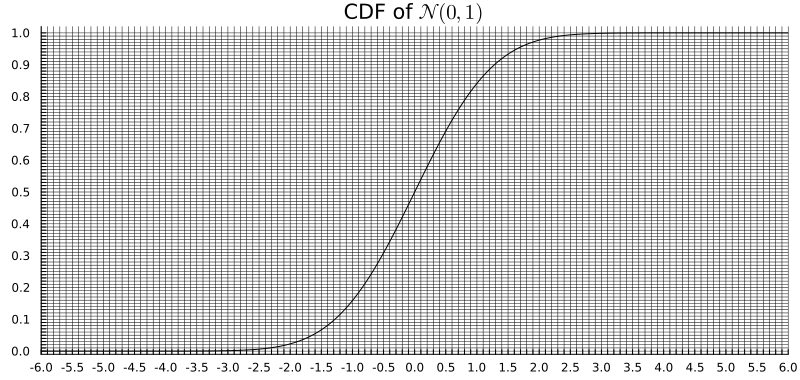

## Distributions à connaître

| Distribution | Support | Approximation gaussienne |
|---|---|---|
| $\chi^2(k)$ | $\mathbb{R}_+$ | $\mathcal{N}(k,\, 2k)$ |
| $t(\nu)$ | $\mathbb{R}$ | $\mathcal{N}(0,\, 1)$ pour $\nu$ grand |
| $F(n_1,n_2)$ | $\mathbb{R}_+$ | $\mathcal{N}\!\left(1,\, \frac{2}{n_1}+\frac{2}{n_2}\right)$ pour $n_1,n_2$ grands |

## Exercice 0 : Jeu des $2\sigma$

Pour chaque distribution $P$, calculer l'intervalle $2\sigma$ $[\mu - 2\sigma,\, \mu + 2\sigma]$
en utilisant l'approximation gaussienne, et indiquer si $x_\mathrm{obs}$ se trouve à l'intérieur ou à l'extérieur.

- $P = \chi^2(20)$, $x_\mathrm{obs} = 321$
- $P = \chi^2(100)$, $x_\mathrm{obs} = 95$
- $P = t(30)$, $x_\mathrm{obs} = 0{,}5$
- $P = t(50)$, $x_\mathrm{obs} = 6{,}1$
- $P = F(10, 30)$, $x_\mathrm{obs} = 5$
- $P = F(20, 20)$, $x_\mathrm{obs} = 1{,}2$

## Exercice 1

Une usine de fabrication de pain souhaite mettre en place des procédures de contrôle avec pour objectif principal de réduire les problèmes de surproduction, sources de pertes pour l'usine.
On s'intéresse ici au poids des baguettes produites par l'usine, dont le poids cible est de $250$ grammes.
Pour un échantillon de $n = 30$ baguettes, la moyenne empirique est $\bar{X}_n = 256{,}3$ et la variance empirique est $S^2_n = 82{,}1$.

**A priori**, l'usine atteint le poids cible de $250$ grammes.
On souhaite tester au niveau de signification $\alpha = 0{,}01$ s'il existe un problème de **surproduction**.

1. S'agit-il d'un test unilatéral ou bilatéral ?

2. Formuler le problème de test d'hypothèses : définir les paramètres du modèle, les distributions correspondantes (en précisant quels paramètres sont connus et lesquels sont inconnus), et écrire $H_0$ et $H_1$ ainsi que les ensembles de paramètres correspondants $\Theta_0$ et $\Theta_1$.

3. Quelle statistique de test utiliser, et quelle est sa distribution sous $H_0$ ?
   *Remarque : puisque $\sigma^2$ est inconnu, expliquer pourquoi un test de Student est approprié ici.*

4. Déterminer la région de rejet.

5. L'usine a-t-elle un problème de surproduction ?

## Exercice 2

On souhaite tester la précision d'une méthode de mesure du taux d'alcoolémie sur un échantillon sanguin. La précision est définie comme le double de l'écart-type de la méthode (supposée suivre une loi gaussienne). L'échantillon de référence est divisé en $6$ tubes à essai, qui sont soumis à une analyse en laboratoire. Les taux d'alcoolémie obtenus en g/L sont les suivants :
$$
1{,}35, \quad 1{,}26, \quad 1{,}48, \quad 1{,}32, \quad 1{,}50, \quad 1{,}44.
$$

On souhaite tester l'hypothèse que la précision est supérieure à $0{,}1\,\text{g/L}$
(c'est-à-dire que la méthode **n'est pas** suffisamment précise).

1. Formuler le problème de test d'hypothèses. Notons que « précision $\leq 0{,}1$ g/L » signifie
   $2\sigma \leq 0{,}1$, c'est-à-dire $\sigma^2 \leq \sigma_0^2 = 0{,}0025$.
   Écrire $H_0$, $H_1$, $\Theta_0$ et $\Theta_1$.

2. Écrire la statistique de test et donner sa distribution sous $H_0 : \sigma^2 = \sigma_0^2$.

3. Effectuer le test au niveau de signification $\alpha = 0{,}05$.

4. Montrer que la p-valeur de ce test est comprise entre $0{,}001$ et $0{,}01$.
   *Utiliser le fait que $\chi^2_5(0{,}99) \approx 15{,}09$ et $\chi^2_5(0{,}999) \approx 20{,}52$.*

## Exercice 3

Un candidat aux élections européennes souhaite savoir si sa popularité diffère entre les hommes et les femmes. Un sondage a été réalisé auprès de $250$ hommes, dont $42\%$ se sont déclarés favorables au candidat, et $250$ femmes, dont $51\%$ se sont déclarées favorables.

1. Formuler le problème de test d'hypothèses. On note $p_h$ et $p_f$ les proportions réelles de soutien respectivement chez les hommes et chez les femmes.

2. Pour tester $H_0: p_h = p_f$, utiliser la proportion poolée
   $\hat{p} = (\hat{p}_h + \hat{p}_f)/2$ pour estimer la variance commune sous $H_0$,
   et construire une statistique $z$. Au niveau de signification $\alpha = 0{,}05$, la différence est-elle statistiquement significative ?

3. Donner la p-valeur sous la forme $2F(z_\mathrm{obs})$ où $F$ est la fonction de répartition de $\mathcal{N}(0,1)$
   et $z_\mathrm{obs} < 0$, et la lire sur le graphique ci-dessous.

   

## Exercice 4

On souhaite comparer les durées moyennes journalières (en heures) des trajets domicile-travail dans deux départements notés $A$ et $B$. On a interrogé aléatoirement $26$ personnes dans $A$ et $22$ dans $B$. Soit $X_i$ la durée du trajet de la personne $i$ dans le département $A$, et $Y_j$ celle de la personne $j$ dans le département $B$. On suppose que les échantillons sont i.i.d. et gaussiens :
$$
X_i \sim \mathcal{N}(\mu_A,\, \sigma_A^2) \quad \text{et} \quad
Y_j \sim \mathcal{N}(\mu_B,\, \sigma_B^2).
$$

Voici un résumé des données :

| | Département $A$ | Département $B$ |
|:--|:--:|:--:|
| Taille de l'échantillon | $n_A = 26$ | $n_B = 22$ |
| $\sum x_i$ | $533$ | — |
| $\sum y_j$ | — | $396$ |
| $\sum x_i^2$ | $11626$ | — |
| $\sum y_j^2$ | — | $7590$ |

1. Formuler le problème de test d'hypothèses pour la comparaison des deux moyennes.

2. Tester l'égalité des variances $H_0: \sigma_A^2 = \sigma_B^2$ au niveau de signification
   $\alpha = 0{,}1$, à l'aide d'un test $F$. Qu'en concluez-vous pour le choix du test à la Q.3 ?

3. En utilisant la conclusion de la Q.2, tester l'égalité des durées moyennes de trajet
   $H_0: \mu_A = \mu_B$ au niveau de signification $\alpha = 0{,}05$, et conclure.

4. Donner une approximation gaussienne de la statistique de test en utilisant le TCL et la LGN, et
   approcher la p-valeur à l'aide du graphique de la fonction de répartition de $\mathcal{N}(0,1)$ de l'Exercice 3.
