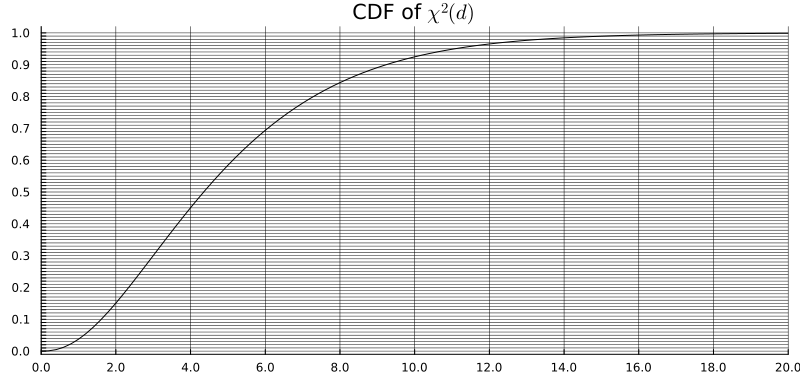

## Exercice 0 : Jeu des $2\sigma$

Pour chaque distribution $P$, calculer une approximation de l'intervalle $2\sigma$ $[\mu - 2\sigma,\, \mu + 2\sigma]$
et indiquer si $x_\mathrm{obs}$ se trouve à l'intérieur ou à l'extérieur.
Pour les lois $\chi^2$, $t$ et $F$, utiliser l'approximation gaussienne.

- $P = \mathcal{N}(3,\, 2^2)$, $x_\mathrm{obs} = 8$
- $P = \mathcal{N}(-5,\, 3^2)$, $x_\mathrm{obs} = 0{,}5$
- $P = \mathcal{P}(9)$, $x_\mathrm{obs} = 16$
- $P = \mathcal{P}(25)$, $x_\mathrm{obs} = 18$
- $P = \mathcal{E}(2)$, $x_\mathrm{obs} = 0{,}6$
- $P = \mathcal{E}(0{,}5)$, $x_\mathrm{obs} = 3{,}5$
- $P = \chi^2(10)$, $x_\mathrm{obs} = 19$
- $P = F(10,\, 30)$, $x_\mathrm{obs} = 1{,}9$

## Exercice 1

On veut tester si un dé est pipé. Il est lancé $1000$ fois et on enregistre le nombre d'apparitions de chaque face. Les données sont les suivantes :

|          | 1   | 2   | 3   | 4   | 5   | 6   |
|----------|-----|-----|-----|-----|-----|-----|
| Effectifs | 159 | 168 | 167 | 160 | 175 | 171 |

1. Formuler le problème de test d'hypothèses.
2. Calculer les effectifs théoriques sous $H_0$, donner le degré de liberté $d$ de la statistique du test du chi-deux et donner la p-valeur approchée, en utilisant la fonction de répartition de $\chi^2(d)$ :



## Exercice 2

Dans une enquête portant sur $825$ familles ayant $3$ enfants, le nombre de garçons a été enregistré :

$$
\begin{array}{|c|c|c|c|c|c|}
\hline
\text{Nombre de garçons} & 0 & 1 & 2 & 3 & \text{Total} \\
\hline
\text{Nombre de familles} & 71 & 297 & 336 & 121 & 825 \\
\hline
\end{array}
$$

On suppose sous $H_0$ que les sexes des enfants lors des naissances successives au sein d'une famille sont des variables catégorielles indépendantes et que la probabilité $p$ d'avoir un garçon reste constante.

1. Déterminer la loi du nombre de garçons dans une famille de 3 enfants en fonction de $p$.
2. Estimer $p$ par un estimateur du maximum de vraisemblance.
3. Tester l'adéquation à la loi obtenue à la question 1.

## Exercice 3

On observe
```
X = [0, 1, 0, 0, 0, 0, 0, 0.5, 1, 1, 1, 0.7, 0.9, 1, 1, 1, 1, 0, 0.1, 0, 1]
```

On suppose que les entrées de $X$ sont i.i.d. de loi $P$.

On considère le problème de test d'hypothèses suivant :

$H_0$ : $P = \mathcal{B}(0{,}5)$ (Bernoulli) $\quad$ contre $\quad$ $H_1$ : $P \neq \mathcal{B}(0{,}5)$.

1. Examiner attentivement les données. Que peut-on dire des observations, de l'hypothèse d'i.i.d., de $H_0$ et de $H_1$ ?
2. Tracer sur le même graphique la fonction de répartition d'une loi de Bernoulli $\mathcal{B}(0{,}5)$ et la fonction de répartition empirique des données observées $X$.
3. Appliquer le test de Kolmogorov-Smirnov au niveau $0{,}1$. Pour cela, utiliser ce [tableau](https://real-statistics.com/statistics-tables/kolmogorov-smirnov-table/).
4. Commenter le résultat.
