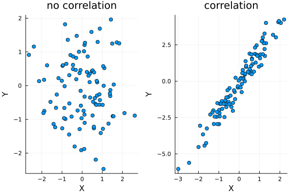
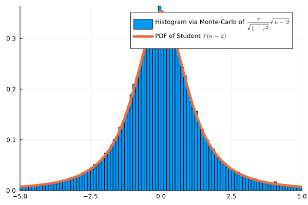
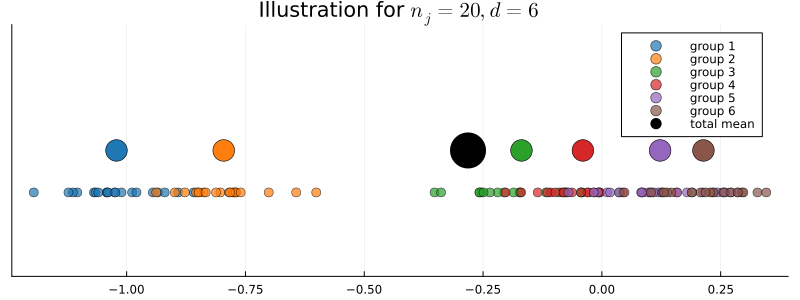
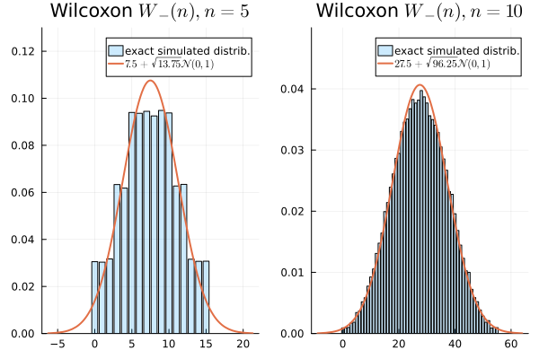

## Plan

- Test de corrélation (Pearson)
- Test ANOVA
- Tests d'homogénéité et d'indépendance du $\chi^2$
- Test des rangs signés de Wilcoxon

[Précédent](goodness_of_fit_chi2.qmd)

# Test de Corrélation

## Cadre

. . .

On observe des données appariées i.i.d. $(X_1, Y_1), \dots, (X_n,Y_n)$ de moyennes **inconnues** $\mu_X, \mu_Y$ et de matrice de covariance **inconnue** $\Sigma$.

. . .

Soit $X = X_1$, $Y = Y_1$.

. . .

::: {.square-def}
$\mathrm{Cov}(X,Y) = \mathbb{E}[(X - \mathbb{E}[X])(Y - \mathbb{E}[Y])]$
:::

. . .

::: {.square-objective}
$H_0: \mathrm{Cov}(X,Y) = 0$ contre $H_1: \mathrm{Cov}(X,Y) \neq 0$
:::

## Corrélation et Matrice de Covariance

. . .

$\sigma_X^2 = \mathrm{Cov}(X,X)$

$\sigma_Y^2 = \mathrm{Cov}(Y,Y)$

. . .

::: {.square-def}
$\hat \rho(X,Y) = \dfrac{\mathrm{Cov}(X,Y)}{\sigma_X \sigma_Y}$
:::

[[Wooclap](https://app.wooclap.com/events/RQSUIA/questions/67d18d44da9d0e3a03397017)]

. . .

Matrice de covariance :

$$
\Sigma = 
\begin{pmatrix} 
\sigma_X^2 & \mathrm{Cov}(X,Y) \\
\mathrm{Cov}(X,Y) & \sigma_Y^2 
\end{pmatrix}
$$

## Quantités Théoriques VS Empiriques

. . .

On définit leurs versions empiriques :

. . .

$\widehat{\mathrm{Cov}}(X,Y) = \frac{1}{n-1}\sum_{i=1}^n (X_i - \overline X)(Y_i - \overline Y)$

. . .

$\hat \sigma_X^2 = \frac{1}{n-1}\sum_{i=1}^n (X_i - \overline X)^2$

. . .

::: {.square-def}
$$\hat \rho(X,Y) = \frac{\widehat{\mathrm{Cov}}(X,Y)}{\hat \sigma_X \hat \sigma_Y}$$
:::

##

::: {.callout-warning}
## Quantités empiriques vs. théoriques

$\hat \rho$, $\hat \sigma_X$, $\widehat{\mathrm{Cov}}$, ... sont des quantités [*empiriques*]{style="background-color: yellow;"} — elles sont calculées à partir des données. Leurs homologues $\rho$, $\sigma_X$, $\mathrm{Cov}$, ... sont des quantités [*théoriques*]{style="background-color: yellow;"} (de population), généralement inconnues.
:::

## Propriétés de la Corrélation Empirique

. . .

À partir de l'inégalité de Cauchy-Schwarz, on déduit que :

. . .

La corrélation $\hat \rho$ est toujours comprise entre $-1$ et $1$ :

- Si [$\hat \rho = 1$]{style="background-color: lightgreen;"} : pour tout $i$, $Y_i = aX_i + b$ pour un certain [$a > 0$]{style="background-color: lightgreen;"}

- Si [$\hat \rho = -1$]{style="background-color: orange;"} : pour tout $i$, $Y_i = aX_i + b$ pour un certain [$a < 0$]{style="background-color: orange;"}

- Si [$\hat \rho = 0$]{style="background-color: yellow;"} : **aucune** relation linéaire. [notebook](../pluto/introduction.html)


## Test de Corrélation de Pearson

. . .

Corrélation empirique :

::: {.square-def}
$$\hat \rho = \frac{\sum_{i=1}^n (X_i - \overline X)(Y_i - \overline Y)}{\sqrt{\sum_{i=1}^n (X_i - \overline X)^2\sum_{i=1}^n (Y_i - \overline Y)^2}}$$
:::

. . .

Statistique de test :

$$\psi(X,Y) = \frac{\hat \rho}{\sqrt{1-\hat \rho^2}}\sqrt{n-2}$$

Sous $H_0$, si les données sont gaussiennes : $\psi(X,Y) \approx \mathcal{T}(n-2)$

[Motivation et preuve](../notes/pearson_student_fr.html)

##




## Validation par Monte Carlo ($n=4$)

. . .




## Exemple

. . .

Le temps d'étude est-il corrélé avec les notes aux examens ?

| Étudiant | Temps d'étude $X_i$ (h) | Note $Y_i$ (%) |
|----------|--------------------------|-----------------|
| 1 | 2 | 55 |
| 2 | 4 | 65 |
| 3 | 6 | 70 |
| 4 | 8 | 80 |
| 5 | 10 | 90 |

## Formalisation

. . .

On note $X_i$ le temps d'étude de l'étudiant $i$ et $Y_i$ sa note.

. . .

On suppose que $(X_1, \dots, X_n)$ i.i.d. $\mathcal N(\mu_X, \sigma_X^2)$ et $(Y_1, \dots, Y_n)$ i.i.d. $\mathcal N(\mu_Y, \sigma_Y^2)$ où $\mu_X$, $\mu_Y$, $\sigma_X$, $\sigma_Y$ sont **inconnus**.

. . .

On note $\rho = Cov(X,Y)$, également **inconnu**. On veut tester :

::: {.square-objective}
$H_0: \rho = 0$ contre $H_1: \rho \neq 0$
:::

. . .

Ici $\hat \rho =0{,}9948$ et $\hat{\rho} = \frac{170}{\sqrt{40 \times 730}} \approx 0{,}9948, \qquad t = \frac{0{,}9948\sqrt{3}}{\sqrt{1-0{,}9948^2}} \approx 16{,}94$. [Rejet]{style="background-color: orange;"} (présence de corrélation)


# Test ANOVA

## Motivation

. . .

Précédemment : test de corrélation entre deux variables [quantitatives]{style="background-color: yellow;"} $Y$ et $X$. Que faire si $X$ représente des modalités ?

. . .

Par exemple : $Y$ représente le salaire et $X$ la région.

. . .

Question naturelle : les salaires sont-ils homogènes entre les régions ?

## Cadre
. . .

On observe

$(X_1, \dots, X_n) \in \{1, \dots I\}^n$\ (modalités)
$(Y_1, \dots, Y_n) \in \mathbb R^n$ (variables quantitatives)

. . .

Hypothèse : $(Y_k,X_k)$ sont indépendants, de [même variance]{style="background-color: yellow;"}, et si $X_k=i$ :

::: {.square-def}
$Y_k \sim \mathcal N(\mu_k, \sigma^2)$
:::


. . .


On peut écrire :

$\mu_i = \mathbb E[Y|X=i]=\frac{\mathbb E[Y\mathbf 1\{X=i\}]}{\mathbb P(X=i)}$ **(inconnu)**

## Problème de Test

. . .

Les $Y$ sont-ils homogènes par rapport aux modalités de $X$ ?

. . .

::: {.square-def}
$H_0: \mu_1=\dots = \mu_I$ contre $H_1: \mu_i \neq \mu_j$ pour certains $i,j$
:::

. . .

::: {.callout-warning}
Il s'agit d'un test sur les **moyennes** et non sur les variances. La **variance est supposée constante** pour toutes les modalités.
:::


## Formulation Équivalente

. . .

On observe 

::: {.square-def}
$Y_k = \sum_{i=1}^I\mathbf{1}\{X_k = i\} \mu_i + \sigma \varepsilon_k$
:::


où les $\varepsilon_k$ sont i.i.d. $\mathcal N(0,1)$

## Représentation Graphique

. . .

On observe $X=(X_1, \dots, X_n)$ et $Y=(Y_1, \dots, Y_n)$, où

- $X_k \in \{1, \dots, I\}$ (Qualitatif)
- $Y_k \in \mathbb R$ (Quantitatif)

. . .

**Boxplot** : représente les percentiles $0$, $25$, $75$ et $100$.


## Jeu de Données des Chanteurs (Julia StatsPlots)

. . .

$X$ : Taille (en pouces), $Y$ : Type de chanteur

. . .

Boxplot : (min, $q_{1/4}$, $q_{3/5}$, max) pour chaque modalité

{width=60%}


## Définitions

. . .

$X=(X_1, \dots, X_n) \in \{1, \dots, I\}^n$, 
$Y=(Y_1, \dots, Y_n) \in \mathbb R^n$

. . .

Pour $i \in \{1, \dots, I\}$, on définit les moyennes partielles :

::: {.square-def}
:::{style="font-size: 80%;"}
$N_i = \sum_{k=1}^n \mathbf 1\{X_k=i\}$ et $\overline Y_i = \frac{1}{N_i}\sum_{k=1}^n Y_k \mathbf 1\{X_k=i\}$
:::

:::

. . .

Moyenne totale :

::: {.square-def}
$\overline Y = \frac{1}{N}\sum_{k=1}^n Y_k = \frac{1}{N}\sum_{i=1}^I\sum N_i \overline Y_i$
:::


## Décomposition de la Variance


. . .


:::{style="font-size: 70%;"}
::: {.square-def}
$$\frac{1}{n}\underbrace{\sum_{k=1}^n(Y_k - \overline Y)^2}_{S_{\text{tot}}} = 
\frac{1}{n}\underbrace{\sum_{i=1}^IN_i(\overline Y_i - \overline Y)^2}_{S_{\text{inter}}} 
+ \frac{1}{n}\underbrace{\sum_{k=1}^n\mathbf 1\{X_k=i\}(Y_k - \overline Y_i)^2}_{S_{\text{intra}}}$$
:::
:::

. . .

**Rapport de corrélation :**

::: {.square-def}
$$ \hat \eta^2 = \frac{S_{\text{inter}}}{S_{\text{tot}}}  \in [0,1]$$
:::

. . .

C'est un estimateur de $\eta = \frac{\mathbb V(\mathbb E[Y|X])}{\mathbb V(Y)}$ **inconnu**


## Distribution sous $H_0$

. . .

**Modèle :** $Y_k = \mu + \varepsilon_k$, $\varepsilon_k \overset{iid}{\sim} \mathcal{N}(0, \sigma^2)$, c'est-à-dire $\mu_1 = \cdots = \mu_I = \mu$ (inconnu).

. . .

::: {.callout-note}
## Proposition

Sous $H_0$, en supposant $\varepsilon_k \overset{iid}{\sim} \mathcal{N}(0,\sigma^2)$ :

$$\frac{S_{\text{inter}}}{\sigma^2} \sim \chi^2(I-1), \qquad \frac{S_{\text{intra}}}{\sigma^2} \sim \chi^2(n-I)$$

et $S_{\text{inter}} \perp S_{\text{intra}}$. Par conséquent,

$$F = \frac{S_{\text{inter}}/(I-1)}{S_{\text{intra}}/(n-I)} \sim \mathcal{F}(I-1,\, n-I)$$

[preuve](../notes/anova.qmd)

:::


##

Les **degrés de liberté** ont une interprétation intuitive :

- $I-1$ : $I$ moyennes de groupe, moins 1 contrainte globale $\overline Y$
- $n-I$ : $n$ observations, moins $I$ moyennes de groupe estimées

. . .

**Test de Fisher :** rejeter $H_0$ au niveau $\alpha$ lorsque

$$F > f_{1-\alpha}(I-1,\, n-I)$$

où $f_{1-\alpha}(I-1, n-I)$ est le quantile $(1-\alpha)$ de $\mathcal{F}(I-1, n-I)$.

## Test ANOVA

. . .

**Statistique de test**

::: {.square-def}
$$\psi(X,Y) = \frac{S_{\text{inter}}/(I-1)}{S_{\text{intra}}/(N-I)}$$
:::

. . .

$\psi(X,Y) \sim \mathcal F(I-1, N-I)$ sous $H_0$

. . .

p-valeur : 
```julia
1-cdf(FDist(I-1, N-1), psiobs)
```

## Illustration

. . .

{height=280}

## Exemple

[Correction 2025](../annals/correction_2025.qmd)


# Tests d'Homogénéité et d'Indépendance du $\chi^2$


## Objectif Général

. . .

Précédemment : [corrélation de Pearson entre variables quantitatives]{style="background-color: yellow;"} $X_i$ et $Y_i$

. . .

Mais que faire si $X_i$ et $Y_i$ représentent [deux modalités]{style="background-color: yellow;"} de l'individu $i$ ?

. . .

Exemple : catégorie socioprofessionnelle et région, opinion politique et tranche d'âge, religion et pays...


## De Nouveau les Multinomiales

. . .

Pensez aux modalités de [$Y$ comme des « sacs »]{style="background-color: yellow;"} et aux modalités de [$X$ comme des « couleurs »]{style="background-color: yellow;"}.

. . .

Il s'agit juste d'une représentation, on peut prendre $X$ pour les sacs.

. . .

Ainsi, échantillonner une population revient à tirer des boules dans des sacs.

. . .

On obtient une [loi multinomiale]{style="background-color: yellow;"}


## Tableau de Contingence et Notations

. . .

On observe $X=(X_1, \dots, X_n)$ i.i.d. et $Y=(Y_1, \dots, Y_n)$ i.i.d., où

- $X_k \in \{1, \dots, I\}$ (facteur à $I$ catégories, « couleurs »)
- $Y_k \in \{1, \dots, J\}$ (facteur à $J$ catégories, « sacs »)

. . .

| Catégorie X/Y | **Sac 1** | **Sac 2** | **Sac 3** | Totaux |
|---|---|---|---|---|
| **Col 1** | $n_{11}$ | $n_{12}$ | $n_{13}$ | $R_1$ |
| **Col 2** | $n_{21}$ | $n_{22}$ | $n_{23}$ | $R_2$ |
| **Totaux** | $N_1$ | $N_2$ | $N_3$ | $N$ |


$n_{ij}$ : nombre d'individus ayant la catégorie $i$ pour $X$ et $j$ pour $Y$  


## Exemple : Jeu de Données NO2trafic

. . .

Le jeu de données contient des mesures de qualité de l'air à différentes stations de surveillance du trafic. On étudie deux variables qualitatives :

- **Type** : type de route — P (périphérique), U (urbain), A (autoroute), T (tunnel), V (voie verte)
- **Fluidité** : niveau de fluidité du trafic — A (fluide), B (modéré), C (dense), D (congestionné)


## Exemple : Jeu de Données NO2trafic

. . .

**Tableau de contingence** des variables « Type » et « Fluidité »

| **Fluidité**/**Type** | P | U | A | T | V |
|---|------|-----|-----|-----|-----|
| A | 21 | 21 | 19 | 9 | 9 |
| B | 20 | 17 | 16 | 8 | 7 |
| C | 17 | 17 | 16 | 8 | 7 |
| D | 20 | 20 | 18 | 8 | 8 |

En R : `table(X,Y)`


## Deux Questions Possibles, Une Même Statistique :

. . .

Les sacs sont-ils homogènes ?

. . .

Existe-t-il une dépendance entre $X$ et $Y$ ?


## Test d'Homogénéité du $\chi^2$

. . .

$d$ groupes différents (sacs), chacun contenant des boules de $m$ couleurs possibles.

. . .

Si $d = 3$ et $m = 2$, on observe le tableau $2\times 3$ d'**effectifs** suivant :

. . .

|         | sac 1    | sac 2    | sac 3    | Total |
| ------- | -------- | -------- | -------- | ----- |
| couleur 1 | $n_{11}$ | $n_{12}$ | $n_{13}$ | $R_1$ |
| couleur 2 | $n_{21}$ | $n_{22}$ | $n_{23}$ | $R_2$ |
| Total   | $N_1$    | $N_2$    | $N_3$    | $N$   |

## Cadre et Statistique

. . .


Dans le sac $j$ :

::: {.square-def}
$(X_{1j}, X_{2j}, \dots, X_{mj}) \sim \mathrm{Mult}(N_j, (p_{1j}, p_{2j}, \dots, p_{mj}))$
:::

. . .


Les paramètres $p_{ij}$ sont **inconnus** [[Wooclap](https://app.wooclap.com/events/RQSUIA/questions/67d19ee99480f7e8d5dbf8da)]


. . .

::: {.square-objective}
$H_0$ : $p_{i1} = p_{i2} = \dots = p_{id}$ pour toute couleur $i$ (les sacs sont homogènes)

$H_1$ : les sacs sont hétérogènes
:::


## Statistique de Test


. . .

Sous $H_0$, on écrit $p_i = p_{i1} = p_{i2} = \dots = p_{id}$.

. . .

On peut alors estimer

$\hat{p}_{i} = \tfrac{1}{N}\sum_{j=1}^{d}X_{ij} = \dfrac{R_i}{N}$


On définit la statistique de test comme :

::: {.square-def}
$$\psi(X) = \sum_{i=1}^m\sum_{j=1}^d \frac{(n_{ij}- N_j\hat{p}_{i})^2}{N_j\hat{p}_{i}} \;\asymp\; \chi^2\!\left((m-1)(d-1)\right)$$
:::


## Proposition

. . .

::: {.callout-note}
## Proposition

Sous $H_0$, lorsque $N \to \infty$ avec $N_j/N \to \lambda_j > 0$,

$$\psi(X) = \sum_{i=1}^m\sum_{j=1}^d \frac{(n_{ij} - N_j\hat{p}_{i})^2}{N_j\hat{p}_{i}} \xrightarrow{\mathcal{L}} \chi^2\!\left((m-1)(d-1)\right)$$
:::


## Degrés de Liberté — Intuition

. . .

Le tableau comporte $m \times d$ cases, mais toutes ne sont pas libres une fois les marges fixées.

. . .

:::{style="font-size: 80%;"}
| | $j=1$ | $j=2$ | $\cdots$ | $j=d$ | |
|:-:|:-:|:-:|:-:|:-:|:-:|
| $i=1$ | $n_{11}$ | $n_{12}$ | $\cdots$ | **?** | $R_1$ |
| $i=2$ | $n_{21}$ | $n_{22}$ | $\cdots$ | **?** | $R_2$ |
| $\vdots$ | | | | **?** | $\vdots$ |
| $i=m$ | **?** | **?** | $\cdots$ | **?** | $R_m$ |
| | $C_1$ | $C_2$ | $\cdots$ | $C_d$ | $N$ |
:::

. . .

Une fois le **bloc supérieur gauche** de $(m-1)(d-1)$ cases rempli, **toutes les autres cases sont déterminées** par les contraintes des marges.

## Exemple : Préférences de Boissons Gazeuses


:::{style="font-size: 80%;"}

:::

. . .

:::{style="font-size: 60%"}
| Groupe d'âge    | Jeunes adultes | Âge moyen | Seniors | Total |
| --------------- | -------------- | ----------| ------- | ----- |
| Coca            | 60             | 40        | 30      | 130   |
| Pepsi           | 50             | 55        | 25      | 130   |
| Sprite          | 30             | 45        | 55      | 130   |
| **Total**       | 140            | 140       | 110     | 390   |
:::

. . .

Effectif théorique : $N_1 \hat{p}_1 = 140 \times \dfrac{130}{390} \approx 46{,}7$

## Calcul de la Statistique du $\chi^2$

. . .

$$
\begin{aligned}
\psi(X) &= \frac{(60-46{,}7)^2}{46{,}7} + \frac{(40-46{,}7)^2}{46{,}7} + \frac{(30-36{,}7)^2}{36{,}7} \\
        &+ \frac{(50-46{,}7)^2}{46{,}7} + \frac{(55-46{,}7)^2}{46{,}7} + \frac{(25-36{,}7)^2}{36{,}7} \\
        &+ \frac{(30-46{,}7)^2}{46{,}7} + \frac{(45-46{,}7)^2}{46{,}7} + \frac{(55-36{,}7)^2}{36{,}7} \\
        &\approx 26{,}57
\end{aligned}
$$

. . .

```julia
1 - cdf(Chisq(4), 26.57)  # ≈ 2.4e-5  →  rejeter H₀
```


## Test d'Indépendance du $\chi^2$

$\newcommand{\VS}{\quad \mathrm{contre} \quad}$
$\newcommand{\and}{\quad \mathrm{et} \quad}$

. . .

On observe  \
$X=(X_1, \dots, X_n) \in \{1, \dots, I\}^n$ et $Y=(Y_1, \dots, Y_n) \in \{1, \dots, J\}^n$

. . .

**Hypothèses** : $(X_k,Y_k)$ sont indépendants, chaque paire a une distribution inconnue $P_{XY}$

. . .

Problème de test de dépendance :

::: {.square-def}
$$H_0: P_{XY}=P_{X}P_Y \VS H_1: P_{XY} \neq P_{X}P_{Y}$$
:::


## Définitions

. . .

Cases du tableau :

::: {.square-def}
$$n_{ij} = \sum_{k=1}^n \mathbf 1\{X_{k} = i\}\mathbf 1\{Y_k=j\}$$
:::

. . .

Proportion totale des individus $k$ de couleur $X_k =i$ :\

::: {.square-def}
[$\hat p_{i}=\frac{R_i}{N}$]{style="background-color: yellow;"} $= \tfrac{1}{N}\sum_{j=1}^{J}n_{ij}$
:::


## Test d'Indépendance du $\chi^2$ 

. . .

Statistique du chi-deux, ou distance du chi-deux :

::: {.square-def}
$$\psi(X,Y) = \sum_{i=1}^I\sum_{j=1}^J \frac{(n_{ij}- N_j\hat p_{i})^2}{N_j\hat p_{i}}$$
:::


- Approximation : $\psi(X,Y) \sim \chi^2((I-1)(J-1))$ quand $n \to \infty$
- Test : $T=\mathbf 1\{\psi(X,Y) \geq t_{1-\alpha/2}\}$, où \
$t_{0{,}975}$ = `quantile(Chisq(I-1,J-1), 0.975)`


## Test d'Indépendance du $\chi^2$

. . .

::: {.callout-note}
## Cadre

- Observations : variables **catégorielles** appariées $(X_1, Y_1), \dots, (X_n, Y_n)$
- Ex. : $X_i \in \{\mathrm{homme}, \mathrm{femme}\}$, $Y_i \in \{\mathrm{café}, \mathrm{thé}\}$ [[Wooclap](https://app.wooclap.com/events/RQSUIA/questions/67d1a28a4b4e2b35810c65ff)]
- Idée : regrouper les données selon une variable pour former des **sacs**, puis appliquer le test d'homogénéité
:::

. . .

:::{style="font-size: 70%;"}
:::: {.columns}
::: {.column}

**Tableau de contingence :**

| Sexe    | Homme | Femme | Total |
|---------|-------|-------|-------|
| Café    | 30    | 20    | 50    |
| Thé     | 28    | 22    | 50    |
| Total   | 58    | 42    | 100   |

:::
::: {.column}

**Effectifs théoriques :**

| Sexe    | Homme | Femme | Total |
|---------|-------|-------|-------|
| Café    | 29    | 21    | 50    |
| Thé     | 29    | 21    | 50    |
| Total   | 58    | 42    | 100   |

:::
::::
:::

. . .

$N_1 \hat{p}_1 = 58 \cdot 50/100 = 29$, degrés de liberté $= (2-1)(2-1) = 1$

# Test des Rangs Signés de Wilcoxon

## Variables Aléatoires Symétriques

. . .

::: {.callout-note}
## Définitions

- Une **médiane** de $X$ est un quantile d'ordre $0{,}5$ de sa distribution : si $X$ a une densité $p$, la médiane $m$ vérifie
$$\int_{-\infty}^m p(x)\,dx = \int_{m}^{+\infty} p(x)\,dx = 0{,}5$$

- Une variable aléatoire $X$ est **symétrique** si $X \overset{d}{=} -X$. En particulier sa médiane est $0$.
:::

## Caractérisation par signe et valeur absolue

. . .

::: {.callout-note title="Proposition"}
Soit $X$ une variable aléatoire avec $\mathbb P(X = 0) = 0$. Les propriétés suivantes sont **équivalentes** :

1. $X$ est symétrique ($X \overset{d}{=} -X$).

2. $X \overset{d}{=} \varepsilon\,|X|$, où $\varepsilon$ est **uniforme sur $\{-1, +1\}$** et **indépendante** de $|X|$.
:::

. . .

Autrement dit : une variable symétrique se décompose en un **signe aléatoire équilibré**, indépendant de son **amplitude** $|X|$.

## Idée de preuve ($1 \Rightarrow 2$)

. . .

Il suffit de montrer que $\mathrm{sgn}(X) \perp |X|$ avec $\mathrm{sgn}(X)$ uniforme sur $\{-1, +1\}$. Pour cela, on vérifie que pour tout $t > 0$ :

:::{style="font-size: 70%;"}
$\mathbb P\bigl(\mathrm{sgn}(X) = +1,\; |X| \geq t\bigr) = \mathbb P\bigl(\mathrm{sgn}(X) = +1\bigr)\,\cdot\,\mathbb P\bigl(|X| \geq t\bigr).$
:::

. . .

**Membre de gauche.** L'événement $\{\mathrm{sgn}(X) = +1\} \cap \{|X| \geq t\}$ est exactement $\{X \geq t\}$, donc
$$
\mathbb P\bigl(\mathrm{sgn}(X) = +1,\; |X| \geq t\bigr) = \mathbb P(X \geq t).
$$

##

**Par symétrie**, $\mathbb P(X \geq t) = \mathbb P(-X \geq t) = \mathbb P(X \leq -t)$, donc
$$
\mathbb P(X \geq t) = \dfrac{\mathbb P(X \geq t) + \mathbb P(X \leq -t)}{2} = \dfrac{\mathbb P(|X| \geq t)}{2}.
$$

## Symétrisation

. . .

::: {.callout-note}
## Lemme de Symétrisation

Si $X$ et $Y$ sont deux variables **indépendantes** de même densité $p$, alors $X - Y$ est symétrique.

**Preuve :**
$$
\mathbb{P}(X - Y \leq t) = \int_{-\infty}^t \mathbb{P}(X \leq t+y)\,p(y)\,dy = \mathbb{P}(Y - X \leq t) \; .
$$

Donc $X \perp Y \Rightarrow X - Y$ symétrique $\Rightarrow \mathrm{médiane}(X-Y) = 0$.
:::

## Problème de Dépendance pour Données Appariées

. . .

On observe des paires i.i.d. $(X_1, Y_1), \dots, (X_n, Y_n)$ de densité jointe **inconnue** $p_{XY}(x,y)$.

. . .

::: {.square-objective}
$H_0$ : $\mathrm{médiane}(X_i - Y_i) = 0$ pour tout $i$

$H_1$ : $\mathrm{médiane}(X_i - Y_i) \neq 0$ pour un certain $i$
:::

. . .

[[Wooclap](https://app.wooclap.com/events/RQSUIA/questions/67d2a7e45a6787f340144164)]

. . .

::: {.callout-note}
## Quand $H_0$ est-elle vérifiée ?

- Si $X_i - Y_i$ est symétrique pour tout $i$, on est sous $H_0$.
- Si $X_i \perp Y_i$ pour tout $i$, on est sous $H_0$.
:::

## Plus Formellement

. . .

::: {.square-def}
$$X_i \perp Y_i \text{et même loi} \implies X_i - Y_i \text{ symétrique} \implies \text{méd}(X_i - Y_i) = 0$$
:::


## Test des Rangs Signés de Wilcoxon : Définitions

. . .

Soit $D_i = X_i - Y_i$.

- Le **signe** de la paire $i$ est le signe de $D_i \in \{-1, +1\}$.
- Le **rang** $R_i$ est la position de $|D_i|$ dans l'ordre trié :


. . .

$$|D_{(1)}| \leq \dots \leq |D_{(n)}|$$

[[Wooclap](https://app.wooclap.com/events/RQSUIA/questions/67d2a963cf335081a465b092)]

## Propriétés sous $H_0$

. . .

::: {.callout-note}
- Les signes $\mathrm{sgn}(D_i)$ sont indépendants et **uniformément distribués** dans $\{-1, +1\}$.
- En particulier, le nombre de signes positifs $\sum \mathbf{1} \{D_i > 0\}\sim \mathcal{B}(n, 0{,}5)$.
- Les rangs $(R_1, \dots, R_n)$ forment une **permutation aléatoire**, indépendante de la densité inconnue.
:::

. . .

::: {.callout-important}
Toute fonction déterministe des rangs et des signes est une **statistique de test pivot** : sa distribution sous $H_0$ ne dépend pas de la distribution inconnue des données.
:::


## Statistique du Test de Wilcoxon

. . .

::: {.square-def}
$$W_- = \sum_{i=1}^n R_i\, \mathbf{1}\{D_i < 0\}$$
:::

. . .

On utilise aussi : $W_+ = \sum_{i=1}^n R_i\, \mathbf{1}\{D_i > 0\}$ ou $\min(W_-, W_+)$.

. . .

## Idée :


- Classer les $|D_i|$ du plus petit au plus grand.
- Sous $H_0$ : les signes $\pm$ sont aléatoires $\Rightarrow$ les grands et petits rangs se répartissent équitablement entre différences positives et négatives.
- $W_-$ grand (resp. petit) $\Rightarrow$ les différences négatives (resp. positives) dominent $\Rightarrow$ preuve contre $H_0$.

## Approximation Gaussienne

. . .

Lorsque $n \to +\infty$, sous $H_0$, 

$$W_- \;\asymp\; \frac{n(n+1)}{4} + \sqrt{\frac{n(n+1)(2n+1)}{24}}\;\mathcal{N}(0,1)$$

Si $H_1$ : $\mathrm{médiane}(D_i) < 0$ → test **unilatéral droit** sur $W_-$

. . .

Si $H_1$ : $\mathrm{médiane}(D_i) > 0$ → test **unilatéral gauche** sur $W_-$.

. . .

Pour simuler $W_-$ sous $H_0$ :
```julia
k = rand(Binomial(n, 0.5))
w = sum(randperm(n)[1:k])
```

[preuve](../notes/wilcoxon_dep.qmd)

## Validation par Monte Carlo

. . .

L'approximation gaussienne s'ajuste bien à la distribution exacte :



## Exemple : Effet d'un Médicament sur la Pression Artérielle

. . .

- $H_0$ : le médicament n'a aucun effet. $H_1$ : il abaisse la pression artérielle (test unilatéral gauche sur $W_-$).

. . .

:::{style="font-size: 70%;"}

| Patient | $X_i$ (Avant) | $Y_i$ (Après) | $D_i = X_i - Y_i$ | $R_i$  |
| ------- | -------------- | ------------- | ------------------ | ------ |
| 1       | 150            | 140           | 10                 | 6 (+)  |
| 2       | 135            | 130           | 5                  | 5 (+)  |
| 3       | 160            | 162           | −2                 | 2 (−)  |
| 4       | 145            | 146           | −1                 | 1 (−)  |
| 5       | 154            | 150           | 4                  | 4 (+)  |
| 6       | 171            | 160           | 11                 | 7 (+)  |
| 7       | 141            | 138           | 3                  | 3 (+)  |

:::

## Application Numérique

. . .

$W_- = 1 + 2 = 3$

. . .

Par simulation, on approche $\mathbb{P}(W_- = i)$ pour $i \in \{0,1,2,3,4,5,6\}$ sous $H_0$ :

```
[0.00784066, 0.00781442, 0.00781534, 0.01563892, 0.01562184, 0.02343478, ...]
```

. . .

Par simulation :

::: {.square-def}
$p_{\text{valeur}} = \mathbb{P}(W_- \leq 3) \approx 0{,}039 < 0{,}05$
:::

. . .

On rejette $H_0$ au niveau $5\%$ : le médicament semble abaisser la pression artérielle.

## Correction pour les ex-aequo

. . .

La construction du test suppose que les $|D_i|$ sont **tous distincts**, de sorte que les rangs $1, 2, \dots, n$ sont bien définis. Dans la pratique, il arrive que plusieurs $|D_i|$ soient égaux (arrondis, données discrètes, ...).

. . .

**Traitement usuel** : à chaque groupe d'ex-aequo, on attribue la **moyenne** de leurs rangs (*midranks*). Par exemple, si $|D_3|$ et $|D_5|$ sont tous deux à la 4ème position dans le tri, ils reçoivent tous les deux le rang $(4 + 5)/2 = 4{,}5$.

##

**Conséquence sur la loi** : la variance de $W_-$ est **réduite** par rapport au cas sans ex-aequo. La formule corrigée est

$$
\mathrm{Var}(W_-) = \dfrac{n(n+1)(2n+1)}{24} - \dfrac{1}{48}\sum_{k} (t_k^3 - t_k)
$$

où $t_k$ est la taille du $k$-ième groupe d'ex-aequo.

##

::: {.callout-note}
En R : `wilcox.test(x, y, paired=TRUE)` applique automatiquement la correction. Un message d'avertissement apparaît quand des ex-aequo sont détectés (« *cannot compute exact p-value with ties* »), et le logiciel bascule sur l'approximation gaussienne avec variance corrigée.
:::

##

[précédent](goodness_of_fit_chi2_fr.qmd)
[suivant : tests multiples et vitesses de détection](multiple_minimax_fr.qmd)