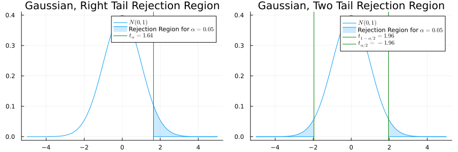
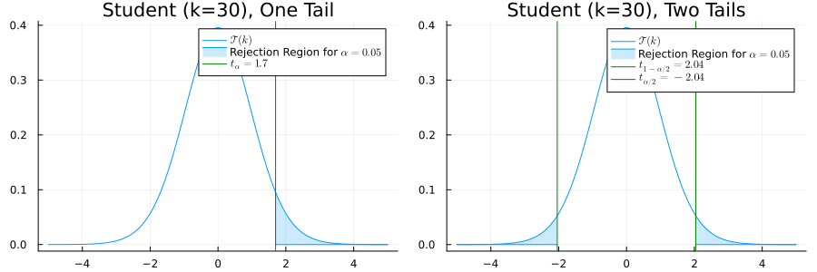
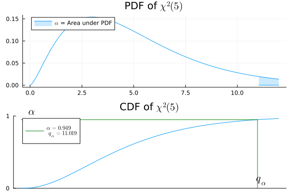
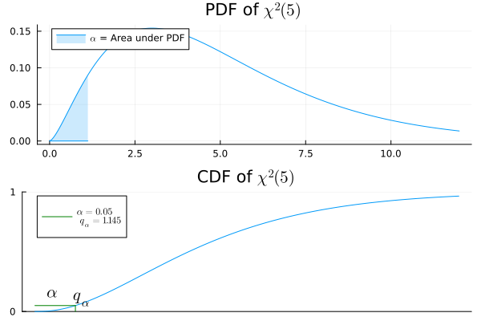

## Plan

:::{style="font-size: 80%;"}
- [Une population gaussienne]{style="background-color: yellow;"} (une moyenne, une variance) :
  - [Test sur la moyenne]{style="background-color: lightgreen;"} avec [variance connue]{style="background-color: orange;"}
  - [Test sur la moyenne]{style="background-color: lightgreen;"} avec [variance inconnue]{style="background-color: orange;"}
  - [Test sur la variance]{style="background-color: lightgreen;"} avec [moyenne inconnue]{style="background-color: orange;"}
- [Deux populations gaussiennes]{style="background-color: yellow;"} (deux moyennes, deux variances)
  - [Test sur la différence des moyennes]{style="background-color: lightgreen;"} avec [variances connues]{style="background-color: orange;"}
  - [Test sur les variances]{style="background-color: lightgreen;"} avec [moyenne inconnue]{style="background-color: orange;"}
  - [Test sur la différence des moyennes]{style="background-color: lightgreen;"} avec [variances inconnues]{style="background-color: orange;"}
- [Approximations asymptotiques]{style="background-color: yellow;"}

[Précédent : lois usuelles](usual_distributions_fr.qmd)

[Suivant : adéquation du chi-deux](goodness_of_fit_chi2_fr.qmd)
:::

# Une Population Gaussienne {style="text-align: center;"}

## Test sur la Moyenne avec Variance Connue

. . .

$X = (X_1, \dots, X_n)$, iid de loi $\mathcal N(\mu, \sigma^2)$.

. . .

::: {.callout-note icon=false}
## Problèmes de test
$H_0: \mu = \mu_0 ~~~~ \text{ ou } ~~~ H_1: \mu > \mu_0$  (unilatéral droit)

$H_0: \mu = \mu_0 ~~~ \text{ ou } ~~~ H_1: \mu < \mu_0$  (unilatéral gauche)

$H_0: \mu = \mu_0 ~~~ \text{ ou } ~~~ H_1: \mu \neq \mu_0$  (bilatéral)

:::

. . .

On veut tester la moyenne $\mu = \mu_0$. Idée naturelle : utiliser $\overline X$

. . .

Mais $\overline X \sim \mathcal N(\mu_0, \frac{\sigma^2}{n})$ sous $H_0$. On normalise donc pour obtenir une $\mathcal N(0,1)$

## Statistique de Test

. . .

Statistique de test :

::: {.square-def}
$$\psi(X) = \frac{\sqrt{n}(\overline X-\mu_0)}{\sigma}$$
:::

. . .

[Sous $H_0$]{style="background-color: yellow;"}, $\psi(X) \sim \mathcal N(0,1)$

::: {.callout-warning}
C'est une statistique de test car $\mu_0$ et $\sigma$ sont **connus** ici. Ce ne serait pas le cas sinon.
:::

- [Q1](https://app.wooclap.com/events/RQSUIA/questions/67cac80ddae229478c77ada9), [Q2](https://app.wooclap.com/events/RQSUIA/questions/67cac961ec10853018cfd6bd)
  
## Tests

. . .

::: {.callout-note icon=false}
## Régions critiques du test

$\mathcal R$ : $\frac{\sqrt{n}(\overline X-\mu_0)}{\sigma} > t_{1-\alpha}$ (unilatéral droit)

$\mathcal R$ : $\frac{\sqrt{n}(\overline X-\mu_0)}{\sigma} < t_{\alpha}$ (unilatéral gauche)

$\mathcal R$ : $\left|\frac{\sqrt{n}(\overline X-\mu_0)}{\sigma}\right| > t_{1-\tfrac{\alpha}{2}}$ (bilatéral)

:::

## Illustration

. . .

## Exemple
:::{style="font-size: 80%;"}
Une machine remplit des bouteilles avec un volume nominal de [$\mu_0 = 500$ ml]{style="background-color: yellow;"}. Le volume de remplissage suit une loi $\mathcal{N}(\mu, \sigma^2)$ avec [$\sigma = 5$ ml]{style="background-color: yellow;"}. Sur un échantillon de [$n = 25$]{style="background-color: yellow;"} bouteilles, on observe $\overline{x} = 498.1$ ml. La machine [sous-remplit]{style="background-color: yellow;"}-elle ?
:::

- $H_0: \mu = 500$ vs $H_1: \mu < 500$ (unilatéral gauche)
- Statistique de test : $\tfrac{\sqrt{n}(\overline X - \mu_0)}{\sigma} = \tfrac{\sqrt{25}(498.1 - 500)}{5} = -1.9$
- Seuil : $t_{\alpha} =$ `quantile(Normal(0,1), 0.05) = -1.645`
- $-1.9 < -1.645$ : [on rejette $H_0$ au niveau $5\%$]{style="background-color: yellow;"}
- p-valeur : `cdf(Normal(0,1), -1.9) = 0.029`

## Test sur la Moyenne, Variance Inconnue

. . .

On observe $(X_1, \dots, X_n)$ iid $\mathcal N(\mu, \sigma^2)$ où $\mu$ et $\sigma$ sont **inconnus**.

. . .

On fixe $\mu_0$ comme une quantité **connue**

. . .

on veut tester si $\mu = \mu_0$.

. . .

Problème de test multiple VS multiple :

::: {.square-objective}
$$
H_0: \{\mu_0,\sigma > 0\} \text{ ou } H_1: \{\mu \neq \mu_0,\sigma > 0\} \;.
$$

:::

##

. . .

::: {.callout-warning}
$\psi(X) = \frac{\sqrt{n}(\overline X-\mu_0)}{\sigma}$ **n'est plus une statistique de test**.
:::

. . .

**Idée** : remplacer $\sigma$ par son estimateur
$$ \hat \sigma(X) = \sqrt{\frac{1}{n-1}\sum_{i=1}^n(X_i - \overline X)^2} \; .$$

## Test T de Student

. . .

::: {.square-objective}
$$
H_0: \{\mu_0,\sigma > 0\} \text{ ou } H_1: \{\mu \neq \mu_0,\sigma > 0\} \;.
$$
:::

. . .

Statistique du test T (de Student) :
$$\psi(X) = \frac{\sqrt{n}(\overline X-\mu_0)}{\hat \sigma(X)}$$

. . .

::: {.callout-note}
## Proposition : loi de T sous $H_0$
$\psi(X)$ est une statistique de test pivotale (souvent notée $T(X)$).
Sous $H_0$, $\psi(X)\sim \mathcal T(n-1)$
:::

## Preuve

. . .

Prenons [$E = \operatorname{Span}(\mathbf{1})$]{style="background-color: yellow;"} et $F = E^\perp$. En posant $Y_i = \frac{X_i - \mu}{\sigma}$ :

. . .

$$
\|\Pi_E Y\|^2 = n\overline{Y}^2 = \frac{n(\overline{X}-\mu)^2}{\sigma^2} \sim \chi^2(1)
$$

$$
\|\Pi_F Y\|^2 = \sum_{i=1}^n (Y_i - \overline{Y})^2 = \frac{(n-1)\hat{\sigma}^2}{\sigma^2} \sim \chi^2(n-1)
$$

et les deux sont **indépendants**, ce qui est précisément ce qu'il faut pour la statistique $T$ de Student.

## Loi de Student

:::{.fragment}

:::

## Test sur la Variance, Moyenne Inconnue

. . .

On observe $X=(X_1, \dots, X_{n_1})$ iid $\mathcal N(\mu, \sigma^2)$. $\mu$, $\sigma$ sont **inconnus**. $\sigma_0$ est fixé et **connu**.

On veut tester si $\sigma > \sigma_0$, ou $\sigma < \sigma_0$

## Test de Fisher Unilatéral Droit

. . .

::: {.square-objective}

$H_0$ : $\sigma \leq \sigma_0$, $H_1$ : $\sigma > \sigma_0$

:::

. . .

[Statistique de test :]{style="background-color: yellow;"}

$\psi(X) = \frac{1}{\sigma_0^2}\sum_{i=1}^n (X_i - \overline X)^2$ [Wooclap](https://app.wooclap.com/events/RQSUIA/questions/67cacda8c917f9165d229d9d)

. . .

[Test :]{style="background-color: yellow;"}

$T(X) = \mathbf{1}\{\psi(X) > q_{1-\alpha}\}$ avec $q_{1-\alpha}$ le quantile d'ordre $(1-\alpha)$ de $\chi^2(n-1)$

. . .

[Région de rejet :]{style="background-color: yellow;"} $[q_{1-\alpha}, +\infty)$

[Région critique :]{style="background-color: yellow;"} $\{(x_1, \dots, x_n) \in \mathbb R^n: ~ \psi(x_1, \dots, x_n) > q_{1-\alpha}\}$

## Propriété du Test de Fisher

. . .

::: {.callout-note}
## Proposition
Fixons $t>0$. [Sous $H_0$, c'est-à-dire si $\sigma \leq \sigma_0$]{style="background-color: yellow;"}

::: {.square-def}
$$P_{\mu, \sigma}(\psi(X) > t) \leq P_{\mu, \sigma_0}(\psi(X) > t) = P(\chi^2(n-1) > t)$$
:::

$~$
:::

. . .

En pratique :

$q_{1-\alpha}$ : `quantile(Chisq(n-1), 1-alpha)`

. . .

p-valeur : `1-cdf(Chisq(n-1), xobs)`

---

**Preuve.**

. . .

Sous $P_{\mu,\sigma}$, la variable aléatoire $Z = \frac{1}{\sigma^2}\sum_{i=1}^n (X_i - \bar{X})^2 \sim \chi^2(n-1)$.

. . .

$\psi(X) = \frac{1}{\sigma_0^2}\sum_{i=1}^n (X_i - \bar{X})^2 = \frac{\sigma^2}{\sigma_0^2}\, Z.$

. . .

D'où,
$P_{\mu,\sigma}(\psi(X) > t) = P\!\left(Z > \frac{\sigma_0^2}{\sigma^2}\, t\right)\\
 \leq P(Z > t) = P(\chi^2(n-1) > t),$

## Illustration

. . .

{width=80%}

## Test de Fisher Unilatéral Gauche

. . .

::: {.square-objective}
$H_0$ : $\sigma \geq \sigma_0$, $H_1$ : $\sigma \leq \sigma_0$
:::

. . .

$\psi(X) = \frac{1}{\sigma_0^2}\sum_{i=1}^n (X_i - \overline X)^2$ 

. . .

$T(X) = \mathbf{1}\{\psi(X) < q_{\alpha}\}$

. . .

$q_{\alpha}$ : `quantile(Chisq(n-1), alpha)`

. . .

p-valeur : `cdf(Chisq(n-1), xobs)`

--- 

{width=80%}

# Deux Populations Gaussiennes

## Test sur les Moyennes, Variances Connues

. . .

On observe $(X_1, \dots, X_{n_1})$ iid $\mathcal N(\mu_1, \sigma_1^2)$ et $(Y_1, \dots, Y_{n_2})$ iid $\mathcal N(\mu_2, \sigma_2^2)$.

. . .

$\sigma_1$, $\sigma_2$ sont **connus**, $\mu_1$, $\mu_2$ sont **inconnus**

Problème de test :

::: {.square-def}
$H_0: \mu_1 = \mu_2 ~~~\text{VS} ~~~H_1: \mu_1 \neq \mu_2$
:::

. . .

::: {.callout-warning}
On ne peut pas utiliser $\mu_1$ ou $\mu_2$ car ils sont inconnus
:::

## Idée

. . .

On veut utiliser $\overline X - \overline Y$ puisque $\mathbb E[\overline X] - \mathbb E[\overline Y] = \mu_1 - \mu_2$.

. . .

Mais quelle est $\mathbb V(\overline X - \overline Y)$ sous $H_0$ ?

. . .

::: {.square-def}
$\mathbb V(\overline X - \overline Y) = \frac{\sigma_1^2}{n_1} + \frac{\sigma_2^2}{n_2}$
:::

. . .

On peut utiliser $\sqrt{\frac{\sigma_1^2}{n_1} + \frac{\sigma_2^2}{n_2}}$ car $\sigma_1$, $\sigma_2$ sont **connus** ici.

## Statistique de Test

. . .

Statistique de test :

::: {.square-def}
$$
\psi(X,Y)=\frac{\overline X - \overline Y}{\sqrt{\frac{\sigma_1^2}{n_1} + \frac{\sigma_2^2}{n_2}}} 
$$
:::

. . .

::: {.callout-note}
## Propriété
Sous $H_0$, $\psi(X,Y)$ suit une loi $\mathcal N(0, 1)$
:::

## Test

. . .

Test bilatéral :

$$
T(X,Y)=\mathbf 1\left\{|\psi(X, Y)| \geq t_{1-\alpha/2}\right\} \;  ,
$$

. . .

$t_{1-\alpha/2}$ est le quantile d'ordre $(1-\alpha/2)$ d'une loi **gaussienne**

. . .

On peut aussi tester $\mu_1 < \mu_2$ ou $\mu_1 > \mu_2$.

. . .

Pour cela, on retire la valeur absolue et on prend $t_\alpha$ ou $t_{1-\alpha}$.

## Exemple

. . .

**Objectif.** Tester si un nouveau médicament est efficace pour réduire le taux de cholestérol

. . .

**Expérience.**

- Groupe A : $n_A = 45$ patients recevant le nouveau médicament
- Groupe B : $n_B = 50$ patients recevant un placebo
- On observe $(X_1, \dots, X_{n_A})$ iid $\mathcal N(\mu_A,\sigma^2)$ et $(Y_1, \dots, Y_{n_B})$ iid $N(\mu_B,\sigma^2)$ les taux de cholestérol. $\sigma = 8$ mg/dL est **connu** par calibration.

## Exemple (Suite)
. . .

**Problème de test.**

- $H_0: \mu_A = \mu_B$ VS $H_1: \mu_A < \mu_B$
  
- **Statistique de test.** $\psi(X,Y)=\frac{\overline X - \overline Y}{\sqrt{\frac{\sigma^2}{n_1} + \frac{\sigma^2}{n_2}}}$
- **Loi sous $H_0$ :** $\psi(X,Y) \sim \mathcal N(0,1)$
- **Données.** $\overline X = 24.5$ mg/dL et $\overline Y = 21.3$ mg/dL. D'où $\psi(X,Y)= 5.5$.
- **p-valeur.** $\mathbb P(\psi(X, Y) \leq 5.5) \approx 1$ ($P$ bien définie sous $H_0$ !)
- **Conclusion.** On ne rejette pas, et on n'utilise pas ce médicament !

 
## Test sur les Variances, Moyennes Inconnues

. . .

On observe $X=(X_1, \dots, X_{n})$ iid $\mathcal N(\mu_1, \sigma_1^2)$ et $Y=(Y_1, \dots, Y_{n_2})$ iid $\mathcal N(\mu_2, \sigma_2^2)$.
On suppose également que $X$ et $Y$ sont indépendants

. . .

$\sigma_1$, $\sigma_2$, $\mu_1$, $\mu_2$ sont **inconnus** ici

Problème de test :

::: {.square-objective}
$H_0: \sigma_1 = \sigma_2 ~~~~ \text{ ou } ~~~~ H_1: \sigma_1 \neq \sigma_2$
:::

## Idée

. . .

::: {.square-objective}
$H_0: \sigma_1 = \sigma_2 ~~~~ \text{ ou } ~~~~ H_1: \sigma_1 \neq \sigma_2$
:::

. . .

On ne peut pas utiliser $\sigma_1$, $\sigma_2$ directement car ils sont **inconnus**.

. . .

On les estime :

::: {.square-def}
$\hat \sigma^2_1 = \tfrac{1}{n_1-1}\sum_{i=1}^{n_1}(X_i-\overline X)^2$
$\hat \sigma^2_2 = \tfrac{1}{n_2-1}\sum_{i=1}^{n_2}(Y_i-\overline Y)^2$
:::

. . .

Ce sont des estimateurs **sans biais** puisque $\mathbb E[\hat \sigma_1^2]= \sigma_1^2$ et $\mathbb E[\hat \sigma_2^2]= \sigma_2^2$

## Statistique du Test F

. . .

::: {.callout-note}
## Statistique du Test F
La statistique du test F des variances (ANOVA) est
$$
\psi(X,Y)=\frac{\hat \sigma^2_1}{\hat \sigma_2^2} = \frac{\tfrac{1}{n_1-1}\sum_{i=1}^{n_1}(X_i-\overline X)^2}{\tfrac{1}{n_2-1}\sum_{i=1}^{n_2}(Y_i-\overline Y)^2}\; .
$$
:::

## Loi

. . .

::: {.callout-note}
## Loi de la statistique du test F
Sous la loi donnée par les paramètres $\mu_1, \mu_2, \sigma_1, \sigma_2$,
$\psi(X,Y)=\frac{\hat \sigma^2_1}{\hat \sigma_2^2}$ suit la loi $\frac{\sigma^2_1}{\sigma_2^2} \mathcal F(n_1-1, n_2-1)$
:::

. . .

Cette loi est **inconnue** sous $H_1$, mais sous $H_0$, $\sigma_1=\sigma_2$ donc c'est simplement $\mathcal F(n_1-1, n_2-1)$

## Preuve

. . .

Puisque $X_1,\dots,X_{n_1}\overset{iid}{\sim}\mathcal{N}(\mu_1,\sigma_1^2)$, on a $(n_1-1)\hat\sigma_1^2/\sigma_1^2\sim\chi^2(n_1-1)$, et de même $(n_2-1)\hat\sigma_2^2/\sigma_2^2\sim\chi^2(n_2-1)$, indépendamment. Alors

$$\psi(X,Y)=\frac{\hat\sigma_1^2}{\hat\sigma_2^2}=\frac{\sigma_1^2}{\sigma_2^2}\cdot\frac{\hat\sigma_1^2/\sigma_1^2}{\hat\sigma_2^2/\sigma_2^2}\\
=\frac{\sigma_1^2}{\sigma_2^2}\cdot\frac{\chi^2(n_1-1)/(n_1-1)}{\chi^2(n_2-1)/(n_2-1)}\sim\frac{\sigma_1^2}{\sigma_2^2}\,\mathcal{F}(n_1-1,n_2-1),$$

par définition de la loi de Fisher. $\blacksquare$

## Test sur les Moyennes, Variances Égales

. . .

On observe $(X_1, \dots, X_{n_1})$ iid $\mathcal N(\mu_1, \sigma_1^2)$ et $(Y_1, \dots, Y_{n_2})$ iid $\mathcal N(\mu_2, \sigma_2^2)$.

. . .

$\sigma_1$, $\sigma_2$, $\mu_1$, $\mu_2$ sont **inconnus**, mais on **sait** que $\sigma_1=\sigma_2$

. . .

Problème de test d'égalité des moyennes :

::: {.square-objective}
$$
H_0: \mu_1 = \mu_2 ~~~~ \text{ ou } ~~~~ H_1: \mu_1 \neq \mu_2
$$
:::

. . .

Formellement, $H_0 = \{(\mu,\sigma, \mu, \sigma), \mu \in \mathbb R, \sigma > 0\}$.

---

## Idée pour le Test sur les Moyennes

. . .

On utilise à nouveau $\overline X - \overline Y$ (d'espérance $\mu_1 - \mu_2$)

. . .

Quelle est sa variance (inconnue) ?

. . .

$\sigma_1 = \sigma_2 = \sigma$ donc on a

::: {.square-def}
$\mathbb V(\overline X - \overline Y) = \sigma^2(\frac{1}{n_1} + \frac{1}{n_2})$
:::

. . .

::: {.callout-warning}
On ne peut pas utiliser $\sigma$ pour normaliser car il est inconnu !!!
:::

. . .

Il faut l'**estimer** : $\hat \sigma = \frac{1}{n_1 + n_2 - 2}\left(\sum_{i=1}^{n_1}(X_i - \overline X)^2 + \sum_{i=1}^{n_2}(Y_i - \overline Y)^2 \right)$

## Test d'Égalité des Moyennes (Variance Égale)
::: {.callout-note .fragment}
## Test T de Student pour deux populations à variance égale

- $\hat \sigma^2 = \frac{1}{n_1 + n_2 - 2}\left(\sum_{i=1}^{n_1}(X_i - \overline X)^2 + \sum_{i=1}^{n_2}(Y_i - \overline Y)^2 \right)$
- On normalise $\overline X - \overline Y$ :
$$\psi(X,Y) = \frac{\overline X - \overline Y}{\sqrt{\hat \sigma^2\left(\frac{1}{n_1} + \frac{1}{n_2}\right)}} \sim \mathcal T(n_1+n_2 - 2) \; .$$

- $\psi(X,Y)$ est pivotale **car** $\sigma_1 = \sigma_2$.
:::

## Égalité des Moyennes, Variances Inégales

On observe $(X_1, \dots, X_{n_1})$ iid $\mathcal N(\mu_1, \sigma_1^2)$ et $(Y_1, \dots, Y_{n_2})$ iid $\mathcal N(\mu_2, \sigma_2^2)$

. . .

$\sigma_1$, $\sigma_2$, $\mu_1$, $\mu_2$ sont **inconnus**

. . .

Problème de test d'égalité des moyennes :

::: {.square-objective}
$$
H_0: \mu_1 = \mu_2 ~~~~ \text{ ou } ~~~~ H_1: \mu_1 \neq \mu_2
$$
:::

Formellement :

$\Theta_0 = \{(\mu,\sigma_1, \mu, \sigma_2), \mu \in \mathbb R, \sigma_1, \sigma_2 > 0\}$.

## Test de Welch

::: {.callout-note .fragment}
## Statistique du test de Welch
 $$\psi(X, Y) = \frac{\overline X - \overline Y}{\sqrt{\frac{\hat \sigma_1^2}{n_1} + \frac{\hat \sigma_2^2}{n_2}}}$$

- [Wooclap](https://app.wooclap.com/events/RQSUIA/questions/67cad447d25f1ba0974ebeaa) $\psi(X,Y)$ **n'est pas pivotale**
- Approximation gaussienne : $\psi(X,Y) \approx \mathcal N(0,1)$ quand $n_1, n_2 \to \infty$
- Meilleure approximation : [Test de Welch](https://fr.wikipedia.org/wiki/Test_t_de_Welch)
:::

# Approximations Asymptotiques

## Principe Général

. . .

On observe $(X_1, \dots, X_{n_1})$ et/ou $(Y_1, \dots, Y_{n_2})$ et on suppose que les observations sont indépendantes

. . .

$\mathbb E[X_i] = \mu_1$, $\mathbb E[Y_i] = \mu_2$, variances $\sigma_1^2$ et $\sigma_2^2$.

. . .

Même si les $X_i$ ne sont pas des gaussiennes standard, on peut approcher par ex. [$\sqrt{\tfrac{n_1}{\sigma_1^2}}(\overline X - \mu_1)$ par une $\mathcal N(0,1)$]{style="background-color: lightblue;"} en utilisant le TCL.

. . .

[Intuition : les variables centrées et normalisées]{style="background-color: yellow;"} ressemblent toujours à des gaussiennes sous l'hypothèse d'indépendance.

. . .

On peut donc calculer des p-valeurs/régions de rejet approchées.

## Test de Proportion

. . .

On observe $X \sim Bin(n_1, p_1)$ et $Y \sim Bin(n_2, p_2)$.

. . .

::: {.callout-warning}
Ici, X n'est pas un vecteur, mais un entier !!
:::

$n_1$, $n_2$ sont **connus** mais $p_1$, $p_2$ sont **inconnus** dans $(0,1)$

. . .

::: {.square-def}
$H_0$ : $p_1 = p_2$ ou $H_1$ : $p_1 \neq p_2$
:::

. . .

Idée : utiliser $X-Y$, car $E[X - Y] = p_1 - p_2$. Quelle est sa variance ?

. . .

notation : $X/n_1$ est un estimateur de $p_1$ donc on note $\hat p_1 = X/n_1$.

## Statistique de Test

::: {.callout-note .fragment}
## Statistique de test
$$ \psi(X,Y) = \frac{\hat p_1 - \hat p_2}{\sqrt{\hat p ( 1-\hat p)\left(\frac{1}{n_1} + \frac{1}{n_2}\right)}} \; .$$

- $\hat p_1 = X/n_1$, $\hat p_2 = Y/n_2$ 
- $\hat p = \frac{X+Y}{n_1+n_2}$ [[Wooclap](https://app.wooclap.com/events/RQSUIA/questions/67caf02c8f00dcba14c76a0b)]
- Si $np_1, np_2 \gg 1$ : $\psi(X) \sim \mathcal N(0,1)$
- On rejette si $|\psi(X,Y)| \geq t_{1-\alpha/2}$ (quantile gaussien)
:::

## Exemple

. . .

Sondage : « faut-il augmenter les taxes sur les cigarettes pour financer une réforme de la santé ? »

. . .

Question : Les non-fumeurs sont-ils en moyenne plus favorables à l'augmentation des taxes ?

. . .

Observations :

:::{.fragment}
|       | Non-fumeurs | Fumeurs | Total |
| ----- | ----------- | ------- | ----- |
| **OUI**   | 351         | 41      | 392   |
| **NON**   | 254         | 195     | 449   |
| **Total** | 605         | 154     | 800   |
:::

## Description

. . .

**Description des données** : on observe $X$ et $Y$ le nombre de non-fumeurs (resp. fumeurs) favorables à l'augmentation des taxes, parmi une population de $n_1$ non-fumeurs (resp. $n_2$ fumeurs).

. . .

**Description alternative** : on observe $(X_1, \dots, X_{n_1})$ et $(Y_1, \dots, Y_{n_2})$ où $X_i$ (resp. $Y_i$) vaut $1$ si et seulement si le non-fumeur $i$ (resp. le fumeur $i$) souhaite une augmentation des taxes.

## Formulation du Problème

. . .

**Hypothèse** : On suppose l'indépendance et que $X \sim \mathcal B(n_1, p_1)$ et $Y \sim \mathcal B(n_2, p_2)$ pour des probabilités inconnues $p_1$, $p_2$

. . .

**(Ou dans la description alternative)** : $X_i$, $Y_i$ sont indépendants et suivent des lois de Bernoulli de paramètres $p_1$, $p_2$. On note $X = \sum_{i=1}^n X_i$ et $Y= \sum_{i=1}^n Y_i$.

. . .

**Problème** : On veut tester

::: {.square-objective}
$H_0: p_1=p_2$ VS $H_1: p_1 > p_2$
:::

## Résolution

$p_1$, $p_2$ : proportion de non-fumeurs ou fumeurs favorables à l'augmentation des taxes

$H_0$ : $p_1=p_2$ ou $H_1$ : $p_1 > p_2$

- $\hat p_1 = \overline X= \approx 0.58$, $\hat p_2=\overline Y= \approx 0.21$.
- $\psi(X,Y)= \frac{\hat p_1 - \hat p_2}{\sqrt{\hat p ( 1-\hat p)\left(\frac{1}{n_1} + \frac{1}{n_2}\right)}} \approx 8.99$
- $\mathbb P(\psi(X,Y) > 8.99)$ = `1-cdf(Normal(0,1), 8.99)`

##

[Précédent : lois usuelles](usual_distributions_fr.qmd)

[Suivant : adéquation du chi-deux](goodness_of_fit_chi2_fr.qmd)