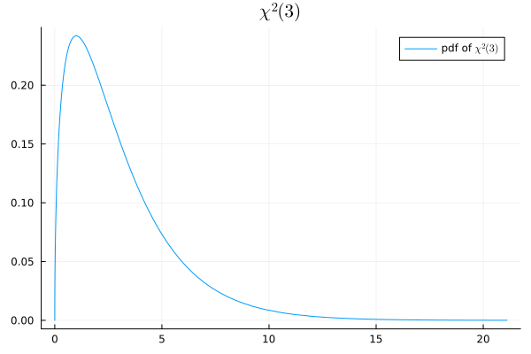
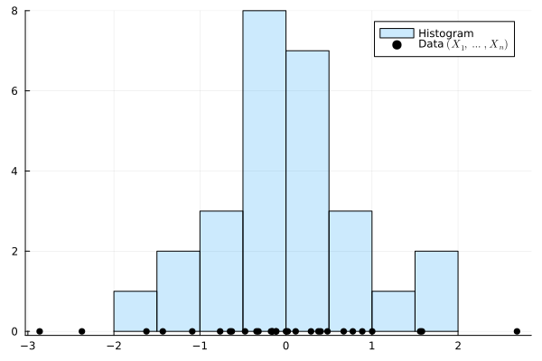
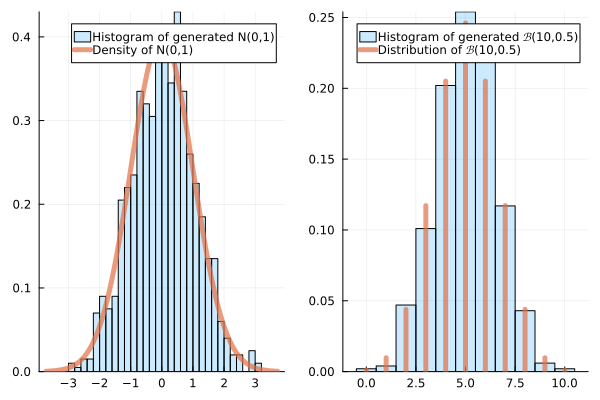
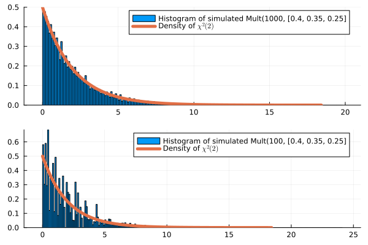
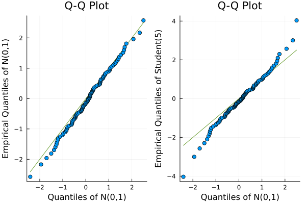
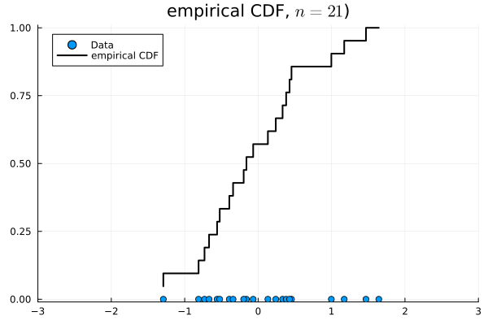
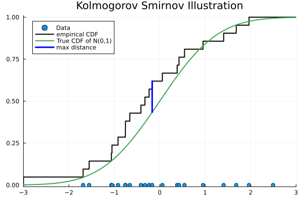

## Plan

- Distributions multinomiales
- Adéquation
  - Test du chi-deux d'adéquation 
  - Histogrammes
  - Test du chi-deux pour comparer des distributions
  - Utilisation des fonctions de répartition et test KS

[précédent](gaussian_populations_fr.qmd)
[suivant](dependency_fr.qmd)

# Distribution Multinomiale


## Distribution binomiale

. . .

Tirer $n$ boules, **bleues ou rouges**, [avec remise]{style="background-color: yellow;"}

. . .

$p_1, (1-p_1)$ : proportion de bleues/rouges [[Wooclap](https://app.wooclap.com/events/RQSUIA/questions/67cefbabf8118ebcec70b8ca)]

. . .

$X$, $Y$ : nombres de boules bleues/rouges

. . .

Alors :

::: {.square-def}
$X \sim \mathrm{Bin}(n,p_1)$, $Y=n-X \sim \mathrm{Bin}(n,1-p_1)$
:::


. . .

Si $k_1 +k_2 = n$ :

::: {.square-def}
$\mathbb P((X,Y) = (k_1,k_2)) = \binom{n}{k_1}p_1^k(1-p_1)^{k_2}$ \
:::


## Distribution multinomiale

. . .

Tirer $n$ boules, **$m$ couleurs possibles**, [avec remise]{style="background-color: yellow;"}

. . .

$(p_1, \dots, p_m)$ : proportions de chaque couleur : $\sum_{i=1}^m p_i = 1$ <!--[[Wooclap](https://app.wooclap.com/events/RQSUIA/questions/67cefcca7dbb16ec8c93ba35)]-->

. . .

$X_1, \dots, X_m$ : effectifs de chaque couleur [[Wooclap](https://app.wooclap.com/events/RQSUIA/questions/67cefe72f151baf0223710ec)]

. . .

Alors :

::: {.square-def}
$(X_1, \dots, X_m) \sim \mathrm{Mult}(n,(p_1, \dots, p_m))$
:::

## Formule

Si $k_1 + \dots + k_m = n$ et $\dfrac{n!}{k_1!\dots k_m!} = \binom{n}{k_1,\dots, k_m}$ est un **coefficient multinomial** :

::: {.square-def}
$\mathbb P((X_1, \dots, X_m)=(k_1, \dots, k_m)) = \dfrac{n!}{k_1!\dots k_m!}p_1^{k_1} \dots p_m^{k_m}$\
:::

## Preuve de la formule

. . .

**Étape 1 : probabilité d'une séquence ordonnée avec effectifs $(k_1, \dots, k_m)$**

$$\underbrace{1, \dots, 1}_{k_1}, \underbrace{2, \dots, 2}_{k_2}, \dots, \underbrace{m, \dots, m}_{k_m} \quad \longrightarrow \quad p_1^{k_1} \cdots p_m^{k_m}$$

. . .

**Étape 2 : nombre de telles séquences**

Permutations de $n$ objets avec $k_i$ identiques de type $i$ :

$$\frac{n!}{k_1! \dots k_m!}$$


## Exemple

. . .

Lancer un dé $n$ fois. Cela suit une loi $Mult(n, (1/6, \cdots, 1/6))$

. . .

Demander à $n$ personnes leur couleur préférée parmi $k$ options : $\text{Mult}(n, (p_1, \ldots, p_k))$.

. . .

Générer $n$ mots depuis un vocabulaire de taille $V$ : $\text{Mult}(n, (p_1, \ldots, p_V))$.

## Exercice

. . .

Soit $(X_1, \dots, X_m) \sim \mathrm{Mult}(3,(1/4, 1/2, 1/4))$.

. . .

Quelle est la probabilité d'observer $(2, 1, 0)$ ?

. . .

$\mathbb P((X_1,X_2,X_3)=(2,1,0)) = \frac{3!}{2!\,1!\,0!}\left(\frac{1}{4}\right)^2\left(\frac{1}{2}\right)^1\left(\frac{1}{4}\right)^0 \\= 3 \cdot \frac{1}{16} \cdot \frac{1}{2} = \frac{3}{32}$


# Test d'adéquation du $\chi^2$

## Problème d'adéquation du $\chi^2$

. . .

On observe $(X_1, \dots, X_m) \sim \mathrm{Mult}(n, q)$. 

. . .

Cela correspond à $n$ tirages : $X_1 + \dots + X_m = n$

. . .

$q = (q_1, \dots, q_m)$ correspond aux probabilités d'obtenir la couleur $1, \dots, m$

. . .

Soit [$p = (p_1, \dots, p_m)$ un vecteur connu]{style="background-color: lightblue;"} tel que $p_1 + \dots + p_m = 1$.


::: {.square-objective}
$H_0:~ q = p ~~~\text{ou}~~~ H_1: q \neq p \; .$
:::


## Test d'adéquation du $\chi^2$

. . .

Statistique du test du chi-deux :

::: {.square-def}
$$\psi(X) = \sum_{i=1}^m\frac{(X_i-n_i)^2}{n_i} \; .$$
:::

où [$n_i = np_i = \mathbb E[X_i]$]{style="background-color: lightblue;"} est l'effectif théorique attendu pour la couleur $i$. Parfois écrit:

$\psi(X) = \sum_{i=1}^m\frac{(O_i-E_i)^2}{E_i} \; ,$

où $O_i$ désigne l'effectif « observé » et $E_i$ l'effectif « attendu »


## Propriété

. . .

::: {.callout-note}
## Approximation chi-deux
Lorsque les $np_i$ sont grands, sous $H_0$ :
$$\psi(X) \xrightarrow{d} \chi^2(m-1)$$
:::

---

## Preuve

. . .

$X \sim \text{Mult}(n, p)$ a pour espérance $np$ et pour covariance $n\Sigma$ où $\Sigma = \text{diag}(p) - pp^\top$. 

. . .


En effet :
$$\Sigma_{ij} = \text{Cov}(X_i, X_j) = \begin{cases} np_i(1-p_i) & i = j \\ -np_ip_j & i \neq j \end{cases}$$
ce qui donne $\Sigma = n(\text{diag}(p) - pp^\top)$.

Par le TCL multivarié :
$$\frac{X - np}{\sqrt{n}} \xrightarrow{d} \mathcal{N}(0, \Sigma)$$

---

. . .

Posons $Z = \text{diag}(p)^{-1/2}(X - np)/\sqrt{n}$, de sorte que $\psi(X) = \|Z\|^2$. Par le théorème de la fonction continue :

. . .

$$Z \xrightarrow{d} \mathcal{N}(0,\, P), \quad P = I - \sqrt{p}\sqrt{p}^\top$$
Comme $P$ est une projection orthogonale de rang $m-1$, $\mathcal{N}(0, P) \stackrel{d}{=} PG$ avec $G \sim \mathcal{N}(0, I)$, donc :
$$\psi(X) = \|Z\|^2 \xrightarrow{d} \|PG\|^2 \sim \chi^2(m-1)$$

## Test et région de rejet

. . .

On rejette $H_0$ si $\psi(X) > t_{1-\alpha}$, le [quantile d'ordre $(1-\alpha)$ du $\chi^2(m-1)$]{style="background-color: lightblue;"}.

. . .

On rejette pour les grandes valeurs de $\psi$ (test unilatéral à droite).


. . .

Question :
On observe une [statistique $\chi^2$ égale à $32$]{style="background-color: yellow;"} pour 1000 lancers d'un dé supposé équilibré. Est-ce normal ?

. . .

Si on observe une [statistique $\chi^2$ égale à $0{,}001$]{style="background-color: yellow;"}, qu'est-ce que cela signifie ?

##



## Exemple : Sachet de bonbons

::: {.callout}
- On observe un **sachet de bonbons** contenant $n=100$ bonbons de $m=3$ couleurs différentes : **rouge**, **vert** et **jaune**. 
- Fabricant : $p_1= 40\%$ rouge, $p_2=35\%$ vert et $p_3=25\%$ jaune.
- $H_0 : q=p$ (les affirmations du fabricant sont correctes)
- $H_1 : q\neq p$ (les affirmations du fabricant sont incorrectes)
:::


:::{.columns}
:::{.column}

:::{.fragment style="font-size:50%;"}
|Couleur|Effectifs observés|
|---|---|
|Rouge|$X_1=50$|
|Vert|$X_2=30$|
|Jaune|$X_3=20$|
:::
:::
:::{.column}
:::{.fragment style="font-size:50%;"}
|Effectifs théoriques|
|---|
|$n_1=40$|
|$n_2=35$|
|$n_3=25$|
:::
:::
::: 


::: {.callout .fragment}
- $\psi(X) = \sum_{i=1}^m\frac{(X_i-n_i)^2}{n_i} \approx 2{,}5 +0{,}71+1 \approx 4{,}21$
- $\mathrm{cdf}(\chi^2(2), 4{,}21) \approx 0{,}878$ ($p_{\text{valeur}} \approx 0{,}222$)
- Conclusion : on ne rejette pas $H_0$
:::


# Comparaison à une distribution théorique

## Représentation par des indicatrices

. . .

On tire [indépendamment et avec remise]{style="background-color: yellow;"} parmi [$m$ catégories $(c_1, \dots, c_m)$]{style="background-color: lightblue;"}. La probabilité d'obtenir la catégorie $c_k$ est $p_k$.

Soit $Z_i$ la catégorie du $i^{\text{ème}}$ tirage

. . .

Alors, si $X_k= \sum_{i=1}^n \mathbf{1}\{Z_i = c_k\}$

::: {.square-def}
$(X_1, \dots, X_m) \sim Mult(n, (p_1, \dots, p_m))$
:::


## Histogrammes avec cette représentation

. . .

On observe $(Z_1, \dots, Z_n) \in \mathbb R^n$\

. . .

On fixe des intervalles $(I_1, \dots, I_m)$ formant une partition de $\mathbb R$

. . .

::: {.callout-note}
## Histogramme
$\mathrm{effectifs}(I) = \sum_{i=1}^n \mathbf 1\{Z_i \in I\} \in \{1, \dots, n\}\;$

$\mathrm{freq}(I) = \mathrm{effectifs}(I)/n$

$\mathrm{hist}(a,b,k) = (\mathrm{effectifs}(I_1), \dots,\mathrm{effectifs}(I_m))$
:::

## Histogramme en pratique

. . .

On utilise généralement des [histogrammes équilibrés]{style="background-color: yellow;"} sur $[a,b)$ : 

$I_l = \big[a + (l-1)\tfrac{b-a}{m},a + l\tfrac{b-a}{m}\big)$

. . .

On peut ajouter $(-\infty, a)$ et $[b, +\infty)$ pour obtenir une partition de $\mathbb R$

:::{.callout-warning icon="true" .fragment}
## Normalisation
 Peut être normalisé en **effectifs** (par défaut), **fréquences**, ou **densité** (aire sous la courbe = 1)
:::

. . .

On peut définir de même formellement les histogrammes lorsque $X_i \in \mathbb R^p$ (même s'il n'existe pas de représentation aussi simple).

## Illustration

. . .



## Loi des grands nombres, Monte Carlo (informel)

. . .

Supposons que $(X_1, \dots, X_n)$ sont iid de distribution $P$, et que $a$, $b$, $m$ sont fixés

. . .

L'histogramme $\mathrm{hist}(a,b,m)$ converge vers l'histogramme de la densité $P$

## Convergence de l'histogramme (Preuve)

. . .

Soient $I_j = \bigl[a + (j-1)\tfrac{b-a}{k},\ a + j\tfrac{b-a}{m}\bigr)$ pour $j=1,\dots,m$ les classes.
La hauteur de la $j$-ème barre est

. . .

$$\hat{h}_j = \frac{1}{n} \sum_{i=1}^n \mathbf{1}_{X_i \in I_j}.$$

Comme les $X_i$ sont iid, les indicatrices $\mathbf{1}_{X_i \in I_j}$ sont des variables de Bernoulli iid d'espérance $P(I_j)$.
Par la **loi forte des grands nombres**,

$$\hat{h}_j \xrightarrow{p.s.} P(I_j) \quad \text{quand } n\to\infty.$$

##

{width=60%}

##



## Test d'adéquation du $\chi^2$ à une distribution donnée

. . .

On observe $(X_1, \dots, X_n) \in \mathbb R^n$, iid de distribution **inconnue** $P$.

. . .

On veut tester si $P$ est égale à une [**distribution connue** $P_0$]{style="background-color: yellow;"}

::: {.square-objective}
$H_0$ : $P = P_0$ contre $H_1$ : $P \neq P_0$ 
:::

[[Wooclap](https://app.wooclap.com/events/RQSUIA/questions/67cf0175f151baf0223ad812)]

. . .

Idée : partitionner $\mathbb R$ et comparer les histogrammes empiriques et théoriques.

##

. . .

Si $(I_1, \dots, I_m)$ sont des intervalles disjoints, 

. . .

on note [$p_1 = P_0(I_1), \dots, p_{m} = P_0(I_m)$]{style="background-color: lightblue;"}
les probabilités théoriques

. . .

::: {.callout-important}
Celles-ci sont connues car $P_0$ est connue et les $I_j$ sont fixés par nous-mêmes !
:::

. . .

On note $C_j = \sum_{i=1}^n \mathbf{1}\{X_{i} \in I_j\}$.

. . .

$C_j$ est le nombre empirique de fois où l'on obtient des observations dans $I_j$.

. . .

Par définition, [sous $P_0$]{style="background-color: orange;"}, les $C_j$ suivent une loi **multinomiale** [$\mathrm{Mult}(n, (p_1, \dots, p_{m}))$]{style="background-color: lightblue;"}

. . .

On veut comparer $C_j$ (empirique) à $np_j$ (théorique)

## Statistique du test du chi-deux

. . .

On observe $X=(X_1, \dots, X_n) \in \mathbb R^n$, et on définit $C_j := C_j(X) = \sum_{i=1}^n \mathbf{1}(X_i \in I_j)$

. . .


Statistique du chi-deux : 

::: {.square-def}
$\psi(X)=\sum_{j=1}^m \frac{(C_j - np_j)^2}{np_j}$
:::

. . .

Si les $np_j$ sont suffisamment grands pour tout $j$ (disons $np_j \geq 15$) alors $\psi(X) \asymp \chi^2(m-1)$

. . .

[Région de rejet : $[t_{1-\alpha}, +\infty)$]{style="background-color: yellow;"} où $t_{1-\alpha}$ est le quantile d'ordre $(1-\alpha)$ du $\chi^2(m-1)$

. . .

C'est un test asymptotique


## Test du $\chi^2$ corrigé

. . .

Si $P_0$ est **inconnue**, appartenant à une famille paramétrique $\mathcal{P} = \{P_\theta : \theta \in \Theta \subset \mathbb{R}^\ell\}$

. . .

Estimer $\theta$ par le MLE $\hat\theta$ à partir des données $X_1,\dots,X_n$

. . .

Remplacer les probabilités théoriques par $\hat p_j = P_{\hat\theta}(I_j)$

. . .

Calculer la statistique corrigée :

::: {.square-def}
$$\psi(X) = \sum_{j=1}^m \frac{(C_j - n\hat{p}_j)^2}{n\hat{p}_j}$$
:::


## Distribution du $\chi^2$ corrigé

. . .

Sous $H_0$, **chaque paramètre estimé coûte un degré de liberté** :

. . .

::: {.square-def}
$\psi(X) \asymp \chi^2(m - 1 - \ell)$
:::

**Intuition :** l'estimation de $\ell$ paramètres à partir des données impose $\ell$ contraintes supplémentaires sur les effectifs $C_j$,

. . .

réduisant les degrés de liberté effectifs de $m-1$ à $m-1-\ell$.


## Exemple : adéquation à une loi de Poisson

$H_0$ : $X_i$ iid $\mathcal P(2)$
```julia
X = [1, 0, 1, 0, 1, 0, 0, 0, 0, 0, 4, 3, 0, 1, 1, 2, 3, 0, 1, 0, 0, 2, 1, 0, 1, 0, 0, 2, 0, 0]
```

:::{style="font-size: 80%;"}
::: {.fragment}

| | $0$ | $1$ | $2$ | $\geq 3$ | Total |
|---| --- | --- | --- | -------- | --- |
| Effectifs observés | 16 | 8 | 3 | 3 | 30 |
| Effectifs théoriques | 4,06 | 8,1 | 8,1 | 9,7 | |
:::
:::

##

::: {.columns}
::: {.column}
::: {.callout .fragment}

- Pour obtenir $9{,}7$, on calcule ```(1-cdf(Poisson(2),2))*30```
- statistique chi-deux $\gtrsim \frac{(16-4)^2}{4} = 36$
- ```(1-cdf(Chisq(3),36))``` est très petit : on rejette
:::
:::
::: {.column}
::: {.callout-warning .fragment}
- Si $H_0$ est $X_i$ iid $\mathcal P(\lambda)$ avec $\lambda$ **inconnu**
- $\hat \lambda = 0{,}8$, $\sum_{i=1}^4 \frac{(X_i - n_i)^2}{n_i} \approx 9{,}4$
- Pas $\chi^2(3)$ mais $\chi^2(2)$
- ```(1-cdf(Chisq(2),9.4))``` $\approx 0{,}009$. On rejette au niveau 1%
:::

:::
::: 

[[Wooclap](https://app.wooclap.com/events/RQSUIA/questions/67cf06270ea10e736b0e07fe)]
  

## Comparaison avec les QQ-plots

. . .

On observe $(X_1, \dots, X_n) \in \mathbb R^n$ de **fonction de répartition inconnue** $F$

. . .

On veut tester si $F= F_0$ :

. . .

::: {.square-objective}
$H_0$ : $F = F_0$ contre $H_1$ : $F \neq F_0$
:::

. . .

On note $X_{(1)} \leq \dots \leq X_{(n)}$ les données ordonnées

. . .

**quantile empirique d'ordre $\frac{k}{n}$** : $X_{(k)}$  [[Wooclap](https://app.wooclap.com/events/RQSUIA/questions/67cf08cca3464294aa47e094)]

. . .

**quantile d'ordre $\frac{k}{n}$** : $x$ tel que $F_0(x) = \frac{k}{n}$

. . .

**Idée** : sous $H_0$, $X_{(k)}$ devrait être approximativement égal au quantile d'ordre $k/n$ de $F_0$


## QQ-plot

- Représenter les quantiles empiriques en fonction des quantiles théoriques.
- Comparer le nuage de points à la droite $y=x$




## Test de Kolmogorov-Smirnov

::: {.callout}

::: {.columns}
::: {.column width=50%}
- On observe $(X_1, \dots, X_n)$ de **fonction de répartition inconnue** $F$
- $H_0$ : $F = F_0$ où $F_0$ est **connue**
- $H_1$ : $F \neq F_0$
- On note $X_{(1)} \leq \dots \leq X_{(n)}$ les données ordonnées
- **quantile empirique d'ordre $\frac{k}{n}$** :
- **quantile d'ordre $\frac{k}{n}$** : $x$ tel que $F_0(x) = \frac{k}{n}$ [[Wooclap](https://app.wooclap.com/events/RQSUIA/questions/67cf0b5ff151baf0224cbd31)]
- **Fonction de répartition empirique** : $\hat F(x) = \frac{1}{n}\sum_{i=1}^n \mathbf 1\{X_i \leq x\}$
- Idée : distance maximale entre la fonction de répartition empirique et la vraie 
:::

::: {.column}
::: {.r-stack}

{.fragment}

{.fragment}

:::
:::
::: 

:::

##

:::: {.callout-note .fragment}
## Test de Kolmogorov-Smirnov

- $\psi(X) = \sup_{x}|\hat F(x) - F_0(x)|$
- Approximation : $\mathbb P_0(\psi(X) >c/\sqrt{n}) \to 2\sum_{r=1}^{+\infty}(-1)^{r-1}\exp(-2c^2r^2)$ quand $n \to +\infty$
- En pratique, utiliser Julia, Python ou R pour les tests KS
::::

##

[précédent](gaussian_populations_fr.qmd)
[suivant](dependency_fr.qmd)