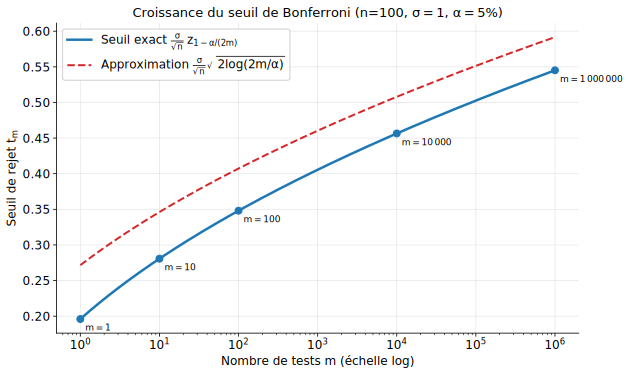
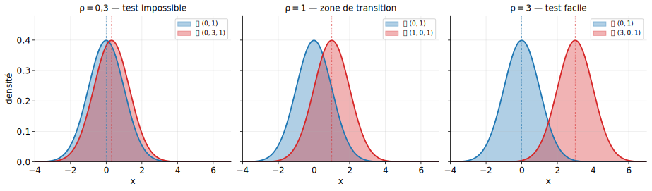
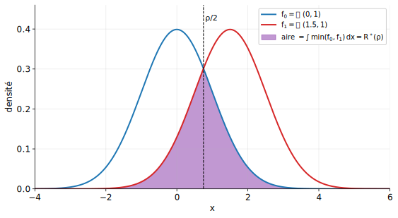

## Plan

- **Partie I** — Tests multiples
  - Le problème des comparaisons multiples
  - Erreur familiale (FWER)
  - Correction de Bonferroni
  - Le "prix" du nombre de tests
- **Partie II** — Introduction au point de vue minimax
  - Risque d'un test et risque minimax
  - Cas gaussien : $\mathcal N(0,1)$ contre $\mathcal N(\rho, 1)$
  - Vitesse optimale de séparation

[précédent](dependency_fr.qmd)

# Partie I — Tests multiples

## Une histoire vraie (presque)

. . .

Un chercheur veut savoir si les **bonbons** causent de l'acné. Il fait un test :

> **p-valeur = 0.23** → pas significatif.

. . .

Il insiste et teste **une par une** 20 couleurs différentes :

- rouge : p = 0.52
- bleu : p = 0.41
- ...
- **vert : p = 0.04** ✓

. . .

Il publie : *« Les bonbons verts causent de l'acné ! »*

. . .

::: {.callout-warning}
**Problème** : ce résultat n'a aucune valeur. En faisant 20 tests sous $H_0$, trouver au moins une p-valeur $< 0.05$ est **presque certain**.
:::

## Quantifions le phénomène

. . .

Supposons que **toutes** les hypothèses nulles sont vraies et que les $m$ tests sont indépendants. Chaque test rejette à tort avec probabilité $\alpha = 5\%$.

. . .

Probabilité de rejeter **au moins un** test à tort :

##

$$\mathbb P(\text{au moins un rejet}) = 1 - (1 - \alpha)^m$$

. . .

| $m$ | $1 - (1-0{,}05)^m$ |
|:---:|:---:|
| $1$ | $0{,}05$ |
| $5$ | $0{,}23$ |
| $10$ | $0{,}40$ |
| $20$ | $0{,}64$ |
| $100$ | $0{,}994$ |

## Illustration : simulation

. . .

{width=60%}

. . .

Plus on fait de tests, plus la plus petite p-valeur observée est artificiellement petite — **même quand aucune hypothèse alternative n'est vraie**.

## Exemples réels

. . .

- **Génomique** : on teste $m \approx 20\,000$ gènes pour voir lesquels sont associés à une maladie

- **A/B testing** : on compare $m$ variantes d'une page web pour décider laquelle maximise les ventes

- **Finance** : on teste $m$ stratégies de trading sur des données historiques (*data snooping*)

. . .

::: {.callout-warning}
Dans tous ces cas, $m$ est très grand et le **contrôle des faux positifs par test individuel** est totalement insuffisant.
:::

## Formalisation

. . .

On dispose de $m$ échantillons indépendants. Pour chaque $j \in \{1, \dots, m\}$ :

- on observe $X_1^{(j)}, \dots, X_n^{(j)}$ i.i.d. $\mathcal N(\mu_j, \sigma^2)$
- on veut tester

::: {.square-objective}
$H_0^{(j)}: \mu_j = 0 \quad$ contre $\quad H_1^{(j)}: \mu_j \neq 0$
:::

. . .

Chaque test produit une statistique $\overline X^{(j)} = \frac{1}{n}\sum_i X_i^{(j)}$ et une p-valeur $p_j$.

## Erreur familiale (FWER)

. . .

Pour contrôler le risque global, on introduit une nouvelle notion d'erreur.

. . .

::: {.callout-note title="Définition : FWER"}
Le **Family-Wise Error Rate** (erreur familiale) est la probabilité de rejeter **au moins une** hypothèse nulle vraie :

$$\text{FWER} = \mathbb P\!\left(\text{au moins un rejet à tort}\right)$$
:::

. . .

**Objectif** : construire une procédure qui contrôle FWER $\leq \alpha$ (typiquement $\alpha = 5\%$), quelles que soient les valeurs vraies $\mu_1, \dots, \mu_m$.

## Le seuil "naïf" ne marche pas

. . .

Seuil individuel au niveau $\alpha = 5\%$ sur chaque test :

- on rejette $H_0^{(j)}$ si $|\overline X^{(j)}| > \dfrac{\sigma}{\sqrt n}\,z_{1-\alpha/2}$

- chaque test a une erreur de niveau $\leq \alpha$

. . .

Mais sous $H_0$ globale, par indépendance :

$$\text{FWER} = 1 - (1 - \alpha)^m \xrightarrow[m \to \infty]{} 1$$

. . .

::: {.callout-warning}
Le FWER **explose** avec $m$ si on ne corrige pas le seuil.
:::

## L'outil clé : l'union bound

. . .

::: {.callout-note title="Union bound (rappel de proba)"}
Pour des événements $A_1, \dots, A_m$ quelconques (pas besoin d'indépendance !) :

$$\mathbb P\!\left(A_1 \cup A_2 \cup \dots \cup A_m\right) \leq \sum_{j=1}^m \mathbb P(A_j)$$
:::

. . .

**Preuve** : récurrence à partir de $\mathbb P(A \cup B) = \mathbb P(A) + \mathbb P(B) - \mathbb P(A \cap B) \leq \mathbb P(A) + \mathbb P(B)$.

. . .

**Idée** : si on fait en sorte que chaque $\mathbb P(A_j)$ soit petit, alors la somme reste petite — et donc la probabilité de l'union aussi.

## Correction de Bonferroni

. . .

Appliquons l'union bound à $A_j = \{$ le test $j$ rejette à tort $\}$.

. . .

Si chaque test individuel est au niveau $\alpha/m$, alors

$$\text{FWER} \leq \sum_{j=1}^m \frac{\alpha}{m} = \alpha$$

. . .

::: {.callout-note title="Principe de Bonferroni"}
Pour contrôler le FWER au niveau $\alpha$, on effectue chaque test individuel au niveau $\alpha/m$.
:::

. . .

**En termes de p-valeurs** : on rejette $H_0^{(j)}$ si $p_j \leq \alpha/m$.

## Traduction en termes de seuil

. . .

Pour le test de la moyenne gaussienne, le seuil individuel au niveau $\alpha$ est :

$t_\alpha = \dfrac{\sigma}{\sqrt n}\,z_{1 - \alpha/2}$

. . .

**Un seul test** (niveau $\alpha$) : $t_1 = \dfrac{\sigma}{\sqrt n}\,z_{1 - \alpha/2}$

. . .

**$m$ tests Bonferroni** (niveau individuel $\alpha/m$) :

::: {.square-def}
$t_m = \dfrac{\sigma}{\sqrt n}\,z_{1 - \alpha/(2m)}$
:::

. . .

**Garantie** : FWER $\leq \alpha$, quel que soit $m$.

## Comportement du seuil en fonction de $m$

. . .

Pour $\sigma = 1$, $n = 100$, $\alpha = 5\%$ :

| $m$ | $\alpha/(2m)$ | $z_{1-\alpha/(2m)}$ | Seuil $t_m$ |
|:---:|:---:|:---:|:---:|
| $1$ | $0{,}025$ | $1{,}96$ | $0{,}196$ |
| $10$ | $0{,}0025$ | $2{,}81$ | $0{,}281$ |
| $100$ | $2{,}5 \cdot 10^{-4}$ | $3{,}48$ | $0{,}348$ |
| $1\,000$ | $2{,}5 \cdot 10^{-5}$ | $4{,}06$ | $0{,}406$ |
| $10^6$ | $2{,}5 \cdot 10^{-8}$ | $5{,}45$ | $0{,}545$ |

## Pourquoi ce comportement logarithmique ?

. . .

Pour $\alpha$ petit, le quantile gaussien admet l'approximation :

$z_{1 - \alpha} \approx \sqrt{2 \log(1/\alpha)}$

. . .

**Intuition** : la queue de $\mathcal N(0,1)$ décroît comme $e^{-t^2/2}$. Résoudre $\mathbb P(Z > t) = \alpha$ revient à $\log(1/\alpha) \approx t^2/2$, d'où $t \approx \sqrt{2\log(1/\alpha)}$.

. . .

En injectant dans le seuil de Bonferroni :

::: {.square-def}
$t_m \approx \dfrac{\sigma}{\sqrt n}\,\sqrt{2 \log(2m/\alpha)}$
:::

## La morphose du seuil

. . .

On compare les seuils pour $1$ et $m$ tests :

| | Seuil (approx.) |
|:---|:---:|
| $1$ test | $\dfrac{\sigma}{\sqrt n}\sqrt{2 \log(2/\alpha)}$ |
| $m$ tests | $\dfrac{\sigma}{\sqrt n}\sqrt{2 \log(2m/\alpha)}$ |

. . .

::: {.callout-note}
## Observation clé
Passer de $1$ à $m$ tests revient à remplacer $\log(2/\alpha)$ par $\log(2m/\alpha)$.

**Le nombre de tests $m$ rentre sous un logarithme, puis sous une racine.**
:::

## Illustration graphique

. . .

{width=60%}

. . .

**Lecture** : passer de $m = 1$ à $m = 10^6$ tests n'augmente le seuil que d'un facteur $\approx 2{,}8$ — c'est à peine plus exigeant.

## Résumé

. . .

::: {.callout-note title="Correction de Bonferroni"}
- **Procédure** : rejeter $H_0^{(j)}$ si $p_j \leq \alpha/m$ (ou de façon équivalente, $|\overline X^{(j)}| > (\sigma/\sqrt n)\,z_{1-\alpha/(2m)}$)
- **Garantie** : FWER $\leq \alpha$, quels que soient $m$, $n$ et les vraies valeurs $\mu_j$
- **Coût** : le seuil augmente en $\sqrt{\log m}$ — très raisonnable
- **Preuve** : union bound, une ligne
:::

# Partie II — Introduction au point de vue minimax

## Nouvelle question

. . .

On a construit des tests, on sait calculer des seuils... **mais sont-ils optimaux ?**

. . .

Autrement dit : à $n$ fixé, à partir de quelle valeur de $|\mu|$ peut-on **espérer** détecter que $\mu \neq 0$ ?

. . .

Le cadre minimax formalise cette question. Il demande :

> **Tous tests confondus**, quelle est la plus petite séparation que l'on peut détecter de façon fiable ?

## Cadre général : hypothèses composites

. . .

On considère un modèle paramétrique $(P_\theta)_{\theta \in \Theta}$ et deux sous-ensembles disjoints $\Theta_0, \Theta_1 \subset \Theta$.

. . .

::: {.square-objective}
$H_0: \theta \in \Theta_0 \quad$ contre $\quad H_1: \theta \in \Theta_1$
:::

. . .

Les hypothèses sont **composites** en général : chacune regroupe une famille de lois.

## Risque d'un test

. . .

Soit $T: \mathcal X \to \{0,1\}$ un test. Comme $H_0$ et $H_1$ sont composites, on prend le **pire des cas** dans chaque hypothèse :

. . .

::: {.callout-note title="Risque du test"}
$$R(T) = \underbrace{\sup_{\theta \in \Theta_0} \mathbb P_\theta(T = 1)}_{\text{1ère espèce (pire cas)}} \; + \; \underbrace{\sup_{\theta \in \Theta_1} \mathbb P_\theta(T = 0)}_{\text{2nde espèce (pire cas)}}$$
:::

. . .

**Lecture** : $R(T)$ est la performance du test *contre l'adversaire le plus défavorable* — un $\theta$ sous $H_0$ qui maximise la proba de rejeter à tort, ou un $\theta$ sous $H_1$ qui la rend indétectable.

## Risque minimax

. . .

::: {.callout-note title="Définition : risque minimax"}
$$R^* = \inf_{T} R(T)$$

où l'infimum est pris sur **tous les tests possibles**.
:::

. . .

C'est la performance du **meilleur test** contre le **pire paramètre** : *min* sur les tests, *max* sur $\theta$ — d'où le nom **minimax**.

. . .

**Question centrale** : quand a-t-on $R^*$ petit ? Autrement dit, quand peut-on espérer un test fiable ?

# Exemple : le cas gaussien

## Cadre

. . .

On se place dans le cas **le plus simple possible** : on observe **une seule** variable $X \sim \mathcal N(\theta, 1)$, avec $\Theta = \mathbb R$.

. . .

On fixe une séparation $\rho > 0$ et on considère le test **unilatéral droit** :

::: {.square-objective}
$\Theta_0 = \{0\}, \quad \Theta_1 = [\rho, +\infty)$
:::

. . .

$H_0$ est simple, mais $H_1$ est **composite** : elle regroupe tous les $\theta \geq \rho$. Le risque s'écrit donc

$$R(T, \rho) = \mathbb P_{\theta=0}(T = 1) + \sup_{\theta \geq \rho} \mathbb P_{\theta}(T = 0)$$

. . .

**Remarque** : observer $n$ variables $X_1, \dots, X_n \sim \mathcal N(\mu, \sigma^2)$ est équivalent à observer $\overline X_n \sim \mathcal N(\mu, \sigma^2/n)$. L'analyse sur une seule gaussienne couvre donc le cas général — il suffira de lire $\rho$ en unités de $\sigma/\sqrt n$.

## Visualisation

. . .

{width=75%}

. . .

Sous $H_1$, le **pire cas** (le plus dur à distinguer de $H_0$) correspond à $\theta = \rho$, le bord de $\Theta_1$ — plus $\theta$ est grand, plus la détection est facile.

- $\rho = 0{,}3$ : densités presque confondues $\Rightarrow$ test impossible
- $\rho = 1$ : zone de transition
- $\rho = 3$ : densités bien séparées $\Rightarrow$ test facile

## Borne supérieure : un test explicite

. . .

Considérons le test "naturel" :

$$T(X) = \mathbf 1\{X > \rho/2\}$$

. . .

**Erreur de 1ère espèce** (sous $\theta = 0$) :

$\mathbb P_{\theta = 0}(X > \rho/2) = 1 - \Phi(\rho/2)$

. . .

**Erreur de 2nde espèce** (sous $\theta \geq \rho$) : la fonction $\theta \mapsto \mathbb P_\theta(X \leq \rho/2) = \Phi(\rho/2 - \theta)$ est **décroissante** en $\theta$, donc le pire cas est atteint en $\theta = \rho$ :

$\sup_{\theta \geq \rho} \mathbb P_{\theta}(X \leq \rho/2) = \mathbb P_{\theta = \rho}(X \leq \rho/2) = 1 - \Phi(\rho/2)$

. . .

**Conclusion** :

::: {.square-def}
$R^*(\rho) \leq R(T, \rho) = 2\,(1 - \Phi(\rho/2))$
:::

## Interprétation

. . .

La fonction $1 - \Phi(\rho/2)$ décroît très vite :

| $\rho$ | $R(T, \rho)$ |
|:---:|:---:|
| $0{,}5$ | $\approx 1{,}60$ (trivial) |
| $1$ | $\approx 1{,}22$ |
| $2$ | $\approx 0{,}62$ |
| $3$ | $\approx 0{,}27$ |
| $4$ | $\approx 0{,}046$ |
| $6$ | $\approx 0{,}0027$ |

## Traduction pour $n$ observations

. . .

En lisant $\rho$ comme $\sqrt n\,\mu/\sigma$ (passage d'une seule gaussienne à la moyenne de $n$ observations) :

. . .

::: {.callout-note}
Le test de la moyenne peut détecter un signal $\mu \neq 0$ dès que

$$|\mu| \gtrsim \dfrac{\sigma}{\sqrt n}$$
:::

. . .

**Est-ce optimal ?** Peut-on faire mieux avec un autre test ?

## Borne inférieure

. . .

Notons $f_0, f_\rho$ les densités de $\mathcal N(0,1)$ et $\mathcal N(\rho, 1)$. Comme $\rho \in \Theta_1$, on a $\sup_{\theta \geq \rho} \mathbb P_\theta(T = 0) \geq \mathbb P_\rho(T = 0)$, donc pour tout test $T$ :

$$R(T, \rho) \;\geq\; \int T\,f_0 + \int (1 - T)\,f_\rho \;\geq\; \int \min(f_0, f_\rho)\,dx$$

. . .

::: {.square-def}
$$R^*(\rho) \geq \int \min(f_0, f_\rho)\,dx$$
:::

. . .

C'est l'**aire sous le minimum des deux densités** — l'aire de recouvrement à la frontière $\theta = \rho$.

## Calcul de l'aire de recouvrement

. . .

{width=55%}

. . .

Par symétrie autour de $\rho/2$ :

$R^*(\rho) = 2\,\mathbb P_{\theta = 0}(X \geq \rho/2) = 2\bigl(1 - \Phi(\rho/2)\bigr)$

. . .

C'est **exactement** le risque atteint par le test $T^*(X) = \mathbf 1\{X \geq \rho/2\}$ — il est donc **optimal**.

## Vitesse de séparation minimax

. . .

On a obtenu **la valeur exacte** du risque minimax :

::: {.square-def}
Pour le test de $\mathcal N(0,1)$ contre $\mathcal N(\rho, 1)$ :
$$R^*(\rho) = 2\bigl(1 - \Phi(\rho/2)\bigr)$$

et donc $\rho^*_{\min} \asymp 1$.
:::

. . .

**Traduction** pour $X_1, \dots, X_n$ i.i.d. $\mathcal N(\mu, \sigma^2)$ :

$$|\mu|^*_{\min} \asymp \dfrac{\sigma}{\sqrt n}$$

. . .

C'est **exactement** la vitesse donnée par le TCL... mais ici on a en plus la garantie qu'**aucun test ne peut faire mieux**. Le $1/\sqrt n$ est intrinsèque au problème.

## Conclusion du chapitre

. . .

::: {.callout-note}
## Les deux messages

**Partie I — Tests multiples** : passer de $1$ à $m$ tests ne coûte qu'un facteur $\sqrt{\log m}$ dans le seuil. Bonferroni (via l'union bound) est simple et efficace.

**Partie II — Minimax** : le seuil de détection en $\sigma/\sqrt n$ d'un test de moyenne n'est pas arbitraire. C'est la **vitesse optimale** : aucun test ne peut détecter un signal plus petit.
:::

. . .

Les seuils que vous avez appris dans ce cours ne sont pas des choix techniques arbitraires — ce sont les **bonnes vitesses**.

[précédent](dependency_fr.qmd)
