# Introduction

## Organisation

- 15h de cours magistraux, 18h de TD
- 12 mai : Examen (2h)
- Notes de cours et diapositives sur le site web
- Sessions Wooclap [[Test](https://app.wooclap.com/events/RQSUIA/questions/67d994736e237838c3125d66)]

[Suivant : lois usuelles](usual_distributions_fr.qmd)

## Évaluation

- Un examen final de 2h (QCM et exercice sur papier)

## Objectif

1. Étant donné un problème de décision général
    - Introduire des notations précises pour décrire le problème
    - Formuler mathématiquement les hypothèses $H_0$ (a priori) et $H_1$ (alternative)
2. Choisir une statistique adaptée au problème
3. Calculer cette statistique et sa p-valeur (ou une approximation)
4. Conclure et prendre une décision

## Principes Généraux

::: {.small-text}

1. **Fixer un objectif :** tester si le médicament fait baisser la tension artérielle
2. **Concevoir une expérience :** essai clinique comparant médicament vs placebo
3. **Définir les hypothèses**
   - **Hypothèse nulle** $H_0$ : le médicament n'a aucun effet
   - **Hypothèse alternative** $H_1$ : le médicament fait baisser la tension artérielle
4. **Définir une règle de décision :** rejeter $H_0$ si p-valeur < α (par ex., 5%)
5. **Collecter les données :** mesurer la variation de tension artérielle dans les deux groupes
6. **Appliquer la règle de décision :** rejeter $H_0$ ou non
7. **Tirer une conclusion :** le médicament doit-il être approuvé ou faut-il mener d'autres essais ?

:::

## Qu'est-ce qu'une p-valeur ?

. . .

**p-valeur** = probabilité d'observer un résultat aussi extrême (ou plus)
en supposant que $H_0$ est vraie

. . .

**Exemple :** un essai médicamenteux montre une baisse de 8 mmHg de la tension artérielle

- p-valeur = 0.03 signifie :
- → « Si le médicament n'avait **aucun effet**, il n'y aurait que **3% de chances**
     d'observer une baisse aussi importante par le seul hasard »

. . .

## Règle de Décision

| p-valeur | Interprétation |
|---------|----------------|
| p < 0.05 | Rejeter $H_0$ → le médicament fonctionne probablement |
| p ≥ 0.05 | Ne pas rejeter $H_0$ → preuves insuffisantes |

⚠️ Une petite p-valeur ne **prouve pas** que $H_1$ est vraie —
elle dit seulement que $H_0$ est peu probable au vu des données.

## Bonnes et Mauvaises Décisions

<table style="border-collapse: collapse; width: 100%; text-align: center; border: 2px solid black;">
  <thead>
    <tr>
      <th>Décision</th>
      <th>$H_0$ Vraie</th>
      <th>$H_1$ Vraie</th>
    </tr>
  </thead>
  <tbody>
    <tr>
      <td>$T=0$</td>
      <td class="fragment green-cell" data-fragment-index="1">
        Vrai Négatif (**VN**)
      </td>
      <td class="fragment red-cell">
        Faux Négatif (**FN**)
        <ul style="list-style-position: inside; margin: 0; padding: 0;">
          <li>Erreur de deuxième espèce</li>
          <li>Non-détection</li>
        </ul>
      </td>
    </tr>
    <tr>
      <td>$T=1$</td>
      <td class="fragment red-cell">
        Faux Positif (**FP**)
        <ul style="list-style-position: inside; margin: 0; padding: 0;">
          <li>Erreur de première espèce</li>
          <li>Fausse alarme</li>
        </ul>
      </td>
      <td class="fragment green-cell">
        Vrai Positif (**VP**)
      </td>
    </tr>
  </tbody>
</table>

## Dé Biaisé Vers le $6$

1. **Objectif** : tester si Bob triche avec un dé biaisé
2. **Expérience** : Bob lance le dé $10$ fois
3. **Hypothèses** :
   - $H_0$ : la probabilité d'obtenir $6$ est $1/6$
   - $H_1$ : la probabilité d'obtenir $6$ est supérieure à $1/6$
4. **Règle de décision** : rejeter $H_0$ si p-valeur $< 0.05$
5. **Données** : le dé tombe $10$ fois sur $6$
6. **Décision** : p-valeur $= (1/6)^{10} \approx 10^{-8} < 0.05$ → rejet
7. **Conclusion** : forte preuve que Bob triche !

---

## Équité du Dé

- On observe $(X_1, \dots, X_n)$ iid où $X_i \in \{1, \dots, 6\}$ avec $\mathbb{P}(X_i = k) = p_k$

::: {.fragment}
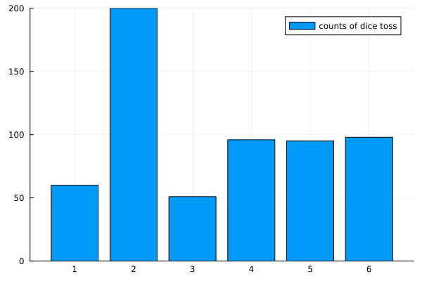{width="50%"}
:::

## Équité du Dé

**⚠️ Mêmes données, deux conclusions**

. . .

::: {.square-def}
$H_0: p_6 = 1/6$ vs $H_1: p_6 > 1/6$
:::

. . .

Ici : on ne rejette pas $H_0$ ($H_0$ est « vraisemblable »)

. . .

::: {.square-def}
$H_0:$ le dé est équilibré vs $H_1: \exists k: p_k > 1/6$
:::

. . .

Ici : on rejette $H_0$ ($H_0$ est « peu vraisemblable »)

## Test Médical

1. **Objectif :** tester si un patient a un taux de cholestérol élevé
2. **Expérience :** mesurer le taux de cholestérol LDL (mg/dL)
3. **Hypothèses :**
   - $H_0$ : le cholestérol LDL est normal $\sim \mathcal{N}(100, 25)$
   - $H_1$ : le cholestérol LDL est élevé

## Test Médical

1. **Règle de décision** : rejeter si $P_0(X \geq x_{obs}) \leq 0.05$
2. **Collecter les données** : $x_{obs}=152$
3. **Prendre une décision** : calculer $P_0(X \geq 152)=0.019$
4. **Conclusion ?**

## Illustration

::: {.r-stack}

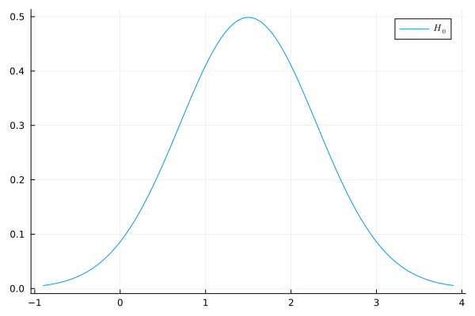{.fragment width="80%"}

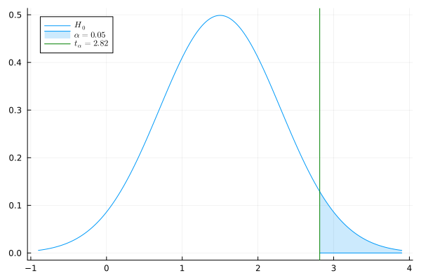{.fragment width="80%"}

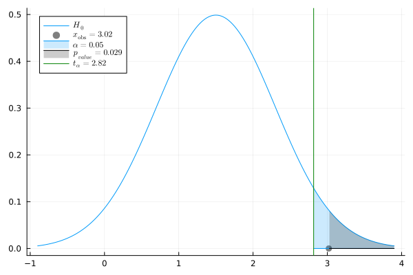{.fragment width="80%"}

:::

# Rappels de Probabilités

## Rappels de Proba : Mesures Continues

- **Densité** (PDF) : $x \mapsto p(x)$ où $\mathbb P(X\in[x,x+dx]) = p(x)dx$
- **Fonction de répartition** (CDF) : $x \mapsto \int_{-\infty}^x p(x')dx'$

. . .

**Quantile d'ordre $\alpha$**:

::: {.square-def}
$q_{\alpha}$ : $\int_{-\infty}^{q_{\alpha}} p(x)dx = \alpha$
:::

. . .

$\Leftrightarrow \mathbb P(X \leq q_{\alpha}) = \alpha$

---

## Rappels de Proba : Mesures Discrètes

Considérons une mesure de probabilité $P$ sur $\mathbb R$ avec $X \sim P$.

- **Fonction de masse** (PMF) : $\mathbb P(X=x) = P(\{x\})=p(x)$
- **Fonction de répartition** (CDF) : $x \mapsto \sum_{x' \leq x} p(x')$

# Lois Usuelles et Représentation Générale

## Exemple : Loi Gaussienne

. . .

**Gaussienne** $\mathcal N(\mu,\sigma)$ : $p(x) = \frac{1}{\sqrt{2\pi \sigma^2}}e^{-\frac{(x-\mu)^2}{2\sigma^2}}$

. . .

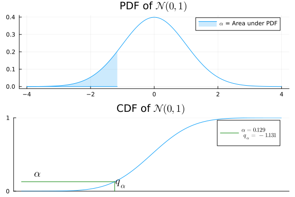{width="50%"}

. . .

Approximation d'une somme de v.a. iid (TCL)

---

## Exemple : Loi Binomiale

**Binomiale** $\mathrm{Bin}(n,q)$ : $p(x)= \binom{n}{x}q^x (1-q)^{n-x}$

. . .

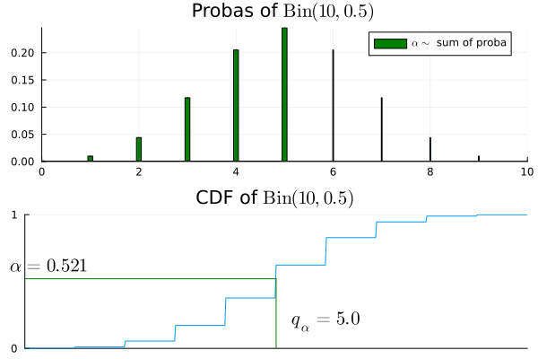{width="50%"}

. . .

Nombre de succès parmi $n$ épreuves de Bernoulli de paramètre $q$

---

## Exemple : Loi Exponentielle

**Exponentielle** $\mathcal E(\lambda)$ : $p(x) = \lambda e^{-\lambda x}$

. . .

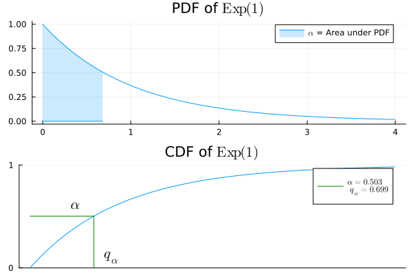{width="50%"}

. . .

Temps d'attente d'une horloge atomique de taux $\lambda$

---

## Exemple : Loi Géométrique

**Géométrique** $\mathcal{G}(q)$ : $p(x)= q(1-q)^{x-1}$

. . .

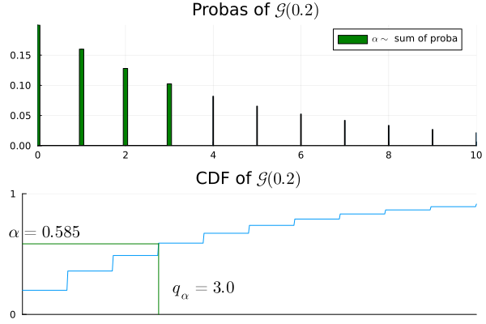{width="50%"}

. . .

Indice du premier succès pour des Bernoulli iid de paramètre $q$

---

## Exemple : Loi Gamma

**Gamma** $\Gamma(k, \lambda)$ : $p(x) = \frac{\lambda^k x^{k-1}e^{-\lambda x}}{(k-1)!}$

. . .

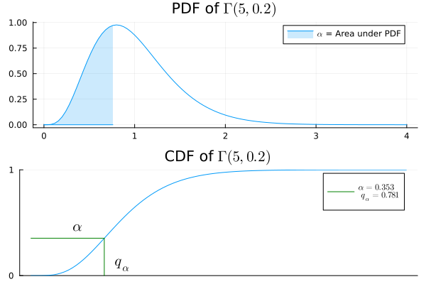{width="50%"}

. . .

Temps d'attente pour $k$ horloges atomiques de taux $\lambda$

---

## Exemple : Loi de Poisson

**Poisson** $\mathcal{P}(\lambda)$ : $p(x)=\frac{\lambda^x}{x!}e^{-\lambda}$

. . .

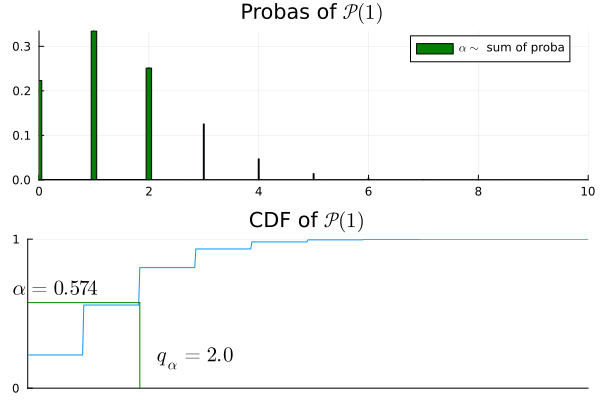{width="50%"}

. . .

Nombre de tics avant le temps $1$ d'une horloge de taux $\lambda$

## Représentation Générale

# Bases des Tests d'Hypothèses

## Estimation VS Test

On observe des données $X$ dans un espace mesurable $(\mathcal X, \mathcal A)$.

Exemple : $\mathcal X = \mathbb R^n$, $X= (X_1, \dots, X_n)$.

---

## Estimation

- Un ensemble de distributions $\mathcal P$ paramétré par $\Theta$
$$\mathcal P = \{P_{\theta},~ \theta \in \Theta\}$$
- $\exists \theta \in \Theta$ tel que $X \sim P_{\theta}$

. . .

::: {.square-objective}
**Objectif :** estimer une fonction de $P_{\theta}$, par ex. $\int x \, dP_{\theta}$ ou $\int x^2 \, dP_{\theta}$
:::

. . .

---

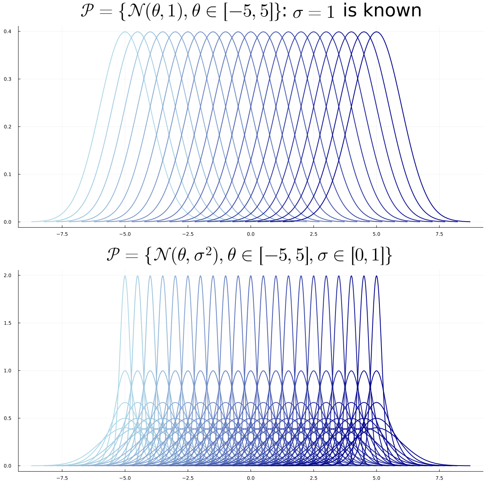{width="70%"}

---

## Test

- Deux ensembles de distributions $\mathcal P_0$, $\mathcal P_1$ avec $\Theta_0$, $\Theta_1$ disjoints
$$\mathcal P_0 = \{P_{\theta} : \theta \in \Theta_0\}, ~~~~ \mathcal P_1 = \{P_{\theta} : \theta \in \Theta_1\}$$
- $\exists \theta \in \Theta_0 \cup \Theta_1$ tel que $X \sim P_{\theta}$

. . .

::: {.square-objective}
**Objectif :** décider entre $H_0: \theta \in \Theta_0$ ou $H_1: \theta \in \Theta_1$
:::

--- 

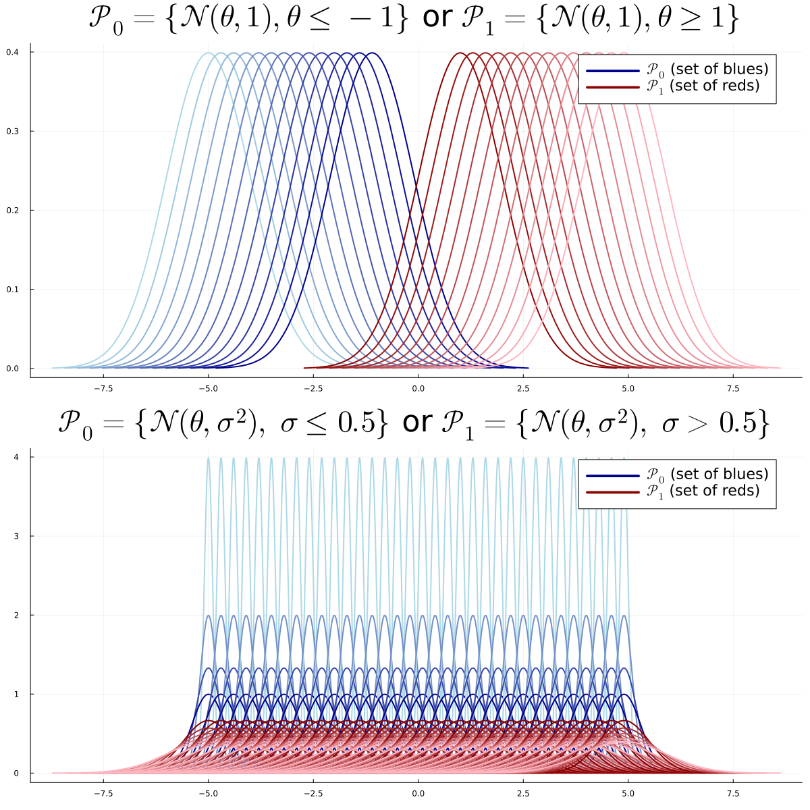{width="70%"}

. . .

[Question Tests](https://app.wooclap.com/events/RQSUIA/questions/6737a984033a3cdd266d88f5)

## Modèle de Test

- Deux ensembles de distributions $\mathcal P_0$, $\mathcal P_1$ avec $\Theta_0$, $\Theta_1$ disjoints
$$\mathcal P_0 = \{P_{\theta} : \theta \in \Theta_0\}, ~~~~ \mathcal P_1 = \{P_{\theta} : \theta \in \Theta_1\}$$
- $\exists \theta \in \Theta_0 \cup \Theta_1$ tel que $X \sim P_{\theta}$

::: {.square-objective}
**Objectif :** décider entre $H_0: \theta \in \Theta_0$ ou $H_1: \theta \in \Theta_1$
:::

---

## Types de Problèmes

- **Simple VS Simple** : $\Theta_0 = \{\theta_0\}$ et $\Theta_1 = \{\theta_1\}$
- **Simple VS Multiple** : $\Theta_0 = \{\theta_0\}$
- **Multiple VS Multiple** : sinon

---

## Simple VS Simple

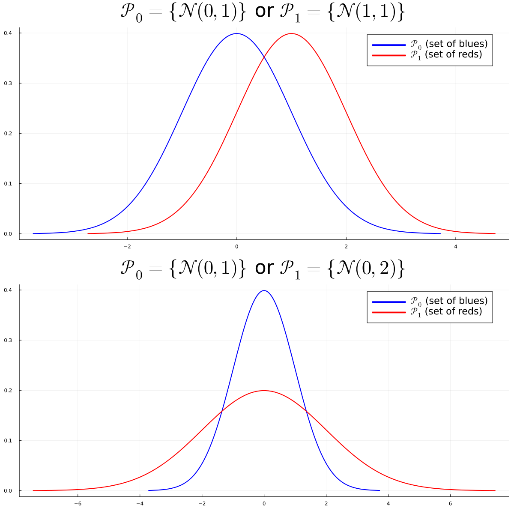{width="60%"}

---

## Multiple VS Multiple

{width="60%"}

---

## Paramétrique VS Non-Paramétrique

- **Paramétrique** : $\Theta_0$ et $\Theta_1$ inclus dans des sous-espaces de dimension finie
- **Non-paramétrique** : sinon

. . .

::: {.square-objective}
**Exemple (Multiple VS Multiple Paramétrique) :**

- $H_0: X \sim \mathcal N(\theta,\sigma)$, $\theta < 0$, $\sigma > 0$ → $\Theta_0 \subset \mathbb R^2$
- $H_1: X \sim \mathcal N(\theta,\sigma)$, $\theta > 0$, $\sigma > 0$ → $\Theta_1 \subset \mathbb R^2$
:::

. . .

[Problèmes Simple VS Multiple Non-Paramétriques](https://app.wooclap.com/events/RQSUIA/questions/6737a94e942e824ee194f4f9)

---

## Règle de Décision

. . .

::: {.callout-note}
Une **Règle de Décision** ou **Test** $T$ est une fonction mesurable :
$$T : \mathcal X \to \{0,1\}$$

- Elle peut dépendre de $\mathcal P_0$ et $\mathcal P_1$
- mais **pas** d'un paramètre inconnu ou de la distribution $P \in \mathcal P_0 \cup \mathcal P_1$ par laquelle $X$ est générée
- $T(x) = 0$ (ou $1$) pour tout $x$ est la règle de décision triviale
  
:::

. . .

[Question : Règle de Décision](https://app.wooclap.com/events/RQSUIA/questions/6737b74b942e824ee1a033a6)

---

## Statistique de Test

. . .

::: {.callout-note}
Une **Statistique de Test** $\psi$ est une fonction mesurable des données à valeurs réelles :
$$\psi : \mathcal X \to \mathbb R$$

- Elle peut dépendre de $\mathcal P_0$ et $\mathcal P_1$
- mais **pas** d'un paramètre inconnu ou de la distribution $P \in \mathcal P_0 \cup \mathcal P_1$ par laquelle $X$ est générée
:::

. . .

[Question : Statistique de Test](https://app.wooclap.com/events/RQSUIA/questions/674734898cc94c63e6c9947e)

## Région de Rejet

. . .

::: {.callout-note}
Pour un test $T$ de statistique $\psi$, la **région de rejet** ou **zone de rejet** $\mathcal R \subset \mathbb R$ est :
$$\mathcal R = \{\psi(x) \in \mathbb R:~ T(x)=1\}$$

- Ensemble des valeurs de la **statistique** qui conduisent à rejeter $H_0$
:::

---

## Région Critique

. . .

::: {.callout-note}
Pour un test $T$, la **région critique** $\mathcal C \subset \mathcal X$ est :
$$\mathcal C = \{x \in \mathcal X:~ T(x)=1\}$$

- Ensemble des **observations** qui conduisent à rejeter $H_0$
- ⚠️ Ces termes sont parfois utilisés de manière interchangeable, mais nous les distinguons dans ce cours.
:::

## Exemple de Région de Rejet

:::{smaller-text}
$$
\begin{aligned}
T(x) &= \mathbf{1}\{\psi(x) > t\}:~~~~~~\mathcal R = (t,+\infty)\\ 
T(x) &= \mathbf{1}\{\psi(x) < t\}:~~~~~~\mathcal R = (-\infty,t)\\
T(x) &= \mathbf{1}\{|\psi(x)| > t\}:~~~~~~\mathcal R = (-\infty,t)\cup (t, +\infty)\\
T(x) &= \mathbf{1}\{\psi(x) \not \in [t_1, t_2]\}:~~~~~~\mathcal R = (-\infty,t_1)\cup (t_2, +\infty)\;
\end{aligned}
$$
:::

# Simple VS Simple

## Problème Simple VS Simple

. . .

On observe $X \in \mathcal X=\mathbb R^n$. On fixe [deux distributions connues $P$ et $Q$]{style="background-color: yellow;"}.

Le problème :

::: {.square-objective}
$H_0: X \sim P$ ou $H_1: X \sim Q$
:::

. . .

::: {.callout-warning}
On **connaît** $P$ et $Q$ mais on ne sait pas si $X \sim P$ ou $X \sim Q$
:::

---

## Niveau et Puissance

::: {.callout-note}
## Niveau et Puissance
Considérons un problème simple VS simple. Le **Niveau** d'un test $T$ est défini par

::: {.square-def}
$$\alpha = P(T(X)=1) = P(X \in \mathcal C) \quad \text{(erreur de 1ère espèce)}$$
:::

Sa [puissance]{style="background-color: yellow;"} est définie par

::: {.square-def}
$$\beta = Q(T(X)=1) = Q(X \in \mathcal C)$$
:::

$1 - \beta$ est l'erreur de 2ème espèce
:::

## Table de Décision

| Décision | $H_0: X \sim P$ | $H_1: X \sim Q$ |
|:--------:|:---------------:|:---------------:|
| $T=0$ | [✓ $1-\alpha$]{.green-cell} | [✗ $1-\beta$]{.red-cell} |
| $T=1$ | [✗ $\alpha$]{.red-cell} | [✓ $\beta$]{.green-cell} |

- **Sans biais** : $\beta \geq \alpha$

- $\alpha = 0$ pour le test trivial $T(x)=0$... mais $\beta = 0$ aussi !

---

## Test du Rapport de Vraisemblance

. . .

Considérons le problème simple VS simple $H_0$ : $X \sim P$ VS $H_1$ : $X \sim Q$.

. . .

**Question :** quel test $T$ maximise $\beta$ à $\alpha$ fixé ?

. . .

::: {.callout-note}
## Statistique du rapport de vraisemblance
$$\psi(x)=\frac{dQ}{dP}(x) = \frac{q(x)}{p(x)}$$
:::

## Test du Rapport de Vraissemblance

. . .

::: {.callout-note}
## Test du rapport de vraisemblance
$$T^*(x)=\mathbf 1\left\{\frac{q(x)}{p(x)} > t_{\alpha}\right\}$$
:::

. . .

où $t_{\alpha}$ est le quantile d'ordre $\alpha$ :
$$\mathbb P_{X \sim P}\left(\frac{q(X)}{p(X)} > t_{\alpha}\right) = \alpha$$

## Théorème de Neyman-Pearson

::: {.callout-note title="Théorème de Neyman-Pearson"}
Le test du rapport de vraisemblance de niveau $\alpha$ maximise la puissance parmi tous les tests de niveau $\alpha$.
:::

. . .

Rappel : $T^*(x)=\mathbf 1\left\{\frac{q(x)}{p(x)} > t_{\alpha}\right\}$ où $P(T^*(X)=1) = \alpha$

. . .

Équivalent au test du log-rapport de vraisemblance :

::: {.square-def}
$$T^*(x)=\mathbf 1\left\{\log\left(\frac{q(x)}{p(x)}\right) > \log(t_{\alpha})\right\}$$

:::

---

## Neyman-Pearson : Esquisse de Preuve

Soit $T$ un test quelconque de niveau $\alpha$. On veut montrer que $\beta^* \geq \beta$.

. . .

$$\beta^* - \beta = Q(T^*=1) - Q(T=1) = \int (T^* - T) dQ$$

. . .

$$= \int (T^* - T) \frac{q}{p} dP$$

## Suite de l'esquisse de preuve

$$\beta^* - \beta = \int (T^* - T) \frac{q}{p} dP$$

. . .

Sur $\{T^*=1\}$ : $\frac{q}{p} > t_\alpha$ et $(T^* - T) \geq 0$

Sur $\{T^*=0\}$ : $\frac{q}{p} \leq t_\alpha$ et $(T^* - T) \leq 0$

. . .

$$\Rightarrow \beta^* - \beta \geq t_\alpha \int (T^* - T) dP = t_\alpha (\alpha - \alpha) = 0 ~~~ \square$$

---

## Neyman-Pearson : Exemple

**Exemple** : $X \sim \mathcal N(\theta, 1)$ avec $H_0: \theta=\theta_0$ et $H_1: \theta=\theta_1$

. . .

Log-rapport de vraisemblance :
$$\log\frac{q(x)}{p(x)} = (\theta_1 - \theta_0)x + \frac{\theta_0^2 -\theta_1^2}{2}$$

. . .

Si $\theta_1 > \theta_0$, le test optimal est :
$$T(x) = \mathbf 1\{ x > t \}$$

---

## Exemple : Gaussiennes avec $n$ Observations

Soit $P_{\theta} = \mathcal N(\theta,1)$. On observe $n$ données iid $X = (X_1, \dots, X_n)$.

- $H_0: X \sim P^{\otimes n}_{\theta_0}$ ou $H_1: X \sim P^{\otimes n}_{\theta_1}$
- Note : $P^{\otimes n}_{\theta}= \mathcal N((\theta,\dots, \theta), I_n)$

. . .

::: {style="font-size: 0.8em;"}
Densité de $P^{\otimes n}_{\theta}$ :
$$\frac{d P^{\otimes n}_{\theta}}{dx} = \frac{1}{\sqrt{2\pi}^n}\exp\left(-\frac{\|x\|^2}{2} + n\theta \overline x - \frac{n\theta^2}{2}\right)$$
:::

---

## Exemple : Gaussiennes (suite)

Test du log-rapport de vraisemblance :

. . .

::: {.square-def}
$T(x) = \mathbf 1\{\overline x > t_{\alpha}\}$ si $\theta_1 > \theta_0$

$T(x) = \mathbf 1\{\overline x < t_{\alpha}\}$ sinon
:::

. . .

[Loi de $\overline X$ ?](https://app.wooclap.com/events/RQSUIA/questions/674dd6ad6e59c0c457a73b85)

. . .

[$t_{\alpha}$ ?](https://app.wooclap.com/events/RQSUIA/questions/674dda3980e3863f9c782fd6)

---

## Généralisation : Familles Exponentielles

. . .

::: {.callout-note}
## Définition
Un ensemble de distributions $\{P_{\theta}\}$ est une **famille exponentielle** s'il existe des fonctions à valeurs réelles $a,b,c,d$ telles que :
$$p_{\theta}(x) = a(\theta)b(x) \exp(c(\theta)d(x))$$

:::

## Test pour les Familles Exponentielles

. . .

::: {.callout-note}
## Test du rapport de vraisemblance pour les familles exponentielles
Considérons le problème de test $H_0: X \sim P_{\theta_0}^{\otimes n}$ vs $H_1: X \sim P_{\theta_1}^{\otimes n}$

Alors, le test du rapport de vraisemblance est

$$T(X) = \mathbf 1\left\{\frac{1}{n}\sum_{i=1}^n d(X_i) > t\right\}$$

:::

. . .

(calibrer $t$ pour atteindre le niveau $\alpha$)

. . .

[Question : Identifier les Familles Exponentielles](https://app.wooclap.com/events/RQSUIA/questions/674ecc1b2713644c58eec8bd)

## Preuve

On observe $X = (X_1, \dots, X_n)$. Considérons le problème de test suivant :

. . .

$$H_0: X \sim P_{\theta_0}^{\otimes n} \quad \text{ou} \quad H_1: X \sim P_{\theta_1}^{\otimes n}.$$

$$\frac{dP_{\theta_1}^{\otimes n}}{dP_{\theta_0}^{\otimes n}} = \left(\frac{a(\theta_1)}{a(\theta_0)}\right)^n \exp\left((c(\theta_1) - c(\theta_0)) \sum_{i=1}^n d(x_i)\right).$$

. . .

$$T(X) = \mathbf{1}\left\{\frac{1}{n}\sum_{i=1}^n d(X_i) > t\right\}. \quad (\text{calibrer } t)$$

## Exemple : La Loi de Poisson est une Famille Exponentielle

Loi de Poisson : $p_\lambda(x) = \frac{\lambda^x}{x!}e^{-\lambda}$

. . .

Réécriture :
 
::: {.square-def}
$$p_\lambda(x) = \underbrace{e^{-\lambda}}_{a(\lambda)} \cdot \underbrace{\frac{1}{x!}}_{b(x)} \cdot \exp\left(\underbrace{\log\lambda}_{c(\lambda)} \cdot \underbrace{x}_{d(x)}\right)$$

:::
. . .

→ La loi de Poisson est une famille exponentielle avec $d(x) = x$

---

## Exemple : La Loi Binomiale est une Famille Exponentielle

Loi binomiale : $p_q(x) = \binom{n}{x}q^x(1-q)^{n-x}$

. . .

Réécriture :

::: {.square-def}
$$p_q(x) = \underbrace{(1-q)^n}_{a(q)} \cdot \underbrace{\binom{n}{x}}_{b(x)} \cdot \exp\left(\underbrace{\log\frac{q}{1-q}}_{c(q)} \cdot \underbrace{x}_{d(x)}\right)$$

:::

. . .

## Exemple : Source Radioactive

- Les particules émises en 1 unité de temps suivent une loi $\mathcal P(\lambda)$
- On observe **20 unités de temps** : $N \sim \mathcal P(20\lambda)$
- **Type A** : $\lambda_0 = 0.6$ particules/unité de temps
- **Type B** : $\lambda_1 = 0.8$ particules/unité de temps

. . .

$H_0$ : $N \sim \mathcal P(12)$ vs $H_1$ : $N \sim \mathcal P(16)$

---

## Source Radioactive : Test

::: {.square-def}
$$T(N)=\mathbf 1\left\{N > t_{\alpha}\right\}$$
:::

. . .

Calcul de $t_{0.05}$ :

- `quantile(Poisson(12), 0.95)` → $18$
- `1-cdf(Poisson(12), 17)` → $0.063$
- `1-cdf(Poisson(12), 18)` → $0.038$

. . .

→ Rejeter $H_0$ si $N \geq 19$
  
# Tests Multiple-Multiple

## Attention

$H_0 = \mathcal P_0=\{P_{\theta}, \theta \in \Theta_0 \}$ [n'est pas un singleton]{style="background-color: orange;"}

. . .

$H_1 = \mathcal P_0=\{P_{\theta}, \theta \in \Theta_0 \}$ [n'est pas un singleton]{style="background-color: orange;"}

. . .

:::{.callout-warning}
Pas de sens de $\mathbb P_{H_0}(X \in A)$ ou $\mathbb P_{H_1}(X \in A)$
:::

. . .

## Niveau et Puissance

::: {.callout-note}
Le **Niveau** d'un test $T$ est défini par

::: {.square-def}
$$\alpha = \sup_{\theta \in \Theta_0}P_{\theta}(T(X)=1)$$
:::

Sa [fonction de puissance]{style="background-color: yellow;"} est définie par

::: {.square-def}
$$\beta: \Theta_1 \to [0,1]:~ \beta(\theta) = P_{\theta}(T(X)=1)$$
:::
 
 

$T$ est **sans biais** si $\beta(\theta) \geq \alpha$ pour tout $\theta \in \Theta_1$
:::

---

## Uniformément Plus Puissant (UPP)

Si $T_1$, $T_2$ sont deux tests de niveau $\alpha_1$, $\alpha_2$ :

. . .

::: {.square-def}
$T_2$ est **uniformément plus puissant (UPP)** que $T_1$ si :

- $\alpha_2 \leq \alpha_1$
- $\beta_2(\theta) \geq \beta_1(\theta)$ pour tout $\theta \in \Theta_1$
:::

. . .

$T^*$ est **UPP$_{\alpha}$** s'il est UPP par rapport à tout autre test de niveau $\alpha$

---

## Tests Unilatéraux

Hypothèse : $\Theta_0 \cup \Theta_1 \subset \mathbb R$

. . .

::: {.square-def}
**Unilatéral droit** : $H_0: \theta \leq \theta_0$ vs $H_1: \theta > \theta_0$
:::

. . .

::: {.square-def}
**Unilatéral gauche** : $H_0: \theta \geq \theta_0$ vs $H_1: \theta < \theta_0$
:::

---

## Tests Bilatéraux

::: {.square-def}
**Simple/Multiple** : $H_0: \theta = \theta_0$ vs $H_1: \theta \neq \theta_0$
:::

. . .

::: {.square-def}
**Multiple/Multiple** : $H_0: \theta \in [\theta_1, \theta_2]$ vs $H_1: \theta \not\in [\theta_1, \theta_2]$
:::

---

## UPP pour les Familles Exponentielles

. . .

::: {.callout-note title="Théorème"}
Supposons que $p_{\theta}(x) = a(\theta)b(x)\exp(c(\theta)d(x))$ avec $c$ croissante.

Pour un **test unilatéral**, il existe un test UPP$_\alpha$. Il est de la forme :

$$T = \mathbf 1\left\{\sum d(X_i) > t \right\}$$ 

pour un test unilatéral droit ($H_1: \theta > \theta_0$), on inverse simplement l'inégalité.

Idem si $c$ est décroissante.
:::

## Statistique de Test Pivotale et P-valeur

. . .

Ici, $\Theta_0$ n'est pas nécessairement un singleton. $\mathbb P_{H_0}(X \in A)$ n'a pas de sens sans hypothèse supplémentaire.

::: {.fragment}
::: {.callout-note title="Statistique de Test Pivotale"}
$\psi: \mathcal X \to \mathbb R$ est **pivotale** si la loi de $\psi(X)$ sous $H_0$ ne dépend pas de $\theta \in \Theta_0$ : \

pour tous $\theta, \theta' \in \Theta_0$, et tout événement $A$,
$$ \mathbb P_{\theta}(\psi(X) \in A) = \mathbb P_{\theta'}(\psi(X) \in A) \; .$$

:::
:::

. . .

Puisque $\psi$ est pivotale, on peut écrire $\mathbb{P}_{H_0}(\cdot)$ sans ambiguïté pour les probabilités impliquant $\psi(X)$ sous $H_0$.

## Exemple

. . .

Si $X=(X_1, \dots, X_n)$ sont iid $\mathcal N(0, \sigma)$, la loi de
$$ \psi(X) = \frac{\sum_{i=1}^n X_i}{\sqrt{\sum_{i=1}^n X_i^2}}$$
ne dépend pas de $\sigma$.

::: {.fragment}
En effet, en écrivant $X_i = \sigma Z_i$ avec $Z_i \overset{\text{iid}}{\sim} \mathcal N(0,1)$,
$$ \psi(X) = \frac{\sum_{i=1}^n \sigma Z_i}{\sqrt{\sum_{i=1}^n \sigma^2 Z_i^2}} = \frac{\sigma \sum_{i=1}^n Z_i}{\sigma\sqrt{\sum_{i=1}^n Z_i^2}} = \frac{\sum_{i=1}^n Z_i}{\sqrt{\sum_{i=1}^n Z_i^2}} \; .$$
:::

## Statistique de Test Pivotale et P-valeur

. . .

::: {.callout-note title="P-valeur : définition"}
On définit $p_{value}(x_{\mathrm{obs}}) =\mathbb P(\psi(X) \geq x_{\mathrm{obs}})$ pour un test unilatéral droit.

Pour un test bilatéral, $p_{value}(x_{\mathrm{obs}}) =2\min(\mathbb P(\psi(X) \geq x_{\mathrm{obs}}),\mathbb P(\psi(X) \leq x_{\mathrm{obs}}))$
:::

- En pratique : rejeter si $p_{value}(x_{\mathrm{obs}}) \leq \alpha = 0.05$
- $\alpha$ est le **niveau** ou **erreur de première espèce** du test

## Illustration si $\psi(X) \sim \mathcal N(0,1)$ :

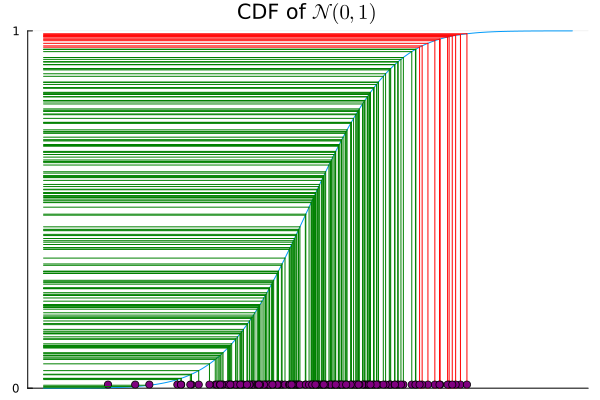

## Propriété

. . .

On considère un test qui rejette $H_0$ pour les grandes valeurs de $\psi$. Au niveau $\alpha \in (0,1)$, la région de rejet est

. . .

$$
\mathcal{R}_\alpha = \bigl\{ x \in \mathcal{X} : \psi(x) > c_\alpha \bigr\},
$$
où $c_\alpha$ est la valeur critique satisfaisant $\mathbb{P}_{H_0}(\psi(X) > c_\alpha) = \alpha$.

. . .

::: {.callout-important title="Propriété"}
La p-valeur est le plus petit niveau $\alpha$ auquel on rejette $H_0$ :
$$
p(x) = \inf\bigl\{\alpha \in (0,1) : x \in \mathcal{R}_\alpha\bigr\}.
$$

[preuve](../notes/pvalue_fr.qmd)
:::

## Exemple 1 : Test z à un échantillon

. . .

$X_1, \dots, X_n \overset{\text{iid}}{\sim} \mathcal N(\mu, \sigma_0)$ avec $\sigma_0$ connue. Test $H_0: \mu = 0$ vs $H_1: \mu \neq 0$.

::: {.fragment}
La statistique pivotale est
$$ \psi(X) = \frac{\sqrt{n}\,\overline{X}}{\sigma_0} \sim \mathcal N(0,1) \quad \text{sous } H_0 \; .$$
:::

## Exemple Numérique

. . .

$n=25$, $\sigma_0 = 2$, $\overline{x}_{\mathrm{obs}} = 0.9$.

$$\psi(x_{\mathrm{obs}}) = \frac{\sqrt{25} \times 0.9}{2} = 2.25$$

P-valeur bilatérale : $p_{value} = 2\,\mathbb P(Z \geq 2.25) = 2 \times 0.0122 = 0.0244$.

Puisque $p_{value} = 0.0244 \leq \alpha = 0.05$, on **rejette** $H_0$.

## Exemple 2 : Test t à un échantillon

. . .

$X_1, \dots, X_n \overset{\text{iid}}{\sim} \mathcal N(\mu, \sigma)$ avec $\sigma$ **inconnue**. Test $H_0: \mu = 0$ vs $H_1: \mu > 0$.

::: {.fragment}
On utilise la statistique de test suivante :
$$ \psi(X) = \frac{\sqrt{n}\,\overline{X}}{S} \sim t_{n-1} \quad \text{sous } H_0$$
où $S^2 = \frac{1}{n-1}\sum_{i=1}^n (X_i - \overline{X})^2$. Le paramètre $\sigma$ se simplifie (comme dans la diapositive précédente), donc $\psi$ est pivotale sur $\Theta_0 = \{(\mu, \sigma): \mu = 0,\, \sigma > 0\}$.
:::

::: {.fragment}
**Exemple numérique :** $n=10$, $\overline{x}_{\mathrm{obs}} = 1.5$, $s = 2.1$.

$$\psi(x_{\mathrm{obs}}) = \frac{\sqrt{10} \times 1.5}{2.1} = 2.26$$

P-valeur unilatérale droite : $p_{value} = \mathbb P(T_9 \geq 2.26) = 0.025$.

Puisque $p_{value} = 0.025 \leq \alpha = 0.05$, on **rejette** $H_0$.
:::

## Propriété de la p-valeur

. . .

::: {.callout-note title="P-valeur sous $H_0$"}
Sous $H_0$, pour un test unilatéral gauche ou droit, pour une statistique de test pivotale $\psi$, $p_{value}(X)$ suit une loi uniforme $\mathcal U([0,1])$.
:::

. . .

Ainsi, si les données suivent vraiment l'hypothèse nulle et si on teste au niveau $5\%$,

. . .

réaliser $1000$ expériences conduira en moyenne à rejeter $50$ fois

## Preuve (cas unilatéral droit)
Soit $F$ la fonction de répartition de $\psi(X)$ sous $H_0$. Supposons pour simplifier qu'elle est strictement croissante.
Alors
$$p_{value}(X) = 1 - F(\psi(X)) \; .$$

::: {.fragment}
Pour tout $t \in [0,1]$,

:::{style="font-size: 80%;"}
$$\mathbb P_{H_0}(p_{value}(X) \leq t) = \mathbb P_{H_0}(1 - F(\psi(X)) \leq t) = \mathbb P_{H_0}(\psi(X) \geq F^{-1}(1-t)) \; .$$
:::
:::

. . .

D'où,

::: {.fragment}
$$\mathbb P_{H_0}(p_{value}(X) \leq t) = 1- F(F^{-1}(1-t))= t$$
:::

##

[Suivant : lois usuelles](usual_distributions_fr.qmd)