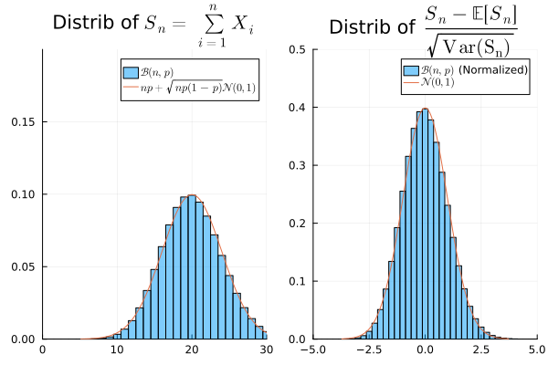
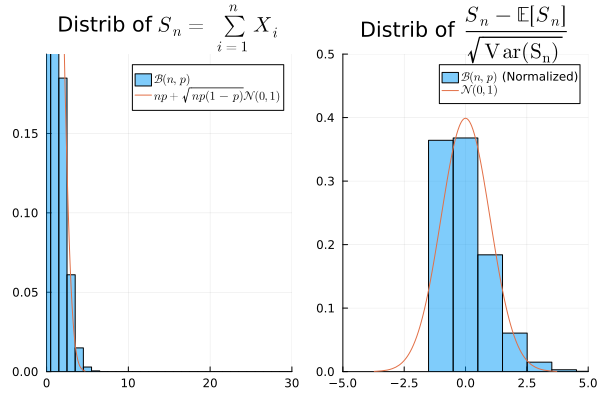
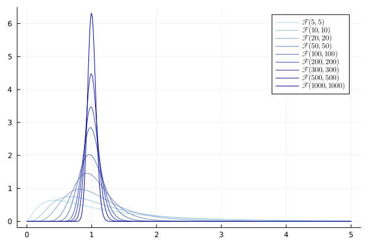

## Plan

- Lois gaussiennes et TCL
- Chi-deux, Student et Fisher
- Théorème de Cochran

[Précédent : tester des modèles](testing_models_fr.qmd)

[Suivant : populations gaussiennes](gaussian_populations_fr.qmd)

# Gaussiennes et TCL

## Loi gaussienne

. . .

::: {.callout-note}
## Définition de la loi gaussienne
Une loi gaussienne (ou normale) de [moyenne $\mu \in \mathbb{R}$]{style="background-color: yellow;"} et de [variance $\sigma^2 > 0$]{style="background-color: yellow;"} est la loi de densité

::: {.square-def}
$$f(x) = \frac{1}{\sqrt{2\pi\sigma^2}} \exp\left(-\frac{(x - \mu)^2}{2\sigma^2}\right)$$
:::
On note $\mathcal{N}(\mu, \sigma^2)$ cette loi. Lorsque $\mu = 0$ et $\sigma^2 = 1$, on parle de **loi normale centrée réduite**.
:::

. . .

::: {.callout-tip}
## Propriétés
- Pour des gaussiennes iid, $\sum_{i=1}^n X_i = n \mu + \sqrt{n} \mathcal N(0,1)$
:::

## Jeu
Je génère $X \sim \mathcal{N}(0,1)$.

. . .

On observe [$0.37$]{style="background-color: lightblue;"}. Cela pourrait-il provenir d'une $\mathcal{N}(0,1)$ ?

. . .

On observe [$3.82$]{style="background-color: lightblue;"}. Cela pourrait-il provenir d'une $\mathcal{N}(0,1)$ ?

. . .

On observe [$-0.91$]{style="background-color: lightblue;"}. Et ça ??

## Formalisation :

. . .

$H_0$ : $X \sim \mathcal N(0,1)$ VS $H_1$ : $X \sim \mathcal N(\mu, 1)$, $\mu \neq 0$

- statistique de test : $X$ test : $|X| > t$ ([Bilatéral]{style="background-color: yellow;"})
- $t$ = `quantile(Normal(0,1), 0.975) = 1.96`
- observation : $3.82$
- conclusion : rejet au niveau $5\%$
- ou avec la p-valeur : `2 * (1 - cdf(Normal(0,1), abs(3.82))) ≈ 0.0001`

## Définition et lien avec le TCL

On observe $(X_1, \dots, X_n)$ des variables aléatoires réelles iid.

. . .

:::{.callout-note title="TCL"} 
Soit $S_n = \sum_{i=1}^n X_i$ avec $(X_1, \dots, X_n)$ iid ($L^2$) alors $$ \frac{S_n - \mathbb E[S_n]}{\sqrt{\mathrm{Var}(S_n)}} \approx \mathcal N(0,1) \text{ quand } n \to \infty $$

Règle empirique : $n \geq 30$ (!!! attention à cette règle)

C'est une égalité lorsque les $X_i$ sont gaussiennes $\mathcal N(\mu, \sigma^2)$
:::

## Exemple : binomiales

. . .

Fixons $p \in (0,1)$. Alors, $\frac{\mathrm{Bin}(n,p) - np}{\sqrt{np(1-p)}} \approx \mathcal N(0,1)$ quand $n \to \infty$

. . .

$n$ doit être $\gg \frac{1}{p}$ (pas $30$ !!!)

:::: {.columns}
::: {.column}

:::{.fragment}

Bonne approximation pour ($n=100$, $p=0.2$)

{width=70%}
:::
:::

::: {.column}
:::{.fragment}
Mauvaise approximation pour ($n=100$, $p=0.01$)
{width=70%}
:::
:::
::::

# Chi-deux, Student et Fisher

## Loi du Chi-deux

. . .

::: {.callout-note}
## Définition de la loi du Chi-deux
Une loi du chi-deux à [degré de liberté $k$]{style="background-color: yellow;"} est la loi de

::: {.square-def}
$$X = \sum_{i=1}^k Z_i^2$$
:::

où les $(Z_1, \dots, Z_k)$ sont [iid $\mathcal N(0,1)$]{style="background-color: lightblue;"}. On note $\chi^2(k)$ cette loi.
:::

. . .

::: {.callout-tip}
## Propriétés
- $\mathbb E[X] = k$, $\mathbb V[X] = 2k$
- $\chi^2(k) \sim k + \sqrt{2k}\mathcal N(0,1)$ quand $k \to +\infty$
:::

## Espérance et variance

$X = \sum_{i=1}^k Z_i^2$

. . .

$$\mathbb{E}[X] = \sum_{i=1}^k \mathbb{E}[Z_i^2] = \sum_{i=1}^k 1 = k$$

. . . 

$$\mathbb{V}[X] = \sum_{i=1}^k \mathbb{V}[Z_i^2] = k* (3-1) = 2k$$

## Convergence en loi

Les $Z_i^2$ sont iid de moyenne $\mu = 1$ et de variance $\sigma^2 = 2$. Par le TCL :

$$\frac{X - \mathbb E[X]}{\mathbb V(X)} = \frac{X - k}{\sqrt{2k}} \xrightarrow{\mathcal{L}} \mathcal{N}(0,1) \quad \text{quand } k \to +\infty$$

En réarrangeant :

$$X \approx k + \sqrt{2k}\,\mathcal{N}(0,1) \qquad \blacksquare$$

## Jeu

Je génère $X \sim \chi^2(53)$.

. . .

On observe [$112.7$]{style="background-color: lightblue;"}. Cela pourrait-il provenir d'une $\chi^2(53)$ ?

. . .

On observe [$50.1$]{style="background-color: lightblue;"}. Cela pourrait-il provenir d'une $\chi^2(53)$ ?

. . .

On observe [$15.4$]{style="background-color: lightblue;"}. Et ça ??

## Formalisation :

. . .

::: {.square-objective}
$H_0$ : $X \sim \chi^2(53)$ VS $H_1$ : $X \not\sim \chi^2(53)$
:::

- statistique de test : $X$ test : $X < t_1$ ou $X > t_2$ ([Bilatéral ici]{style="background-color: yellow;"}. Habituellement avec le chi-deux : unilatéral à droite)
- $t_1$ = `quantile(Chisq(53), 0.025) = 34.78`
- $t_2$ = `quantile(Chisq(53), 0.975) = 74.47`
- observation : $112.7$
- conclusion : rejet au niveau $5\%$
- ou avec la p-valeur : `2 * min(cdf(Chisq(53), 112.7), 1 - cdf(Chisq(53), 112.7)) ≈ 0`

## Loi de Student

. . .

::: {.callout-note}
## Définition de la loi de Student
Une loi de Student à [degré de liberté $k$]{style="background-color: yellow;"} est la loi de

::: {.square-def}
$$T = \frac{Z}{\sqrt{U/k}}$$
:::
où $Z$ et $U$ sont [indépendants]{style="background-color: lightblue;"}, avec $Z \sim \mathcal N(0,1)$ et $U \sim \chi^2(k)$. On note $\mathcal T(k)$ cette loi.
:::

. . .

::: {.callout-tip}
## Propriétés
- $\mathbb E[T] = 0$ pour $k > 1$, $\mathbb V[T] = \frac{k}{k-2}$ pour $k > 2$
- $\mathcal T(k) \sim \mathcal N(0,1)$ quand $k \to +\infty$
:::

## Démonstration

. . .

**Espérance :** Pour $k > 1$, puisque $Z$ et $U$ sont indépendants,
$$\mathbb{E}[T] = \mathbb{E}[Z] \cdot \mathbb{E}\!\left[\frac{1}{\sqrt{U/k}}\right] = 0$$
car $\mathbb{E}[Z] = 0$.

. . .

**Normalité asymptotique :** On écrit $T = \frac{Z}{\sqrt{U/k}}$. Par la loi des grands nombres, $U/k = \frac{1}{k}\sum_{i=1}^k Z_i^2 \xrightarrow{\text{p.s.}} \mathbb{E}[Z_1^2] = 1$ quand $k \to \infty$.

## Jeu

Je génère $T \sim \mathcal{T}(10)$.

. . .

On observe [$-5.2$]{style="background-color: lightblue;"}. Cela pourrait-il être anormalement petit pour une $\mathcal{T}(10)$ ?

. . .

On observe [$3.45$]{style="background-color: lightblue;"}. Cela pourrait-il être anormalement petit pour une $\mathcal{T}(10)$ ?

. . .

On observe [$-0.15$]{style="background-color: lightblue;"}. Et ça ??

## Formalisation :

. . .

::: {.square-objective}
$H_0$ : $T \sim \mathcal T(10)$ VS $H_1$ : $T \sim \mathcal T(10) + \mu$ avec $\mu < 0$
:::

- statistique de test : $T$
- test : $T < -t$
- t = `quantile(TDist(10), 0.05) = -1.81`
- observation : $-3.45$
- conclusion : rejet au niveau $5\%$
- ou avec la p-valeur : `cdf(TDist(10), -3.45) = 0.003`

## Loi de Fisher

. . .

::: {.callout-note}
## Définition de la loi de Fisher
Une loi de Fisher à [degrés de liberté $(k_1, k_2)$]{style="background-color: yellow;"} est la loi de

::: {.square-def}
$F = \frac{U_1/k_1}{U_2/k_2}$
:::
où $U_1$ et $U_2$ sont [indépendants]{style="background-color: lightblue;"}, avec $U_1 \sim \chi^2(k_1)$ et $U_2 \sim \chi^2(k_2)$. On note $\mathcal F(k_1, k_2)$ cette loi.
:::

. . .

::: {.callout-tip}
## Propriétés
- $\mathbb E[F] = \frac{k_2}{k_2 - 2}$ pour $k_2 > 2$
- $\mathcal F(k_1,k_2) \approx 1 + \sqrt{\frac{2}{k_1} + \frac{2}{k_2}}\,\mathcal N(0, 1)$ quand $k_1,k_2 \to +\infty$
:::

## Illustration

. . .

## Convergence : idée de la démonstration

. . .

En utilisant l'approximation du TCL $U_1 \sim k_1 + \sqrt{2k_1} Z_1$ et $U_2 \sim k_1 + \sqrt{2k_2} Z_2$

. . .

$$F = \frac{U_1/k_1}{U_2/k_2} = \frac{1 + \sqrt{\frac{2}{k_1}}\,Z_1}{1 + \sqrt{\frac{2}{k_2}}\,Z_2} \approx 1 + \sqrt{\frac{2}{k_1}}\,Z_1 - \sqrt{\frac{2}{k_2}}\,Z_2$$

Puisque $U_1$ et $U_2$ sont indépendants, la variance du membre de droite est $\frac{2}{k_1} + \frac{2}{k_2}$, donc :

$$F \approx 1 + \sqrt{\frac{2}{k_1} + \frac{2}{k_2}}\,\mathcal{N}(0,1)$$

## Jeu

Je génère $F \sim \mathcal{F}(5, 20)$.

. . .

On observe [$1.12$]{style="background-color: lightblue;"}. Cela pourrait-il être anormalement grand pour une $\mathcal{F}(5,20)$ ?

. . .

On observe [$4.87$]{style="background-color: lightblue;"}. Cela pourrait-il être anormalement grand pour une $\mathcal{F}(5,20)$ ?

. . .

On observe [$0.95$]{style="background-color: lightblue;"}. Et ça ??

## Formalisation :

. . .

$H_0$ : $F \sim \mathcal F(5,20)$ VS $H_1$ : $F$ est stochastiquement plus grande que $\mathcal F(5,20)$

- statistique de test : $F$
- test : $F > t$
- t = `quantile(FDist(5,20), 0.95) = 2.71`
- observation : $4.87$
- conclusion : rejet au niveau $5\%$
- ou avec la p-valeur : `1 - cdf(FDist(5,20), 4.87) = 0.004`

## Test de Fisher

- $\psi(X,Y)=\frac{\hat \sigma^2_1}{\hat \sigma_2^2}$ est indépendant de $\mu_1$, $\mu_2$, $\sigma_1$, $\sigma_2$. C'est une statistique **pivotale**
- Elle suit la loi $\mathcal F(n_1-1, n_2-1)$

## Théorème de Cochran

. . .

::: {.callout-note}
Soit $Y \sim \mathcal{N}(0, I_n)$. Soient $E$ et $F$ deux sous-espaces orthogonaux de $\mathbb{R}^n$, c'est-à-dire $E \perp F$, de dimensions $\dim(E) = p$ et $\dim(F) = q$. On note $\Pi_E$ et $\Pi_F$ les projections orthogonales sur $E$ et $F$ respectivement. Alors :

1. **Indépendance :** $\Pi_E Y$ et $\Pi_F Y$ sont des vecteurs gaussiens indépendants.

2. **Lois du chi-deux :** $\|\Pi_E Y\|^2 \sim \chi^2(p)$ et $\|\Pi_F Y\|^2 \sim \chi^2(q)$.

3. **Décomposition pythagoricienne :** Si $\mathbb{R}^n = E \oplus F$ (c'est-à-dire $p + q = n$), alors
$\|Y\|^2 = \|\Pi_E Y\|^2 + \|\Pi_F Y\|^2$

:::

. . .

voir aussi la [démonstration](../notes/cochran.qmd)

##

[Précédent : tester des modèles](testing_models_fr.qmd)

[Suivant : populations gaussiennes](gaussian_populations_fr.qmd)