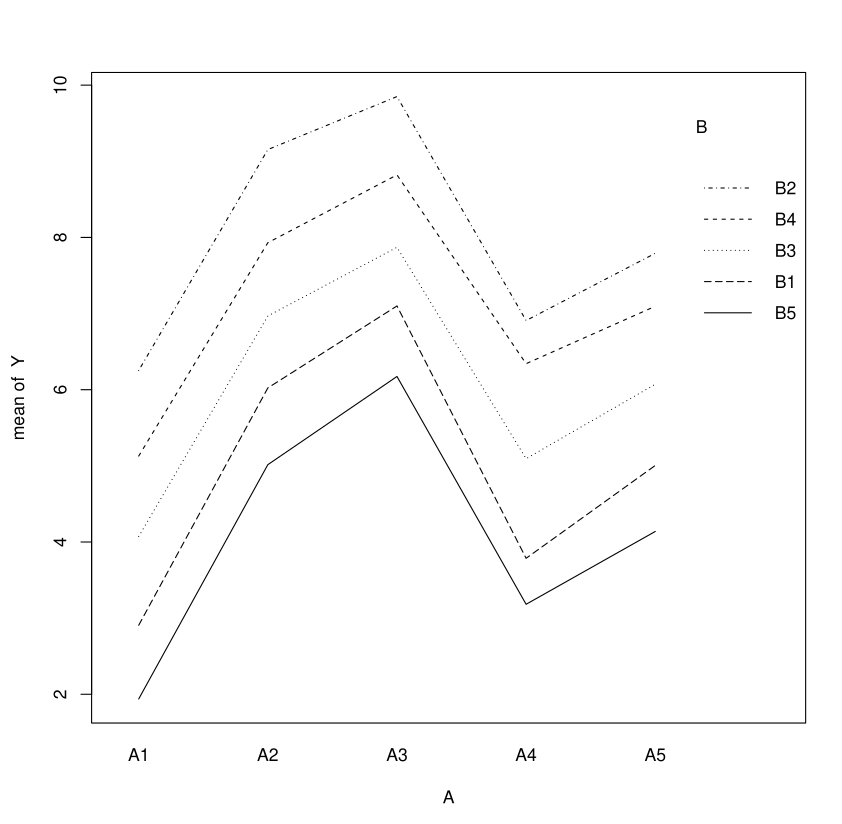
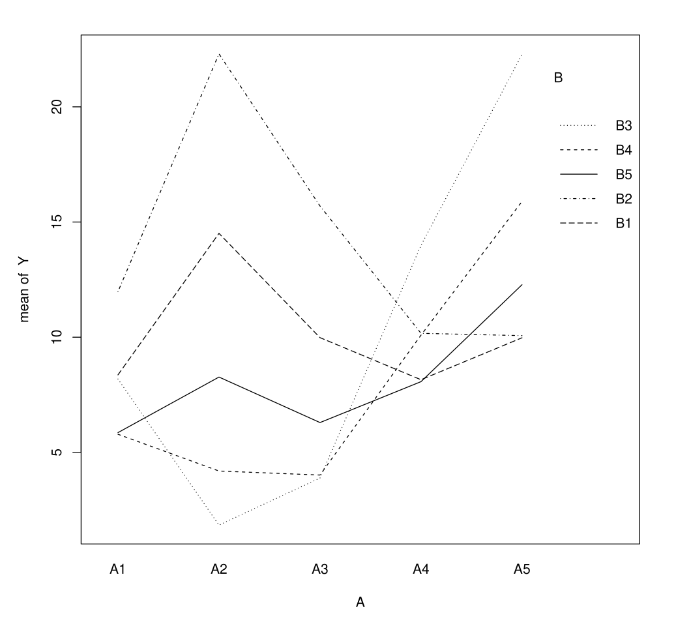

# Overview

::: {style="display:none"}
$\newcommand{\VS}{\quad \mathrm{VS} \quad}$
$\newcommand{\and}{\quad \mathrm{and} \quad}$
$\newcommand{\E}{\mathbb E}$
$\newcommand{\P}{\mathbb P}$
$\newcommand{\Var}{\mathbb V}$
$\newcommand{\Cov}{\mathrm{Cov}}$
$\newcommand{\1}{\mathbf 1}$
:::


## Link with Previous Lectures

. . .

Previously, we considered that:

- Response variable $Y$ is **quantitative**
- Explanatory variables $X^{(j)}$ are **quantitative**

. . .

We still assume $Y$ is **quantitative**, but [explanatory variables can be **qualitative and/or quantitative**]{style="background-color: yellow;"}.

## Terminology

- [**ANOVA**]{style="background-color: lightblue;"} (Analysis of Variance): All explanatory variables $X^{(j)}$ are [**qualitative**]{style="background-color: lightblue;"}
- [**ANCOVA**]{style="background-color: lightgreen;"} (Analysis of Covariance): Explanatory variables mix [**both quantitative and qualitative**]{style="background-color: lightgreen;"} variables

. . .

We'll see that these situations **reduce to the case** of the previous chapter.

# One-Way ANOVA (One Factor)


## Context, Notations

. . .

We seek to explain $Y$ using a **single qualitative variable** $X$.

We observe $(Y, X)$, and define

. . .

::: {.square-def}
:::{style="font-size: 80%;"}
$$N_i = \sum_{k=1}^n \mathbf 1\{X_k=i\} \and \overline Y_i = \frac{1}{N_i}\sum_{k=1}^n Y_k \mathbf 1\{X_k=i\}$$
:::

:::

. . .

Total mean:

$\overline Y = \frac{1}{n}\sum_{k=1}^n Y_k = \frac{1}{n}\sum_{i=1}^I N_i \overline Y_i$

. . .


## The One-Factor Model

. . .

For $k = 1, \ldots, n$

::: {.square-def}
$$Y_k = \sum_{i=1}^I \mu_i \mathbf{1}\{X_k=A_i\} + \varepsilon_k$$
:::

where $\E[\varepsilon_k]=0$,  $\Cov(\varepsilon_k,\varepsilon_l)=\sigma^2\1\{k=l\}$

- $Y_k$ is random and has expectation $\mu_i$ if $X_k=A_i$
- $\Var(Y_k)=\sigma^2$ is the same regardless of modality $A_i$

## Questions of Interest

- Do we have $\mu_1 = \mu_2 = \ldots = \mu_I$? (Does factor $A$ influence $Y$?)
- Does some $\mu_i$ have more influence on $Y$?
- How do we estimate the $\mu_i$'s?

## One Hot Encoding

. . .

We use [one-hot encoding]{style="background-color: yellow;"}: $X_{ki}=\1\{X_k=A_i\}$

. . .

That is, for individual $k$, [$X_{k\cdot} = (\1\{X_k=A_1\}, \dots, \1\{X_k=A_I\}) \in \{0,1\}^I$]{style="background-color: lightblue;"}

. . .

Or, using previous notations, $X = (X^{(1)}, \dots, X^{(I)})$ where


$$X^{(i)}= \begin{pmatrix}
X^{(i)}_1 \\
\vdots  \\
X^{(i)}_n 
\end{pmatrix}$$

## In Other Words

- If there are [ $3$ categories]{style="background-color: yellow;"} e.g. [blue]{style="background-color: lightblue;"}, [orange]{style="background-color: orange;"}, [green]{style="background-color: lightgreen;"}, we replace the column $X$ by $3$ columns

- Example with $I=3$ categories and $n=5$ individuals
$$
\begin{pmatrix}
\color{blue}{\mathrm{blue}} \\
\mathrm{green} \\
\color{blue}{\mathrm{blue}} \\
\mathrm{orange} \\
\mathrm{orange} \\
\end{pmatrix} \quad  \text{becomes} \quad
X=\begin{pmatrix}
\color{blue}{\mathrm{1}} & \mathrm{0} & \mathrm{0}\\
\mathrm{0} & \mathrm{0} & \mathrm{1}\\
\color{blue}{\mathrm{1}} & \mathrm{0} & \mathrm{0}\\
\mathrm{0} & \mathrm{1} & \mathrm{0}\\
\mathrm{0} & \mathrm{1} & \mathrm{0}\\
\end{pmatrix}
$$

## Model, Matrix Form

. . .

We rewrite the model [$Y_k = \sum_{i=1}^I \mu_i \mathbf{1}\{X_k=A_i\} + \varepsilon_k$]{style="background-color: lightblue;"} as

::: {.square-def}
$$Y = X\mu + \varepsilon$$
:::

- Here, [$X_{k\cdot} = (\1\{X_k=A_1\}, \dots, \1\{X_k=A_I\}) \in \{0,1\}^I$]{style="background-color: lightblue;"}
- There is [no constant]{style="background-color: yellow;"} in this model


## Model with Constant

. . .

If we want to model the constant (intercept) and $I$ modalities, we assume

::: {.square-def}
$$Y_k = m+\sum_{i=2}^I \alpha_i \mathbf{1}\{X_k=A_i\} + \varepsilon_k$$
:::

. . .

Equivalently,

::: {.square-def}
$Y = m \mathbf{1} + \sum_{i=2}^I \alpha_i\mathbf{1}_{A_i}+\varepsilon$
:::


## Collinearity Issues and Constraints

. . .


::: {.square-def}
$Y_k = m+\sum_{i=2}^I \alpha_i \mathbf{1}\{X_k=A_i\} + \varepsilon_k$
:::

. . .

::: {.square-def}
$\sum_{i=1}^I \mathbf{1}_{A_i} = \mathbf{1}$
:::


. . .

We have $I+1$ parameters instead of $I$. We have to set one constraint:

- $m=0$ (model without intercept). Here, [$\alpha_i= \mu_i$]{style="background-color: yellow;"}
- $\alpha_1 =0$. In this case, we set [$\alpha_i = \mu_i-\mu_1$]{style="background-color: yellow;"} (default in R).


## In R

. . .

:::{style="font-size: 120%;"}
**with intercept** (default)
:::

```r
lm(Y~A) #with intercept
```

. . .

Interpretation: gives expectation [$\E[Y_k] = \mu_1$]{style="background-color: yellow;"} and coefficients [$\alpha_i= \mu_i - \mu_1$]{style="background-color: yellow;"}

\ \

. . .

:::{style="font-size: 120%;"}
**without intercept**
:::
```r
lm(Y~A-1) #without intercept
```

. . .

Interpretation: gives coefficients [$\alpha_i= \mu_i$]{style="background-color: yellow;"}

## Estimation of μ 

. . .

Whichever the model we choose (with constant or not), estimation of $\mu_i=\E[Y_k|X_k=A_i]$ is the same. Same for $\Var(\varepsilon_k)=\sigma^2$.

. . .

::: {.callout-note}
## Proposition

In category $i$, OLS estimation of $\mu_i$ leads to:

- $\hat{\mu}_i = \frac{1}{N_i}\sum_{k=1}^n Y_k \1\{X_k=A_i\} = \overline{Y}_i$

An unbiased estimator of $\sigma^2$ is

- $\hat{\sigma}^2 = \frac{1}{n-I} \sum_{k=1}^{n}\sum_{i=1}^I (Y_{k} - \overline{Y}_i)^2\1\{X_k=A_i\}$
:::

## Idea of Proof: Projections

. . .

We write $\mathbf 1_i = (\1\{X_1=A_i\}, \dots, \1\{X_n=A_i\})^T$, and $E = span(\mathbf 1_1, \dots, \mathbf 1_I)$

. . .

Then, the OLS is exactly

$\hat \mu = \mathrm{argmin}_{\mu' \in E}\|Y - \mu'\|_2^2 = P_E Y$

. . .

For $\hat \sigma$,  $\mathbb E[((I_n-P_E)\varepsilon)^T(I_n-P_E)\varepsilon]= \sigma^2 (n-I)$

## Testing for Factor Effect (ANOVA Test)

. . .

We want to test $H_0: \mu_1 = \cdots = \mu_I$.

This is a **linear constraints test**! (See previous chapters)

. . .

::: {.callout-note}
## Proposition
If $\varepsilon \sim N(0, \sigma^2 I_n)$, then under $H_0: \mu_1 = \cdots = \mu_I$:

$$F = \frac{SSB/(I-1)}{SSW/(n-I)} \sim F(I-1, n-I)$$

- $SSB = \sum_{i=1}^I N_i (\overline{Y}_i - \overline{Y})^2$
- $SSW = \sum_{i=1}^I \sum_{k=1}^{n} (Y_{k} - \overline{Y}_i)^2\1\{X_k=A_i\}$

**Critical region** at level $\alpha$: $CR_\alpha = \{F > f_{I-1,n-I}(1-\alpha)\}$
:::

## How the F-test sees the data {.smaller}

::: {style="font-size:88%"}
**One-way ANOVA** (a single factor $A$ with $I$ groups). Pull the group means apart (**separation**) or add within-group **noise**. The partition $SST = SSB + SSW$ shifts: $F = \tfrac{SSB/(I-1)}{SSW/(n-I)}$ is large exactly when the **between** share dominates the **within** share.
:::

```{=html}
<style>
.lm-btn{font-family:inherit;font-size:.82em;padding:.35em 1em;margin:.1em .18em;border:1px solid #bbb;border-radius:8px;background:#f4f4f4;color:#333;cursor:pointer}
.lm-btn.on{background:#3b6fb6;color:#fff;border-color:#3b6fb6}
.lm-row{font-size:.72em;line-height:2.3;margin:.12rem 0}
.lm-wrap{text-align:center}
.lm-sw{display:inline-block;width:11px;height:11px;border-radius:2px;vertical-align:middle}
</style>
<div class="lm-wrap">
  <canvas id="awCanvas" width="720" height="338" style="max-width:100%;background:#fff;border:1px solid #ddd;border-radius:8px;touch-action:none"></canvas>
  <div class="lm-row">separation <input id="awSep" type="range" autocomplete="off" min="0" max="3" step="0.05" value="1.2" style="vertical-align:middle;width:150px"> <b id="awSepv">1.20</b> &nbsp; noise <input id="awNz" type="range" autocomplete="off" min="0.2" max="2" step="0.05" value="0.8" style="vertical-align:middle;width:130px"> <b id="awNzv">0.80</b> &nbsp; <button class="lm-btn" id="awNew">↻ resample</button></div>
  <div class="lm-row"><span class="lm-sw" style="background:#3b6fb6"></span> SSB (between) &nbsp; <span class="lm-sw" style="background:#bbb"></span> SSW (within) &nbsp;·&nbsp; F = <b id="awF">–</b> &nbsp; p = <b id="awP">–</b></div>
</div>
<script>
(function () {
  var cv = document.getElementById('awCanvas'); if (!cv || cv.dataset.init) return; cv.dataset.init = 1;
  var c = cv.getContext('2d'), W = cv.width, H = cv.height;
  var I = 4, NG = 10, N = I * NG, D = [-1.5, -0.5, 0.5, 1.5], COL = ['#3498db', '#e67e22', '#27ae60', '#9b59b6'];
  var Z = [], sepEl = document.getElementById('awSep'), nzEl = document.getElementById('awNz'), KEY = 'lmAnovaDecomp';
  function gauss(){var u=0,v=0;while(!u)u=Math.random();while(!v)v=Math.random();return Math.sqrt(-2*Math.log(u))*Math.cos(2*Math.PI*v);}
  function vdcJit(n){var r=0,d=1;n=n+1;while(n>0){d*=2;r+=(n%2)/d;n=Math.floor(n/2);}return r;}
  function regen(){ Z=[]; for(var i=0;i<I;i++){ var g=[]; for(var k=0;k<NG;k++) g.push(gauss()); Z.push(g); } }
  function lgamma(z){var g=[0.99999999999980993,676.5203681218851,-1259.1392167224028,771.32342877765313,-176.61502916214059,12.507343278686905,-0.13857109526572012,9.9843695780195716e-6,1.5056327351493116e-7];if(z<0.5)return Math.log(Math.PI/Math.sin(Math.PI*z))-lgamma(1-z);z-=1;var x=g[0];for(var i=1;i<9;i++)x+=g[i]/(z+i);var t=z+7.5;return 0.5*Math.log(2*Math.PI)+(z+0.5)*Math.log(t)-t+Math.log(x);}
  function betacf(a,b,x){var F=1e-300,qab=a+b,qap=a+1,qam=a-1,cc=1,d=1-qab*x/qap;if(Math.abs(d)<F)d=F;d=1/d;var h=d;for(var m=1;m<=200;m++){var m2=2*m,aa=m*(b-m)*x/((qam+m2)*(a+m2));d=1+aa*d;if(Math.abs(d)<F)d=F;cc=1+aa/cc;if(Math.abs(cc)<F)cc=F;d=1/d;h*=d*cc;aa=-(a+m)*(qab+m)*x/((a+m2)*(qap+m2));d=1+aa*d;if(Math.abs(d)<F)d=F;cc=1+aa/cc;if(Math.abs(cc)<F)cc=F;d=1/d;var del=d*cc;h*=del;if(Math.abs(del-1)<3e-12)break;}return h;}
  function betai(a,b,x){if(x<=0)return 0;if(x>=1)return 1;var bt=Math.exp(lgamma(a+b)-lgamma(a)-lgamma(b)+a*Math.log(x)+b*Math.log(1-x));return x<(a+1)/(a+b+2)?bt*betacf(a,b,x)/a:1-bt*betacf(b,a,1-x)/b;}
  function pf(Fv,d1,d2){return Fv<=0?1:betai(d2/2,d1/2,d2/(d2+d1*Fv));}
  function draw(){
    var sep=+sepEl.value, nz=+nzEl.value, i, k;
    document.getElementById('awSepv').textContent=sep.toFixed(2);
    document.getElementById('awNzv').textContent=nz.toFixed(2);
    var ys=[], mu=[], all=[];
    for(i=0;i<I;i++){ mu[i]=sep*D[i]; ys[i]=[]; for(k=0;k<NG;k++){ var y=mu[i]+nz*Z[i][k]; ys[i].push(y); all.push(y); } }
    var gm=0; all.forEach(function(y){gm+=y;}); gm/=N;
    var ybar=[], SSB=0, SSW=0;
    for(i=0;i<I;i++){ var m=0; for(k=0;k<NG;k++) m+=ys[i][k]; m/=NG; ybar[i]=m; SSB+=NG*(m-gm)*(m-gm); for(k=0;k<NG;k++) SSW+=(ys[i][k]-m)*(ys[i][k]-m); }
    var SST=SSB+SSW, F=(SSB/(I-1))/((SSW/(N-I))||1e-9), p=pf(F,I-1,N-I);
    var lo=Math.min.apply(0,all), hi=Math.max.apply(0,all), pad=(hi-lo)*0.12||1; lo-=pad; hi+=pad;
    var X0=46, top=18, plotW=420, plotH=H-50;
    function PY(y){return top+(hi-y)/(hi-lo)*plotH;}
    c.clearRect(0,0,W,H);
    c.strokeStyle='#e6e6e6'; c.lineWidth=1; c.strokeRect(X0,top,plotW,plotH);
    c.strokeStyle='#aaa'; c.setLineDash([4,3]); c.beginPath(); c.moveTo(X0,PY(gm)); c.lineTo(X0+plotW,PY(gm)); c.stroke(); c.setLineDash([]);
    c.fillStyle='#999'; c.font='10px sans-serif'; c.textAlign='left'; c.fillText('grand mean',X0+4,PY(gm)-4);
    for(i=0;i<I;i++){
      var cx=X0+(i+0.5)/I*plotW;
      for(k=0;k<NG;k++){ var jx=cx+(vdcJit(k)-0.5)*30; c.fillStyle=COL[i]; c.globalAlpha=0.75; c.beginPath(); c.arc(jx,PY(ys[i][k]),3.2,0,6.2832); c.fill(); }
      c.globalAlpha=1;
      c.strokeStyle=COL[i]; c.lineWidth=2.5; c.beginPath(); c.moveTo(cx-22,PY(ybar[i])); c.lineTo(cx+22,PY(ybar[i])); c.stroke();
      c.fillStyle='#555'; c.font='11px sans-serif'; c.textAlign='center'; c.fillText('A'+(i+1),cx,H-30);
    }
    c.fillStyle='#777'; c.font='11px sans-serif'; c.textAlign='center'; c.fillText('groups',X0+plotW/2,H-12);
    var bx=X0+plotW+44, bw=70, bTop=top, bH=plotH;
    c.strokeStyle='#e6e6e6'; c.strokeRect(bx,bTop,bw,bH);
    var fb=SSB/(SST||1), hB=fb*bH;
    c.fillStyle='#3b6fb6'; c.fillRect(bx,bTop+bH-hB,bw,hB);
    c.fillStyle='#bbb'; c.fillRect(bx,bTop,bw,bH-hB);
    c.font='bold 12px sans-serif'; c.textAlign='center';
    if(fb>0.08){ c.fillStyle='#fff'; c.fillText(Math.round(fb*100)+'%',bx+bw/2,bTop+bH-hB/2+4); }
    if(1-fb>0.08){ c.fillStyle='#555'; c.fillText(Math.round((1-fb)*100)+'%',bx+bw/2,bTop+(bH-hB)/2+4); }
    c.fillStyle='#777'; c.font='11px sans-serif'; c.fillText('SST',bx+bw/2,bTop+bH+16);
    document.getElementById('awF').textContent=F.toFixed(2);
    document.getElementById('awP').textContent=p<1e-4?p.toExponential(1):p.toFixed(3);
    save();
  }
  function save(){try{localStorage.setItem(KEY,JSON.stringify({s:+sepEl.value,n:+nzEl.value}));}catch(e){}}
  var saved=null; try{saved=JSON.parse(localStorage.getItem(KEY));}catch(e){}
  if(saved){ sepEl.value=saved.s; nzEl.value=saved.n; }
  sepEl.addEventListener('input',draw); nzEl.addEventListener('input',draw);
  document.getElementById('awNew').addEventListener('click',function(){regen();draw();});
  regen(); draw();
})();
</script>
```

## Idea of proof

. . .


Using the previous projection $P_E = \sum_{i=1}^I \frac{1}{N_i}\mathbf{1}_i\mathbf{1}_i^T$, we have the decomposition

::: {.square-def}
$$Y - P_0Y = Y-P_E Y + P_E Y - P_0 Y$$
:::


## Link with previous chapter

. . .


Under $H_0: \mu_1 = \cdots = \mu_I$, there are $I-1$ constraints to test.

. . .

$$F = \frac{n-I}{I-1} \cdot \frac{SSR_c - SSR}{SSR}$$

. . .

We show that 

- $SSR = SSW$
- $SSR_c = SST = \sum_{k=1}^n(Y_k - \overline Y)^2$
- $SST = SSB + SSW$.


. . .

**In R**: `anova(lm(Y~A))`


## What the ANOVA Test Assumes

. . .

::: {.callout-warning}
The previous analysis of variance test [tests equality of means]{style="background-color: lightgreen;"} between modalities 
[not equality of variances]{style="background-color: orange;"}

:::

. . .

It is valid under the assumption $\varepsilon \sim N(0, \sigma^2 I_n)$.

- **Gaussian assumption**: Not critical if $n$ is large
- **Homoscedasticity**: [Important assumption]{style="background-color: orange;"}


## Homoscedasticity Tests

. . .

How to test **equality of variances** in each modality:

- **Levene test**
- **Bartlett test**

. . .

**In R**: `leveneTest` or `bartlett.test` from `car` library

## Post-hoc Analysis: Multiple Testing Problem

. . .

If factor $A$ is significant, we want to know more: \
[which modality(ies) differ from the others?]{style="background-color: yellow;"}

. . .

We want to perform [all tests]{style="background-color: orange;"}:

::: {.square-def}
$$H_{0}^{i,j}: \mu_i = \mu_j \quad \text{vs} \quad H_{1}^{i,j}: \mu_i \neq \mu_j$$
:::

. . .

for all $i \neq j$ in $\{1, \ldots, I\}$, corresponding to [$I(I-1)/2$ tests]{style="background-color: orange;"}.

## Multiple Testing: Naive Approach

. . .

Perform all [Student's t-tests]{style="background-color: yellow;"} for mean comparison ([1 constraint]{style="background-color: yellow;"}), each at level $\alpha$.

**Problem**: Given the number of tests, this would lead to many **false positives**.

. . .

False positives are a well-known problem in multiple testing.

. . .

**Solution**: Apply a correction to the decision rule, e.g.

- **Bonferroni correction**
- **Benjamini-Hochberg correction**

. . .

**For one-way ANOVA**: **Tukey's test** addresses the problem.


## Multiple Testing: Tukey's Test

. . .

::: {.square-def}
$$Q = \max_{(i,j)} \frac{|\overline{Y}_i - \overline{Y}_j|}{\hat{\sigma}\sqrt{\tfrac{1}{2}\left(\frac{1}{N_i} + \frac{1}{N_j}\right)}}$$
:::

. . .

::: {.callout-note}
## Distribution of Tukey's Test Statistic
Under [$H_0: \mu_1 = \cdots = \mu_I$]{style="background-color: lightblue;"} and assuming $\varepsilon \sim N(0, \sigma^2 I_n)$:

$$Q \sim Q_{I,n-I}$$


where $Q_{I,n-I}$ denotes the **Tukey distribution** with $(I, n-I)$ degrees of freedom.

**Note**: This is exact if all $n_i$ are equal, otherwise the distribution is approximately Tukey.
:::

## Individual Tests

. . .


To test each [$H_0^{i,j}: \mu_i = \mu_j$]{style="background-color: lightblue;"}, we use the critical regions:

. . .

:::{style="font-size: 80%;"}
::: {.square-def}
$$CR_\alpha^{i,j} = \left\{|\overline{Y}_i - \overline{Y}_j| > \frac{\hat{\sigma}}{\sqrt{2}} \sqrt{\frac{1}{n_i} + \frac{1}{n_j}} \cdot Q_{I,n-I}(1-\alpha)\right\}$$
:::
:::


where $Q_{I,n-I}(1-\alpha)$ denotes the $(1-\alpha)$ quantile of a [tukey distribution $Q(I,n-I)$]{style="background-color: yellow;"}  of degrees $(I, n-I)$.

## Key Properties of Tukey's Test

. . .


The form of the previous $CR_\alpha^{i,j}$ ensures that:
$$\mathbb{P}_{\mu_1 = \cdots = \mu_I}\left(\bigcup_{(i,j)} \{Y \in CR_\alpha^{i,j}\}\right) = \alpha$$

**Interpretation**: If all null hypotheses $H_0^{i,j}$ are true ($\mu_1 = \cdots = \mu_I$), then the probability of concluding at least one $H_1^{i,j}$ equals $\alpha$.

. . .

This is the **simultaneous Type I error rate**.

## Comparison with Student's tests

- **Individual Student's t-tests** $T^{i,j}$ at level $\alpha$: only guarantee $\mathbb{P}_{\mu_i = \mu_j}(T^{i,j}=1) = \alpha$
- **When cumulated**: $\mathbb{P}_{\mu_1 = \cdots = \mu_I}\left[\cup_{(i,j)}\{T^{i,j}=1\}\right] \approx 1$ → **false positives**

. . .

### Advantage
With Tukey's test, two significantly different means are **truly different**, not just due to false positives.

**In R**: `TukeyHSD`


## Why naive pairwise testing fails {.smaller}

::: {style="font-size:84%"}
**Left:** the chance of flagging at least one false "significant" pair (FWER) vs the number of groups, by **Monte-Carlo** — *hover* to read the %. **Right:** *one* experiment as a circle of the $I$ groups. The true means are **all equal**, but sampled means wiggle: every pair is tested (grey), a chord turns **red** when the naive test calls it different, **green** when even **Tukey** does — every coloured chord is a **false positive**.
:::

```{=html}
<style>
.lm-btn{font-family:inherit;font-size:.82em;padding:.35em 1em;margin:.1em .18em;border:1px solid #bbb;border-radius:8px;background:#f4f4f4;color:#333;cursor:pointer}
.lm-row{font-size:.72em;line-height:2.1;margin:.12rem 0}
.lm-wrap{text-align:center}
.lm-sw{display:inline-block;width:11px;height:11px;border-radius:2px;vertical-align:middle}
</style>
<div class="lm-wrap">
  <canvas id="fwCanvas" width="760" height="338" style="max-width:100%;background:#fff;border:1px solid #ddd;border-radius:8px;touch-action:none"></canvas>
  <div class="lm-row">data: \( Y_{g,k} = \mu + \varepsilon_{g,k},\ \ \varepsilon_{g,k}\sim\mathcal N(0,\sigma^2) \) — <b>same \(\mu\) for every group</b> (pure noise, no real differences)</div>
  <div class="lm-row">groups I <input id="fwI" type="range" autocomplete="off" min="2" max="10" step="1" value="6" style="vertical-align:middle;width:150px"> <b id="fwIv">6</b> &nbsp; α <input id="fwA" type="range" autocomplete="off" min="0.01" max="0.1" step="0.01" value="0.05" style="vertical-align:middle;width:110px"> <b id="fwAv">0.05</b> &nbsp; <button class="lm-btn" id="fwNew">↻ new experiment</button></div>
  <div class="lm-row"><span class="lm-sw" style="background:#c0392b"></span> naive false positive &nbsp; <span class="lm-sw" style="background:#27ae60"></span> Tukey false positive &nbsp;·&nbsp; this experiment: naive <b id="fwNa">–</b>, Tukey <b id="fwTu">–</b> &nbsp;<span style="color:#999">(true = 0)</span></div>
</div>
<script>
(function(){
  var cv=document.getElementById('fwCanvas'); if(!cv||cv.dataset.init)return; cv.dataset.init=1;
  var c=cv.getContext('2d'),W=cv.width,H=cv.height, NG=6, M=300, MQ=1200, IMAX=10;
  var iEl=document.getElementById('fwI'), aEl=document.getElementById('fwA'), KEY='lmFwer';
  var top=20, plotH=H-50, X0=52, plotW=300, bx0=X0+plotW+50, bpW=W-bx0-14, hoverI=null;
  function gauss(){var u=0,v=0;while(!u)u=Math.random();while(!v)v=Math.random();return Math.sqrt(-2*Math.log(u))*Math.cos(2*Math.PI*v);}
  function lgamma(z){var g=[0.99999999999980993,676.5203681218851,-1259.1392167224028,771.32342877765313,-176.61502916214059,12.507343278686905,-0.13857109526572012,9.9843695780195716e-6,1.5056327351493116e-7];if(z<0.5)return Math.log(Math.PI/Math.sin(Math.PI*z))-lgamma(1-z);z-=1;var x=g[0];for(var i=1;i<9;i++)x+=g[i]/(z+i);var t=z+7.5;return 0.5*Math.log(2*Math.PI)+(z+0.5)*Math.log(t)-t+Math.log(x);}
  function betacf(a,b,x){var F=1e-300,qab=a+b,qap=a+1,qam=a-1,cc=1,d=1-qab*x/qap;if(Math.abs(d)<F)d=F;d=1/d;var h=d;for(var m=1;m<=200;m++){var m2=2*m,aa=m*(b-m)*x/((qam+m2)*(a+m2));d=1+aa*d;if(Math.abs(d)<F)d=F;cc=1+aa/cc;if(Math.abs(cc)<F)cc=F;d=1/d;h*=d*cc;aa=-(a+m)*(qab+m)*x/((a+m2)*(qap+m2));d=1+aa*d;if(Math.abs(d)<F)d=F;cc=1+aa/cc;if(Math.abs(cc)<F)cc=F;d=1/d;var del=d*cc;h*=del;if(Math.abs(del-1)<3e-12)break;}return h;}
  function betai(a,b,x){if(x<=0)return 0;if(x>=1)return 1;var bt=Math.exp(lgamma(a+b)-lgamma(a)-lgamma(b)+a*Math.log(x)+b*Math.log(1-x));return x<(a+1)/(a+b+2)?bt*betacf(a,b,x)/a:1-bt*betacf(b,a,1-x)/b;}
  function tp(t,df){return betai(df/2,0.5,df/(df+t*t));}
  function tcrit(df,alpha){var lo=0,hi=20,it,mid;for(it=0;it<60;it++){mid=(lo+hi)/2;if(tp(mid,df)>alpha)lo=mid;else hi=mid;}return (lo+hi)/2;}
  function tukeyQ(I,df,alpha){ var qs=[],r,i,j; for(r=0;r<MQ;r++){ var U=[]; for(i=0;i<I;i++)U.push(gauss()); var lo=Math.min.apply(0,U),hi=Math.max.apply(0,U),w=0; for(j=0;j<df;j++){var x=gauss();w+=x*x;} qs.push((hi-lo)/Math.sqrt(w/df)); } qs.sort(function(a,b){return a-b;}); return qs[Math.floor((1-alpha)*MQ)]; }
  var curveN=[], curveT=[], qByI=[], pool=[];
  function genPool(){ pool=[]; for(var g=0;g<IMAX;g++){ var row=[]; for(var k=0;k<NG;k++) row.push(gauss()); pool.push(row); } }
  function simulate(){
    var alpha=+aEl.value, I, rep, a2, b2, gi, k; curveN=[]; curveT=[]; qByI=[];
    for(I=2;I<=IMAX;I++){
      var df=I*NG-I, q=tukeyQ(I,df,alpha), anyN=0, anyT=0; qByI[I]=q;
      for(rep=0;rep<M;rep++){
        var means=[], ssw=0, mn=Infinity, mx=-Infinity;
        for(gi=0;gi<I;gi++){ var s=0, gv=[]; for(k=0;k<NG;k++){var x=gauss();gv.push(x);s+=x;} var m=s/NG; means.push(m); if(m<mn)mn=m; if(m>mx)mx=m; for(k=0;k<NG;k++) ssw+=(gv[k]-m)*(gv[k]-m); }
        var sd=Math.sqrt(ssw/df), se=sd*Math.sqrt(2/NG), hitN=false;
        for(a2=0;a2<I&&!hitN;a2++)for(b2=a2+1;b2<I;b2++){ if(tp(Math.abs(means[a2]-means[b2])/(se||1e-9),df)<alpha){hitN=true;break;} }
        if(hitN)anyN++;
        if((mx-mn)/((sd*Math.sqrt(1/NG))||1e-9) > q) anyT++;
      }
      curveN[I]=anyN/M; curveT[I]=anyT/M;
    }
  }
  function mcol(t){ var a=[52,152,219], b=[231,76,60]; return 'rgb('+Math.round(a[0]+(b[0]-a[0])*t)+','+Math.round(a[1]+(b[1]-a[1])*t)+','+Math.round(a[2]+(b[2]-a[2])*t)+')'; }
  function pos(e){var r=cv.getBoundingClientRect();return [(e.clientX-r.left)*W/r.width,(e.clientY-r.top)*H/r.height];}
  function PX(i){return X0+(i-2)/(IMAX-2)*plotW;}
  function PY(y){return top+(1-y)*plotH;}
  function draw(){
    var I=+iEl.value, alpha=+aEl.value, ii, yy;
    document.getElementById('fwIv').textContent=I; document.getElementById('fwAv').textContent=alpha.toFixed(2);
    c.clearRect(0,0,W,H);
    // ===== LEFT: FWER curves =====
    c.strokeStyle='#e6e6e6'; c.lineWidth=1; c.strokeRect(X0,top,plotW,plotH);
    c.font='10px sans-serif';
    for(yy=0;yy<=1.0001;yy+=0.25){ c.textAlign='right'; c.fillStyle='#999'; c.fillText(Math.round(yy*100)+'%',X0-6,PY(yy)+3); c.strokeStyle='#f2f2f2'; c.beginPath(); c.moveTo(X0,PY(yy)); c.lineTo(X0+plotW,PY(yy)); c.stroke(); }
    c.save(); c.translate(13,top+plotH/2); c.rotate(-Math.PI/2); c.textAlign='center'; c.fillStyle='#888'; c.font='10px sans-serif'; c.fillText('chance of ≥1 false positive',0,0); c.restore();
    c.textAlign='center'; c.fillStyle='#999'; c.font='10px sans-serif'; for(ii=2;ii<=IMAX;ii++) c.fillText(ii,PX(ii),top+plotH+15);
    c.fillText('number of groups I',X0+plotW/2,H-6);
    c.strokeStyle='#aaa'; c.setLineDash([4,3]); c.beginPath(); c.moveTo(X0,PY(alpha)); c.lineTo(X0+plotW,PY(alpha)); c.stroke(); c.setLineDash([]);
    c.fillStyle='#999'; c.textAlign='left'; c.fillText('α',X0+plotW+2,PY(alpha)+3);
    function line(cur,col){ var i; c.strokeStyle=col; c.lineWidth=2.2; c.beginPath(); for(i=2;i<=IMAX;i++){var x=PX(i),y=PY(cur[i]); i>2?c.lineTo(x,y):c.moveTo(x,y);} c.stroke(); for(i=2;i<=IMAX;i++){c.fillStyle=col;c.beginPath();c.arc(PX(i),PY(cur[i]),2.4,0,6.2832);c.fill();} }
    if(curveN.length){ line(curveN,'#c0392b'); line(curveT,'#27ae60');
      c.strokeStyle='#888'; c.setLineDash([2,2]); c.beginPath(); c.moveTo(PX(I),top); c.lineTo(PX(I),top+plotH); c.stroke(); c.setLineDash([]); }
    // hover tooltip
    if(hoverI!=null && curveN.length){
      var hx=PX(hoverI);
      c.strokeStyle='#bbb'; c.lineWidth=1; c.beginPath(); c.moveTo(hx,top); c.lineTo(hx,top+plotH); c.stroke();
      c.fillStyle='#c0392b'; c.beginPath(); c.arc(hx,PY(curveN[hoverI]),4,0,6.2832); c.fill();
      c.fillStyle='#27ae60'; c.beginPath(); c.arc(hx,PY(curveT[hoverI]),4,0,6.2832); c.fill();
      var txt='I='+hoverI+'   naive '+Math.round(curveN[hoverI]*100)+'%   Tukey '+Math.round(curveT[hoverI]*100)+'%';
      c.font='11px sans-serif'; var tw=c.measureText(txt).width+12, tx=Math.min(hx+8,X0+plotW-tw); if(tx<X0)tx=X0;
      c.fillStyle='rgba(20,20,20,0.82)'; c.fillRect(tx,top+4,tw,19); c.fillStyle='#fff'; c.textAlign='left'; c.fillText(txt,tx+6,top+17);
    }
    // ===== RIGHT: one experiment as a circle =====
    c.strokeStyle='#e6e6e6'; c.lineWidth=1; c.strokeRect(bx0,top,bpW,plotH);
    var df=I*NG-I, means=[], ssw=0, gi, k;
    for(gi=0;gi<I;gi++){ var s=0; for(k=0;k<NG;k++) s+=pool[gi][k]; var m=s/NG; means.push(m); for(k=0;k<NG;k++) ssw+=(pool[gi][k]-m)*(pool[gi][k]-m); }
    var sd=Math.sqrt(ssw/df), LSD=tcrit(df,alpha)*sd*Math.sqrt(2/NG), HSD=(qByI[I]||0)*sd*Math.sqrt(1/NG);
    var mmin=Math.min.apply(0,means), mmax=Math.max.apply(0,means), rng=(mmax-mmin)||1;
    var cx=bx0+bpW/2, cy=top+plotH*0.46, R=Math.min(bpW,plotH)*0.31, px=[], py=[], i, j;
    for(i=0;i<I;i++){ var ang=-Math.PI/2+i*2*Math.PI/I; px[i]=cx+R*Math.cos(ang); py[i]=cy+R*Math.sin(ang); }
    var nC=0, tC=0;
    for(i=0;i<I;i++)for(j=i+1;j<I;j++){ c.strokeStyle='rgba(0,0,0,0.09)'; c.lineWidth=1; c.beginPath(); c.moveTo(px[i],py[i]); c.lineTo(px[j],py[j]); c.stroke(); }
    for(i=0;i<I;i++)for(j=i+1;j<I;j++){ if(Math.abs(means[i]-means[j])>LSD){ nC++; c.strokeStyle='#c0392b'; c.lineWidth=2; c.beginPath(); c.moveTo(px[i],py[i]); c.lineTo(px[j],py[j]); c.stroke(); } }
    for(i=0;i<I;i++)for(j=i+1;j<I;j++){ if(Math.abs(means[i]-means[j])>HSD){ tC++; c.strokeStyle='#27ae60'; c.lineWidth=3.2; c.beginPath(); c.moveTo(px[i],py[i]); c.lineTo(px[j],py[j]); c.stroke(); } }
    for(i=0;i<I;i++){ var t=(means[i]-mmin)/rng; c.fillStyle=mcol(t); c.beginPath(); c.arc(px[i],py[i],7,0,6.2832); c.fill(); c.strokeStyle='#fff'; c.lineWidth=2; c.stroke(); c.fillStyle='#555'; c.font='9px sans-serif'; c.textAlign='center'; var lr=R+13; c.fillText(i+1,cx+lr*Math.cos(-Math.PI/2+i*2*Math.PI/I),cy+lr*Math.sin(-Math.PI/2+i*2*Math.PI/I)+3); }
    c.fillStyle='#444'; c.font='bold 11px sans-serif'; c.textAlign='center'; c.fillText('one experiment — I = '+I+'  ('+(I*(I-1)/2)+' pairs tested)',bx0+bpW/2,top+13);
    c.fillStyle='#888'; c.font='10px sans-serif'; c.fillText('node colour = its sample mean (blue low → red high)',bx0+bpW/2,top+plotH-20);
    if(nC===0){ c.fillStyle='#27ae60'; c.font='10px sans-serif'; c.fillText('no false positive this time — ↻ or raise I',bx0+bpW/2,top+plotH-6); }
    else { c.fillStyle='#c0392b'; c.font='bold 11px sans-serif'; c.fillText(nC+' naive false positive'+(nC>1?'s':'')+(tC?'  ·  '+tC+' even with Tukey':'  ·  Tukey: 0'),bx0+bpW/2,top+plotH-6); }
    document.getElementById('fwNa').textContent=nC;
    document.getElementById('fwTu').textContent=tC;
    save();
  }
  function save(){try{localStorage.setItem(KEY,JSON.stringify({i:+iEl.value,a:+aEl.value}));}catch(e){}}
  cv.addEventListener('pointermove',function(e){ var p=pos(e); if(curveN.length && p[0]>=X0 && p[0]<=X0+plotW && p[1]>=top && p[1]<=top+plotH){ var i=Math.round(2+(p[0]-X0)/plotW*(IMAX-2)); i=Math.max(2,Math.min(IMAX,i)); if(i!==hoverI){hoverI=i;draw();} } else if(hoverI!==null){hoverI=null;draw();} });
  cv.addEventListener('pointerleave',function(){ if(hoverI!==null){hoverI=null;draw();} });
  var saved=null;try{saved=JSON.parse(localStorage.getItem(KEY));}catch(e){}
  if(saved){iEl.value=saved.i;aEl.value=saved.a;}
  iEl.addEventListener('input',draw);
  aEl.addEventListener('input',function(){simulate();draw();});
  document.getElementById('fwNew').addEventListener('click',function(){genPool();simulate();draw();});
  function typesetEq(){ if(window.MathJax&&MathJax.Hub&&MathJax.Hub.Queue) MathJax.Hub.Queue(['Typeset',MathJax.Hub]); else setTimeout(typesetEq,200); }
  genPool(); simulate(); draw(); typesetEq();
})();
</script>
```

## Example of R output

. . .

Homoscedasticity Test:

```r
leveneTest(Loss~Exercise)
```

We get

```
Levene’s Test for Homogeneity of Variance (center = median)
      Df   F value  Pr(>F)
group 3    0.6527   0.584
      68
```

. . .

Homoscedasticity is ok. ANOVA?

```r
reg=lm(Loss~Exercise) # Exercise has 4 categories
anova(reg)
```

. . .

We get

```
Response: Loss
         Df Sum Sq Mean Sq F value    Pr(>F)    
Exercise   3 712.56  237.519  20.657 1.269e-09 ***
Residuals 68 781.89   11.498
```

## Results Interpretation

. . .

The means are significantly different. We read in particular:

- $I - 1 = 3$, $n - I = 68$
- $SSB = 712.56$, $SSW = 781.89$
- $F = \frac{SSB/(I-1)}{SSW/(n-I)} = 20.657$


## R Example: Post-hoc Analysis

. . .

We finish by analyzing the mean differences more precisely:

. . .

```r
TukeyHSD(aov(Loss~Exercise))
```

. . .

```
Exercise
     diff        lwr        upr     p adj
2-1  7.1666667   4.1897551 10.1435782 0.0000001
3-1  3.8888889   0.9119773  6.8658005 0.0053823
4-1 -0.6111111  -3.5880227  2.3658005 0.9487355
3-2 -3.2777778  -6.2546894 -0.3008662 0.0252761
4-2 -7.7777778 -10.7546894 -4.8008662 0.0000000
4-3 -4.5000000  -7.4769116 -1.5230884 0.0009537
```

. . .

**Conclusion**: All differences are significant, except between exercise 4 and exercise 1.


# Two-Way ANOVA (Two Factors)

## Two-Factor Setting

. . .

We observe $Y$ and explanatory variables $X^{(1)}, X^{(2)}$

- $X^{(1)}_k \in \{A_1, \dots, A_I\}$ ($I$ modalities)
- $X^{(2)}_k \in \{B_1, \dots, B_J\}$ ($J$ modalities)
- $N_{ij} = \sum_{k=1}^n \1\{X^{(1)}_k \in A_i\}\1\{X_k^{(2)} \in B_j\}$ individuals in modality $A_i$ and $B_j$


## Model

. . .

:::{style="font-size: 80%;"}
::: {.square-def}
$$\begin{aligned}
Y_k &= m + \sum_{i=1}^I \alpha_i\1\{X^{(1)}_k = A_i\} + \sum_{j=1}^J \beta_j\1\{X^{(2)}_k = B_j\} \\
&+ \sum_{i=1}^I\sum_{j=1}^J \gamma_{ij}\1\{X^{(1)}_k = A_i\}\1\{X^{(2)}_k = B_j\} + \varepsilon_k
\end{aligned}$$
:::
:::

. . .

In other words, in modality $A_i$ and $B_j$,

. . .

::: {.square-def}
$Y_k =m+\alpha_i + \beta_j + \gamma_{ij}+ \varepsilon_k$
:::


## Interpretation

. . .

This is a model of the type [$Y_k = \mu_{ij} + \varepsilon_k$]{style="background-color: lightblue;"}.

. . .

In modalities $(i,j)$, [$\E[Y_k] = \mu_{ij} = m + \alpha_i + \beta_j + \gamma_{ij}$]{style="background-color: lightblue;"}


- $m$: the average effect of $Y$ (without considering $A$ and $B$)
- $\alpha_i = \mu_{i.} - m$: the marginal effect due to $A$
- $\beta_j = \mu_{.j} - m$: the marginal effect due to $B$  
- $\gamma_{ij} = \mu_{ij} - m - \alpha_i - \beta_j$: the remaining effect, due to interaction between $A$ and $B$ 

## Example 1

. . .

$Y$: employee satisfaction  
[$A$: schedule type]{style="background-color: lightblue;"} (flexible or fixed)  
[$B$: training level]{style="background-color: lightgreen;"} (basic or advanced)

. . .

We can imagine:

- [Effect due to $A$]{style="background-color: lightblue;"}: satisfaction is greater with flexible schedules
- [Effect due to $B$]{style="background-color: lightgreen;"}: satisfaction is higher with advanced training
- **No particular interaction** between A and B


## Example 2  

. . .

$Y$: plant yield  
[$A$: fertilizer type (1 or 2)]{style="background-color: lightblue;"}  
[$B$: water quantity (low, medium, high)]{style="background-color: lightgreen;"}

We can imagine:

- [Effect due to $A$]{style="background-color: lightblue;"}: yield differs according to fertilizer used
- [Effect due to $B$]{style="background-color: lightgreen;"}: yield is better when there is lots of water
- [Interaction]{style="background-color: orange;"}: fertilizer 1 is better with water, and vice versa for fertilizer 2

. . .

Maybe interaction is so strong that the effect due to A seems absent!


## Constraints on the Parameters

. . .

In modalities $(i,j)$, [$\E[Y_k] = \mu_{ij} = m + \alpha_i + \beta_j + \gamma_{ij}$]{style="background-color: lightblue;"}

. . .

Initial two-factor ANOVA problem: [$I \times J$]{style="background-color: yellow;"} parameters $\mu_{ij}$.

. . .

Now: [$1 + I + J + IJ$ parameters]{style="background-color: yellow;"} ($m$, $\alpha_i$, $\beta_j$, $\gamma_{ij}$).

. . .

Therefore, [we need $1 + I + J$ constraints]{style="background-color: yellow;"} for identifiability:


. . .

::: {.square-def}
$\sum_{i=1}^{I} \alpha_i = 0 \and \sum_{j=1}^{J} \beta_j = 0$


:::

. . .

::: {.square-def}
$\sum_{i=1}^{I} \gamma_{ij} = 0 \and \sum_{j=1}^{J} \gamma_{ij} = 0$
:::


. . .


These constraints ensure model identifiability by removing the redundant parameters that cause [multicollinearity issues]{style="background-color: yellow;"}.


## Implementation in R

. . .

The complete model (with interaction) is launched with the command:

```r
lm(Y ~ A + B + A:B) ## or equivalently, lm(Y ~ A*B)
```

. . .

With these constraints, the parameter interpretation is as follows:

**Intercept:** $m = \mu_{11}$ \
**Main effect A:** $\alpha_i = \mu_{i1} - \mu_{11}$ \
**Main effect B:** $\beta_j = \mu_{1j} - \mu_{11}$ \
**Interaction:** $\gamma_{ij} = \mu_{ij} - \mu_{i1} - \mu_{1j} + \mu_{11}$ \


## Important Note on Interpretation

. . .

From 
```r
lm(Y ~ A + B + A:B) ## or equivalently, lm(Y ~ A*B)
```
. . .

**Intercept:** $m = \mu_{11}$ \
**Main effect A:** $\alpha_i = \mu_{i1} - \mu_{11}$ \
**Main effect B:** $\beta_j = \mu_{1j} - \mu_{11}$ \
**Interaction:** $\gamma_{ij} = \mu_{ij} - \mu_{i1} - \mu_{1j} + \mu_{11}$ \

. . .

::: {.callout-warning}
## Be Cautious on the Interpretation of the Coefficients

To impose the constraints from the previous approach ([sum-to-zero]{style="background-color: orange;"} constraints):

```r
lm(Y ~ A*B, contrasts = list(A = contr.sum, B = contr.sum))
```

:::


## Estimation

. . .

The [choice of constraints does not affect the estimation]{style="background-color: yellow;"} of the expectation of $Y$ in each crossed modality $A_i \cap B_j$.

. . .

::: {.callout-note}
## Proposition

Whatever the linear constraints chosen, the OLS leads to, for all $i = 1, \ldots, I$, $j = 1, \ldots, J$ and $k = 1, \ldots, N_{ij}$, if $X^{(1)}_{k}=A_i$ and $X_k^{(2)}=B_j$:

$$\widehat{Y}_{k} = \overline{Y}_{ij}:= \frac{1}{N_{ij}} \sum_{k=1}^{n} Y_{k}\1\{X_k^{(1)}=A_i \and X_k^{(2)}=B_j\}$$


and to the estimation of the residual variance:

$$\hat{\sigma}^2 = \frac{1}{n - IJ} \sum_{i=1}^I\sum_{j=1}^J\sum_{k=1}^n (Y_{k} - \overline{Y}_{ij})^2\1\{X_k^{(1)}=A_i \and X_k^{(2)}=B_j\}$$
:::

## Significance Tests for Effects


- Is the effect due to the [interaction between A and B]{style="background-color: orange;"}  significant?
- Is the marginal [effect due to A]{style="background-color: lightblue;"} significant?
- Is the marginal [effect due to B]{style="background-color: lightgreen;"} significant?

. . .

We test for interaction first. Under $H_0^{(AB)}$, the model reduces to the **additive model**
[$Y_{ijk} = m + \alpha_i + \beta_j + \varepsilon_{ijk}$]{style="background-color: lightblue;"}

\

**Do we have $\gamma_{ij} = 0$ for all $i, j$?**


## Reading Interaction Plots

. . .

Plot $\overline Y_{ij}$ in function of modalities $(i,j)$ \

. . .

without interactions, lines should be almost parallel

::: {style="text-align: center;"}
{width="50%"}
:::


```r
interaction.plot(A,B,Y)
```

## Interaction Plots: Lines Cross

. . .


Lines cross in presence of interaction




## Interaction plot — drag the cell means {.smaller}

::: {style="font-size:82%"}
Drag a cell mean (solid = **theoretical** $\mu_{ij}$; light dashed = **empirical** $\hat Y_{ij}$, with noise). Pick the active cell with the **i / j** buttons; **hover a point** to read its value. The interaction term $\gamma_{ij}$ turns green and $\to 0$ when the lines are parallel.
:::

```{=html}
<style>
.lm-btn{font-family:inherit;font-size:.8em;padding:.3em .9em;margin:.08em .14em;border:1px solid #bbb;border-radius:8px;background:#f4f4f4;color:#333;cursor:pointer}
.lm-btn.on{background:#3b6fb6;color:#fff;border-color:#3b6fb6}
.lm-row{font-size:.72em;line-height:2;margin:.08rem 0}
.lm-wrap{text-align:center}
#ipEq{display:inline-flex;align-items:flex-end;gap:.04rem;margin-top:.35rem}
#ipEq .trm{display:inline-flex;flex-direction:column;align-items:center;min-width:60px}
#ipEq .op{font-size:1.1em;padding:0 .08em .38em}
#ipEq .sym{height:1.55em;line-height:1.55em}
#ipEq .val{font-family:ui-monospace,SFMono-Regular,Menlo,Consolas,monospace;font-size:.8em;width:56px;text-align:center;color:#444}
</style>
<div class="lm-wrap" id="ipWrap">
  <canvas id="ipCanvas" width="680" height="248" style="max-width:100%;background:#fff;border:1px solid #ddd;border-radius:8px;touch-action:none"></canvas>
  <div class="lm-row">noise σ <input id="ipS" type="range" autocomplete="off" min="0.2" max="4" step="0.05" value="2" style="vertical-align:middle;width:100px"> <b id="ipSv">2.00</b> &nbsp; n/cell <input id="ipN" type="range" autocomplete="off" min="2" max="100" step="1" value="6" style="vertical-align:middle;width:100px"> <b id="ipNv">6</b> &nbsp; <button class="lm-btn" id="ipNew">↻ resample</button> <button class="lm-btn" id="ipFlat">remove interaction</button> <button class="lm-btn" id="ipReset">↻ reset</button></div>
  <div class="lm-row">cell &nbsp;i <button class="lm-btn ib" data-i="0">1</button><button class="lm-btn ib" data-i="1">2</button> &nbsp; j <button class="lm-btn jb" data-j="0">1</button><button class="lm-btn jb" data-j="1">2</button><button class="lm-btn jb" data-j="2">3</button></div>
  <div id="ipEq">
    <span class="trm"><span class="sym" id="ipSymMu"></span><span class="val" id="ipValMu">–</span></span>
    <span class="op">=</span>
    <span class="trm"><span class="sym" id="ipSymM"></span><span class="val" id="ipValM">–</span></span>
    <span class="op">+</span>
    <span class="trm"><span class="sym" id="ipSymA"></span><span class="val" id="ipValA">–</span></span>
    <span class="op">+</span>
    <span class="trm"><span class="sym" id="ipSymB"></span><span class="val" id="ipValB">–</span></span>
    <span class="op">+</span>
    <span class="trm"><span class="sym" id="ipSymG"></span><span class="val" id="ipValG">–</span></span>
  </div>
</div>
<script>
(function(){
  var cv=document.getElementById('ipCanvas'); if(!cv||cv.dataset.init)return; cv.dataset.init=1;
  var c=cv.getContext('2d'), W=cv.width, H=cv.height, I=2, J=3;
  var INIT=[[2,5,8],[8,5,2]], mu=INIT.map(function(r){return r.slice();}), act=[0,0], Z=[], hover=null;
  var TCOL=['#2c6fb5','#d2691e'], ECOL=['#6aa3e0','#ef9f55'], KEY='lmInteractionPlot7';
  var sEl=document.getElementById('ipS'), nEl=document.getElementById('ipN');
  var X0=54, top=16, plotW=W-86, plotH=H-44, ylo=0, yhi=10;
  function gauss(){var u=0,v=0;while(!u)u=Math.random();while(!v)v=Math.random();return Math.sqrt(-2*Math.log(u))*Math.cos(2*Math.PI*v);}
  function regen(){ Z=[]; for(var i=0;i<I;i++){ var r=[]; for(var j=0;j<J;j++) r.push(gauss()); Z.push(r); } }
  function PX(j){return X0+j/(J-1)*plotW;}
  function PY(y){return top+(yhi-y)/(yhi-ylo)*plotH;}
  function IY(py){return yhi-(py-top)/plotH*(yhi-ylo);}
  function pos(e){var r=cv.getBoundingClientRect();return [(e.clientX-r.left)*W/r.width,(e.clientY-r.top)*H/r.height];}
  function sgn(v){return (v<0?'-':'+')+Math.abs(v).toFixed(2);}
  function id(s){return document.getElementById(s);}
  function decomp(){
    var m=0,i,j,s; for(i=0;i<I;i++)for(j=0;j<J;j++)m+=mu[i][j]; m/=I*J;
    var ai=[],bj=[],G=[];
    for(i=0;i<I;i++){s=0;for(j=0;j<J;j++)s+=mu[i][j];ai[i]=s/J-m;}
    for(j=0;j<J;j++){s=0;for(i=0;i<I;i++)s+=mu[i][j];bj[j]=s/I-m;}
    for(i=0;i<I;i++){G[i]=[];for(j=0;j<J;j++)G[i][j]=mu[i][j]-m-ai[i]-bj[j];}
    return {m:m,ai:ai,bj:bj,G:G};
  }
  function typeset(){ if(window.MathJax&&MathJax.Hub&&MathJax.Hub.Queue) MathJax.Hub.Queue(['Typeset',MathJax.Hub,id('ipEq')]); else setTimeout(typeset,200); }
  function renderSymbols(){
    var i=act[0]+1, j=act[1]+1;
    id('ipSymMu').innerHTML='\\(\\mu_{'+i+','+j+'}\\)';
    id('ipSymM').innerHTML='\\(m\\)';
    id('ipSymA').innerHTML='\\(\\color{#2c6fb5}{\\alpha_'+i+'}\\)';
    id('ipSymB').innerHTML='\\(\\color{#d2691e}{\\beta_'+j+'}\\)';
    id('ipSymG').innerHTML='\\(\\color{#7c3aed}{\\gamma_{'+i+','+j+'}}\\)';
    typeset();
  }
  function updateNumbers(d){
    var i=act[0], j=act[1], gij=d.G[i][j];
    id('ipValMu').textContent=mu[i][j].toFixed(2);
    id('ipValM').textContent=d.m.toFixed(2);
    id('ipValA').textContent=sgn(d.ai[i]);
    id('ipValB').textContent=sgn(d.bj[j]);
    var g=id('ipValG'); g.textContent=sgn(gij); g.style.color=Math.abs(gij)<0.1?'#27ae60':'#c0392b';
  }
  function setActive(i,j){ act=[i,j];
    Array.prototype.forEach.call(document.querySelectorAll('#ipWrap .ib'),function(b){b.classList.toggle('on',+b.dataset.i===i);});
    Array.prototype.forEach.call(document.querySelectorAll('#ipWrap .jb'),function(b){b.classList.toggle('on',+b.dataset.j===j);});
    renderSymbols();
  }
  function draw(){
    var i,j, sig=+sEl.value, nn=+nEl.value, SE=sig/Math.sqrt(nn);
    id('ipSv').textContent=sig.toFixed(2); id('ipNv').textContent=nn;
    c.clearRect(0,0,W,H);
    c.strokeStyle='#e6e6e6'; c.lineWidth=1; c.strokeRect(X0,top,plotW,plotH);
    c.font='11px sans-serif'; c.textAlign='center';
    for(j=0;j<J;j++){ c.strokeStyle='#f1f1f1'; c.beginPath(); c.moveTo(PX(j),top); c.lineTo(PX(j),top+plotH); c.stroke(); c.fillStyle='#777'; c.fillText('B'+(j+1),PX(j),top+plotH+15); }
    c.fillStyle='#777'; c.fillText('factor B',X0+plotW/2,H-4);
    c.save(); c.translate(14,top+plotH/2); c.rotate(-Math.PI/2); c.fillStyle='#777'; c.fillText('cell mean',0,0); c.restore();
    c.save(); c.beginPath(); c.rect(X0,top,plotW,plotH); c.clip();
    for(i=0;i<I;i++){
      c.strokeStyle=ECOL[i]; c.lineWidth=2.2; c.setLineDash([5,4]); c.beginPath();
      for(j=0;j<J;j++){ var ye=mu[i][j]+SE*Z[i][j], x=PX(j), y=PY(ye); j?c.lineTo(x,y):c.moveTo(x,y); } c.stroke(); c.setLineDash([]);
      for(j=0;j<J;j++){ var ye2=mu[i][j]+SE*Z[i][j]; c.fillStyle=ECOL[i]; c.beginPath(); c.arc(PX(j),PY(ye2),3.5,0,6.2832); c.fill(); }
    }
    c.restore();
    for(i=0;i<I;i++){
      c.strokeStyle=TCOL[i]; c.lineWidth=2.6; c.beginPath();
      for(j=0;j<J;j++){ var x2=PX(j),y2=PY(mu[i][j]); j?c.lineTo(x2,y2):c.moveTo(x2,y2); } c.stroke();
      for(j=0;j<J;j++){ var on=(act[0]===i&&act[1]===j); c.fillStyle=TCOL[i]; c.beginPath(); c.arc(PX(j),PY(mu[i][j]),on?7:6,0,6.2832); c.fill(); c.strokeStyle=on?'#000':'#fff'; c.lineWidth=on?2.5:2; c.stroke(); }
    }
    if(hover){ c.font='11px sans-serif'; var tw=c.measureText(hover.txt).width+10, tx=Math.min(Math.max(hover.x-tw/2,X0),X0+plotW-tw), ty=hover.y-24; if(ty<top)ty=hover.y+10;
      c.fillStyle='rgba(20,20,20,0.82)'; c.fillRect(tx,ty,tw,18); c.fillStyle='#fff'; c.textAlign='left'; c.fillText(hover.txt,tx+5,ty+13); }
    updateNumbers(decomp());
    save();
  }
  var drag=-1;
  cv.addEventListener('pointerdown',function(e){ var p=pos(e),best=1e9,bi=-1,bj=-1,i,j;
    for(i=0;i<I;i++)for(j=0;j<J;j++){var dx=p[0]-PX(j),dy=p[1]-PY(mu[i][j]),dd=dx*dx+dy*dy; if(dd<best){best=dd;bi=i;bj=j;}}
    if(best<500){ drag=bi*J+bj; setActive(bi,bj); hover=null; draw(); e.preventDefault(); } });
  window.addEventListener('pointermove',function(e){ if(drag<0)return; var p=pos(e),i=Math.floor(drag/J),j=drag%J,y=IY(p[1]); y=Math.max(ylo+0.3,Math.min(yhi-0.3,y)); mu[i][j]=y; draw(); e.preventDefault(); });
  window.addEventListener('pointerup',function(){drag=-1;});
  cv.addEventListener('pointermove',function(e){ if(drag>=0)return; var p=pos(e),sig=+sEl.value,nn=+nEl.value,SE=sig/Math.sqrt(nn),best=170,hv=null,i,j;
    for(i=0;i<I;i++)for(j=0;j<J;j++){
      var tx=PX(j),ty=PY(mu[i][j]),dt=(p[0]-tx)*(p[0]-tx)+(p[1]-ty)*(p[1]-ty); if(dt<best){best=dt;hv={x:tx,y:ty,txt:'μ('+(i+1)+','+(j+1)+') = '+mu[i][j].toFixed(2)};}
      var ee=mu[i][j]+SE*Z[i][j],ex=PX(j),ey=PY(ee),de=(p[0]-ex)*(p[0]-ex)+(p[1]-ey)*(p[1]-ey); if(de<best){best=de;hv={x:ex,y:ey,txt:'Ŷ('+(i+1)+','+(j+1)+') = '+ee.toFixed(2)};}
    }
    var changed=(hv&&!hover)||(!hv&&hover)||(hv&&hover&&hv.txt!==hover.txt); if(changed){hover=hv;draw();} });
  cv.addEventListener('pointerleave',function(){ if(hover){hover=null;draw();} });
  id('ipNew').addEventListener('click',function(){ regen(); draw(); });
  id('ipFlat').addEventListener('click',function(){ var d=decomp(),i,j; for(i=0;i<I;i++)for(j=0;j<J;j++) mu[i][j]=d.m+d.ai[i]+d.bj[j]; draw(); });
  id('ipReset').addEventListener('click',function(){ mu=INIT.map(function(r){return r.slice();}); draw(); });
  Array.prototype.forEach.call(document.querySelectorAll('#ipWrap .ib'),function(b){b.addEventListener('click',function(){setActive(+b.dataset.i,act[1]);draw();});});
  Array.prototype.forEach.call(document.querySelectorAll('#ipWrap .jb'),function(b){b.addEventListener('click',function(){setActive(act[0],+b.dataset.j);draw();});});
  sEl.addEventListener('input',draw); nEl.addEventListener('input',draw);
  function save(){try{localStorage.setItem(KEY,JSON.stringify({mu:mu,s:+sEl.value,n:+nEl.value,a:act}));}catch(e){}}
  var saved=null; try{saved=JSON.parse(localStorage.getItem(KEY));}catch(e){}
  if(saved&&saved.mu&&saved.mu.length===I){ mu=saved.mu.map(function(r){return r.slice();}); if(saved.a)act=saved.a; sEl.value=saved.s; nEl.value=saved.n; }
  regen(); setActive(act[0],act[1]); draw();
})();
</script>
```

## Testing Strategy: Interaction First

. . .

We want to test for the presence of an interaction:

::: {.square-def}
$$H_0^{(AB)}: \gamma_{ij} = 0 \text{ for all } i, j$$
:::

. . .

If we conclude $H_0^{(AB)}$ (accept the null hypothesis), we then want to test the marginal effects:

::: {.square-def}
$$H_0^{(A)}: \alpha_i = 0 \text{ for all } i \and H_0^{(B)}: \beta_j = 0 \text{ for all } j$$
:::

## When the Interaction Is Significant

. . .

::: {.square-def}
$$H_0^{(AB)}: \gamma_{ij} = 0 \text{ for all } i, j$$
:::

. . .

::: {.callout-warning}
If we reject $H_0^{(AB)}$, it makes no sense to test whether A or B have an effect: they have one through their interaction.
:::

. . .

These tests reduce to [constraint tests]{style="background-color: yellow;"} in the regression model.


## Balanced Design Analysis of Variance

. . .

We assume that "the design is balanced": this means that [$N_{ij}:=N$ does not depend on $i$ or $j$]{style="background-color: yellow;"}. (Otherwise, everything becomes complicated).

. . .

In this case, we have the analysis of variance formula:


## ANOVA Formula

. . .

:::{style="font-size: 80%;"}
::: {.square-def}
$$S_T^2 = S_A^2 + S_B^2 + S_{AB}^2 + S_R^2$$
:::


- [$S_T^2 = \sum_{k=1}^{n} (Y_{k} - \overline{Y})^2$]{style="background-color: lightblue;"}: total sum of squares

- [$S_A^2 = \sum_{i=1}^{I} \sum_{j=1}^{J} N_{ij} (\overline{Y}_{i.} - \overline{Y})^2$]{style="background-color: lightblue;"}: $S^2_{between}$ in the case of one-factor ANOVA where the factor is $A$

- [$S_B^2 = \sum_{i=1}^{I} \sum_{j=1}^{J} N_{ij} (\overline{Y}_{.j} - \overline{Y})^2$: $S^2_{between}$]{style="background-color: lightblue;"} in the case of one-factor ANOVA where the factor is $B$

- [$S_{AB}^2 = \sum_{i=1}^{I} \sum_{j=1}^{J} N_{ij} (\overline{Y}_{ij} - \overline{Y}_{i.} - \overline{Y}_{.j} + \overline{Y})^2$]{style="background-color: lightblue;"} quantifies the interaction

- [$S_R^2 = \sum_{i=1}^{I} \sum_{j=1}^{J} \sum_{k=1}^{N_{ij}} (Y_{k} - \overline{Y}_{ij})^2\1\{X^{(1)}_k=A_i \and X^{(2)}_k=B_j\}$]{style="background-color: lightblue;"}: $S_{within}$ in one-factor ANOVA
:::


## Testing the Interaction: Constraint Test

. . .

For testing the interaction, [$H_0^{(AB)}: \gamma_{ij} = 0$ for all $i, j$]{style="background-color: lightblue;"}

. . .

We use the linear constraint test statistic $F = \frac{n-p}{q} \frac{(SSR_c - SSR)}{SSR}$

where $SSR_c$ corresponds to the sum of squares of the residuals in [the space $\gamma_{ij}=0$ for all $(i,j)$]{style="background-color: yellow;"}.


## Testing the Interaction: F Statistic

. . .

::: {.square-def}
$$F^{(AB)} = \frac{S_{AB}^2/\big((I-1)(J-1)\big)}{S_R^2/(n-IJ)}$$
:::


When $\varepsilon \sim \mathcal N(0, \sigma^2 I_n)$, [$F^{(AB)} \sim \mathcal F((I-1)(J-1), n-IJ)$]{style="background-color: lightgreen;"}


## Testing the Effect of A

. . .

For testing the main effect of $A$, [$H_0^{(A)}: \alpha_i = 0$]{style="background-color: lightblue;"} for all $i$:

We use $F = \frac{n-p}{q} \frac{(SSR_c - SSR)}{SSR}$

where $SSR_c$ corresponds to the sum of squares of the residuals in the space $\alpha_i=0$ for all $i$.

. . .

::: {.square-def}
$$F^{(A)} = \frac{S_A^2/(I-1)}{S_R^2/(n-IJ)}$$
:::

When $\varepsilon \sim \mathcal{N}(0, \sigma^2 I_n)$, [$F^{(A)} \sim \mathcal{F}(I-1, n-IJ)$]{style="background-color: lightgreen;"}

## Testing the Effect of B

. . .

For testing the main effect of $B$, [$H_0^{(B)}: \beta_j = 0$]{style="background-color: lightblue;"} for all $j$:

We use $F = \frac{n-p}{q} \frac{(SSR_c - SSR)}{SSR}$

where $SSR_c$ corresponds to the sum of squares of the residuals in the space $\beta_j=0$ for all $j$.

. . .

::: {.square-def}
$$F^{(B)} = \frac{S_B^2/(J-1)}{S_R^2/(n-IJ)}$$
:::

When $\varepsilon \sim \mathcal{N}(0, \sigma^2 I_n)$, [$F^{(B)} \sim \mathcal{F}(J-1, n-IJ)$]{style="background-color: lightgreen;"}

## R outputs

. . .

In software, these tests are summarized in a table as shown below.

In R: `anova(lm(Y ~ A*B))`

:::{style="font-size: 60%;"}
| Source | df | Sum Sq | Mean Sq | F value | Pr(>F) |
|--------|----|---------|---------|---------|---------| 
| $A$ | $I-1$ | $S_A^2$ | $S_A^2/(I-1)$ | $F^{(A)}$ | ... |
| $B$ | $J-1$ | $S_B^2$ | $S_B^2/(J-1)$ | $F^{(B)}$ | ... |
| $A:B$ | $(I-1)(J-1)$ | $S_{AB}^2$ | $S_{AB}^2/((I-1)(J-1))$ | $F^{(AB)}$ | ... |
| Residuals | $n-IJ$ | $S_R^2$ | $S_R^2/(n-IJ)$ | | |
:::


# Two-Way ANOVA in Practice

## Assumptions

. . .

Fisher tests are based on the assumption $\varepsilon \sim N(0, \sigma^2 I_n)$

- Normality is not critical, but **homoscedasticity is**
- We can test equality of variances in each modality of A (or B), or in each crossed modality if the $n_{ij}$ are sufficiently large
- This can be done with **Levene's test** or **Bartlett's test**

## Practical Procedure

1. **Test equality of variances**

2. **Form the ANOVA table** (independent of chosen constraints)

3. **If the $AB$ interaction is significant**: don't change anything

4. **If the interaction is not significant**: analyze the marginal effects of A and B
  - If they are significant: the model is additive: `lm(Y ~ A + B)`
  - Otherwise: we can remove $A$ (or $B$) from the model

## Post-Hoc Analysis

. . .


**Once effects are identified**: perform post-hoc analysis by [examining differences between (crossed) modalities more closely]{style="background-color: yellow;"}, using **Tukey's test** as in one-factor ANOVA


# Beyond Two Factors

## Principle and Limits

. . .

We seek to explain $Y$ using [$k$ qualitative variables]{style="background-color: yellow;"} $A=X^{(1)}$, $B=X^{(2)}$, $C=X^{(3)}$, ...

. . .

We can assume that [$\E[Y_k]$ depends on each factor and their interactions]{style="background-color: yellow;"}:

- **Two-way interactions**: $AB$, $BC$, $AC$, etc.
- **Three-way interactions**: $ABC$, etc.
- **Higher-order interactions**: and potentially more

. . .

::: {.callout-warning}
This results in $2^k - 1$ possible effects for $k$ factors.
:::

## Testing Approach

. . .

Each effect can be tested using [linear constraint tests]{style="background-color: yellow;"}. However, this approach presents several challenges:

- **Multiple testing burden**: Too [many tests to perform]{style="background-color: orange;"}
- **Sample size limitations**: Risk of [insufficient sample sizes]{style="background-color: orange;"} in each crossed modality

. . .

In practice, choices are made to [include only a limited number of effects and interactions]{style="background-color: lightgreen;"} in the analysis.


# Analysis of Covariance (ANCOVA)

## Model Components

. . .

Most general situation: we seek to explain Y using [both quantitative and qualitative variables]{style="background-color: yellow;"}.

. . .

**Quantitative variable effects**: Through each regression coefficient $\beta_j$ associated with each variable

. . .

**Factor effects and interactions**: As in ANOVA analysis

- Main effects of factors (quali. var.)
- Interactions between factors

. . .

**Mixed interactions**: Effects of interactions between factors and quantitative variables

## Example of Mixed Interaction

- $A \in \{\text{Labrador}, \text{Chihuahua}\}$
- $X^{(1)}$: size of the dog
- There is [clearly a mixed interaction]{style="background-color: yellow;"} between factor $A$ and $X^{(1)}$!

## Statistical Testing

- Each effect can be tested using a Fisher test.

- Obviously, choices must be made regarding which effects and interactions to include in the model.

# ANCOVA in R: Quantitative &amp; Qualitative Variables


## Model Without Interaction

. . .

$Y$: quantitative response variable

. . .

$X$: quantitative variable, 

$Z$: factor with $I$ modalities $\{A_1, \dots, A_I\}$

. . .

`lm(Y~X+Z)` estimates the [model without interaction]{style="background-color: yellow;"}, where, for each individual $k = 1, \ldots, n$:

::: {.square-def}
$$Y_k = m + \beta X_k + \sum_{i=2}^{I} \alpha_i \mathbf{1}\{Z_k=A_i\} + \varepsilon_k$$
:::


*Constraint $\alpha_1 = 0$ is adopted to make the model identifiable.*

## Model With Interaction

. . .

`lm(Y~X+A+X:A)` or `lm(Y~X*A)` estimates the [model with interaction]{style="background-color: yellow;"}:

. . .

::: {.square-def}

$$
\begin{aligned}
Y_k &= m + \beta X_k + \sum_{i=2}^{I} \beta_i X_k \mathbf{1}\{Z_k=A_i\} \\
&+ \sum_{i=2}^{I} \alpha_i \mathbf{1}\{Z_k=A_i\} + \varepsilon_k
\end{aligned}
$$
:::

. . .

**Key Insight:** In the interaction model, the coefficient $\beta$ associated with $X$ varies according to the modality $A_i$.

## Next

[Introduction to the Generalized Linear Model](../../glm/slides/Introduction_glm.qmd)