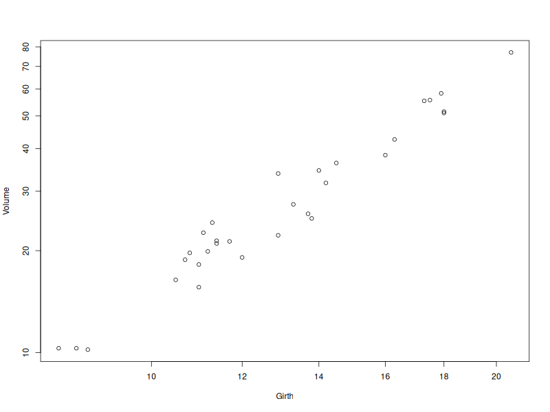
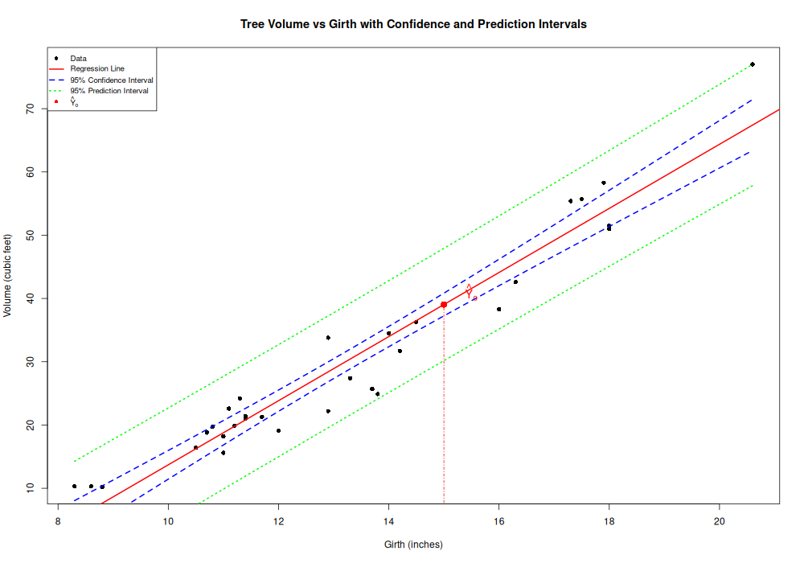

# Estimation of β

::: {style="display:none"}
$\newcommand{\VS}{\quad \mathrm{VS} \quad}$
$\newcommand{\and}{\quad \mathrm{and} \quad}$
$\newcommand{\E}{\mathbb E}$
$\newcommand{\P}{\mathbb P}$
$\newcommand{\Var}{\mathbb V}$
$\newcommand{\1}{\mathbf 1}$
:::


## Ordinary Least Square Estimator (OLS)

. . .

We observe $Y \in \mathbb R^{n\times 1}$ and $X \in \mathbb R^{n \times p}$.

. . .

What is the best [estimator $\hat \beta$]{style="background-color: yellow;"} of $\beta$ such that
[$Y = X\beta + \varepsilon$]{style="background-color: yellow;"}?

. . .

Ordinary Least Square (OLS) Estimator:

$\newcommand{\argmin}{\mathrm{argmin}}$

::: {.square-def}
$\hat \beta = \argmin_{\beta'}\|Y-X\beta'\|^2$
:::

Here, $\|Y-X\beta'\|^2 = \sum_{i=1}^n(Y_i-\beta'_1X_{i}^{(1)}- \dots - \beta'_pX_i^{(p)})^2$

## Formula for β̂

. . .

If $\mathrm{rk}(X) = p$, it holds that 

::: {.square-def}
$$\hat \beta = (X^TX)^{-1}X^TY$$
:::

. . .

[proof](../lectures/estimation.qmd#estimation)


## Polynomial regression is still linear {.smaller}

::: {style="font-size:86%"}
A degree-$m$ polynomial fit *is* a linear model: from one variable $x$, build columns $1,x,\dots,x^m$ — the design matrix $X=[\,\mathbf 1\mid x\mid\cdots\mid x^m\,]$, then run OLS. Data come from a degree-$d$ truth (blue); pick the fit degree $m$ (red). **Drag the blue curve** to reshape the truth (degree stays $d$).
:::

```{=html}
<style>
.lm-btn{font-family:inherit;font-size:.85em;padding:.4em 1.1em;margin:.12em .22em;border:1px solid #bbb;border-radius:8px;background:#f4f4f4;color:#333;cursor:pointer}
.lm-row{font-size:.72em;line-height:2.2;margin:.12rem 0}
.lm-wrap{text-align:center}
.lm-sw{display:inline-block;width:11px;height:11px;border-radius:2px;vertical-align:middle}
</style>
<div class="lm-wrap">
  <canvas id="pgCanvas" width="600" height="312" style="background:#fff;border:1px solid #ddd;border-radius:8px;max-width:100%;touch-action:none;cursor:grab"></canvas>
  <div class="lm-row">
    true deg d <input id="pgD" type="range" autocomplete="off" min="1" max="6" step="1" value="3" style="vertical-align:middle;width:85px"> <b id="pgDv">3</b> ·
    fit deg m <input id="pgM" type="range" autocomplete="off" min="0" max="15" step="1" value="3" style="vertical-align:middle;width:105px"> <b id="pgMv">3</b> ·
    points N <input id="pgN" type="range" autocomplete="off" min="5" max="80" step="1" value="24" style="vertical-align:middle;width:105px"> <b id="pgNv">24</b> ·
    noise <input id="pgNz" type="range" autocomplete="off" min="0" max="0.5" step="0.01" value="0.12" style="vertical-align:middle;width:80px"> <b id="pgNzv">0.12</b> &nbsp; <button class="lm-btn" id="pgNew">↻ resample</button>
  </div>
  <div class="lm-row"><span class="lm-sw" style="background:#5b8cff"></span> true (deg d, drag me) &nbsp; <span class="lm-sw" style="background:#e74c3c"></span> fit (deg m) &nbsp;·&nbsp; X is <b id="pgCols">–</b>×<b id="pgCol2">–</b> &nbsp;·&nbsp; R²=<b id="pgR2">–</b> &nbsp;·&nbsp; <b id="pgMsg">–</b></div>
</div>
<script>
(function () {
  var cv = document.getElementById('pgCanvas'); if (!cv || cv.dataset.init) return; cv.dataset.init = 1;
  var c = cv.getContext('2d'), W = cv.width, H = cv.height, MAXN = 80, B = [], M = [], Xp = [], Zp = [];
  var dEl = document.getElementById('pgD'), mEl = document.getElementById('pgM'), nEl = document.getElementById('pgN'), nzEl = document.getElementById('pgNz');
  var XL = -1.12, XH = 1.12, YL = -1.6, YH = 1.6, drag = false, gx = 0, gw = [], gden = 1;
  function gauss() { var u = 0, v = 0; while (!u) u = Math.random(); while (!v) v = Math.random(); return Math.sqrt(-2 * Math.log(u)) * Math.cos(2 * Math.PI * v); }
  function vdc(n) { var rev = 0, den = 1; while (n > 0) { den *= 2; rev += (n % 2) / den; n = Math.floor(n / 2); } return rev; }   // van der Corput → nested, well-spread x
  function evalp(co, x) { var s = 0; for (var k = co.length - 1; k >= 0; k--) s = s * x + co[k]; return s; }
  function basis(x, deg) { var b = []; for (var k = 0; k <= deg; k++) b.push(Math.pow(x, k)); return b; }
  function dot(a, b) { var s = 0; for (var i = 0; i < a.length; i++) s += a[i] * b[i]; return s; }
  function solve(Mx, b) { var n = b.length, a = Mx.map(function (r) { return r.slice(); }), bb = b.slice(), i, r, k; for (i = 0; i < n; i++) { var pv = i; for (r = i + 1; r < n; r++) if (Math.abs(a[r][i]) > Math.abs(a[pv][i])) pv = r; var t = a[i]; a[i] = a[pv]; a[pv] = t; var tb = bb[i]; bb[i] = bb[pv]; bb[pv] = tb; for (r = i + 1; r < n; r++) { var f = a[r][i] / (a[i][i] || 1e-12); for (k = i; k < n; k++) a[r][k] -= f * a[i][k]; bb[r] -= f * bb[i]; } } var x = new Array(n).fill(0); for (i = n - 1; i >= 0; i--) { var s = bb[i]; for (k = i + 1; k < n; k++) s -= a[i][k] * x[k]; x[i] = s / (a[i][i] || 1e-12); } return x; }
  function gram(d) { var G = [], j, k; for (j = 0; j <= d; j++) { G.push([]); for (k = 0; k <= d; k++) G[j].push((j + k) % 2 === 0 ? 2 / (j + k + 1) : 0); } for (j = 0; j <= d; j++) G[j][j] += 1e-9; return G; }
  function genB(d) { var raw = [], k; for (k = 0; k <= d; k++) raw.push(gauss() * Math.pow(0.65, k)); var mx = 1e-9; for (var i = 0; i <= 40; i++) { var v = Math.abs(evalp(raw, -1 + 2 * i / 40)); if (v > mx) mx = v; } var sc = 0.85 / mx; return raw.map(function (a) { return a * sc; }); }
  function rebuild() { var d = +dEl.value; B = genB(d); M = gram(d); }
  function regen() { Xp = []; Zp = []; for (var i = 0; i < MAXN; i++) { Xp.push(-1 + 2 * vdc(i)); Zp.push(gauss()); } rebuild(); }   // Xp nested (vdc); only Zp/B change on resample
  function fit(Y, m) { var p = m + 1, n = Y.length, Mf = [], v = [], i, r, k; for (r = 0; r < p; r++) { Mf.push(new Array(p).fill(0)); v.push(0); } for (i = 0; i < n; i++) { var pw = basis(Xp[i], m); for (r = 0; r < p; r++) { for (k = 0; k < p; k++) Mf[r][k] += pw[r] * pw[k]; v[r] += pw[r] * Y[i]; } } for (r = 0; r < p; r++) Mf[r][r] += 1e-6; return solve(Mf, v); }
  function PX(x) { return 16 + (x - XL) / (XH - XL) * (W - 28); } function PY(y) { return H - 16 - (y - YL) / (YH - YL) * (H - 28); }
  function IX(px) { return XL + (px - 16) / (W - 28) * (XH - XL); } function IY(py) { return YL + (H - 16 - py) / (H - 28) * (YH - YL); }
  function pos(e) { var r = cv.getBoundingClientRect(); return [(e.clientX - r.left) * W / r.width, (e.clientY - r.top) * H / r.height]; }
  function draw() {
    var d = +dEl.value, m = +mEl.value, n = +nEl.value, nz = +nzEl.value, i;
    document.getElementById('pgDv').textContent = d; document.getElementById('pgMv').textContent = m; document.getElementById('pgNv').textContent = n; document.getElementById('pgNzv').textContent = nz.toFixed(2);
    var Y = []; for (i = 0; i < n; i++) Y.push(evalp(B, Xp[i]) + nz * Zp[i]);
    var beta = fit(Y, m);
    c.clearRect(0, 0, W, H);
    c.strokeStyle = '#eee'; c.beginPath(); c.moveTo(PX(XL), PY(0)); c.lineTo(PX(XH), PY(0)); c.stroke();
    c.save(); c.beginPath(); c.rect(0, 0, W, H); c.clip();
    c.strokeStyle = '#5b8cff'; c.lineWidth = 3; c.beginPath(); for (i = 0; i <= 220; i++) { var x = XL + (XH - XL) * i / 220; i ? c.lineTo(PX(x), PY(evalp(B, x))) : c.moveTo(PX(x), PY(evalp(B, x))); } c.stroke();
    c.strokeStyle = '#e74c3c'; c.lineWidth = 2.5; c.beginPath(); for (i = 0; i <= 220; i++) { var xx = XL + (XH - XL) * i / 220; i ? c.lineTo(PX(xx), PY(evalp(beta, xx))) : c.moveTo(PX(xx), PY(evalp(beta, xx))); } c.stroke();
    c.fillStyle = '#2c3e50'; for (i = 0; i < n; i++) { c.beginPath(); c.arc(PX(Xp[i]), PY(Y[i]), 3, 0, 6.2832); c.fill(); }
    c.restore();
    var my = 0; Y.forEach(function (y) { my += y; }); my /= n; var ssr = 0, sst = 0;
    Y.forEach(function (y, i) { var yh = evalp(beta, Xp[i]); ssr += (y - yh) * (y - yh); sst += (y - my) * (y - my); });
    document.getElementById('pgCols').textContent = n; document.getElementById('pgCol2').textContent = (m + 1); document.getElementById('pgR2').textContent = (sst ? 1 - ssr / sst : 1).toFixed(3);
    document.getElementById('pgMsg').innerHTML = m < d ? '<span style="color:#b06a00">underfit (m &lt; d)</span>' : (m > d + 1 ? '<span style="color:#e74c3c">overfit — chasing noise</span>' : '<span style="color:#1b7a3a">good fit</span>');
  }
  cv.addEventListener('pointerdown', function (e) { var p = pos(e), xg = IX(p[0]); if (xg < XL || xg > XH) return; if (Math.abs(PY(evalp(B, xg)) - p[1]) < 16) { drag = true; gx = xg; var b = basis(gx, B.length - 1); gw = solve(M, b); gden = dot(b, gw) || 1e-9; cv.style.cursor = 'grabbing'; } });
  window.addEventListener('pointermove', function (e) { if (!drag) return; var p = pos(e), yt = IY(p[1]), delta = yt - evalp(B, gx); for (var k = 0; k < B.length; k++) B[k] += delta * gw[k] / gden; draw(); e.preventDefault(); });
  window.addEventListener('pointerup', function () { drag = false; cv.style.cursor = 'grab'; });
  [mEl, nEl, nzEl].forEach(function (el) { el.addEventListener('input', draw); });    // m / N / noise keep the truth and the (nested) sample
  dEl.addEventListener('input', function () { rebuild(); draw(); });
  document.getElementById('pgNew').addEventListener('click', function () { regen(); draw(); });
  regen(); draw();
})();
</script>
```

## Least squares as an L2 projection 

. . .

Let $[X]$ be the subspace of $\mathbb R^n$ [generated by columns of $X$]{style="background-color: yellow;"}:

:::{style="font-size: 80%;"}
::: {.square-def}
$[X]=\mathrm{Im}(X)=\mathrm{Span}(X^{(1)},\dots, X^{(p)})=\{X\alpha, \alpha \in \mathbb R^p\}$

:::
:::


. . .

Then,

::: {.square-def}
$X\hat \beta = X(X^TX)^{-1}X^TY$ 
:::


is [the projection of $Y$]{style="background-color: yellow;"} on $[X]$


## The projection matrix P[X]

. . .

::: {.square-def}

$$P_{[X]} = X(X^TX)^{-1}X^T \and \widehat{Y} = P_{[X]}Y = X\hat \beta$$
:::


. . .

Check that [$P_{[X]}$ is the orthogonal projector on $[X]$ ]{style="background-color: yellow;"}

. . .

That is $P_{[X]}^2 = P_{[X]}$, $P_{[X]}=P_{[X]}^T$ and $\mathrm{Im} (P_{[X]}) = [X]$


## Pythagorean Decomposition of Y

. . .

We can decompose

::: {.square-def}
$$Y = \underbrace{P_{[X]}Y}_{\widehat Y} + \underbrace{(I-P_{[X]})Y}_{"residuals"}$$
:::

. . .

Notice that $I-P_{[X]}= P_{[X]^{\perp}}$ is the orthogonal projection on $[X]^{\perp} = \{\alpha\in \mathbb R^n:~ X^T\alpha =0\}$


## Projection: Y=Ŷ+ε̂ {.smaller}

::: {style="font-size:86%"}
Least squares projects $Y$ **orthogonally** onto the column space $[X]$: $\hat Y=P_{[X]}Y$, and the residual $\hat\varepsilon=Y-\hat Y\perp[X]$. Hence Pythagoras $\lVert Y\rVert^2=\lVert\hat Y\rVert^2+\lVert\hat\varepsilon\rVert^2$. **Drag to rotate**; slide the residual.
:::

```{=html}
<style>
.lm-btn{font-family:inherit;font-size:.85em;padding:.4em 1.1em;margin:.12em .22em;border:1px solid #bbb;border-radius:8px;background:#f4f4f4;color:#333;cursor:pointer}
.lm-row{font-size:.72em;line-height:2.2;margin:.12rem 0}
.lm-wrap{text-align:center}
</style>
<div class="lm-wrap">
  <canvas id="prCanvas" width="560" height="320" style="background:#fff;border:1px solid #ddd;border-radius:8px;max-width:100%;touch-action:none;cursor:grab"></canvas>
  <div class="lm-row">residual ‖ε̂‖ <input id="prR" type="range" autocomplete="off" min="0" max="1.6" step="0.02" value="1" style="vertical-align:middle;width:170px"> <b id="prRv">1.00</b> &nbsp; <button class="lm-btn" id="prNew">↻ new Y</button></div>
  <div class="lm-row" id="prPyth">–</div>
</div>
<script>
(function () {
  var cv = document.getElementById('prCanvas'); if (!cv || cv.dataset.init) return; cv.dataset.init = 1;
  var c = cv.getContext('2d'), W = cv.width, H = cv.height, SC = 82, R = 1.5, az = 0.7, el = 0.5, drag = false, lx = 0, ly = 0;
  var rEl = document.getElementById('prR'), a = 0.8, b = -0.6, baseH = 1;
  function dot(p, q) { return p[0] * q[0] + p[1] * q[1] + p[2] * q[2]; }
  function add(p, q) { return [p[0] + q[0], p[1] + q[1], p[2] + q[2]]; } function sub(p, q) { return [p[0] - q[0], p[1] - q[1], p[2] - q[2]]; }
  function scl(p, s) { return [p[0] * s, p[1] * s, p[2] * s]; } function cross(p, q) { return [p[1] * q[2] - p[2] * q[1], p[2] * q[0] - p[0] * q[2], p[0] * q[1] - p[1] * q[0]]; }
  function unit(p) { var n = Math.sqrt(dot(p, p)) || 1; return scl(p, 1 / n); }
  var u1 = unit([1, 0.2, 0.6]), u2 = unit(sub([0.1, 1, -0.4], scl(unit([1, 0.2, 0.6]), dot([0.1, 1, -0.4], unit([1, 0.2, 0.6]))))), nv = unit(cross(u1, u2));
  function gauss() { var u = 0, v = 0; while (!u) u = Math.random(); while (!v) v = Math.random(); return Math.sqrt(-2 * Math.log(u)) * Math.cos(2 * Math.PI * v); }
  function proj(v) { var gx = v[0] * Math.cos(az) - v[1] * Math.sin(az), gy = v[0] * Math.sin(az) + v[1] * Math.cos(az), up = v[2] * Math.cos(el) + gy * Math.sin(el); return [W / 2 + gx * SC, H / 2 + 8 - up * SC]; }
  function arrow(p, q, col, w) { var P = proj(p), Q = proj(q); c.strokeStyle = col; c.fillStyle = col; c.lineWidth = w; c.beginPath(); c.moveTo(P[0], P[1]); c.lineTo(Q[0], Q[1]); c.stroke(); var an = Math.atan2(Q[1] - P[1], Q[0] - P[0]), s = 9; c.beginPath(); c.moveTo(Q[0], Q[1]); c.lineTo(Q[0] - s * Math.cos(an - 0.42), Q[1] - s * Math.sin(an - 0.42)); c.lineTo(Q[0] - s * Math.cos(an + 0.42), Q[1] - s * Math.sin(an + 0.42)); c.closePath(); c.fill(); }
  function draw() {
    var h = baseH * (+rEl.value); document.getElementById('prRv').textContent = (+rEl.value).toFixed(2);
    var O = [0, 0, 0], Yh = add(scl(u1, a), scl(u2, b)), Y = add(Yh, scl(nv, h));
    c.clearRect(0, 0, W, H);
    c.strokeStyle = 'rgba(91,140,255,0.5)'; c.lineWidth = 1; var ng = 6, gi, gj;   // plane [X]
    for (gi = 0; gi <= ng; gi++) {
      c.beginPath(); for (gj = 0; gj <= ng; gj++) { var p = add(scl(u1, -R + 2 * R * gi / ng), scl(u2, -R + 2 * R * gj / ng)), P = proj(p); gj ? c.lineTo(P[0], P[1]) : c.moveTo(P[0], P[1]); } c.stroke();
      c.beginPath(); for (gj = 0; gj <= ng; gj++) { var p2 = add(scl(u2, -R + 2 * R * gi / ng), scl(u1, -R + 2 * R * gj / ng)), P2 = proj(p2); gj ? c.lineTo(P2[0], P2[1]) : c.moveTo(P2[0], P2[1]); } c.stroke();
    }
    c.fillStyle = '#888'; c.font = '13px sans-serif'; c.textAlign = 'left'; var lp = proj(add(scl(u1, R), scl(u2, R * 0.2))); c.fillText('[X]', lp[0] + 4, lp[1]);
    // right-angle marker at Yhat (between residual and plane)
    var sg = h >= 0 ? 1 : -1, d2 = 0.17, c0 = Yh, c1 = add(Yh, scl(nv, sg * d2)), c2 = add(c1, scl(u1, d2)), c3 = add(Yh, scl(u1, d2));
    c.strokeStyle = 'rgba(0,0,0,0.45)'; c.lineWidth = 1; var pa = proj(c0), pb = proj(c1), pc = proj(c2), pd = proj(c3); c.beginPath(); c.moveTo(pa[0], pa[1]); c.lineTo(pb[0], pb[1]); c.lineTo(pc[0], pc[1]); c.lineTo(pd[0], pd[1]); c.closePath(); c.stroke();
    arrow(O, Yh, '#27ae60', 2.5);                 // Yhat (green, in plane)
    arrow(Yh, Y, '#e74c3c', 2.5);                 // residual (red, perpendicular)
    arrow(O, Y, '#2c3e50', 2.5);                  // Y (dark)
    c.fillStyle = '#fff'; c.beginPath(); var pO = proj(O); c.arc(pO[0], pO[1], 3, 0, 6.2832); c.fill(); c.strokeStyle = '#333'; c.lineWidth = 1; c.stroke();
    var pY = proj(Y), pYh = proj(Yh), pM = proj(add(Yh, scl(nv, h / 2)));
    c.fillStyle = '#2c3e50'; c.font = '14px sans-serif'; c.fillText('Y', pY[0] + 6, pY[1] - 4);
    c.fillStyle = '#1e8449'; c.fillText('Ŷ', pYh[0] + 6, pYh[1] + 12);
    c.fillStyle = '#c0392b'; c.fillText('Y − Ŷ', pM[0] + 7, pM[1]);
    var nY2 = a * a + b * b + h * h, nYh2 = a * a + b * b, ne2 = h * h;
    document.getElementById('prPyth').innerHTML = '‖Y‖² = <b>' + nY2.toFixed(2) + '</b> &nbsp;=&nbsp; ‖Ŷ‖² <b>' + nYh2.toFixed(2) + '</b> + ‖ε̂‖² <b>' + ne2.toFixed(2) + '</b>';
  }
  function newY() { a = gauss() * 0.85; b = gauss() * 0.85; baseH = (0.6 + Math.random() * 0.5) * (Math.random() < 0.5 ? 1 : -1); }
  cv.addEventListener('pointerdown', function (e) { drag = true; lx = e.clientX; ly = e.clientY; cv.style.cursor = 'grabbing'; });
  window.addEventListener('pointermove', function (e) { if (!drag) return; az -= (e.clientX - lx) * 0.01; el = Math.max(0.12, Math.min(1.45, el + (e.clientY - ly) * 0.008)); lx = e.clientX; ly = e.clientY; draw(); });
  window.addEventListener('pointerup', function () { drag = false; cv.style.cursor = 'grab'; });
  rEl.addEventListener('input', draw);
  document.getElementById('prNew').addEventListener('click', function () { newY(); draw(); });
  newY(); draw();
})();
</script>
```

## Properties on β̂

. . .

::: {.callout-note}
## Expectation and variance
Assume that $\mathrm{rk}(X)=p$, $\mathbb E[\varepsilon] = 0$ and $\mathbb V(\varepsilon) = \sigma^2I_n$. Then,

- $\hat \beta = (X^TX)^{-1}X^T Y$ is a [linear estimator]{style="background-color: yellow;"}
- $\mathbb E[\hat \beta] = \beta$ [unbiased estimator]{style="background-color: yellow;"}
- $\mathbb V(\hat \beta) = \sigma^2(X^TX)^{-1}$
:::

. . .

[Proof](../lectures/estimation.qmd)

## Gauss-Markov Theorem

. . .

::: {.callout-note}
## Gauss-Markov Theorem

Under the same assumptions, if $\tilde \beta$ is another [linear and unbiased estimator]{style="background-color: yellow;"} then $$\mathbb V(\hat \beta) \preceq \mathbb V(\tilde \beta),$$

where $A\preceq B$  means that $B-A$ is a symmetric positive semidefinite matrix

:::

. . .

[Proof](../lectures/estimation.qmd)


# Estimation of σ²

## Residuals

. . .

We define the [residuals $\hat \varepsilon$]{style="background-color: yellow;"} as

::: {.square-def}
$$
\hat \varepsilon = Y- \hat Y = Y-X\hat \beta
$$
:::

. . .

It can be computed from the data. 

. . .


It is the [orthogonal projection of $Y$ on $[X]^{\perp}$]{style="background-color: yellow;"}:

. . .

::: {.square-def}
$$Y = \underbrace{P_{[X]}Y}_{\widehat Y} + \underbrace{(I-P_{[X]})Y}_{\hat \varepsilon="residuals"}$$
:::


## Residuals: model vs estimation

. . .

::: {.square-def}
$$
\begin{aligned}
Y &= X\beta + \varepsilon & \quad \text{(model)} \\
Y &= \widehat Y + \hat \varepsilon & \quad \text{(estimation)}
\end{aligned}
$$
:::

## Properties on residuals

. . .

::: {.callout-note}
## Expectation and Variance of ε̂

If $\mathrm{rk}(X)=p$, $\mathbb E[\varepsilon] = 0$ and $\mathbb V(\varepsilon)=\sigma^2I_n$, then

- $\mathbb E[\hat\varepsilon]=0$
- $\mathbb V(\hat \varepsilon) = \sigma^2P_{[X]^\perp} = \sigma^2(I_n - X(X^TX)^{-1}X^T)$
:::

. . .

Remark: [if a constant vector is in $[X]$]{style="background-color: yellow;"}, e.g. $\forall i,X_i^{(1)}=1$, then $\hat \varepsilon \perp \mathbf 1$ and

$$ 
\overline{\hat\varepsilon} = \frac{1}{n}\sum_{i=1}^n \hat\varepsilon_i = 0 \and \overline{\widehat Y} = \overline Y
$$


## Estimation of σ²

. . .

Recall that in the model $Y=X\beta + \varepsilon$, [both $\beta$ and $\sigma^2=\mathbb E[\varepsilon_i^2]$ are unknown]{style="background-color: yellow;"} ($p+1$ parameters)

. . .


::: {.square-def}
$$
\hat\varepsilon = Y- \hat Y = P_{[X]^\perp}\varepsilon \and dim([X]^{\perp}) = n-p
$$
:::

. . .


We estimate $\sigma^2$ with 

::: {.square-def}
$$\hat \sigma^2 = \frac{1}{n-p}\sum_{i=1}^n \hat \varepsilon_i^2$$
:::


## Properties of σ̂²

. . .


::: {.callout-note}
## Proposition
If $\mathrm{rk}(X)=p$, $\E[\varepsilon]=0$ and $\Var(\varepsilon)= \sigma^2I_n$, then

$$\hat \sigma^2 = \frac{1}{n-p}\sum_{i=1}^n \hat \varepsilon_i^2=\frac{\mathrm{SSR}}{n-p}$$

is an [unbiased]{style="background-color: yellow;"} estimator of $\sigma^2$. If moreover the $\varepsilon_i$'s are iid, then $\hat \sigma^2$ is a [consistent]{style="background-color: yellow;"} estimator. [Proof](../lectures/estimation.qmd#variance-1)

:::

- [unbiased]{style="background-color: yellow;"}: $\E[\hat \sigma^2]= \sigma^2$
- [consistent]{style="background-color: yellow;"}: $\hat \sigma^2 \to \sigma^2$ in $L^2$ as $n\to +\infty$
- SSR: Sum of squared residuals


# The Gaussian Model

## Gaussian Model

. . .

[Until then]{style="background-color: yellow;"}, we assumed that $Y=X\beta+\varepsilon$, where $\E[\varepsilon]=0$ and $\Var(\varepsilon)= \sigma^2I_n$.

. . .

The $\varepsilon_i$ are [uncorrelated but]{style="background-color: yellow;"} there can be [dependency]{style="background-color: yellow;"}

. . .

[No assumption was made on the distribution]{style="background-color: yellow;"} of $\varepsilon$ 

. . .


**Now** (Gaussian Model):

::: {.square-def}
$$\varepsilon \sim \mathcal N(0, \sigma^2I_n) \quad \text{i.e.} \quad Y \sim \mathcal N(X\beta, \sigma^2I_n)$$
:::


. . .

Equivalently we assume that the [$\varepsilon_i$'s are iid $\mathcal N(0, \sigma^2)$]{style="background-color: yellow;"}.

. . .

In this simpler model, we can do maximum likelihood estimation (MLE)!

## Maximum Likelihood Estimation


. . .

::: {.callout-note}
## MLE
Let $\hat \beta_{MLE}$ and $\hat \sigma_{MLE}^2$ be the MLE of $\beta$ and $\sigma^2$, respectively.


- $\hat{\beta}_{MLE} = \hat{\beta}$ and $\hat{\sigma}^2_{MLE} = \frac{SSR}{n} = \frac{n-p}{n} \hat{\sigma}^2$.

- $\hat{\beta} \sim N(\beta, \sigma^2(X^TX)^{-1})$.

- $\frac{n-p}{\sigma^2} \hat{\sigma}^2 = \frac{n}{\sigma^2} \hat{\sigma}^2_{MLE} \sim \chi^2(n - p)$.

- $\hat{\beta}$ and $\hat{\sigma}^2$ are independent


:::

. . .

[Proof](../lectures/estimation.qmd#proof-mle)

## Efficient Estimator

. . .

::: {.callout-note}
## Theorem
In the Gaussian Model, $\hat \beta$ is an [efficient]{style="background-color: yellow;"} estimator of $\beta$. This means that 
$$
\Var(\hat \beta) \preceq \Var(\tilde \beta)\; ,
$$
for [any unbiased]{style="background-color: yellow;"} estimator $\tilde \beta$. See [Proof](../lectures/estimation.qmd#efficient-beta)

:::

- This is stronger than Gauss-Markov
- Better than [any unbiased $\tilde \beta$]{style="background-color: yellow;"}, not only [linear $\tilde  \beta$]{style="background-color: yellow;"}. $\hat \beta$ is "BUE" (Best Unbiased Estimator)
- If [$n$ is large]{style="background-color: yellow;"}, most of the result in Gaussian case remains valid.


# Tests and Confidence Intervals

## Pivotal Distribution in Gaussian Case

. . .

Recall that $\hat \sigma^2 = \frac{1}{n-p}\|\hat \varepsilon\|^2$ and $\hat \beta \sim \mathcal N(\beta, \sigma^2(X^TX)^{-1})$

. . .

::: {.callout-note}
## Property

In the Gaussian model,

$$ \frac{\hat \beta_j - \beta_j}{\hat \sigma \sqrt{(X^T X)^{-1}_{jj}}} \sim \mathcal T(n-p) $$

(Student Distribution of degree $n-p$, $(X^TX)^{-1}_{jj}$  is the $j^{th}$ element of the matrix $(X^TX)^{-1}$)

:::

. . .

:::{style="font-size: 80%;"}
$\mathbb V(\hat{\beta}) = \sigma^2 (X^T X)^{-1}$ implies that $\mathbb V(\hat{\beta}_j) = \sigma^2 (X^T X)^{-1}_{jj}$. 
$\hat{\sigma}^2_{\hat{\beta}_j}:=\hat\sigma^2 (X^T X)^{-1}_{jj}$ is an estimator of $\mathbb V(\hat{\beta}_j)$

:::

## Student significance test

. . .

We observe $Y = X\beta+\varepsilon$, where $\beta \in \mathbb R^p$ is unknown.

. . .

We want to test whether the $j^{th}$ feature $X^{(j)}$ is significant in the LM, that is:

::: {.square-def}

$H_0: \beta_j =0 \VS H_1: \beta_j \neq 0$.
:::

We use the test statistic 

:::{style="font-size: 90%;"}
::: {.square-def}
$$\psi_j(X,Y)= \frac{\hat \beta_j}{\hat \sigma_{\hat \beta_j}} = \frac{\hat \beta_j}{\hat \sigma \sqrt{(X^T X)^{-1}_{jj}}} \sim \mathcal T(n-p) ~~\text{(under $H_0$)}$$
:::
:::

## Student test: rejection rule


. . .

:::{style="font-size: 90%;"}
::: {.square-def}
$$\psi_j(X,Y)= \frac{\hat \beta_j}{\hat \sigma_{\hat \beta_j}} = \frac{\hat \beta_j}{\hat \sigma \sqrt{(X^T X)^{-1}_{jj}}} \sim \mathcal T(n-p) ~~\text{(under $H_0$)}$$
:::
:::

. . .

We [reject if $|\psi(X,Y)| \geq t_{1-\alpha/2}$]{style="background-color: yellow;"}, where $t_{\alpha}$ is the $\alpha$-quantile of $\mathcal T(n-p)$.

. . .


## P-value of Student Test

. . .

::: {.square-def}

$$p_{value}=2\min\left(F\left(\frac{\hat \beta_j}{\hat \sigma_{\hat \beta_j}}\right), 1-F\left(\frac{\hat \beta_j}{\hat \sigma_{\hat \beta_j}}\right)\right)$$

:::


where [$F$ is the cdf]{style="background-color: yellow;"} of $\mathcal T(n-p)$.

. . .

If we cannot reject $\beta_j=0$, we may remove $X^{(j)}$ from the model.

## Confidence Interval

. . .

Confidence interval with proba $1-\alpha$ around $\beta_j$:

::: {.square-def}
$$CI_{1-\alpha} = [\hat \beta_j \pm t\hat \sigma_{\hat \beta_j}]$$
:::

- Here, $t$ is the $1-\alpha/2$ quantile of $\mathcal T(n-p)$
- Recall that $\hat \sigma_{\hat \beta_j} = \hat \sigma \sqrt{(X^T X)^{-1}_{jj}}$

. . .

We check that 

$$ 
\P(\beta_j \in CI_{1-\alpha}) = 1- \alpha
$$

## Remarks

- This is what is computed on $R$
- This is valid in Gaussian case, but is [also true when $n$ is large for other distributions]{style="background-color: yellow;"} 

# Prediction 

## Prediction Setting

. . .

Consider the LM [$Y = X\beta + \varepsilon$]{style="background-color: yellow;"}.

. . .

From previous slides, we estimate $(\beta, \sigma)$ with $(\hat \beta, \hat \sigma)$ from observations $Y$ and [matrix]{style="background-color: lightblue;"} $X=(X^{(1)}, \dots, X^{(p)})$.

. . .

We observe a [new individual $o$]{style="background-color: yellow;"}, with [unknown $Y_o$]{style="background-color: yellow;"} and [vector]{style="background-color: lightblue;"} $X_o=X_{o,\cdot}=(X^{(1)}_o, \dots, X^{(p)}_o)$, and [independent noise $\varepsilon_o$]{style="background-color: yellow;"}.

. . .

with this definition, [$X_o$ is a row vector]{style="background-color: yellow;"} and

::: {.square-def}
$$Y_o = X_{o}\beta + \varepsilon_o = \beta_1X^{(1)}_o + \dots + \beta_p X^{(p)}_o+\varepsilon_o$$
:::

Here, $\mathbb E[\varepsilon_o] = 0$ and $\mathbb V(\varepsilon_o)=\sigma^2$

## Prediction

. . .

We want predict $Y_o$ (unknown) from $X_o$ (known). Natural predictor:

::: {.square-def}
$\hat Y_o = X_o \hat \beta$
:::

. . .

Prediction error $Y_o - \hat Y_o$ decomposes in [two terms]{style="background-color: yellow;"}: 

::: {.square-def}
$$Y_o - \hat Y_o = \underbrace{X_o(\beta - \hat \beta)}_{\text{Estimation error}} + \underbrace{\varepsilon_o}_{\text{Random error}}$$
:::

---

##  Error Decomposition

. . .

:::{style="font-size: 90%;"}
::: {.square-def}
$$Y_o - \hat Y_o = \underbrace{X_o(\beta - \hat \beta)}_{\text{Estimation error}} + \underbrace{\varepsilon_o}_{\text{Random error}}$$
:::
:::


. . .

$\E(Y_o - \hat Y_o)$: prediction error is [$0$ on average]{style="background-color: yellow;"}

. . .

$$\begin{aligned}
\Var(Y_o - \hat Y_o) &= \color{blue}{ \Var(X_o(\beta - \hat \beta))} + \color{red}{\Var(\varepsilon_o)} \\
&=\color{blue}{\sigma^2X_o(X^TX)^{-1}X_o^T} + \color{red}{\sigma^2} \\
\end{aligned}$$

. . .

$\color{blue}{\Var(X_o(\beta - \hat \beta))\to 0}$ when $n \to +\infty$ but $\color{red}{\Var(\varepsilon_o) =\sigma^2}$

. . .

Estimation error is [negligible]{style="color: blue;"} when $n \to +\infty$ but random error is [incompressible]{style="color: red;"}.

## Prediction interval

. . .

In the Gaussian model, $Y_o - \hat Y_o \sim \mathcal N(0,  \sigma^2X_o(X^TX)^{-1}X_o^T+\sigma^2)$.

. . .

Since $\hat \sigma$ is   indep of $\hat Y_o$ (check this with projections!),

:::{style="font-size: 100%;"}
::: {.square-def}
$$\frac{Y_o - \hat Y_o}{\hat \sigma\sqrt{X_o(X^TX)^{-1}X_o^T+1}} \sim \mathcal T(n-p)$$
:::
:::

## Prediction interval (formula)

. . .

We deduce the [prediction interval ]{style="background-color: yellow;"}

:::{style="font-size: 90%;"}
::: {.square-def}
$PI_{1-\alpha}(Y_o)=\left[\hat Y_o \pm t\sqrt{\color{blue}{\hat \sigma^2X_o(X^TX)^{-1}X_o^T} + \color{red}{\hat \sigma^2}}\right]$
:::
:::

where $t$ is the $1-\alpha/2$ quantile of $\mathcal T(n-p)$.

. . .

We have $\P(Y_o \in PI_{1-\alpha})= 1-\alpha$


. . .

If we only want to estimate $\mathbb E[Y_o]=X_o \beta$, (point on the hyperplane), we get the [confidence interval]{style="background-color: yellow;"}

:::{style="font-size: 90%;"}
::: {.square-def}
$CI_{1-\alpha}(X_o\beta)=\left[\hat Y_o \pm \sqrt{\color{blue}{\hat \sigma^2X_o(X^TX)^{-1}X_o^T}}\right]$
:::
:::


## Confidence band vs prediction band {.smaller}

::: {style="font-size:86%"}
For a query $x_o$: the **confidence** band covers the mean $\mathbb E[Y_o]=X_o\beta$ (width $\propto\hat\sigma\sqrt{X_o(X^TX)^{-1}X_o^T}$); the **prediction** band covers a *new* $Y_o$ and is wider by the extra $\hat\sigma^2$ (the $+1$). Both flare away from $\bar x$.
:::

```{=html}
<style>
.lm-btn{font-family:inherit;font-size:.85em;padding:.4em 1.1em;margin:.12em .22em;border:1px solid #bbb;border-radius:8px;background:#f4f4f4;color:#333;cursor:pointer}
.lm-row{font-size:.72em;line-height:2.2;margin:.12rem 0}
.lm-wrap{text-align:center}
.lm-sw{display:inline-block;width:11px;height:11px;border-radius:2px;vertical-align:middle}
</style>
<div class="lm-wrap">
  <canvas id="ciCanvas" width="600" height="320" style="background:#fff;border:1px solid #ddd;border-radius:8px;max-width:100%"></canvas>
  <div class="lm-row">
    points N <input id="ciN" type="range" autocomplete="off" min="5" max="80" step="1" value="20" style="vertical-align:middle;width:110px"> <b id="ciNv">20</b> ·
    noise σ <input id="ciS" type="range" autocomplete="off" min="0.1" max="1.4" step="0.05" value="0.6" style="vertical-align:middle;width:105px"> <b id="ciSv">0.60</b> ·
    level 1−α <input id="ciL" type="range" autocomplete="off" min="0.8" max="0.99" step="0.01" value="0.95" style="vertical-align:middle;width:105px"> <b id="ciLv">0.95</b> &nbsp; <button class="lm-btn" id="ciNew">↻ resample</button>
  </div>
  <div class="lm-row"><span class="lm-sw" style="background:rgba(91,140,255,0.55)"></span> confidence (mean) &nbsp; <span class="lm-sw" style="background:rgba(231,76,60,0.22)"></span> prediction (new Y) &nbsp;·&nbsp; t=<b id="ciT">–</b> · σ̂=<b id="ciSh">–</b></div>
</div>
<script>
(function () {
  var cv = document.getElementById('ciCanvas'); if (!cv || cv.dataset.init) return; cv.dataset.init = 1;
  var c = cv.getContext('2d'), W = cv.width, H = cv.height, MAXN = 80, A0 = 0.3, A1 = 1.1, Xp = [], Zp = [];
  var nEl = document.getElementById('ciN'), sEl = document.getElementById('ciS'), lEl = document.getElementById('ciL');
  var XL = -2.3, XH = 2.3;
  function gauss() { var u = 0, v = 0; while (!u) u = Math.random(); while (!v) v = Math.random(); return Math.sqrt(-2 * Math.log(u)) * Math.cos(2 * Math.PI * v); }
  function vdc(n) { var rev = 0, den = 1; while (n > 0) { den *= 2; rev += (n % 2) / den; n = Math.floor(n / 2); } return rev; }
  function regen() { Xp = []; Zp = []; for (var i = 0; i < MAXN; i++) { Xp.push(-2 + 4 * vdc(i)); Zp.push(gauss()); } }   // nested x in [-2,2]
  function lgamma(z) { var g = [0.99999999999980993, 676.5203681218851, -1259.1392167224028, 771.32342877765313, -176.61502916214059, 12.507343278686905, -0.13857109526572012, 9.9843695780195716e-6, 1.5056327351493116e-7]; if (z < 0.5) return Math.log(Math.PI / Math.sin(Math.PI * z)) - lgamma(1 - z); z -= 1; var x = g[0]; for (var i = 1; i < 9; i++) x += g[i] / (z + i); var t = z + 7.5; return 0.5 * Math.log(2 * Math.PI) + (z + 0.5) * Math.log(t) - t + Math.log(x); }
  function tpdf(t, nu) { return Math.exp(lgamma((nu + 1) / 2) - lgamma(nu / 2) - 0.5 * Math.log(nu * Math.PI) - ((nu + 1) / 2) * Math.log(1 + t * t / nu)); }
  function tcdf(t, nu) { var n = 120, b = Math.abs(t), h = b / n, s = 0; for (var i = 0; i <= n; i++) { var x = i * h, w = (i === 0 || i === n) ? 1 : (i % 2 ? 4 : 2); s += w * tpdf(x, nu); } s *= h / 3; return t >= 0 ? 0.5 + s : 0.5 - s; }
  function tquant(p, nu) { var lo = 0, hi = 60; for (var i = 0; i < 50; i++) { var m = (lo + hi) / 2; if (tcdf(m, nu) < p) lo = m; else hi = m; } return (lo + hi) / 2; }
  function draw() {
    var n = +nEl.value, sg = +sEl.value, lev = +lEl.value, nu = Math.max(1, n - 2), i;
    document.getElementById('ciNv').textContent = n; document.getElementById('ciSv').textContent = sg.toFixed(2); document.getElementById('ciLv').textContent = lev.toFixed(2);
    var Y = [], xbar = 0; for (i = 0; i < n; i++) { Y.push(A0 + A1 * Xp[i] + sg * Zp[i]); xbar += Xp[i]; } xbar /= n;
    var Sxx = 0, Sxy = 0, ybar = 0; for (i = 0; i < n; i++) ybar += Y[i]; ybar /= n;
    for (i = 0; i < n; i++) { Sxx += (Xp[i] - xbar) * (Xp[i] - xbar); Sxy += (Xp[i] - xbar) * (Y[i] - ybar); }
    var b1 = Sxy / (Sxx || 1e-9), b0 = ybar - b1 * xbar;
    var ssr = 0; for (i = 0; i < n; i++) { var e = Y[i] - (b0 + b1 * Xp[i]); ssr += e * e; }
    var sig2 = ssr / nu, sig = Math.sqrt(sig2), t = tquant((1 + lev) / 2, nu);
    function line(x) { return b0 + b1 * x; }
    function seMean(x) { return sig * Math.sqrt(1 / n + (x - xbar) * (x - xbar) / (Sxx || 1e-9)); }
    function sePred(x) { return sig * Math.sqrt(1 + 1 / n + (x - xbar) * (x - xbar) / (Sxx || 1e-9)); }
    var YLv = 1e9, YHv = -1e9, gx; for (gx = 0; gx <= 30; gx++) { var x = XL + (XH - XL) * gx / 30, hi = line(x) + t * sePred(x), lo = line(x) - t * sePred(x); if (hi > YHv) YHv = hi; if (lo < YLv) YLv = lo; }
    var pad = (YHv - YLv) * 0.06; YLv -= pad; YHv += pad;
    function PX(x) { return 16 + (x - XL) / (XH - XL) * (W - 28); } function PY(y) { return H - 16 - (y - YLv) / (YHv - YLv) * (H - 28); }
    c.clearRect(0, 0, W, H);
    function band(se, style) { c.fillStyle = style; c.beginPath(); var np = 60, j; for (j = 0; j <= np; j++) { var x = XL + (XH - XL) * j / np; (j ? c.lineTo : c.moveTo).call(c, PX(x), PY(line(x) + t * se(x))); } for (j = np; j >= 0; j--) { var x2 = XL + (XH - XL) * j / np; c.lineTo(PX(x2), PY(line(x2) - t * se(x2))); } c.closePath(); c.fill(); }
    band(sePred, 'rgba(231,76,60,0.16)');   // prediction (wider)
    band(seMean, 'rgba(91,140,255,0.35)');  // confidence (narrower)
    c.strokeStyle = '#e74c3c'; c.lineWidth = 2.5; c.beginPath(); c.moveTo(PX(XL), PY(line(XL))); c.lineTo(PX(XH), PY(line(XH))); c.stroke();
    c.fillStyle = '#2c3e50'; for (i = 0; i < n; i++) { c.beginPath(); c.arc(PX(Xp[i]), PY(Y[i]), 3, 0, 6.2832); c.fill(); }
    document.getElementById('ciT').textContent = t.toFixed(2); document.getElementById('ciSh').textContent = sig.toFixed(2);
  }
  [nEl, sEl, lEl].forEach(function (el) { el.addEventListener('input', draw); });
  document.getElementById('ciNew').addEventListener('click', function () { regen(); draw(); });
  regen(); draw();
})();
</script>
```

## Example


For 31 trees, we record their volume and their girth.


::: {style="text-align: center;"}
{width="70%"}
:::

## Model

. . .

Volume = $\beta_1$ + $\beta_2$ Girth  + $\varepsilon$

```r
# In R
reg=lm(Volume ~ Girth, data=trees)
summary(reg)
```

```
Coefficients:
            Estimate Std. Error t value Pr(>|t|)    
(Intercept) -36.9435     3.3651  -10.98 7.62e-12 ***
Girth         5.0659     0.2474   20.48  < 2e-16 ***
---
Signif. codes:  0 ‘***’ 0.001 ‘**’ 0.01 ‘*’ 0.05 ‘.’ 0.1 ‘ ’ 1

Residual standard error: 4.252 on 29 degrees of freedom
```


## Results

. . .

Estimation:

:::{style="font-size: 80%;"}
::: {.square-def}
$$\hat \beta_1=-36.9 \and \hat \beta_2=5.07$$
$$\hat \sigma_{\hat \beta_1} =3.4 \and \hat \sigma_{\hat \beta_2} =0.25$$
:::
:::

. . .

Statistics:

:::{style="font-size: 80%;"}
::: {.square-def}
$$\frac{\hat \beta_1}{\hat \sigma_{\hat \beta_1}}=-10.98 \and \frac{\hat \beta_2}{\hat \sigma_{\hat \beta_2}}=20.48$$
:::


:::

. . .

$Pr(>|t|)$: pvalues of the student tests. Last row: $\hat \sigma=4.25$ and df.


## Illustration: trees regression



## R code

```r 
require(stats); require(graphics)
pairs(trees, main = "trees data")
trees[,c("Girth", "Volume")]
reg <- lm(Volume ~ Girth, data = trees)
# Create sequence of x values for smooth curves
x_seq <- seq(min(trees$Girth), max(trees$Girth), length.out = 100)

# Calculate confidence and prediction intervals
conf_int <- predict(reg, newdata = data.frame(Girth = x_seq), 
                   interval = "confidence", level = 0.95)
pred_int <- predict(reg, newdata = data.frame(Girth = x_seq), 
                   interval = "prediction", level = 0.95)
```

## Next

[Validation](validation.qmd)