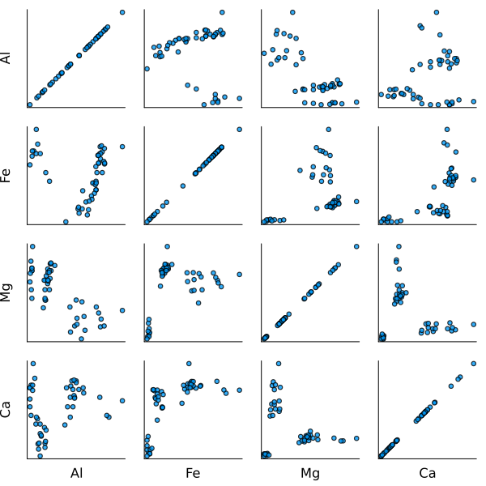
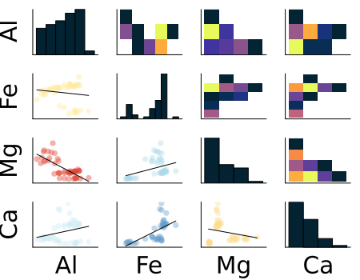
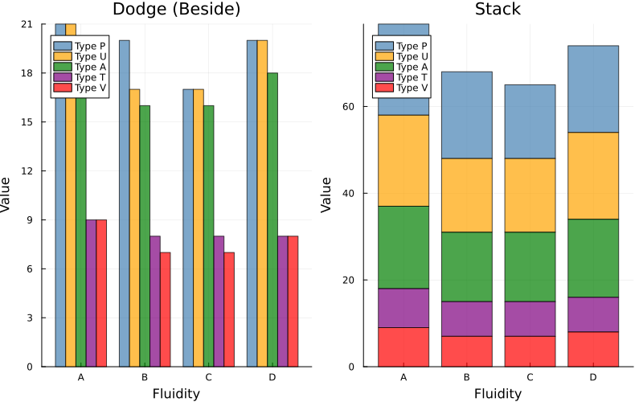
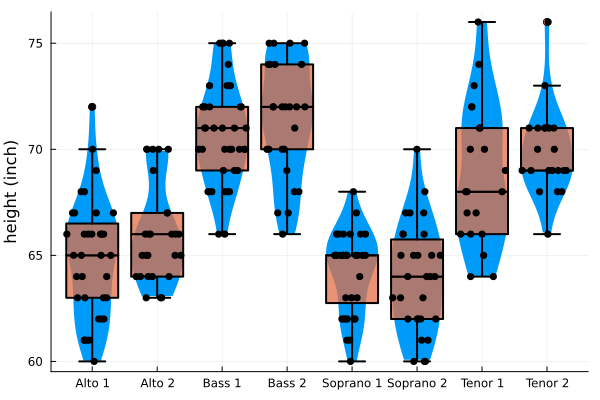

# Practical information

## Teachers

. . .


:::{style="font-size: 80%;"}
:::{.nonincremental}
1. cours 
     - [Emmanuel Pilliat]{style="background-color: yellow;"} (Me, in english)
     - Frédéric Lavancier (in French)
2. TD
  - [Théo Paquier]{style="background-color: yellow;"} (In English)
  - Julien Jamme
  - Théo Leroy
  - Denis Mottin
  - Marie Christiane Wambo / Koffi Amezouwui
:::
:::


## About Me

. . .


:::{.nonincremental}
- I arrived at ENSAI in Sep. 2024
- I give also lectures on [hypothesis testing]{style="background-color: yellow;"}
- Before: PhD in Montpellier
- [Research fields]{style="background-color: yellow;"}: crowdsourcing, active learning and parallel computing
:::

## Course Structure

. . .


:::{.nonincremental}
- 8 lecture sessions
- Course materials and slides (both evolving) available on Moodle (French)
- And [https://epilliat.github.io/](https://epilliat.github.io/)
- 8 TD/TP sessions (tutorial/practical work)
:::

## Evaluation

- A **short quiz** at the beginning of each tutorial/practical session
- A **one-hour midterm exam** (1h) on November 4th *(date to be confirmed)*
- An **exam** (3h) on December 19th *(date to be confirmed)*

# What is a regression model?

## Goal: explain or predict

. . .

Explain a [quantity $Y$]{style="background-color: lightgreen;"} 

. . .

based on [$p$ quantities $X^{(1)}, ..., X^{(p)}$]{style="background-color: lightblue;"} (explanatory variables, or regressors). 

. . .

For this purpose, we have [$n$ observations]{style="background-color: yellow;"} of each quantity from $n$ individuals.


## Example: electricity consumption

. . .

[$Y$: daily electricity consumption in France ]{style="background-color: lightgreen;"} 

. . .

[$X= X^{(1)}$: average daily temperature ]{style="background-color: lightblue;"} 

. . .

The data consists of a history of $(Y_1, \dots, Y_n)$ and $(X_1, \dots, X_n)$ over $n$ days  
  
. . .

**Question**: Do we have $Y \approx f(X)$ for a certain function f?  
**Simplifying**: Do we have $Y \approx aX + b$ for certain values $a$ and $b$?
  If yes, what is $a$? What is $b$? Is the relationship "reliable"?


## Example: customer scoring

. . .

[$Y \in \{0,1\}$]{style="background-color: lightgreen;"}: customer quality ($1$: good; $0$: not good)  

- [$X^{(1)}$]{style="background-color: lightblue;"}: customer income  
- [$X^{(2)}$]{style="background-color: lightblue;"}: socio-professional category (6-7 possibilities)  
- [$X^{(3)}$]{style="background-color: lightblue;"}: age  

. . .


  Data: n customers.  
  
  In this case, we model [$p = P(Y = 1)$]{style="background-color: yellow;"}.  
  Do we have [$p \approx f(X^{(1)}, X^{(2)}, X^{(3)})$]{style="background-color: yellow;"} for a function f with values in $[0, 1]$?


## Why model? Describe vs predict

. . .

Approximate [relationship]{style="background-color: yellow;"} between $Y$ and $X^{(1)}$, ..., $X^{(p)}$ is a [model]{style="background-color: yellow;"}.

. . .

Why seek to establish such a model? Two main reasons:

. . .

**Descriptive objective**: quantify the [marginal effect]{style="background-color: yellow;"} of each variable.

. . .

For example, if [$X^{(1)}$ increases by 10%]{style="background-color: lightblue;"}, how does [$Y$ change]{style="background-color: lightgreen;"}?

. . .

**Predictive objective**: given [new values for $X^{(1)}$, ..., $X^{(p)}$]{style="background-color: lightblue;"}, 
we can estimate an [approximation of corresponding $Y$]{style="background-color: lightgreen;"}.


## The four chapters


1. **Introduction**: [Bivariate analysis]{style="background-color: yellow;"}, and [general aspects]{style="background-color: yellow;"} of modelling


2. **Linear Regression**: [Quantitative $Y$]{style="background-color: lightgreen;"} as a function of [quantitative $X^{(1)}$, ..., $X^{(p)}$]{style="background-color: lightblue;"}


3. **Analysis of Variance and Covariance**: [Quantitative $Y$]{style="background-color: lightgreen;"} as a function of  [qualitative and/or quantitative $X^{(1)}$, ..., $X^{(p)}$]{style="background-color: lightblue;"}

4. **Generalized Linear Regression**:  [Qualitative or quantitative $Y$]{style="background-color: lightgreen;"} as a function of  [qualitative and/or quantitative $X^{(1)}$, ..., $X^{(p)}$]{style="background-color: lightblue;"}


# Variables & data

## Quantitative vs qualitative

. . .

$X$ and $Y$ can be 

- Quantitative (they represent numbers)
- or Qualitative (modalities, e.g. colors)
  
## Quantitative variables

. . .

A variable whose observation is a [measured quantity]{style="background-color: yellow;"}.

- **Discrete quantitative variables** whose possible values are finite or countable 
 (Examples: number of children, number of infractions, etc.)
- **Continuous quantitative variables** which can take any value within an interval
 (Examples: height, salary, etc.)

## Qualitative Variables (or Factors)

. . .

A variable whose observation results in a category or code. Possible observations are called [modalities]{style="background-color: yellow;"}


- **ordinal qualitative variable**: a natural order appears in the modalities
(Examples: high school honors, etc.). 
- **nominal qualitative variable** otherwise (Examples: gender, socio-professional category, etc.).


## Example of the "Pottery" Dataset

. . .

Data: chemical composition of pottery found at different archaeological sites in the United Kingdom

::: {.table-responsive}
|  | Site | Al | Fe | Mg | Ca | Na |
|---|------------|------|-----|-----|------|------|
| 1 | Llanedyrn | 14.4 | 7.00 | 4.30 | 0.15 | 0.51 |
| 2 | Llanedyrn | 13.8 | 7.08 | 3.43 | 0.12 | 0.17 |
| 3 | Llanedyrn | 14.6 | 7.09 | 3.88 | 0.13 | 0.20 |
| 4 | Llanedyrn | 10.9 | 6.26 | 3.47 | 0.17 | 0.22 |
| 5 | Caldicot | 11.8 | 5.44 | 3.94 | 0.30 | 0.04 |
| 6 | Caldicot | 11.6 | 5.39 | 3.77 | 0.29 | 0.06 |
| 7 | IsleThorns | 18.3 | 1.28 | 0.67 | 0.03 | 0.03 |
| 8 | IsleThorns | 15.8 | 2.39 | 0.63 | 0.01 | 0.04 |
| 9 | IsleThorns | 18.0 | 1.88 | 0.68 | 0.01 | 0.04 |
| 10 | IsleThorns | 20.8 | 1.51 | 0.72 | 0.07 | 0.10 |
| 11 | AshleyRails | 17.7 | 1.12 | 0.56 | 0.06 | 0.06 |
| 12 | AshleyRails | 18.3 | 1.14 | 0.67 | 0.06 | 0.05 |
| 13 | AshleyRails | 16.7 | 0.92 | 0.53 | 0.01 | 0.05 |
:::

- **Individuals**: pottery numbered from 1 to 13  
- **Variables**: the archaeological site (factor with 4 modalities) and different chemical compounds (quantitative).


## Example of the "NO2traffic" 

. . .

**Data**: NO2 concentration inside cars in Paris, type of road,
(P, T, A, V or U) and traffic fluidity (A to D).

::: {.table-responsive}
|  | NO2 | Type | Fluidity |
|---|------|------|----------|
| 1 | 378.94 | P | A |
| 2 | 806.67 | T | D |
| 3 | 634.58 | A | D |
| 4 | 673.35 | T | C |
| 5 | 589.75 | P | A |
| ... | ... | ... | ... |
| 283 | 184.16 | P | B |
| 284 | 121.88 | V | D |
| 285 | 152.39 | U | A |
| 286 | 129.12 | U | C |
:::

- **Individuals**: vehicles numbered from 1 to 286  
- **Variables**: NO2 (quantitative), type (factor with 5 modalities) and fluidity (ordinal factor with 4 modalities)


# Bivariate analysis I — two quantitative variables

## Pairwise Scatter Plots

. . .

We observe 

$X=(X_1, \ldots, X_n) \in \mathbb R^n$ and $Y=(Y_1, \ldots, Y_n) \in \mathbb R^n$, (**quantitative variables**)

. . .

Relationship between $X$ and $Y$: **scatter plot** of points $(X_i, Y_i)$.

## Example: Pottery Dataset

. . .


{width=100%}

## Correlation Plot

. . .




```julia
plot_cor=@df pottery_num corrplot(cols(1:4),grid=false, compact=true) #Julia
```


## Linear Empirical Covariance and Variance

. . .


$\DeclareMathOperator{\cov}{cov}$
$\DeclareMathOperator{\var}{var}$

. . .

Let $\hat \var$ and $\hat \cov$ denote the [empirical]{style="background-color: yellow;"} variance and covariance:

. . .

::: {.square-def}
$\hat \cov(X,Y)= \frac{1}{n}\sum_{i=1}^{n}(X_i - \overline X)(Y_i - \overline Y)$
:::

. . .

::: {.square-def}
 $\hat \var(X) = \hat \cov(X,X)$, $\hat \var(Y)=\hat\cov(Y,Y)$
:::


## Covariance = average signed area {.smaller}

. . .


::: {style="font-size:90%"}
Covariance = **average signed rectangle area**. Drag the points.
:::

```{=html}
<div id="cvWrap" style="text-align:center">
  <canvas id="cvCanvas" width="520" height="350" style="background:#fff;border:1px solid #ddd;border-radius:8px;max-width:100%;touch-action:none"></canvas>
  <div style="font-size:.8em;margin-top:.4rem">\(\widehat{\mathrm{cov}}\) = <b id="cvCov">–</b> &nbsp;·&nbsp; \(\hat\rho\) = <b id="cvRho">–</b> &nbsp; <button class="lm-btn" id="cvNew">↻ new</button></div>
</div>
<script>
(function () {
  var cv = document.getElementById('cvCanvas'); if (!cv || cv.dataset.init) return; cv.dataset.init = 1;
  var c = cv.getContext('2d'), W = cv.width, H = cv.height, N = 9, P = [], drag = -1;
  var XLO = -5, XHI = 5, YLO = -5, YHI = 5;
  function gauss() { var u = 0, v = 0; while (!u) u = Math.random(); while (!v) v = Math.random(); return Math.sqrt(-2 * Math.log(u)) * Math.cos(2 * Math.PI * v); }
  function gen() { P = []; for (var i = 0; i < N; i++) { var x = gauss() * 1.8; P.push([x, 0.7 * x + gauss() * 1.4]); } }
  function PX(x) { return 28 + (x - XLO) / (XHI - XLO) * (W - 40); } function PY(y) { return H - 20 - (y - YLO) / (YHI - YLO) * (H - 34); }
  function IX(px) { return XLO + (px - 28) / (W - 40) * (XHI - XLO); } function IY(py) { return YLO + (H - 20 - py) / (H - 34) * (YHI - YLO); }
  function draw() {
    var mx = 0, my = 0; P.forEach(function (p) { mx += p[0]; my += p[1]; }); mx /= N; my /= N;
    var sxy = 0, sxx = 0, syy = 0; P.forEach(function (p) { sxy += (p[0] - mx) * (p[1] - my); sxx += (p[0] - mx) * (p[0] - mx); syy += (p[1] - my) * (p[1] - my); });
    c.clearRect(0, 0, W, H);
    P.forEach(function (p) { c.fillStyle = (p[0] - mx) * (p[1] - my) >= 0 ? 'rgba(52,152,219,0.16)' : 'rgba(231,76,60,0.16)'; c.fillRect(PX(mx), PY(my), PX(p[0]) - PX(mx), PY(p[1]) - PY(my)); });
    c.strokeStyle = '#bbb'; c.setLineDash([4, 4]); c.lineWidth = 1; c.beginPath(); c.moveTo(PX(mx), 0); c.lineTo(PX(mx), H); c.moveTo(0, PY(my)); c.lineTo(W, PY(my)); c.stroke(); c.setLineDash([]);
    c.fillStyle = '#2c3e50'; P.forEach(function (p) { c.beginPath(); c.arc(PX(p[0]), PY(p[1]), 5, 0, 6.2832); c.fill(); });
    document.getElementById('cvCov').textContent = (sxy / N).toFixed(2);
    document.getElementById('cvRho').textContent = (sxy / Math.sqrt(sxx * syy || 1)).toFixed(2);
  }
  function pos(e) { var r = cv.getBoundingClientRect(); return [(e.clientX - r.left) * W / r.width, (e.clientY - r.top) * H / r.height]; }
  cv.addEventListener('pointerdown', function (e) { var m = pos(e); for (var i = 0; i < N; i++) { if (Math.hypot(PX(P[i][0]) - m[0], PY(P[i][1]) - m[1]) < 13) { drag = i; break; } } });
  cv.addEventListener('pointermove', function (e) { if (drag < 0) return; var m = pos(e); P[drag] = [Math.max(XLO, Math.min(XHI, IX(m[0]))), Math.max(YLO, Math.min(YHI, IY(m[1])))]; draw(); e.preventDefault(); });
  window.addEventListener('pointerup', function () { drag = -1; });
  document.getElementById('cvNew').addEventListener('click', function () { gen(); draw(); });
  gen(); draw();
})();
</script>
```

## Linear Empirical Correlation

. . .

The linear relationship is quantified by Pearson's linear correlation:


::: {.square-def}
$$\hat \rho = \frac{\hat\cov(X,Y)}{\sqrt{\hat \var(X)\hat \var(Y)}}$$
:::

## Correlation: -1 ≤ ρ̂ ≤ 1

. . .

From the Cauchy-Schwarz inequality, we deduce that:

. . .

The correlation $\hat \rho$ is always between $-1$ and $1$:

- If [$\hat \rho = 1$]{style="background-color: lightgreen;"}: for all $i$, $Y_i = aX_i + b$ for some [$a > 0$]{style="background-color: lightgreen;"}

- If [$\hat \rho = -1$]{style="background-color: orange;"}: for all $i$, $Y_i = aX_i + b$ for some [$a < 0$]{style="background-color: orange;"}

- If [$\hat \rho = 0$]{style="background-color: yellow;"}: **no linear** relationship. [notebook](../pluto/introduction.html)

## Correlation explorer {.smaller}

. . .


::: {style="font-size:90%"}
Pearson's $\hat\rho$ measures only **linear** association.
:::

```{=html}
<style>
.lm-btn{font-family:inherit;font-size:.85em;padding:.4em 1.1em;margin:.12em .22em;border:1px solid #bbb;border-radius:8px;background:#f4f4f4;color:#333;cursor:pointer}
.lm-btn.on{background:#3b6fb6;color:#fff;border-color:#3b6fb6}
.lm-eq{font-size:.85em;margin:.35rem 0}
.lm-row{font-size:.72em;line-height:2.3;margin:.15rem 0}
#corrWrap{text-align:center}
</style>
<div id="corrWrap">
  <canvas id="corrCanvas" width="720" height="320" style="max-width:100%;background:#fff;border:1px solid #ddd;border-radius:8px"></canvas>
  <div class="lm-eq" id="corrEq">\(Y=\rho X+\sqrt{1-\rho^2}\,Z\)</div>
  <div class="lm-row">
    <button class="lm-btn on" data-shape="gauss">Gaussian</button>
    <button class="lm-btn" data-shape="parabola">Parabola</button>
    <button class="lm-btn" data-shape="circle">Circle</button>
    <button class="lm-btn" data-shape="xshape">Two lines</button>
  </div>
  <div class="lm-row">
    <span id="corrP1wrap"><b id="corrP1lab">ρ</b> <input id="corrP1" type="range" autocomplete="off" style="vertical-align:middle;width:200px"> <b id="corrP1v"></b></span>
    <span id="corrP2wrap"> · <b id="corrP2lab">noise</b> <input id="corrP2" type="range" autocomplete="off" style="vertical-align:middle;width:150px"> <b id="corrP2v"></b></span>
    &nbsp;·&nbsp; <b>\(\hat\rho\) = <span id="corrRhoHat">–</span></b> &nbsp; <button class="lm-btn" id="corrResample">↻ resample</button>
  </div>
</div>
<script>
(function () {
  var cv = document.getElementById('corrCanvas'); if (!cv || cv.dataset.init) return; cv.dataset.init = 1;
  var c = cv.getContext('2d'), W = cv.width, H = cv.height, N = 150, shape = 'gauss', KEY = 'lmCorrExplorer';
  var u1 = [], z1 = [], z2 = [], sg = [];
  var p1 = document.getElementById('corrP1'), p2 = document.getElementById('corrP2'), p1v = document.getElementById('corrP1v'), p2v = document.getElementById('corrP2v'),
      p1l = document.getElementById('corrP1lab'), p2l = document.getElementById('corrP2lab'), p2w = document.getElementById('corrP2wrap'), eq = document.getElementById('corrEq');
  function gauss() { var u = 0, v = 0; while (!u) u = Math.random(); while (!v) v = Math.random(); return Math.sqrt(-2 * Math.log(u)) * Math.cos(2 * Math.PI * v); }
  function regen() { u1 = []; z1 = []; z2 = []; sg = []; for (var i = 0; i < N; i++) { u1.push(Math.random()); z1.push(gauss()); z2.push(gauss()); sg.push(Math.random() < 0.5 ? -1 : 1); } }
  function typesetEq() { if (window.MathJax && MathJax.Hub && MathJax.Hub.Queue) MathJax.Hub.Queue(['Typeset', MathJax.Hub, eq]); else setTimeout(typesetEq, 200); }   // MathJax 2 (reveal), retry until loaded
  function save() { try { localStorage.setItem(KEY, JSON.stringify({ s: shape, a: +p1.value, b: +p2.value })); } catch (e) {} }
  var CFG = {
    gauss: { eq: 'Y=\\rho X+\\sqrt{1-\\rho^2}\\,Z', p1: { lab: 'ρ', min: -0.99, max: 0.99, step: 0.01, val: 0.7 }, p2: null },
    parabola: { eq: 'Y=a\\,X^2+\\varepsilon', p1: { lab: 'a', min: -1.2, max: 1.2, step: 0.02, val: 0.7 }, p2: { lab: 'noise', min: 0, max: 1, step: 0.02, val: 0.25 } },
    circle: { eq: 'X=r\\cos\\theta,\\ \\ Y=r\\sin\\theta+\\varepsilon', p1: { lab: 'r', min: 0.5, max: 3, step: 0.05, val: 2.1 }, p2: { lab: 'noise', min: 0, max: 1, step: 0.02, val: 0.12 } },
    xshape: { eq: 'Y=\\pm a\\,X+\\varepsilon', p1: { lab: 'a', min: 0, max: 2.5, step: 0.05, val: 1 }, p2: { lab: 'noise', min: 0, max: 1, step: 0.02, val: 0.16 } }
  };
  function pts() {
    var a = +p1.value, nz = +p2.value, out = [];
    for (var i = 0; i < N; i++) {
      if (shape === 'gauss') { var s = Math.sqrt(1 - a * a); out.push([z1[i], a * z1[i] + s * z2[i]]); }
      else if (shape === 'parabola') { var x = (u1[i] * 2 - 1) * 2.6; out.push([x, a * (x * x - 2.2) + nz * z2[i]]); }
      else if (shape === 'circle') { var t = u1[i] * 2 * Math.PI, rad = a + nz * z2[i]; out.push([rad * Math.cos(t), rad * Math.sin(t)]); }
      else { var x2 = (u1[i] * 2 - 1) * 2.6; out.push([x2, sg[i] * a * x2 + nz * z2[i]]); }
    }
    return out;
  }
  function draw() {
    var data = pts(), n = data.length, mx = 0, my = 0; data.forEach(function (d) { mx += d[0]; my += d[1]; }); mx /= n; my /= n;
    var sxy = 0, sxx = 0, syy = 0; data.forEach(function (d) { var dx = d[0] - mx, dy = d[1] - my; sxy += dx * dy; sxx += dx * dx; syy += dy * dy; });
    document.getElementById('corrRhoHat').textContent = (sxy / Math.sqrt(sxx * syy || 1)).toFixed(2);
    p1v.textContent = (+p1.value).toFixed(2); if (p2w.style.display !== 'none') p2v.textContent = (+p2.value).toFixed(2);
    var slope = sxy / (sxx || 1), intercept = my - slope * mx;
    var xs = data.map(function (d) { return d[0]; }), ys = data.map(function (d) { return d[1]; }), xlo, xhi, ylo, yhi;
    if (shape === 'gauss') { xlo = ylo = -3.2; xhi = yhi = 3.2; }
    else { xlo = Math.min.apply(0, xs); xhi = Math.max.apply(0, xs); ylo = Math.min.apply(0, ys); yhi = Math.max.apply(0, ys); var dx = (xhi - xlo) * 0.1 || 1, dy = (yhi - ylo) * 0.1 || 1; xlo -= dx; xhi += dx; ylo -= dy; yhi += dy; }
    var pad = 14; function PX(x) { return pad + (x - xlo) / (xhi - xlo) * (W - 2 * pad); } function PY(y) { return H - pad - (y - ylo) / (yhi - ylo) * (H - 2 * pad); }
    c.clearRect(0, 0, W, H); c.strokeStyle = '#e6e6e6'; c.lineWidth = 1; c.strokeRect(pad, pad, W - 2 * pad, H - 2 * pad);
    c.save(); c.beginPath(); c.rect(pad, pad, W - 2 * pad, H - 2 * pad); c.clip();
    c.strokeStyle = '#e74c3c'; c.lineWidth = 2.5; c.beginPath(); c.moveTo(PX(xlo), PY(slope * xlo + intercept)); c.lineTo(PX(xhi), PY(slope * xhi + intercept)); c.stroke();
    c.fillStyle = 'rgba(44,62,80,0.7)'; data.forEach(function (d) { c.beginPath(); c.arc(PX(d[0]), PY(d[1]), 3.4, 0, 6.2832); c.fill(); });
    c.restore();
  }
  function setShape(sh) {
    shape = sh; var cfg = CFG[sh];
    Array.prototype.forEach.call(document.querySelectorAll('#corrWrap .lm-btn[data-shape]'), function (b) { b.classList.toggle('on', b.dataset.shape === sh); });
    p1l.textContent = cfg.p1.lab; p1.min = cfg.p1.min; p1.max = cfg.p1.max; p1.step = cfg.p1.step; p1.value = cfg.p1.val;
    if (cfg.p2) { p2w.style.display = ''; p2l.textContent = cfg.p2.lab; p2.min = cfg.p2.min; p2.max = cfg.p2.max; p2.step = cfg.p2.step; p2.value = cfg.p2.val; } else p2w.style.display = 'none';
    eq.innerHTML = '\\(' + cfg.eq + '\\)'; typesetEq(); draw();
  }
  Array.prototype.forEach.call(document.querySelectorAll('#corrWrap .lm-btn[data-shape]'), function (b) { b.addEventListener('click', function () { setShape(b.dataset.shape); save(); }); });
  p1.addEventListener('input', function () { draw(); save(); }); p2.addEventListener('input', function () { draw(); save(); });
  document.getElementById('corrResample').addEventListener('click', function () { regen(); draw(); });
  // restore mode + params from a previous visit, then make buttons/values/equation match
  var saved = null; try { saved = JSON.parse(localStorage.getItem(KEY)); } catch (e) {}
  regen(); setShape(saved && CFG[saved.s] ? saved.s : 'gauss');
  if (saved) { p1.value = saved.a; if (p2w.style.display !== 'none' && saved.b != null) p2.value = saved.b; }
  draw(); save();
})();
</script>
```

## Correlation test: hypotheses


. . .

$\hat \rho(X, Y)$ is an estimator of the **unknown** theoretical correlation $\rho$ between $X$ and $Y$ defined by
$$\rho = \frac{\mathbb E[(X - \mathbb E(X))(Y - \mathbb E(Y))]}{\sqrt{\mathbb V(X)\mathbb V(Y)}}$$

. . .

**Correlation test problem:** 

$$H_0: \rho = 0 \quad \text{VS}\quad  H_1: \rho \neq 0$$

## Correlation test: statistic

. . .

**Test statistic** (here we use $\psi$ for test statistics and $T$ for tests)
$$\psi(X,Y) = \frac{\hat \rho\sqrt{n-2}}{\sqrt{1-\hat \rho^2}}$$

. . .

**Test**

[Under $H_0$]{style="background-color: yellow;"}, if $(X,Y)$ is Gaussian, [$\psi(X,Y) \sim \mathcal T(n-2)$]{style="background-color: yellow;"} (Student distribution of degree of freedom $n-2$)

. . .

$$T(X,Y) = \mathbf{1}\{|\psi(X,Y)| > t_{1-\alpha/2}\}$$

In R: `cor.test`


## Significance test for ρ {.smaller}

. . .


::: {style="font-size:90%"}
Each sample gives a **test statistic** $\psi=\hat\rho\sqrt{n-2}/\sqrt{1-\hat\rho^2}$. Under $H_0:\rho=0$ it follows $\mathcal T(n-2)$; the proportion of samples in the **rejection zone** estimates the **power**.
:::

```{=html}
<div id="ctWrap" style="text-align:center">
  <canvas id="ctCanvas" width="720" height="290" style="max-width:100%;background:#fff;border:1px solid #ddd;border-radius:8px"></canvas>
  <div class="lm-row">
    true ρ <input id="ctRho" type="range" autocomplete="off" min="-0.9" max="0.9" step="0.05" value="0.3" style="vertical-align:middle;width:130px"> <b id="ctRhoV">0.30</b> &nbsp;·&nbsp;
    n <input id="ctN" type="range" autocomplete="off" min="5" max="100" step="1" value="20" style="vertical-align:middle;width:110px"> <b id="ctNv">20</b> &nbsp;·&nbsp;
    level α <input id="ctA" type="range" autocomplete="off" min="0.01" max="0.2" step="0.01" value="0.05" style="vertical-align:middle;width:110px"> <b id="ctAv">0.05</b> · crit \(t_{1-\alpha/2}\)=<b id="ctThr">–</b>
  </div>
  <div class="lm-row">
    <button class="lm-btn" id="ctGen">generate sample</button>
    <button class="lm-btn" id="ctGen20">+20</button>
    <button class="lm-btn" id="ctReset">reset</button>
    &nbsp;&nbsp; kept: <b id="ctKept">0</b> · rejected: <b id="ctRej">0</b> · proportion rejected: <b id="ctProp">–</b>
  </div>
</div>
<script>
(function () {
  var cv = document.getElementById('ctCanvas'); if (!cv || cv.dataset.init) return; cv.dataset.init = 1;
  var c = cv.getContext('2d'), W = cv.width, H = cv.height, RNG = 5.5, psis = [];
  var rhoEl = document.getElementById('ctRho'), nEl = document.getElementById('ctN'), aEl = document.getElementById('ctA'),
      rhoV = document.getElementById('ctRhoV'), nV = document.getElementById('ctNv'), aV = document.getElementById('ctAv');
  function gauss() { var u = 0, v = 0; while (!u) u = Math.random(); while (!v) v = Math.random(); return Math.sqrt(-2 * Math.log(u)) * Math.cos(2 * Math.PI * v); }
  function lgamma(z) { var g = [0.99999999999980993, 676.5203681218851, -1259.1392167224028, 771.32342877765313, -176.61502916214059, 12.507343278686905, -0.13857109526572012, 9.9843695780195716e-6, 1.5056327351493116e-7]; if (z < 0.5) return Math.log(Math.PI / Math.sin(Math.PI * z)) - lgamma(1 - z); z -= 1; var x = g[0]; for (var i = 1; i < 9; i++) x += g[i] / (z + i); var t = z + 7.5; return 0.5 * Math.log(2 * Math.PI) + (z + 0.5) * Math.log(t) - t + Math.log(x); }
  function tpdf(t, nu) { return Math.exp(lgamma((nu + 1) / 2) - lgamma(nu / 2) - 0.5 * Math.log(nu * Math.PI) - ((nu + 1) / 2) * Math.log(1 + t * t / nu)); }
  function tcdf(t, nu) { var n = 140, b = Math.abs(t), h = b / n, s = 0; for (var i = 0; i <= n; i++) { var x = i * h, w = (i === 0 || i === n) ? 1 : (i % 2 ? 4 : 2); s += w * tpdf(x, nu); } s *= h / 3; return t >= 0 ? 0.5 + s : 0.5 - s; }
  function tquant(p, nu) { var lo = 0, hi = 60; for (var i = 0; i < 50; i++) { var m = (lo + hi) / 2; if (tcdf(m, nu) < p) lo = m; else hi = m; } return (lo + hi) / 2; }
  function oneSample(n, rho) {
    var sq = Math.sqrt(1 - rho * rho), X = [], Y = [], mx = 0, my = 0, i;
    for (i = 0; i < n; i++) { var x = gauss(); X.push(x); var y = rho * x + sq * gauss(); Y.push(y); mx += x; my += y; } mx /= n; my /= n;
    var sxy = 0, sxx = 0, syy = 0; for (i = 0; i < n; i++) { sxy += (X[i] - mx) * (Y[i] - my); sxx += (X[i] - mx) * (X[i] - mx); syy += (Y[i] - my) * (Y[i] - my); }
    var r = sxy / Math.sqrt(sxx * syy || 1); return r * Math.sqrt(n - 2) / Math.sqrt(1 - r * r || 1e-9);
  }
  function draw() {
    var rho = +rhoEl.value, n = +nEl.value, al = +aEl.value, nu = n - 2, thr = tquant(1 - al / 2, nu), i;
    rhoV.textContent = rho.toFixed(2); nV.textContent = n; aV.textContent = al.toFixed(2); document.getElementById('ctThr').textContent = thr.toFixed(2);
    var pad = 24, top = 12, baseY = H - 22, ymax = tpdf(0, nu) * 1.12;
    function PX(t) { return pad + (t + RNG) / (2 * RNG) * (W - 2 * pad); } function PY(d) { return baseY - d / ymax * (baseY - top); }
    c.clearRect(0, 0, W, H);
    c.fillStyle = 'rgba(231,76,60,0.10)'; c.fillRect(PX(-RNG), 0, PX(-thr) - PX(-RNG), baseY); c.fillRect(PX(thr), 0, PX(RNG) - PX(thr), baseY);
    c.fillStyle = 'rgba(231,76,60,0.8)'; c.font = '12px sans-serif'; c.textAlign = 'center'; c.fillText('reject', (PX(-RNG) + PX(-thr)) / 2, 16); c.fillText('reject', (PX(thr) + PX(RNG)) / 2, 16);
    var kept = 0, rej = 0;
    psis.forEach(function (p, idx) {
      var rd = Math.abs(p) > thr; if (rd) rej++; else kept++;
      var x = PX(Math.max(-RNG, Math.min(RNG, p))), last = idx === psis.length - 1;
      c.strokeStyle = rd ? 'rgba(231,76,60,' + (last ? 1 : 0.3) + ')' : 'rgba(52,120,200,' + (last ? 1 : 0.3) + ')';
      c.lineWidth = last ? 2.5 : 1; c.beginPath(); c.moveTo(x, top); c.lineTo(x, baseY); c.stroke();
    });
    c.strokeStyle = '#2c3e50'; c.lineWidth = 2; c.beginPath(); for (i = 0; i <= 240; i++) { var t = -RNG + i / 240 * 2 * RNG; i ? c.lineTo(PX(t), PY(tpdf(t, nu))) : c.moveTo(PX(t), PY(tpdf(t, nu))); } c.stroke();
    c.strokeStyle = '#ccc'; c.lineWidth = 1; c.beginPath(); c.moveTo(pad, baseY); c.lineTo(W - pad, baseY); c.stroke();
    c.fillStyle = '#666'; c.font = '12px sans-serif'; c.textAlign = 'center'; c.fillText('test statistic  ψ', W / 2, H - 6);
    c.strokeStyle = '#e74c3c'; c.lineWidth = 2; c.setLineDash([5, 4]); [-thr, thr].forEach(function (tt) { c.beginPath(); c.moveTo(PX(tt), 8); c.lineTo(PX(tt), baseY); c.stroke(); }); c.setLineDash([]);
    document.getElementById('ctKept').textContent = kept; document.getElementById('ctRej').textContent = rej;
    document.getElementById('ctProp').textContent = (kept + rej) ? (100 * rej / (kept + rej)).toFixed(0) + '%' : '–';
  }
  function gen(k) { var n = +nEl.value, rho = +rhoEl.value; for (var i = 0; i < k; i++) psis.push(oneSample(n, rho)); draw(); }
  document.getElementById('ctGen').addEventListener('click', function () { gen(1); });
  document.getElementById('ctGen20').addEventListener('click', function () { gen(20); });
  document.getElementById('ctReset').addEventListener('click', function () { psis = []; draw(); });
  rhoEl.addEventListener('input', function () { psis = []; draw(); });   // sample no longer valid
  nEl.addEventListener('input', function () { psis = []; draw(); });
  aEl.addEventListener('input', draw);                                   // just re-threshold + re-tally
  draw();
})();
</script>
```

## Least Square (p=1)

. . .

Given observations $(X_i, Y_i)$, we consider $\hat \alpha$, $\hat \mu$ that **minimize**, over all $(\alpha, \mu) \in \mathbb R^2$:

::: {.square-objective}
$$
L(\alpha, \mu) = \sum_{i=1}^n (Y_i - \alpha X_i - \mu)^2
$$

:::

. . .

**Solution:** (check homogeneity!)

:::{style="font-size: 80%;"}
::: {.square-solution}
$$\hat \alpha = \frac{\hat \cov(X,Y)}{\hat \var(X)}  \quad \text{and} \quad \hat \mu = \overline Y - \hat \alpha \overline X$$

:::
:::


## Least squares, visually {.smaller}

. . .


::: {style="font-size:90%"}
The line with the **smallest total square area**. Drag the red handles.
:::

```{=html}
<div id="lsWrap" style="text-align:center">
  <canvas id="lsCanvas" width="560" height="360" style="background:#fff;border:1px solid #ddd;border-radius:8px;max-width:100%;touch-action:none"></canvas>
  <div style="font-size:.8em;margin-top:.4rem">RSS = <b id="lsRSS">–</b> &nbsp; <button class="lm-btn" id="lsSnap">snap to OLS</button> &nbsp; <button class="lm-btn" id="lsNew">↻ new data</button></div>
</div>
<script>
(function () {
  var cv = document.getElementById('lsCanvas'); if (!cv || cv.dataset.init) return; cv.dataset.init = 1;
  var c = cv.getContext('2d'), W = cv.width, H = cv.height, N = 11, P = [], drag = -1;
  var XLO = -0.3, XHI = 10.3, YLO = -1.5, YHI = 12, xL = 1, xR = 9, hL = 3, hR = 7;
  function gauss() { var u = 0, v = 0; while (!u) u = Math.random(); while (!v) v = Math.random(); return Math.sqrt(-2 * Math.log(u)) * Math.cos(2 * Math.PI * v); }
  function gen() { P = []; var a = 0.7 + Math.random() * 0.6, b = 1 + Math.random() * 2; for (var i = 0; i < N; i++) { var x = 0.5 + i * 0.95; P.push([x, a * x + b + gauss() * 1.1]); } }
  function PX(x) { return 34 + (x - XLO) / (XHI - XLO) * (W - 46); } function PY(y) { return H - 26 - (y - YLO) / (YHI - YLO) * (H - 40); }
  function IY(py) { return YLO + (H - 26 - py) / (H - 40) * (YHI - YLO); }
  function line() { var slope = (hR - hL) / (xR - xL); return [slope, hL - slope * xL]; }
  function ols() { var mx = 0, my = 0; P.forEach(function (p) { mx += p[0]; my += p[1]; }); mx /= N; my /= N; var sxy = 0, sxx = 0; P.forEach(function (p) { sxy += (p[0] - mx) * (p[1] - my); sxx += (p[0] - mx) * (p[0] - mx); }); var a = sxy / sxx; return [a, my - a * mx]; }
  function draw() {
    var lm = line(), a = lm[0], m = lm[1], rss = 0;
    c.clearRect(0, 0, W, H); c.save(); c.beginPath(); c.rect(0, 0, W, H); c.clip();
    P.forEach(function (p) {
      var yhat = a * p[0] + m, r = p[1] - yhat; rss += r * r;
      var x = PX(p[0]), yp = PY(p[1]), yl = PY(yhat), h = Math.abs(yl - yp), top = Math.min(yp, yl);
      c.fillStyle = r > 0 ? 'rgba(230,126,34,0.20)' : 'rgba(52,152,219,0.20)'; c.fillRect(x, top, h, h);
      c.strokeStyle = 'rgba(120,120,120,0.45)'; c.lineWidth = 1; c.beginPath(); c.moveTo(x, yp); c.lineTo(x, yl); c.stroke();
    });
    c.strokeStyle = '#e74c3c'; c.lineWidth = 2.5; c.beginPath(); c.moveTo(PX(XLO), PY(a * XLO + m)); c.lineTo(PX(XHI), PY(a * XHI + m)); c.stroke();
    c.fillStyle = '#2c3e50'; P.forEach(function (p) { c.beginPath(); c.arc(PX(p[0]), PY(p[1]), 3.6, 0, 6.2832); c.fill(); });
    [[xL, hL], [xR, hR]].forEach(function (hd) { c.fillStyle = '#fff'; c.strokeStyle = '#e74c3c'; c.lineWidth = 2.5; c.beginPath(); c.arc(PX(hd[0]), PY(hd[1]), 7, 0, 6.2832); c.fill(); c.stroke(); });
    c.restore();
    document.getElementById('lsRSS').textContent = rss.toFixed(1);
  }
  function pos(e) { var r = cv.getBoundingClientRect(); return [(e.clientX - r.left) * W / r.width, (e.clientY - r.top) * H / r.height]; }
  cv.addEventListener('pointerdown', function (e) { var p = pos(e); if (Math.hypot(PX(xL) - p[0], PY(hL) - p[1]) < 16) drag = 0; else if (Math.hypot(PX(xR) - p[0], PY(hR) - p[1]) < 16) drag = 1; });
  cv.addEventListener('pointermove', function (e) { if (drag < 0) return; var p = pos(e), y = Math.max(YLO, Math.min(YHI, IY(p[1]))); if (drag === 0) hL = y; else hR = y; draw(); e.preventDefault(); });
  window.addEventListener('pointerup', function () { drag = -1; });
  document.getElementById('lsSnap').addEventListener('click', function () { var o = ols(); hL = o[0] * xL + o[1]; hR = o[0] * xR + o[1]; draw(); });
  document.getElementById('lsNew').addEventListener('click', function () { gen(); draw(); });
  gen(); draw();
})();
</script>
```

# Bivariate analysis II — two qualitative variables

## Contingency Table and Notation

. . .

We observe $X=(X_1, \dots, X_n)$ and $Y=(Y_1, \dots, Y_n)$, where

- $X_k \in \{1, \dots, I\}$ (factor with $I$ categories, "colors")
- $Y_k \in \{1, \dots, J\}$ (factor with $J$ categories, "bags")

. . .

| Category X/Y| **Bag 1** | **Bag 2** | **Bag 3** | Totals |
|---|---|---|---|---|
| **Col 1** | $n_{11}$ | $n_{12}$ | $n_{13}$ | $R_1$ |
| **Col 2** | $n_{21}$ | $n_{22}$ | $n_{23}$ | $R_2$ |
| **Totals** | $N_1$ | $N_2$ | $N_3$ | $N$ |


$n_{ij}$: number of individuals having category $i$ for $X$ and $j$ for $Y$  


## Example: NO2traffic dataset

. . .


**contingency table** of variable "Type" and "Fluidity"

| **Fluidity**/**Type** | P | U | A | T | V |
|---|------|-----|-----|-----|-----|
| A | 21 | 21 | 19 | 9 | 9 |
| B | 20 | 17 | 16 | 8 | 7 |
| C | 17 | 17 | 16 | 8 | 7 |
| D | 20 | 20 | 18 | 8 | 8 |

In R: `table(X,Y)`

## In Julia

. . .




```julia
fluidity_types = ["A", "B", "C", "D"]
type_p = [21, 20, 17, 20]
type_u = [21, 17, 17, 20]
type_a = [19, 16, 16, 18]
type_t = [9, 8, 8, 8]
type_v = [9, 7, 7, 8]

# Create a matrix for the grouped bar plot
# Each row represents a fluidity type, each column represents a measurement type
data_matrix = hcat(type_p, type_u, type_a, type_t, type_v)

# Create a grouped bar plot
p1 = groupedbar(
    fluidity_types,
    data_matrix,
    title="Dodge (Beside)",
    xlabel="Fluidity",
    ylabel="Value",
    label=["Type P" "Type U" "Type A" "Type T" "Type V"],
    legend=:topleft,
    bar_position=:dodge,
    color=[:steelblue :orange :green :purple :red],
    alpha=0.7,
    size=(800, 500)
)
p2 = groupedbar(
    fluidity_types,
    data_matrix,
    title="Stack",
    xlabel="Fluidity",
    ylabel="Value",
    label=["Type P" "Type U" "Type A" "Type T" "Type V"],
    legend=:topleft,
	bar_position=:stack,
    color=[:steelblue :orange :green :purple :red],
    alpha=0.7,
    size=(800, 500)
)
plot(p1,p2)
```

## χ² test: hypotheses

. . .


$\newcommand{\VS}{\quad \mathrm{VS} \quad}$
$\newcommand{\and}{\quad \mathrm{and} \quad}$

. . .

We observe  \
$X=(X_1, \dots, X_n) \in \{1, \dots, I\}^n$ and $Y=(Y_1, \dots, Y_n) \in \{1, \dots, J\}^n$

. . .

**Assumptions**: $(X_k,Y_k)$ are independent, each pair has unknown distribution $P_{XY}$

. . .

dependency test problem:

::: {.square-def}
$$H_0: P_{XY}=P_{X}P_Y \VS H_1: P_{XY} \neq P_{X}P_{Y}$$
:::


## Contingency table: definitions

. . .

Entries of the table:

::: {.square-def}
$$n_{ij} = \sum_{k=1}^n \mathbf 1\{X_{k} = i\}\mathbf 1\{Y_k=j\}$$
:::

. . .

Total proportion of individuals $k$ of color $X_k =i$:\

::: {.square-def}
[$\hat p_{i}=\frac{R_i}{N}$]{style="background-color: yellow;"} $= \tfrac{1}{N}\sum_{j=1}^{J}n_{ij}$
:::


## χ² test: statistic

. . .

Chi-squared statistic, or chi-squared distance:

::: {.square-def}
$$\psi(X,Y) = \sum_{i=1}^I\sum_{j=1}^J \frac{(n_{ij}- N_j\hat p_{i})^2}{N_j\hat p_{i}}$$
:::


- Approximation: $\psi(X,Y) \sim \chi^2((I-1)(J-1))$ when $n \to \infty$
- Test: $T=\mathbf 1\{\psi(X,Y) \geq t_{1-\alpha}\}$, where \
$t_{0.95}$ = `quantile(Chisq((I-1)*(J-1)), 0.95)`


# Bivariate analysis III — quantitative Y, qualitative X

## Setting

. . .

We observe $X=(X_1, \dots, X_n)$ and $Y=(Y_1, \dots, Y_n)$, where

- $X_k \in \{1, \dots, I\}$ (Quali)
- $Y_k \in \mathbb R$ (Quanti)

. . .

**Boxplot**:  represents the $0, 25, 50, 75$ and $100$ percentiles.


## Singer Dataset (Julia StatsPlots)

. . .

$X$: Height (in inches), $Y$: Type of singer

. . .

Boxplot: (min, $q_{1/4}$, median, $q_{3/4}$, max) for each modality

{width=70%}


## Partial means

. . .

$X=(X_1, \dots, X_n) \in \{1, \dots, I\}^n$, 
$Y=(Y_1, \dots, Y_n) \in \mathbb R^n$

. . .

if $i \in \{1, \dots, I\}$, we define partial means as

::: {.square-def}
:::{style="font-size: 80%;"}
$$N_i = \sum_{k=1}^n \mathbf 1\{X_k=i\} \and \overline Y_i = \frac{1}{N_i}\sum_{k=1}^n Y_k \mathbf 1\{X_k=i\}$$
:::

:::

. . .

Total mean:

$\overline Y = \frac{1}{N}\sum_{k=1}^n Y_k = \frac{1}{N}\sum_{i=1}^I N_i \overline Y_i$

## Variance Decomposition


. . .


:::{style="font-size: 70%;"}
::: {.square-def}
$$\frac{1}{n}\underbrace{\sum_{k=1}^n(Y_k - \overline Y)^2}_{SST} = 
\frac{1}{n}\underbrace{\sum_{i=1}^IN_i(\overline Y_i - \overline Y)^2}_{SSB} 
+ \frac{1}{n}\underbrace{\sum_{i=1}^I\sum_{k=1}^n\mathbf 1\{X_k=i\}(Y_k - \overline Y_i)^2}_{SSW}$$
:::
:::

. . .

**correlation ratio:**

::: {.square-def}
$$ \hat \eta^2 = \frac{SSB}{SST}  \in [0,1]$$
:::

. . .

This is an estimator of **unknown** $\eta^2 = \frac{\mathbb V(\mathbb E[Y|X])}{\mathbb V(Y)}$

## Between vs within: drag the groups {.smaller}

. . .


::: {style="font-size:90%"}
**Drag the group means** apart → between-group spread and $F$ grow; **noise** grows the within-group spread. Add groups or individuals and the degrees of freedom follow.
:::

```{=html}
<div id="anWrap" style="text-align:center">
  <canvas id="anCanvas" width="640" height="290" style="max-width:100%;background:#fff;border:1px solid #ddd;border-radius:8px;touch-action:none"></canvas>
  <div class="lm-row">
    groups <input id="anI" type="range" autocomplete="off" min="2" max="6" step="1" value="3" style="vertical-align:middle;width:80px"> <b id="anIv">3</b> &nbsp;·&nbsp;
    gap <input id="anGap" type="range" autocomplete="off" min="0" max="4" step="0.05" value="2.4" style="vertical-align:middle;width:95px"> <b id="anGapv">2.40</b> &nbsp;·&nbsp;
    per group <input id="anNg" type="range" autocomplete="off" min="3" max="40" step="1" value="14" style="vertical-align:middle;width:95px"> <b id="anNgv">14</b> &nbsp;·&nbsp;
    noise <input id="anNz" type="range" autocomplete="off" min="0.2" max="2.5" step="0.05" value="0.8" style="vertical-align:middle;width:90px"> <b id="anNzv">0.80</b>
  </div>
  <div class="lm-row">
    \(\hat\eta^2\)=<b id="anEta">–</b> · F=<b id="anF">–</b> · df=(<b id="anDf1">–</b>, <b id="anDf2">–</b>) · p=<b id="anP">–</b> &nbsp; <button class="lm-btn" id="anNew">↻ resample</button>
  </div>
</div>
<script>
(function () {
  var cv = document.getElementById('anCanvas'); if (!cv || cv.dataset.init) return; cv.dataset.init = 1;
  var c = cv.getContext('2d'), W = cv.width, H = cv.height, YR = 9, I = 3, means = [], base = [], drag = -1;
  var iEl = document.getElementById('anI'), ngEl = document.getElementById('anNg'), nzEl = document.getElementById('anNz'), gapEl = document.getElementById('anGap');
  var cols = ['#3498db', '#e67e22', '#27ae60', '#9b59b6', '#e74c3c', '#16a085'];
  function gauss() { var u = 0, v = 0; while (!u) u = Math.random(); while (!v) v = Math.random(); return Math.sqrt(-2 * Math.log(u)) * Math.cos(2 * Math.PI * v); }
  function lgamma(z) { var g = [0.99999999999980993, 676.5203681218851, -1259.1392167224028, 771.32342877765313, -176.61502916214059, 12.507343278686905, -0.13857109526572012, 9.9843695780195716e-6, 1.5056327351493116e-7]; if (z < 0.5) return Math.log(Math.PI / Math.sin(Math.PI * z)) - lgamma(1 - z); z -= 1; var x = g[0]; for (var i = 1; i < 9; i++) x += g[i] / (z + i); var t = z + 7.5; return 0.5 * Math.log(2 * Math.PI) + (z + 0.5) * Math.log(t) - t + Math.log(x); }
  function betacf(a, b, x) { var FPMIN = 1e-300, qab = a + b, qap = a + 1, qam = a - 1, cc = 1, d = 1 - qab * x / qap; if (Math.abs(d) < FPMIN) d = FPMIN; d = 1 / d; var h = d; for (var m = 1; m <= 200; m++) { var m2 = 2 * m, aa = m * (b - m) * x / ((qam + m2) * (a + m2)); d = 1 + aa * d; if (Math.abs(d) < FPMIN) d = FPMIN; cc = 1 + aa / cc; if (Math.abs(cc) < FPMIN) cc = FPMIN; d = 1 / d; h *= d * cc; aa = -(a + m) * (qab + m) * x / ((a + m2) * (qap + m2)); d = 1 + aa * d; if (Math.abs(d) < FPMIN) d = FPMIN; cc = 1 + aa / cc; if (Math.abs(cc) < FPMIN) cc = FPMIN; d = 1 / d; var del = d * cc; h *= del; if (Math.abs(del - 1) < 3e-12) break; } return h; }
  function betai(a, b, x) { if (x <= 0) return 0; if (x >= 1) return 1; var bt = Math.exp(lgamma(a + b) - lgamma(a) - lgamma(b) + a * Math.log(x) + b * Math.log(1 - x)); return x < (a + 1) / (a + b + 2) ? bt * betacf(a, b, x) / a : 1 - bt * betacf(b, a, 1 - x) / b; }
  function pf(F, d1, d2) { return F <= 0 ? 1 : betai(d2 / 2, d1 / 2, d2 / (d2 + d1 * F)); }   // P(F_{d1,d2} > F)
  function defaults() { var gap = +gapEl.value; means = []; for (var g = 0; g < I; g++) means.push((g - (I - 1) / 2) * gap); }
  function regen() { var ng = +ngEl.value; base = []; for (var g = 0; g < I; g++) { var col = [], mu = 0; for (var k = 0; k < ng; k++) { var z = gauss(); col.push(z); mu += z; } mu /= ng; for (k = 0; k < ng; k++) col[k] -= mu; base.push(col); } }   // centered → group mean == means[g]
  function PY(y) { return H - 26 - (y + YR) / (2 * YR) * (H - 44); }
  function IY(py) { return (H - 26 - py) / (H - 44) * (2 * YR) - YR; }
  function gx(g) { var gw = (W - 40) / I; return 20 + gw * (g + 0.5); }
  function bandHalf() { return Math.min(34, (W - 40) / I * 0.4); }
  function draw() {
    var ng = +ngEl.value, nz = +nzEl.value, N = I * ng, g, k;
    document.getElementById('anIv').textContent = I; document.getElementById('anNgv').textContent = ng; document.getElementById('anNzv').textContent = nz.toFixed(2);
    var gm = 0; for (g = 0; g < I; g++) gm += means[g]; gm /= I;
    var ssb = 0, ssw = 0; for (g = 0; g < I; g++) { ssb += ng * (means[g] - gm) * (means[g] - gm); for (k = 0; k < ng; k++) { var d = nz * base[g][k]; ssw += d * d; } }
    var sst = ssb + ssw, df1 = I - 1, df2 = N - I, F = (ssb / df1) / ((ssw / df2) || 1e-9), eta = ssb / (sst || 1), p = pf(F, df1, df2);
    c.clearRect(0, 0, W, H);
    c.strokeStyle = '#ddd'; c.setLineDash([3, 3]); c.lineWidth = 1; c.beginPath(); c.moveTo(16, PY(gm)); c.lineTo(W - 14, PY(gm)); c.stroke(); c.setLineDash([]);
    c.fillStyle = '#999'; c.font = '11px sans-serif'; c.textAlign = 'right'; c.fillText('grand mean', W - 16, PY(gm) - 4);
    var bh = bandHalf();
    for (g = 0; g < I; g++) {
      var cx = gx(g); c.fillStyle = cols[g % cols.length];
      for (k = 0; k < ng; k++) { var jx = cx - bh * 0.7 + (k % 5) * (bh * 1.4 / 4); c.beginPath(); c.arc(jx, PY(means[g] + nz * base[g][k]), 2.6, 0, 6.2832); c.fill(); }
      c.strokeStyle = cols[g % cols.length]; c.lineWidth = 3; c.beginPath(); c.moveTo(cx - bh, PY(means[g])); c.lineTo(cx + bh, PY(means[g])); c.stroke();
      c.fillStyle = '#fff'; c.lineWidth = 2; c.beginPath(); c.arc(cx + bh, PY(means[g]), 5, 0, 6.2832); c.fill(); c.stroke();
    }
    document.getElementById('anEta').textContent = eta.toFixed(2); document.getElementById('anF').textContent = F.toFixed(1);
    document.getElementById('anDf1').textContent = df1; document.getElementById('anDf2').textContent = df2;
    document.getElementById('anP').textContent = p < 0.001 ? '<0.001' : p.toFixed(3);
  }
  function pos(e) { var r = cv.getBoundingClientRect(); return [(e.clientX - r.left) * W / r.width, (e.clientY - r.top) * H / r.height]; }
  cv.addEventListener('pointerdown', function (e) { var p = pos(e), bh = bandHalf(); for (var g = 0; g < I; g++) { if (Math.abs(p[0] - gx(g)) < bh + 8 && Math.abs(p[1] - PY(means[g])) < 26) { drag = g; break; } } });
  cv.addEventListener('pointermove', function (e) { if (drag < 0) return; var p = pos(e); means[drag] = Math.max(-YR + 1, Math.min(YR - 1, IY(p[1]))); draw(); e.preventDefault(); });
  window.addEventListener('pointerup', function () { drag = -1; });
  iEl.addEventListener('input', function () { I = +iEl.value; defaults(); regen(); draw(); });
  gapEl.addEventListener('input', function () { defaults(); document.getElementById('anGapv').textContent = (+gapEl.value).toFixed(2); draw(); });
  ngEl.addEventListener('input', function () { regen(); draw(); });
  nzEl.addEventListener('input', draw);
  document.getElementById('anNew').addEventListener('click', function () { regen(); draw(); });
  defaults(); regen(); draw();
})();
</script>
```

## ANOVA test: hypotheses

. . .

$(X_1, \dots, X_n) \in \{1, \dots I\}^n$\
$(Y_1, \dots, Y_n) \in \mathbb R^n$

. . .

Assumption: $Y_k$ are independent, Gaussian of [same variance]{style="background-color: yellow;"}.
$\mu_i = \mathbb E[Y|X=i]=\frac{\mathbb E[Y\mathbf 1\{X=i\}]}{\mathbb P(X=i)}$ **(unknown)**

. . .

Problem:

::: {.square-def}
$$H_0: \mu_1=\dots \mu_I \VS H_1: \mu_i \neq \mu_j \text{ for some $i,j$}$$
:::

## ANOVA test: statistic

. . .

**Test Statistic**

::: {.square-def}
$$\psi(X,Y) = \frac{SSB/(I-1)}{SSW/(N-I)}$$
:::

. . .

$\psi(X,Y) \sim \mathcal F(I-1, N-I)$ under $H_0$

. . .

pvalue: 
```julia
1-cdf(FDist(I-1, N-I), psiobs)
```


# From bivariate analysis to a model

## Context

. . .

$n$ individuals, $p$ explanatory variables $X=(X^{(1)}, \dots, X^{(p)})$.

**Goal:** Explain/Predict $Y$ in function of $X$

. . .

**We observe**

$$Y=\begin{pmatrix}
Y_1 \\
Y_2 \\
\vdots \\
Y_n
\end{pmatrix} \and X=\begin{pmatrix}
X^{(1)}_1 & \cdots & X^{(p)}_1 \\
X^{(1)}_2 & \cdots & X^{(p)}_2 \\
\vdots & & \vdots \\
X^{(1)}_n & \cdots & X^{(p)}_n
\end{pmatrix}$$

Each [individual $k$]{style="background-color: yellow;"} correspond to $Y_k$ a [row]{style="background-color: yellow;"} $(X^{(1)}_k, \dots, X^{(p)}_k)$

## Where is Randomness?

. . .


Generally, we don't know any values a priori.
Example:

- individual characteristics of a customer

. . .

$Y$ and $X^{(1)}, \ldots, X^{(p)}$ are [random variables]{style="background-color: yellow;"}. 

. . .

We observe [realizations]{style="background-color: yellow;"} the $Y$'s and $X$'s

. . .

Sometimes $X = (X^{(1)}, \ldots, X^{(p)})$ is chosen **a priori**.
Example:

- $X$: medication dosages (and $Y$: a physiological response)

. . .


In this context, $Y$ is random, but $X^{(1)}, \ldots, X^{(p)}$ are not.


## Summary:
. . .

$Y$ is always viewed as a [random variable]{style="background-color: yellow;"}

. . .

$X^{(1)}, \ldots, X^{(p)}$ are viewed as random variables or deterministic variables, depending on the context


## General Model

. . .

$Y=(Y_1, \dots, Y_n)$\
$X^{(k)} = (X^{(k)}_1, \dots, X^{(k)}_n)$, $k= 1, \dots, p$ (row notation) 

. . .

General model:

::: {.square-def}
$$Y_i = F(X_i^{(1)}, \dots, X_i^{(p)}, \varepsilon_i)$$
:::

- $F$ is an **unknown** and **deterministic** function of $p$ variables.
- $\varepsilon_i$ are iid **random** representing external independent noise

. . .

:::{style="font-size: 90%;"}
[Nonparametric problem]{style="background-color: yellow;"}: space of all $F$ is of [infinite dimension]{style="background-color: yellow;"}!

:::

## Linear Model

. . .

Idea: reduce to a smaller class of function $F \in \mathcal F$.

. . .

Linear Model:

::: {.square-def}
$$
Y_i = \mu + \beta_1 X^{(1)}_i + \beta_2 X^{(2)}_i + \dots + \beta_p X^{(p)}_i + \sigma \varepsilon_i
$$
:::

. . .

Space of affine function:

$$
\mathcal F = \{F:~ F(x, \varepsilon) = \mu + \beta^T x + \sigma \varepsilon, (\mu, \beta, \sigma) \in \mathbb R^{p+2}\}
$$

. . .


$\dim(\mathcal F) = p+2$ (number of unknown parameters)

. . .

much easier to estimate $f$ (and perhaps less overfitting)


## Why restrict the class 𝓕? {.smaller}

. . .


::: {style="font-size:88%"}
High degree **chases the noise** — why we restrict the model class.
:::

```{=html}
<div id="ofWrap" style="text-align:center">
  <canvas id="ofCanvas" width="600" height="320" style="background:#fff;border:1px solid #ddd;border-radius:8px;max-width:100%"></canvas>
  <div style="font-size:.8em;line-height:2.4;margin-top:.3rem">degree d <input id="ofD" type="range" min="1" max="9" step="1" value="1" style="width:170px;vertical-align:middle"> <b id="ofDv">1</b> &nbsp; <button class="lm-btn" id="ofNew">↻ new data</button></div>
</div>
<script>
(function () {
  var cv = document.getElementById('ofCanvas'); if (!cv || cv.dataset.init) return; cv.dataset.init = 1;
  var c = cv.getContext('2d'), W = cv.width, H = cv.height, N = 16, P = [];
  var dEl = document.getElementById('ofD'), dV = document.getElementById('ofDv');
  function gauss() { var u = 0, v = 0; while (!u) u = Math.random(); while (!v) v = Math.random(); return Math.sqrt(-2 * Math.log(u)) * Math.cos(2 * Math.PI * v); }
  function truth(x) { return Math.sin(2.3 * x) * 0.75; }
  function gen() { P = []; for (var i = 0; i < N; i++) { var x = -1 + 2 * i / (N - 1); P.push([x, truth(x) + gauss() * 0.18]); } }
  function solve(A, b) { var n = b.length, i, r, col; for (i = 0; i < n; i++) { var p = i; for (r = i + 1; r < n; r++) if (Math.abs(A[r][i]) > Math.abs(A[p][i])) p = r; var t = A[i]; A[i] = A[p]; A[p] = t; var tb = b[i]; b[i] = b[p]; b[p] = tb;
    for (r = i + 1; r < n; r++) { var f = A[r][i] / (A[i][i] || 1e-12); for (col = i; col < n; col++) A[r][col] -= f * A[i][col]; b[r] -= f * b[i]; } }
    var x = new Array(n).fill(0); for (i = n - 1; i >= 0; i--) { var s = b[i]; for (var j = i + 1; j < n; j++) s -= A[i][j] * x[j]; x[i] = s / (A[i][i] || 1e-12); } return x; }
  function fit(d) { var m = d + 1, A = [], bb = [], r, col; for (r = 0; r < m; r++) { A.push(new Array(m).fill(0)); bb.push(0); }
    P.forEach(function (p) { var pw = []; for (var k = 0; k < 2 * m; k++) pw.push(Math.pow(p[0], k)); for (r = 0; r < m; r++) { for (col = 0; col < m; col++) A[r][col] += pw[r + col]; bb[r] += pw[r] * p[1]; } });
    for (r = 0; r < m; r++) A[r][r] += 1e-7; return solve(A, bb); }
  function ev(co, x) { var s = 0; for (var k = co.length - 1; k >= 0; k--) s = s * x + co[k]; return s; }
  function PX(x) { return 22 + (x + 1.15) / 2.3 * (W - 36); } function PY(y) { return H - 18 - (y + 1.7) / 3.4 * (H - 30); }
  function draw() {
    var d = +dEl.value; dV.textContent = d; var co = fit(d), i;
    c.clearRect(0, 0, W, H);
    c.strokeStyle = '#bbb'; c.lineWidth = 1.5; c.setLineDash([5, 4]); c.beginPath(); for (i = 0; i <= 200; i++) { var x = -1 + 2 * i / 200; i ? c.lineTo(PX(x), PY(truth(x))) : c.moveTo(PX(x), PY(truth(x))); } c.stroke(); c.setLineDash([]);
    c.save(); c.beginPath(); c.rect(0, 0, W, H); c.clip();
    c.strokeStyle = '#e74c3c'; c.lineWidth = 2.5; c.beginPath(); for (i = 0; i <= 240; i++) { var xx = -1.12 + 2.24 * i / 240; i ? c.lineTo(PX(xx), PY(ev(co, xx))) : c.moveTo(PX(xx), PY(ev(co, xx))); } c.stroke();
    c.fillStyle = '#2c3e50'; P.forEach(function (p) { c.beginPath(); c.arc(PX(p[0]), PY(p[1]), 3.6, 0, 6.2832); c.fill(); });
    c.restore();
  }
  dEl.addEventListener('input', draw); document.getElementById('ofNew').addEventListener('click', function () { gen(); draw(); });
  gen(); draw();
})();
</script>
```

## What does "+" mean for a qualitative X?

. . .


If the $X^{(k)}$ are **qualitative** factors,

. . .

What is the meaning of


$$
Y_i = \mu + \beta_1 X^{(1)}_i + \beta_2 X^{(2)}_i + \dots + \beta_p X^{(p)}_i + \sigma \varepsilon_i
$$

## Case of categorical variables

. . .

[Encode]{style="background-color: yellow;"} each category

. . .

If $Y \in \{A, B\}$ has $2$ categories, we encode
$$\widetilde Y = \mathbf 1\{Y = A\}$$

. . .

If $Y\in \{A_1, \dots, A_K\}$, we use [one hot encoding]{style="background-color: yellow;"}: 

$$\widetilde{Y}_k = \mathbf 1\{Y=A_k\}$$

- Also encode $X^{(1)}, \ldots, X^{(p)}$ if needed.
- see also the chapter on ANOVA and ANCOVA.


## From random to deterministic X

. . .

If $X^{(1)}, \ldots, X^{(p)}$ are [random]{style="background-color: yellow;"}, 

. . .

Then for all [deterministic]{style="background-color: yellow;"} $x^{(1)}, \dots, x^{(p)}$

. . .

[Conditionally]{style="background-color: yellow;"} to $(X^{(1)}=x^{(1)}, \dots, X^{(p)} =x^{(p)})$, we have the general model

$$Y = F(x^{(1)},\dots, x^{(p)}, \varepsilon)$$

- Because $\varepsilon$ is [independent]{style="background-color: yellow;"} of $X$
- Replace $X^{(k)}$ by their observations $x^{(k)}$. 
- The only randomness is now in $\varepsilon$!

## Next Class

. . .


[Definition of the Linear Model](linear_model.qmd)
