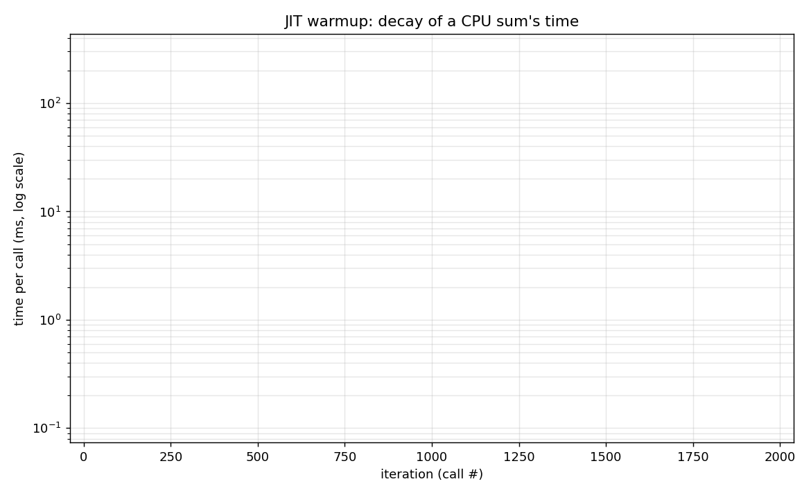
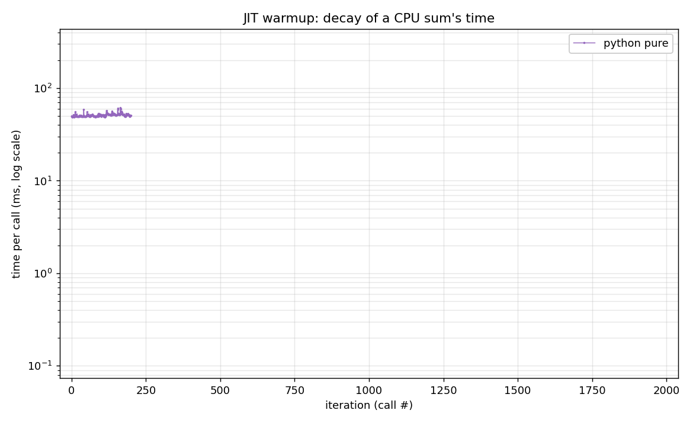
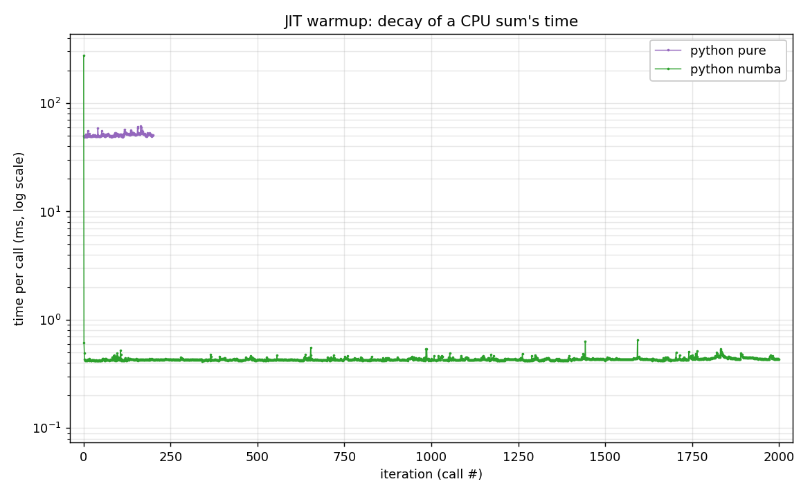
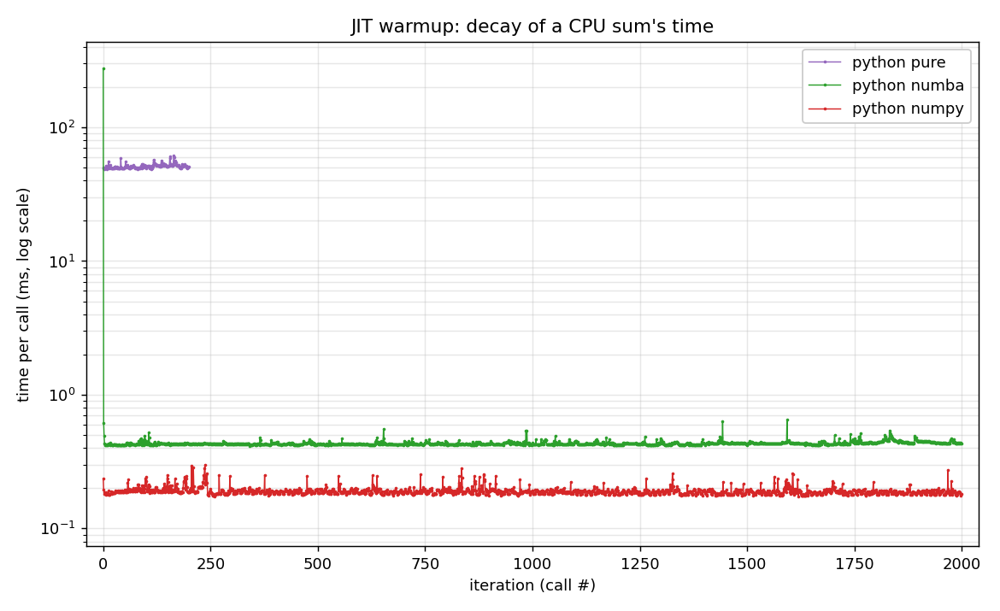
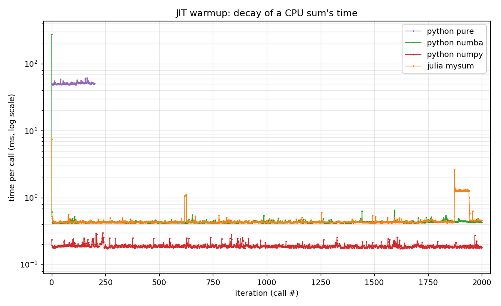
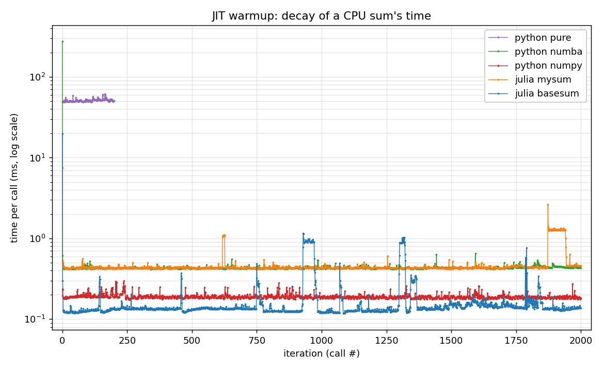

## A tale of two ships {.smaller}

::: {.r-stack}
{width="82%"}

{.fragment width="82%"}
:::

## Goals

:::{.nonincremental}
- Understand what happens between source code and the processor.
- See **type specialization** (why Julia ≈ C).
- Learn to **measure performance properly**.
:::

. . .

> ▶ Notebook (demo + solution): [Interpreted vs compiled](../pluto/1_compilation_and_types.jl)

. . .

> ⬅ **Previous:** [0 — Julia for Python users](0_julia_basics.qmd)  ·  **Next:** [2 — Multiple dispatch vs OOP](2_dispatch_vs_oop.qmd) ➡

## Same computation, very different times

- We sum a large vector (10⁶ floats) — *the same computation* everywhere.
- We call it **R = 2000 times in a row** and time **every call**.
- Five variants: pure Python, `numba @njit`, `numpy`, Julia `mysum` (loop), Julia `sum`.

. . .

> The question: what happens **on the very first call**?

## Warmup: the curves appear

. . .

::: {.r-stack}
{width="82%"}

{.fragment width="82%"}

{.fragment width="82%"}

{.fragment width="82%"}

{.fragment width="82%"}

{.fragment width="82%"}
:::

## Reading the curves

. . .

| variant | compile spike | plateau |
|---|---|---|
| pure Python | **0** — never compiled | ~50 ms |
| numba `@njit` | **~340 ms** | ~0.4 ms |
| numpy | ≈ 0 — precompiled C | ~0.2 ms |
| Julia `mysum` | ~7 ms | ~0.4 ms |
| Julia `sum` | ~20 ms | ~0.1 ms |

. . .

> The **spike** is the JIT compiling — paid once, then amortized.
> Pure Python has **no spike**, but its plateau stays **slow** (never compiled).

## What the warmup reveals

- The spike = **just-in-time (JIT) compilation on the 1st call**, for that argument type.
- **Everything is JIT in Julia**: even Base `sum` (re)compiles per type on first use.
- **numpy** = ahead-of-time C → fast, no warmup; **pure Python** = never compiled → slow, no spike.

. . .

::: {.callout-note}
Type **checked at run time**, every operation, on boxed objects (pure Python) = slow;
type **known at compile time**, check eliminated (numba/Julia) = specialized native
code = fast… once the warmup is paid.
:::

::: {.notes}
Don't say "Python can't specialize by type" — false since 3.11 (PEP 659): the adaptive
interpreter rewrites a hot `s += x` into `BINARY_OP_ADD_FLOAT`. The point is that it
specializes ONE bytecode and KEEPS the guard, inside the interpreter, on boxed objects.
Julia specializes the whole function and deletes the guard. That's why the 100× survives.
:::

## What is JIT?

. . .

Three ways to get from source code to the processor:

. . .

- **Interpreted** (CPython): the bytecode is re-examined at every operation → slow, but starts instantly.
- **Ahead-of-time / AOT** (C, `numpy`): everything compiled before execution → fast, **zero warmup**.
- **Just-in-time / JIT** (Julia): compiled **on the 1st execution**, then native → fast *after* the warmup.

. . .

> The **spike** we just saw is **exactly** the JIT compiling.

## Julia: one native version per type {.smaller}

JIT gives native speed — but there's a catch: the machine code must be **specialized**.
There is no single "`x + y`" instruction.

. . .

The *same* `x + y` becomes **different assembly** depending on the argument types:

. . .

| `x`, `y` | machine code for `x + y` |
|---|---|
| `Int, Int` | `add` (integer) |
| `Float64, Float64` | `vaddsd` (float) |
| `Float64, Int` | `vcvtsi2sd` + `vaddsd` (convert, then add) |

. . .

**Julia's solution**: on the 1st call, compile a native version **specialized for the concrete types**,
then reuse it. Type known at compile time → the check/conversion **vanishes** from the hot code (**≈ C**).

. . .

> Picking the version from the type of **all** arguments = **multiple dispatch**
> ([covered in the dispatch module]{style="background-color: yellow;"}).

## The pitfall: type instability

- Untyped global variable → dynamic code, comparable to Python.
- The tool: `@code_warntype` (red = `Any`).
- **Golden rule**: put the work in **functions** that receive their data as arguments.

## Measuring properly

- Pitfall A: **timing the compilation** instead of the computation — *exactly the warmup spike we just saw*.
- Pitfall B: measuring only once → `@btime` / `@benchmark`.

. . .

> **Always** discard the 1st call (warmup), then measure the **steady state**.

# Code introspection {style="text-align: center;"}

## Opening the box

- Julia lets you **inspect** what it generates, at every stage of the pipeline:

. . .

```julia
@code_lowered  mysum(x)   # desugared form
@code_typed    mysum(x)   # after type inference
@code_warntype mysum(x)   # unstable types in red (= Any)
@code_native   mysum(x)   # the assembly actually executed
```

. . .

> We saw **Base `sum` ≈ 5× faster than `mysum`** (same computation). `@code_native` tells us *why*.

## Why `sum` beats `mysum` — 1/2

`@code_native mysum` — the hot loop:

. . .

```asm
.LBB0_6:                          ; loop unrolled ×8
    vaddsd  xmm0, xmm0, [rcx + 8*rdx]
    vaddsd  xmm0, xmm0, [rcx + 8*rdx + 8]
    vaddsd  xmm0, xmm0, [rcx + 8*rdx + 16]
    ...                               ; ×8
    add     rdx, 8
    jne     .LBB0_6
```

. . .

- `vaddSD` = **S**calar **D**ouble = **1 float** at a time, **a single accumulator** `xmm0`. → [scalar]{style="background-color: yellow;"}.
- Each `+` waits for the previous one → **a single dependency chain** (*latency-bound*).

## Why `sum` beats `mysum` — 2/2 {.smaller}

`@code_native sum` shows that for N ≥ 16 the work is **not inlined**:

. . .

```asm
    cmp     rdx, 15
    jle     .small_case
    call    mapreduce_impl          ; kernel elsewhere
```

. . .

Inside `mapreduce_impl`:

```asm
.LBB0_8:
    vaddpd  ymm0, ymm0, [r8 + 8*r9 - 96]
    vaddpd  ymm1, ymm1, [r8 + 8*r9 - 64]
    vaddpd  ymm2, ymm2, [r8 + 8*r9 - 32]
    vaddpd  ymm3, ymm3, [r8 + 8*r9]
```

. . .

- `vaddPD` = **P**acked **D**ouble = **4 floats** at once → [SIMD 4-wide]{style="background-color: yellow;"}.
- **4 independent accumulators** `ymm0..ymm3` → **16 doubles / iteration**, 4 parallel chains (ILP).

## The catch: associativity

::: {.callout-warning}
Floating-point addition is **not associative**: `(a+b)+c ≠ a+(b+c)` (rounding). Without permission,
the compiler **must** keep the order → `mysum` stays scalar and serial.
:::

. . .

- `sum` goes through a **reduction that allows reassociation** (+ *pairwise* in blocks of 1024)
  → the compiler can vectorize and parallelize.

## Confirmation: `@simd` {.smaller}

A single word lifts the catch — we explicitly allow reassociation:

. . .

```julia
function mysum_simd(x)
    s = 0.0
    @inbounds @simd for i in eachindex(x)   # ← @simd
        s += x[i]
    end
    s
end
```

. . .

| variant | time / call |
|---|---|
| `mysum` (scalar) | **42 µs** |
| `mysum_simd` (`vaddpd ymm`) | **4 µs** |
| Base `sum` | 8 µs |

. . .

> It's not "Julia magic": what we see is **the algorithm** (allowed reassociation → SIMD + ILP),
> not the language.

## Going further

:::{.nonincremental}
- ▶ Notebook (demo + solution): [Interpreted vs compiled](../pluto/1_compilation_and_types.jl)
- 🔬 The JIT warmup: [`experiences/warmup_jit/`](../experiences/warmup_jit/) (`warmup.py`, `warmup.jl`).
- 🔬 The `mysum` vs `sum` asm + the `@simd` counter-test: [`experiences/sum_vs_size/reflection.jl`](../experiences/sum_vs_size/reflection.jl).
:::

. . .

> ⬅ **Previous:** [0 — Julia for Python users](0_julia_basics.qmd)  ·  **Next:** [2 — Multiple dispatch vs OOP](2_dispatch_vs_oop.qmd) ➡
